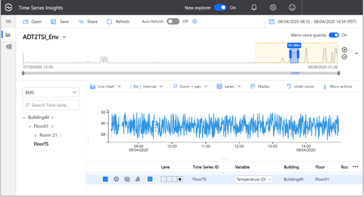
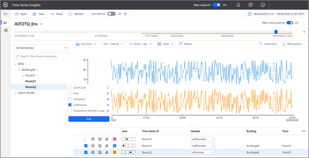

# Model synchronization between ADT and TSI Gen2

## Introduction

This article explains best practices and tools used to translate asset model in Azure Digital Twins (ADT) to asset model in Azure Time Series Insights (TSI).  This article is the second part of a two-part tutorial series explaining the integration of Azure Digital Twins (ADT) with Azure Time Series Insights (TSI). Integration of ADT with TSI enables archival and tracking the history of telemetries and calculated properties of Digital Twins. This series of tutorials are aimed at developers working to integrate TSI with ADT. Part 1 explains  [Establishing data pipeline that brings in the actual time series data from ADT to TSI](https://docs.microsoft.com/azure/digital-twins/how-to-integrate-time-series-insights) and this, second part of the tutorial series explains Asset model synchronization between ADT and TSI.This tutorial explains the best practices in choosing  and establishing naming convention for Time Series ID (TS ID) and manually establishing hierarchies in Time Series Model (TSM).

## Choosing a Time Series ID

Time Series ID is an unique identifier used to identify assets in Time Series Insights. Time series data (telemetries from the field, which are Time-value pairs) is represented using variables listed under TS ID. In ADT, twin properties and telemetries are used to represent state of a twin and measurements produced by the twin respectively. As of the current design of TSM, TSIDs need to be unique. Using twin IDs of the twinds in ADT or combined with property or telemetry name will always make unique TS ID in TSM. In a typical case, the **_`<Twin ID>`_** would the TSID and the property and telemetry names would be the variable names in TSM. However there are use cases where asset hierarchies in TSI are preferred to be flattened using composite keys format, such as **_`<Twin ID>+ <Delimiter of Choice> + <Name of the Property or Telemetry>`_**. Let’s take an example to explain the later case. Consider a room in a building modelled as a twin and has twin ID Room22. Its temperature setting property is to be translated as **_TSID Room22_TempSetting_** and temperature measurement to be translated to **_Room22_TempMea_** in TSM.

[](media/tutorials-model-sync-adt-tsi/choosing-tsid.png#lightbox)

## Contextualizing Time Series

Contextualization of data (mostly spatial in nature) in TSI is achieved through asset hierarchies and the same is used for easy navigation of data through a tree view in TSI explorer. Time series types, and hierarchies are defined using Time Series Model (TSM) in TSI. Types in TSM helps to define variables, while hierarchy levels and instance field values are used to construct the tree view in the TSI explorer. For more details on TSM, please refer [online TSI documentation](https://docs.microsoft.com/azure/time-series-insights/concepts-model-overview).

In Azure Digital Twins, connection among assets are expressed using twin relationships. Twin relationships are simply a graph of connected assets. However in Time Series Insight, relationships between assets are hierarchical in nature. That is, assets share a parent-child kind od relationship and is represented using a tree structure. To translate relationship information from ADT into a TSI hierarchies, we need to choose relevant hierarchical relationships from ADT. ADT uses an open standard, modelling language called Digital Twin Definition Language (DTDL). In DTDL models are described using described using a variant of JSON called JSON-LD. Refer to [DTDL documentation](https://github.com/Azure/opendigitaltwins-dtdl/blob/master/DTDL/v2/dtdlv2.md) for full details on the specification.

[](media/tutorials-model-sync-adt-tsi/asset-connection.png#lightbox)

## Translating graph representation in ADT to tree structure in TSI

The following sections of the tutorial captures few core scenarios of manually translating the graph structure in ADT to tree structure in TSI.

Sample System: This tutorial makes use of the following example to explain the concepts discussed below. It is a simple, fictitious building management system with one floor and two rooms. It has three thermostats, one in each of the rooms and another one common to the floor. Additionally, it also has a water flow meter measuring the water flow from Room21 to Room22 through a pipe connection between the rooms. Looking at the spatial relationship between twins, it has both types of relationships.

1. Most common, hierarchical relationship. For example, Building40 -> Floor01 -> FloorTS* -> Temperature
1. Not so common, circular relationship. For example, starting from Building40, the FlowMtr can be traced via two different paths.

   1. Building40 -> Floor01 -> Room21 -> FlowMtr* -> Flow
   1. Building40 -> Floor01 -> Room22 -> FlowMtr* -> Flow  
      Where “Flow” is the actual telemetry measuring the water flow between Room21 and Room22

> [!Note]
>
> `*` FloorTS stands for FloorThermoStat and FlowMtr stands for Flow Meter and typically chosen as the TSID. Temperature and Flow are the raw telemetry referred as variables in TSI.

Given the current limitation in TSI that one asset cannot be represented in multiple branches, the following sections explains modelling of hierarchical and circular relationships in TSI.

## Case 1: Hierarchical (Parent-Child) relationship

It is the most common type of relationship among the twins. Modelling pure parent-child relationship is explained in the following illustration. Instance fields and TSID are derived from twin ids as shown below. While instance fields could be manually updated using TSI explorer, the section below named “Updating Instance Fields using APIs” explains listening to model changes in ADT and updating instance fields in TSI using Azure functions.

[](media/tutorials-model-sync-adt-tsi/mapping-twin-ids#lightbox)

[](media/tutorials-model-sync-adt-tsi/mapping-twin-ids2#lightbox)

## Case 2: Circular relationship

### Circular relationship in ADT to single hierarchy relationship in TSI

Given that TSID must be unique and can only be represented in one hierarchy, this case represents the _‘FlowMtr’_ with a telemetry named _‘Flow’_ just under twin _‘Room21’_. In future when TSI can support multi representation of time series in TSM, telemetry _‘Flow’_ would be represented under _‘Room 21’_ and _‘Room 22’_

The following screenshots shows manually mapping twin IDs in ADT to Instance field in TSM and the resulting hierarchy in TSI.

[](media/tutorials-model-sync-adt-tsi/mapping-twin-ids-adt#lightbox)

### Circular relationship in ADT to multiple hierarchies in TSI, using duplicates

Part 1 of the tutorial explains how a client program (an Azure function) helps transferring telemetry data from IoT Hub or other event sources to ADT. This approach suggests using the same client program to make updates to relevant properties of the parent twins. In the given example, while reading the FlowMtr telemetry from IoT Hub and updating the property “Flow” in FlowMtr twin, the program can also update corresponding properties in all possible parent twins of the source. In our example it would be “outflowmea” (identified using the ‘outflow’ relationship) property of Room21 and “inflowmea” property of Room22.  Below screenshot shows the final user experience in TSI explorer. It must be noted that we have data duplicates by taking this approach.

[](media/tutorials-model-sync-adt-tsi/tsi-explorer#lightbox)

Code snippet below shows how the client application was able to navigate the twin relationship by using ADT APIs.

> [!Note]
>
> This code snippet example assumes readers are familiar with [Part 01](https://docs.microsoft.com/azure/digital-twins/tutorial-end-to-end#set-up-the-sample-function-app) of the tutorial and this code change was made inside the “ProcessHubToDTEvents” Function.

```csharp
if (propertyPath.Equals("/Flow"))
{
//Update the flow value property of the flow meter
await AdtUtilities.UpdateTwinProperty(client, twinId, "replace",
propertyPath, "double", propertyValue, log);

//also update the sending end flow
string parentIdOutflow = await AdtUtilities.FindParent(client, twinId,
"outflow", log);
if (parentIdOutflow != null)
await AdtUtilities.UpdateTwinProperty(client, parentIdOutflow, "replace", "outflow", "double", propertyValue, log);
else
log.LogInformation("Unable to find Parent with outflow
relationship for " + twinId );
//and receiving end flow value
string parentIdinflow = await AdtUtilities.FindParent(client, twinId,
"inflow", log);
if (parentIdinflow != null)

await AdtUtilities.UpdateTwinProperty(client, parentIdinflow,
"replace", "inflow", "double", propertyValue, log);
else
log.LogInformation("Unable to find Parent with inflow
relationship for " + twinId);
}
```

## Updating instance fields using APIs

This section of the tutorial explains listening to model changes in ADT such as creation, deletion of twins or change in relationships between twins and updating instance fields and hierarchies programmatically using TSI model APIs. This method of updating TSI model is usually achieved via Azure functions. In Azure Digital Twins, event notifications such as twin addition or deletions can be routed downstream services such as Event Hubs which is turn can be fed to Azure functions. Further details about event routing and filtering is explained in [here](https://docs.microsoft.com/azure/digital-twins/how-to-manage-routes-portal).  Remaining of this section explains using TSI model APIs in Azure functions to update TSI model in response to twin addition (one type of model change) in ADT.

### Receiving and identifying twin addition event notification

```csharp
[FunctionName("RouteEventsToTsi")]
public async Task Run([EventGridTrigger]EventGridEvent eventGridEvent)
{
    try
    {
        if (eventGridEvent != null && eventGridEvent.Data != null)
        {
            logger.LogInformation($"EventType: {eventGridEvent.EventType}");
            logger.LogInformation($"EventGridEvent: {JsonConvert.SerializeObject(eventGridEvent)}");

            //Shape event and Send event data to event hub and tsi
            await SendEventToEventHubAsync(eventGridEvent).ConfigureAwait(false);

            //If a new twin was created, update the newly created instance in TSI with info retrieved from ADT
            if (eventGridEvent.EventType == Constants.TwinCreateEventType)
            {
                //retrieve building, floor and room of value twin
                var twinInfo = await RetrieveTwinInfoAsync(eventGridEvent).ConfigureAwait(false);
                //Update Tsi instance with type(sensor type), hierarchy(space hierarchy) and instance fields(twin info retrieved above)
                var instance = await CreateInstanceToSendAsync(twinInfo).ConfigureAwait(false);
                var instanceToUpdate = new List<TimeSeriesInstance>() { instance };
                var response = await tsiClient.TimeSeriesInstances.ExecuteBatchAsync(new InstancesBatchRequest(update: instanceToUpdate)).ConfigureAwait(false);
            }
        }
    }
    catch (Exception ex)
    {
        logger.LogError($"Exception: {ex.Message}");
    }
}
```

### Creating TSI Client and adding instance details

```csharp
private async Task<TimeSeriesInstance> CreateInstanceToSendAsync(Dictionary<string, string> twinInfo)
{
    try
    {
        tsiClient = await GetTSIClientAsync().ConfigureAwait(false);

        var timeSeriesId = new object[] { twinInfo[Constants.DtId] };
        var instances = await tsiClient.TimeSeriesInstances.ExecuteBatchAsync(
            new InstancesBatchRequest(
                get: new InstancesRequestBatchGetOrDelete(
                    new IList<object>[] { timeSeriesId }))).ConfigureAwait(false);
        var instance = instances.Get.First().Instance;

        if (instance != null)
        {
            instance = await AddHierarchyToInstanceAsync(instance).ConfigureAwait(false);
            instance = await AddTypeToInstanceAsync(instance, twinInfo[Constants.TwinType]).ConfigureAwait(false);

            instance.InstanceFields = new Dictionary<string, object>
                            {
                                { "Building", twinInfo[Constants.BuildingName] },
                                { "Floor", twinInfo[Constants.FloorName] },
                                { "Room", twinInfo[Constants.ParentName] }
                            };

            //If value twin is a sensor value twin, add sensor type instance field to diff from spatial value twin
            if (twinInfo[Constants.ParentType] == Constants.Sensor)
            {
                instance.InstanceFields.Add(Constants.SensorType, twinInfo[Constants.TwinType]);
            }
            return instance;
        }
        else
        {
            logger.LogError($"instance with id {twinInfo[Constants.DtId]} not found");
            return new TimeSeriesInstance();
        }
    }
    catch (Exception e)
    {
        logger.LogError(e.Message);
        throw;
    }
}
```

### Applying hierarchy info to instance

```csharp
private async Task<TimeSeriesInstance> AddHierarchyToInstanceAsync(TimeSeriesInstance instance)
{
    if (instance.HierarchyIds == null)
    {
        TimeSeriesHierarchy spacesHierarchy = null;
        try
        {
            var hierarchy = await RunGetHierarchiesAsync(Constants.SpaceHierarchy).ConfigureAwait(false);
            spacesHierarchy = hierarchy.First(h => h.Name.Equals(Constants.SpaceHierarchy));
            instance.HierarchyIds = new List<Guid?>();
            instance.HierarchyIds.Add(spacesHierarchy.Id);
        }
        catch (Exception ex)
        {
            logger.LogWarning($"Hierarchy 'space hierarchy' not found, {ex}");
            throw;
        }
    }
    return instance;
}
```

## Next steps

Third in the series of tutorials is to show how to query historical data from ADT using TSI APIs. It is a work in progress and the section will be updated when ready. In the meantime, readers are encouraged to refer to [TSI data query API documentation](https://docs.microsoft.com/azure/time-series-insights/concepts-query-overview).
