# Tutorial: Set up an Azure Time Series Insights Gen2 environment

This tutorial guides you through the process of creating an Azure Time Series Insights Gen2 *pay-as-you-go* (PAYG) environment.

In this tutorial, you learn how to:

> [!div class="checklist"]
>
> * Create an Azure Time Series Insights Gen2 environment.
> * Connect the Azure Time Series Insights Gen2 environment to an IoT Hub.
> * Run a solution accelerator sample to stream data into the Azure Time Series Insights Gen2 environment.
> * Perform basic analysis on the data.
> * Define a Time Series Model type and hierarchy, and associate it with your instances.

>[!TIP]
> [IoT solution accelerators](https://www.azureiotsolutions.com/Accelerators) provide enterprise-grade preconfigured solutions that you can use to accelerate the development of custom IoT solutions.

Sign up for a [free Azure subscription](https://azure.microsoft.com/free/) if you don't already have one.

## Prerequisites

* At minimum, you must have the **Contributor** role for the Azure subscription. For more information, read [Add or remove Azure role assignments using the Azure portal](../role-based-access-control/role-assignments-portal.md).

## Create a device simulation

In this section, you will create three simulated devices that send data to an Azure IoT Hub instance.

1. Go to the [Azure IoT solution accelerators page](https://www.azureiotsolutions.com/Accelerators). The page displays several prebuilt examples. Sign in by using your Azure account. Then, select **Device Simulation**.

   

1. Enter the subscription where you want to create the device simulation.

   Parameter|Description
   ---|---
   **Deployment name** | This unique value is used to create a new resource group. The listed Azure resources are created and assigned to the resource group.
   **Azure subscription** | Specify the same subscription that was used to create your Azure Time Series Insights Gen2 environment in the previous section.
   **Deployment options** | Select **Provision new IoT Hub** to create a new IoT hub specific to this tutorial.
   **Azure location** | Specify the same region that was used to create your Azure Time Series Insights Gen2 environment in the previous section.

   When you're finished, select **Create** to provision the solution's Azure resources. It may take up to 20 minutes to complete this process.

   [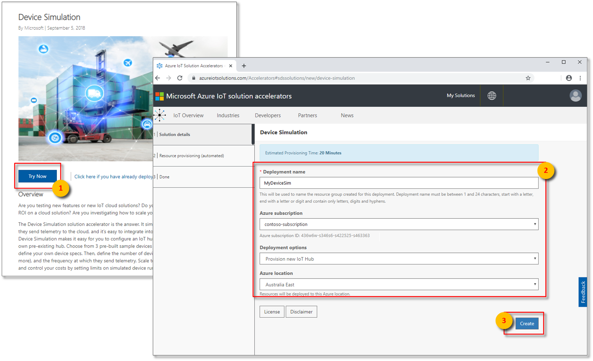](media/v2-update-provision/iot-solution-accelerators-configuration.png#lightbox)

1. After provisioning has finished, two notifications will appear announcing that the deployment state has moved from **Provisioning** to **Ready**.

   >[!IMPORTANT]
   > Don't enter your solution accelerator yet! Keep this web page open because you'll return to it later.

   

1. Now, inspect the newly created resources in the Azure portal. On the **Resource groups** page, notice that a new resource group was created by using the **Solution name** provided in the last step. Make note of the resources that were created for the device simulation.

   [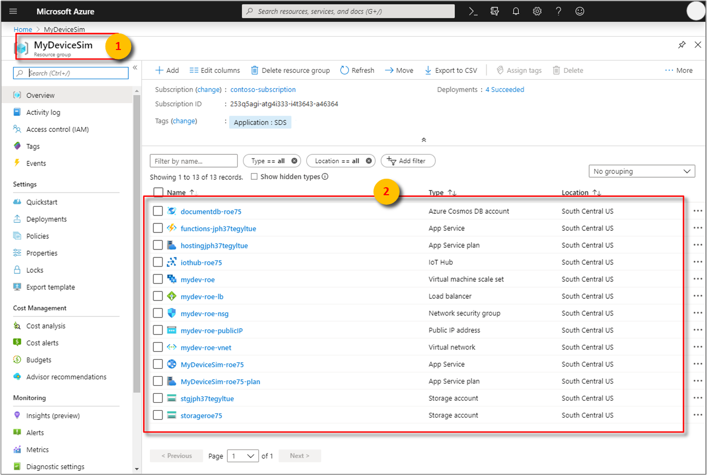](media/v2-update-provision/tsi-device-sim-solution-resources.png#lightbox)

## Create an Azure Time Series Insights Gen2 environment

This section describes how to create an Azure Time Series Insights Gen2 environment and connect it to the IoT hub created by the IoT Solution Accelerator using the [Azure portal](https://portal.azure.com/).

1. Sign in to the [Azure portal](https://portal.azure.com) by using your Azure subscription account.
1. Select **+ Create a resource** in the upper left.
1. Select the **Internet of Things** category, and then select **Time Series Insights**.

   [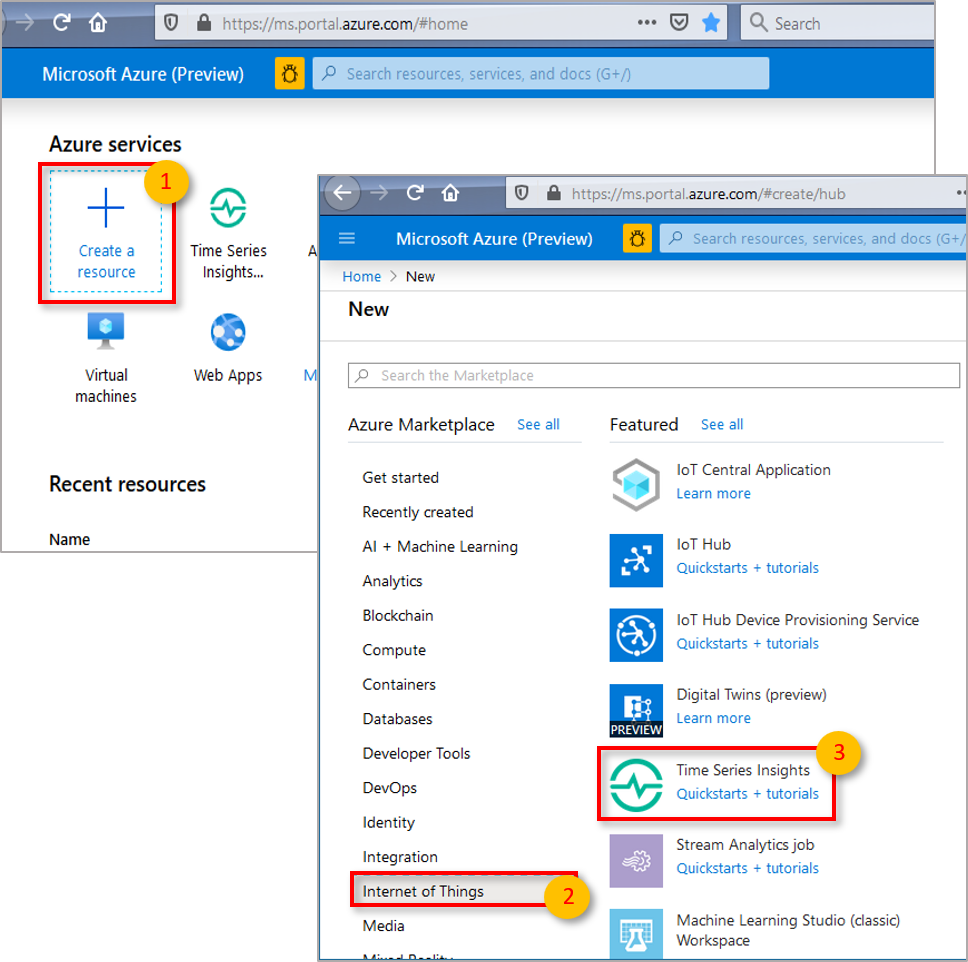](media/v2-update-provision/tsi-create-new-environment.png#lightbox)

1. In the **Create Time Series Insights environment** pane, on the **Basics** tab, set the following parameters:

    | Parameter | Action |
    | --- | ---|
    | **Environment name** | Enter a unique name for the Azure Time Series Insights Gen2 environment. |
    | **Subscription** | Enter the subscription where you want to create the Azure Time Series Insights Gen2 environment. A best practice is to use the same subscription as the rest of the IoT resources that are created by the device simulator. |
    | **Resource group** | Select an existing resource group or create a new resource group for the Azure Time Series Insights Gen2 environment resource. A resource group is a container for Azure resources. A best practice is to use the same resource group as the other IoT resources that are created by the device simulator. |
    | **Location** | Select a data center region for your Azure Time Series Insights Gen2 environment. To avoid additional latency, it's best to create your Azure Time Series Insights Gen2 environment in the same region as your IoT hub created by the device simulator. |
    | **Tier** |  Select **Gen2(L1)**. This is the SKU for the Azure Time Series Insights Gen2 product. |
    | **Time Series ID property name** | Enter a name of a property that contains values that uniquely identify your time series instances. The value you enter in the **Property name** box as Time Series ID cannot be changed later. For this tutorial, enter ***iothub-connection-device-id***. To learn more about Time Series ID including composite Time Series ID, read [Best practices for choosing a Time Series ID](./time-series-insights-update-how-to-id.md). |
    | **Storage account name** | Enter a globally unique name for a new storage account.|
    | **Storage account kind** | Select the storage kind for a new storage account. We recommend StorageV2|
    | **Storage account replication** | Select the storage kind for a new storage account. Based on your location selection, you can choose from LRS, GRS and ZRS. For this tutorial, you can select LRS|
    | **Hierarchical namespace** |This option is selectable, once you select the storage kind to be StorageV2. By default, it is disabled. For this tutorial, you can leave it in its default *disabled* state|
    |**Enable warm store**|Select **Yes** to enable warm store. This setting can be disabled and re-enabled after the environment has been created as well. |
    |**Data retention (in days)**|Choose the default option of 7 days. |

    [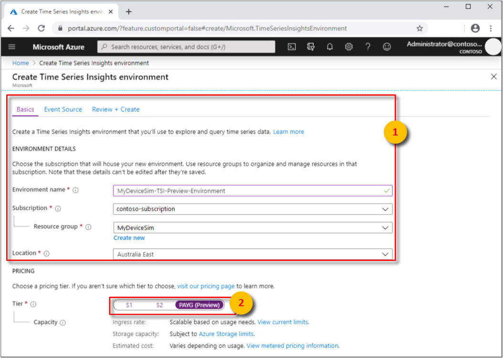](media/v2-update-provision/tsi-environment-configuration.png#lightbox)

1. Select **Next: Event Source**.

   [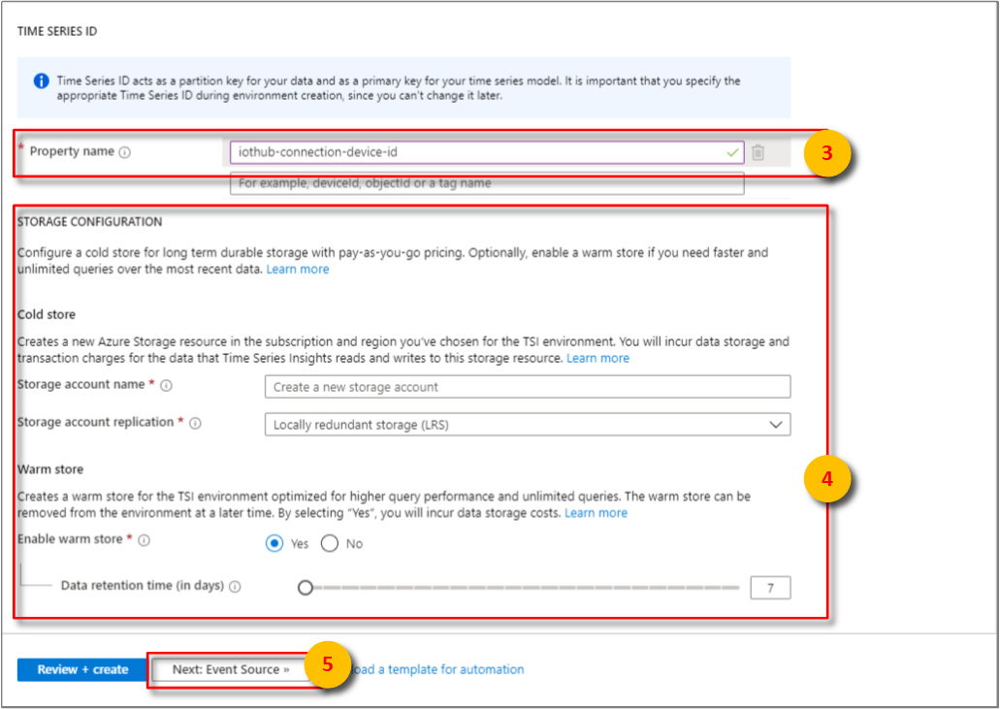](media/v2-update-provision/tsi-time-series-id-selection.png#lightbox)

1. On the **Event Source** tab, set the following parameters:

   | Parameter | Action |
   | --- | --- |
   | **Create an event source?** | Select **Yes**.|
   | **Name** | Enter a unique value for the event source name. |
   | **Source type** | Select **IoT Hub**. |
   | **Select a hub** | Choose **Select existing**. |
   | **Subscription** | Select the subscription that you used for the device simulator. |
   | **IoT Hub name** | Select the IoT hub name you created for the device simulator. |
   | **IoT Hub access policy** | Select **iothubowner**. |
   | **IoT Hub consumer group** | Select **New**, enter a unique name, and then select **+ Add**. The consumer group must be a unique value in Azure Time Series Insights Gen2. |
   | **Timestamp property** | This value is used to identify the **Timestamp** property in your incoming telemetry data. For this tutorial, leave this box empty. This simulator uses the incoming timestamp from IoT Hub, which Azure Time Series Insights Gen2 defaults to. |

1. Select **Review + Create**.

   [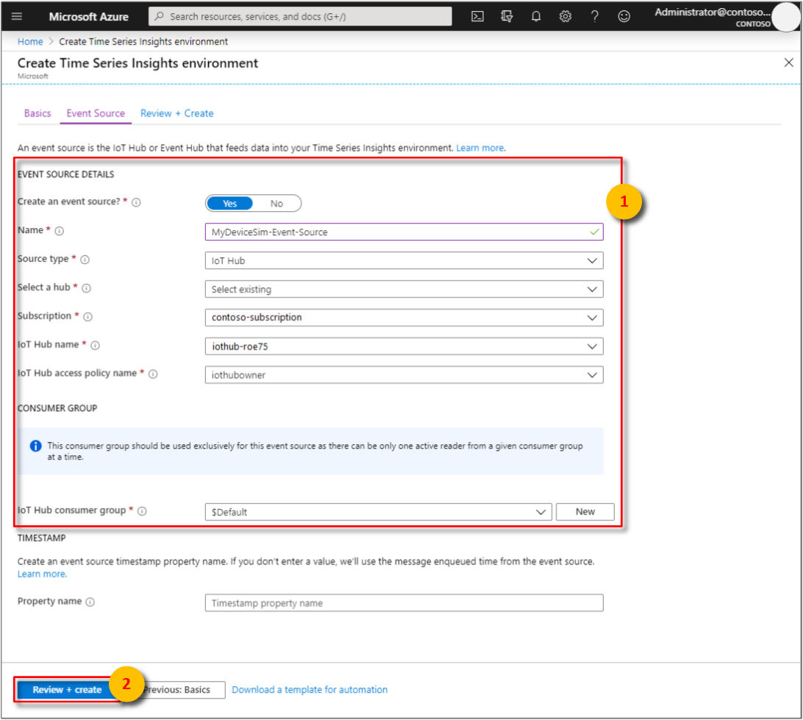](media/v2-update-provision/tsi-configure-event-source.png#lightbox)

1. Select **Create**.

    [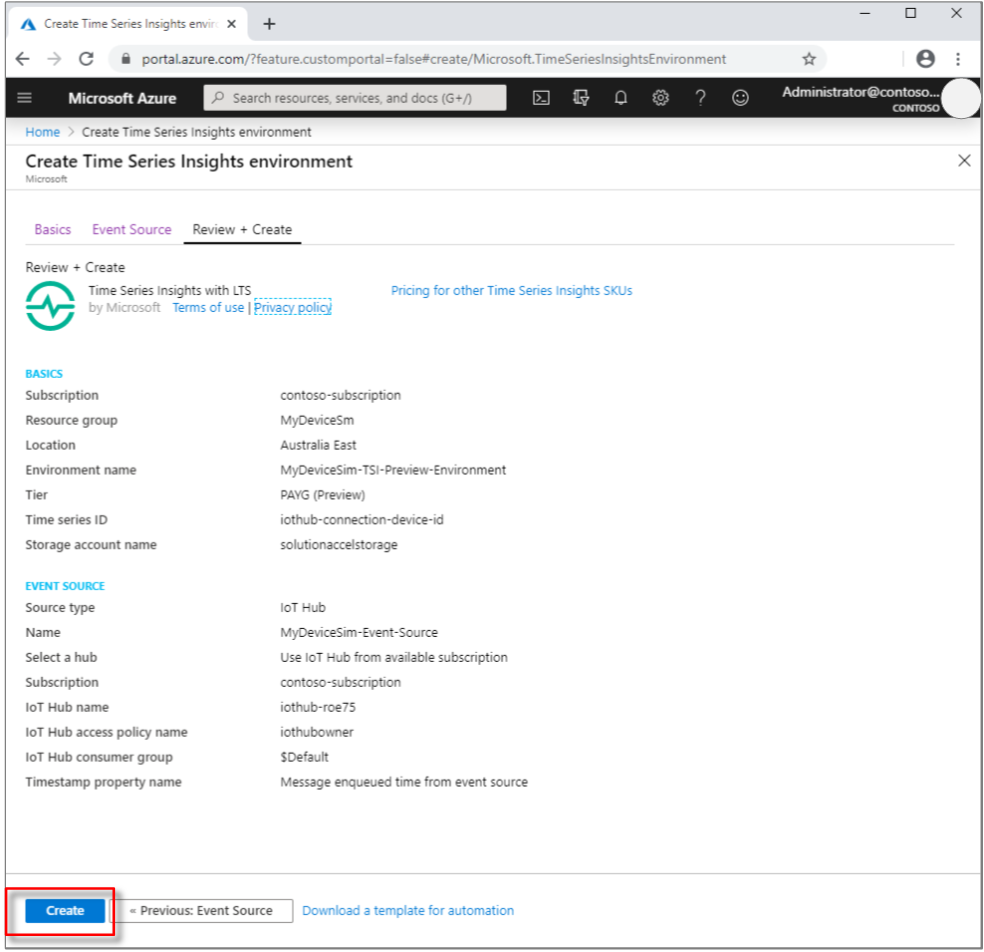](media/v2-update-provision/tsi-environment-confirmation.png#lightbox)

    You can review the status of your deployment:

    [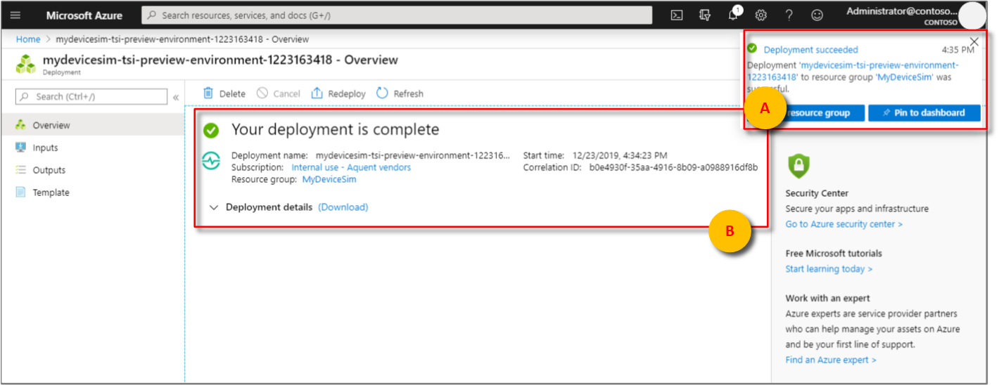](media/v2-update-provision/tsi-deployment-notification.png#lightbox)

1. You have access to your Azure Time Series Insights Gen2 environment by default if you are an owner of the Azure subscription. Verify that you have access:

   1. Search for your resource group, and then select your newly created Azure Time Series Insights Gen2 environment.

      [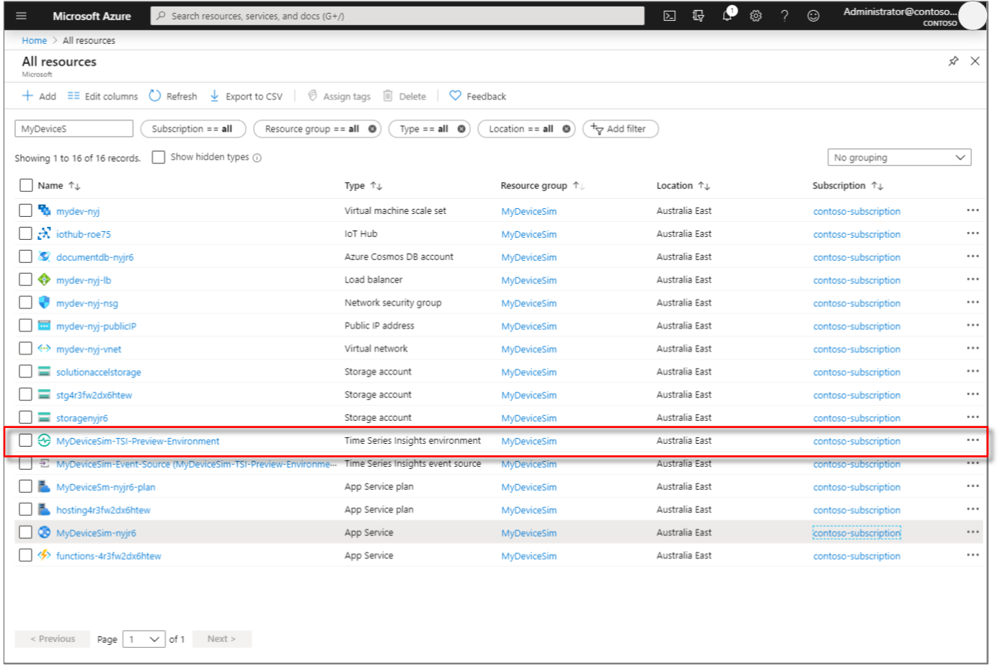](media/v2-update-provision/verify-tsi-resource-in-group.png#lightbox)

   1. On the Azure Time Series Insights Gen2 page, select **Data Access Policies**:

      [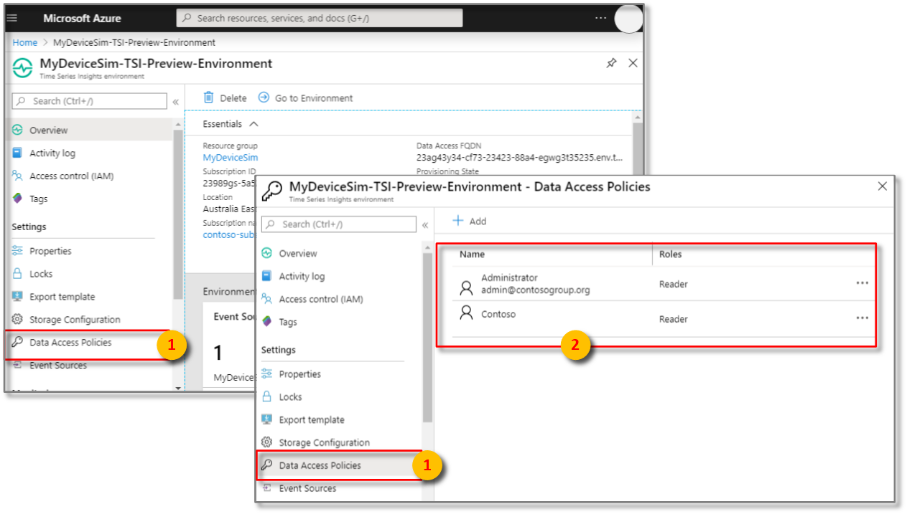](media/v2-update-provision/tsi-data-access-panel.png#lightbox)

   1. Verify that your credentials are listed:

      If your credentials aren't listed, you must grant yourself permission to access the environment by selecting Add and searching for your credentials. To learn more about setting permissions, read [Grant data access](./time-series-insights-data-access.md).

## Stream data

Now that you've deployed your Azure Time Series Insights Gen2 environment, begin streaming data for analysis.

1. Go back to your [Solution accelerators dashboard](https://www.azureiotsolutions.com/Accelerators#dashboard). Sign in again, if necessary, by using the same Azure account you've been using in this tutorial. Select your "Device Solution" and then **Go to your solution accelerator** to launch your deployed solution.

   

1. The device simulation web app begins by prompting you to grant the web application the **Sign you in and read your profile** permission. This permission allows the application to retrieve the user profile information necessary to support the functioning of the application.

   [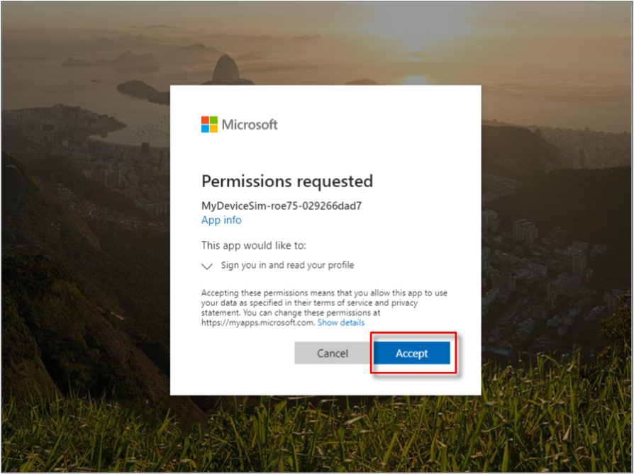](media/v2-update-provision/sawa-signin-consent.png#lightbox)

1. Select **+ New simulation**.

    1. After the **Simulation setup** page loads, enter the required parameters.

        | Parameter | Action |
        | --- | --- |
        | **Name** | Enter a unique name for a simulator. |
        | **Description** | Enter a definition. |
        | **Simulation duration** | Set to **Run indefinitely**. |
        | **Device model** | Click + **Add a device type**  **Name**: Enter **Elevator**.  **Amount**: Enter **3**.   Leave the remaining default values |
        | **Target IoT Hub** | Set to **Use pre-provisioned IoT Hub**. |

        [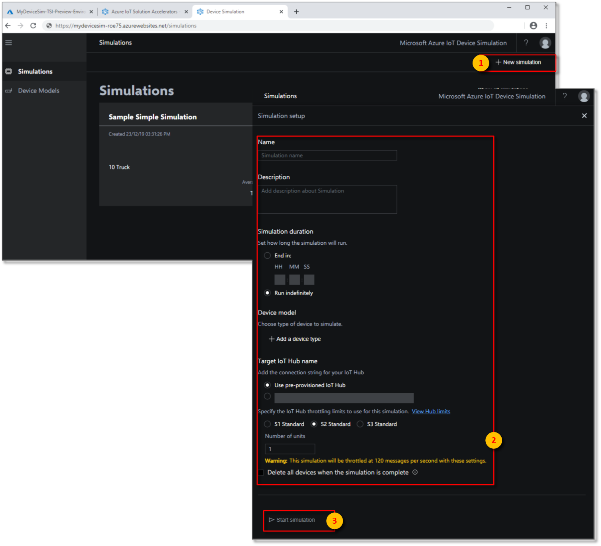](media/v2-update-provision/tsi-launch-solution-accelerator.png#lightbox)

    1. Select **Start simulation**. In the device simulation dashboard, **Active devices** and **Total messages** are displayed.

        

## Analyze data

In this section, you perform basic analytics on your time series data by using the [Azure Time Series Insights Gen2 Explorer](./time-series-insights-update-explorer.md).

1. Go to your Azure Time Series Insights Gen2 Explorer by selecting the URL from the resource page in the [Azure portal](https://portal.azure.com/).

    

1. In the Azure Time Series Insights Gen2 Explorer, a bar spanning the top of the screen will appear. This is your availability picker. Ensure that you have at least two 2 m selected, and if needed, expand the time frame by selecting and dragging the picker handles to the left and right.

1. **Time Series Instances** will be displayed on the left-hand side.

    

1. Select the first-time series instance. Then, select **Show temperature**.

    [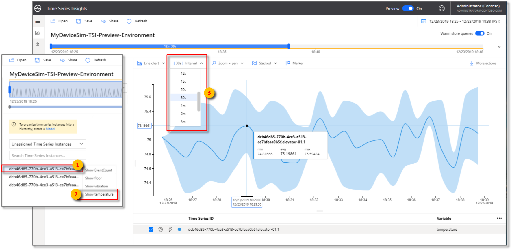](media/v2-update-provision/select-instance-and-temperature.png#lightbox)

    A time series chart appears. Change the **Interval** to **30s**.

1. Repeat the previous step with the other two time series instances so that you're viewing all three, as shown in this chart:

    

1. Select the time span picker in the upper right corner. Here you can select specific start and end times down to the millisecond, or choose from pre-configured options such as **Last 30 minutes**. You can also change the default time zone.

    

    The solution accelerator's progress over the **Last 30 minutes** is now displayed in the Azure Time Series Insights Gen2 Explorer.

## Define and apply a model

In this section, you apply a model to structure your data. To complete the model, you define types, hierarchies, and instances. To learn more about data modeling, read [Time Series Model](./concepts-model-overview.md).

1. In the Explorer, select the **Model** tab:

   

   In the **Types** tab, select **+ Add**.

1. Enter the following parameters:

    | Parameter | Action |
    | --- | ---|
    | **Name** | Enter **Elevator** |
    | **Description** | Enter **This is a type definition for Elevator** |

1. Next, select the **Variables** tab.

    1. Select **+ Add Variable** and fill in the following values for the first variable of the Elevator type. You will author three variables in total.

        | Parameter | Action |
        | --- | --- |
        | **Name** | Enter **Avg Temperature**. |
        | **Kind** | Select **Numeric** |
        | **Value** | Select from preset: Select **temperature (Double)**.   Note: It might take a few minutes for **Value** to be automatically populated after Azure Time Series Insights Gen2 starts receiving events.|
        | **Aggregation Operation** | Expand **Advanced Options**.   Select **AVG**. |

    1. Select **Apply**. Then, **+ Add Variable** again, and set the following values:

        | Parameter | Action |
        | --- | --- |
        | **Name** | Enter **Avg Vibration**. |
        | **Kind** | Select **Numeric** |
        | **Value** | Select from preset: Select **vibration (Double)**.   Note: It might take a few minutes for **Value** to be automatically populated after Azure Time Series Insights Gen2 starts receiving events.|
        | **Aggregation Operation** | Expand **Advanced Options**.   Select **AVG**. |

    1. Select **Apply**. Then, **+ Add Variable** again, and set the following values for the third and final variable:

        | Parameter | Action |
        | --- | --- |
        | **Name** | Enter **Floor**. |
        | **Kind** | Select **Categorical** |
        | **Value** | Select from preset: Select **Floor (Double)**.   Note: It might take a few minutes for **Value** to be automatically populated after Azure Time Series Insights Gen2 starts receiving events.|
        | **Categories** | Label   - Values   Lower: 1,2,3,4   Middle: 5,6,7,8,9   Upper: 10,11,12,13,14,15 |
        | **Default Category** | Enter **Unknown** |

        [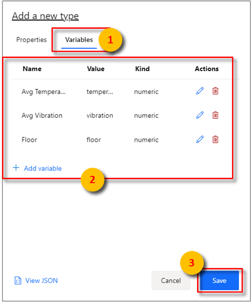](media/v2-update-provision/tsi-add-type-variables.png#lightbox)

    1. Select **Apply**. 
    1. Select **Save**. Three variables are created and displayed.

        

1. Select the **Hierarchies** tab. Then, select **+ Add**.

   1. In the **Edit Hierarchy** pane, set the following parameters:

        | Parameter | Action |
        | --- | ---|
        | **Name** | Enter **Location Hierarchy**. |
        |**Levels**| Enter **Country** as the name of the first level   Select **+ Add Level**   Enter **City** for the second level, then select **+ Add Level**   Enter **Building** as the name of the third and final level |

   1. Select **Save**.

        

1. Navigate to **Instances**.

    1. Under **Actions** on the far right, and select the pencil icon to edit the first instance with the following values:

        | Parameter | Action |
        | --- | --- |
        | **Type** | Select **Elevator**. |
        | **Name** | Enter **Elevator 1**|
        | **Description** | Enter **Instance for Elevator 1** |

    1. Navigate to **Instance Fields** and enter the following values:

        | Parameter | Action |
        | --- | --- |
        | **Hierarchies** | Select **Location Hierarchy** |
        | **Country** | Enter **USA** |
        | **City** | Enter **Seattle** |
        | **Building** | Enter **Space Needle** |

    1. Select **Save**.

1. Repeat the previous step with the other two instances while using the following values:

    **For Elevator 2:**

    | Parameter | Action |
    | --- | --- |
    | **Type** | Select **Elevator**. |
    | **Name** | Enter **Elevator 2**|
    | **Description** | Enter **Instance for Elevator 2** |
    | **Hierarchies** | Select **Location Hierarchy** |
    | **Country** | Enter **USA** |
    | **City** | Enter **Seattle** |
    | **Building** | Enter **Pacific Science Center** |

    **For Elevator 3:**

    | Parameter | Action |
    | --- | --- |
    | **Type** | Select **Elevator**. |
    | **Name** | Enter **Elevator 3**|
    | **Description** | Enter **Instance for Elevator 3** |
    | **Hierarchies** | Select **Location Hierarchy** |
    | **Country** | Enter **USA** |
    | **City** | Enter **New York** |
    | **Building** | Enter **Empire State Building** |

    

1. Navigate back to the **Analyze** tab to view the charting pane. Under **Location Hierarchy**, expand all hierarchy levels to display the time series instances:

    [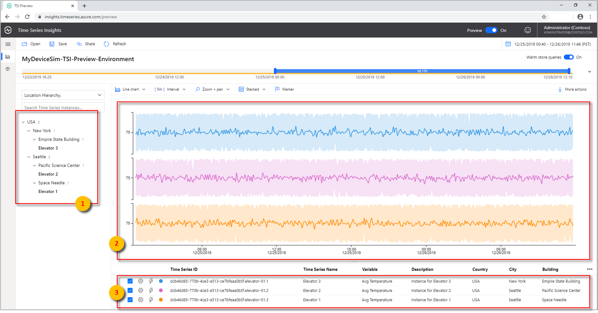](media/v2-update-provision/iot-solution-accelerator-view-hierarchies.png#lightbox)

1. Under **Pacific Science Center**, select the Time Series Instance **Elevator 2**, and then select **Show Average Temperature**.

1. For the same instance, **Elevator 2**, select **Show Floor**.

    With your categorical variable, you can determine how much time the elevator spent on the upper, lower, and middle floors.

    [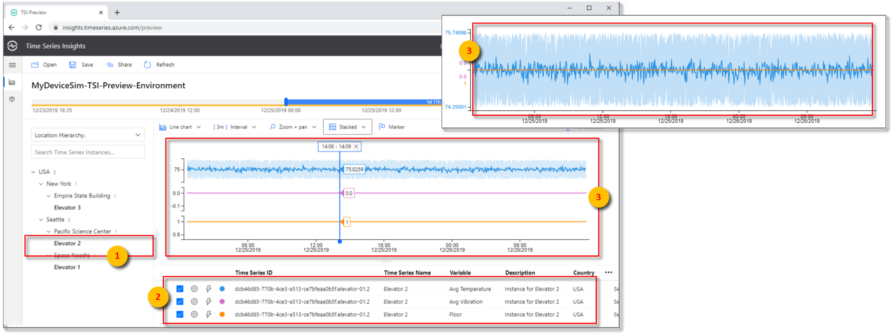](media/v2-update-provision/iot-solution-accelerator-elevator-two.png#lightbox)

## Clean up resources

Now that you've completed the tutorial, clean up the resources you created:

1. From the left menu in the [Azure portal](https://portal.azure.com), select **All resources**, locate your Azure Time Series Insights Gen2 resource group.
1. Either delete the entire resource group (and all resources contained within it) by selecting **Delete** or remove each resource individually.

## Next steps

In this tutorial, you learned how to:  

* Create and use a device simulation accelerator.
* Create an Azure Time Series Insights Gen2 PAYG environment.
* Connect the Azure Time Series Insights Gen2 environment to an iot hub.
* Run a solution accelerator sample to stream data to the Azure Time Series Insights Gen2 environment.
* Perform a basic analysis of the data.
* Define a Time Series Model type and hierarchy, and associate them with your instances.

Now that you know how to create your own Azure Time Series Insights Gen2 environment, learn more about the key concepts in Azure Time Series Insights Gen2.

Read about Azure Time Series Insights Gen2 ingestion:

> [!div class="nextstepaction"]
> [Azure Time Series Insights Gen2 data ingestion overview](./concepts-ingestion-overview.md)

Read about Azure Time Series Insights Gen2 storage:

> [!div class="nextstepaction"]
> [Azure Time Series Insights Gen2 data storage](./concepts-storage.md)

Learn more about Time Series Models:

> [!div class="nextstepaction"]
> [Azure Time Series Insights Gen2 data modeling](./concepts-model-overview.md)

Learn more about connecting your environment to Power BI:

> [!div class="nextstepaction"]
> [Visualize data from Azure Time Series Insights Gen2 in Power BI](./how-to-connect-power-bi.md)
