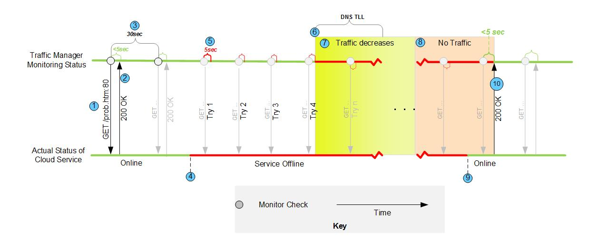

<properties 
   pageTitle="Traffic Manager Monitoring"
   description="This article will help undertstand and configure Traffic Manager monitoring"
   services="traffic-manager"
   documentationCenter=""
   authors="cherylmc"
   manager="adinah"
   editor="tysonn" />
<tags 
   ms.service="traffic-manager"
   ms.devlang="na"
   ms.topic="article"
   ms.tgt_pltfrm="na"
   ms.workload="infrastructure-services"
   ms.date="02/27/2015"
   ms.author="cherylmc" />

# About Traffic Manager Monitoring

Azure Traffic Manager monitors your endpoints, including cloud services and websites, to ensure they are available. In order for monitoring to work correctly, you must set it up the same way for every endpoint that you specify in your Traffic Manager profile. After you configure monitoring, Traffic Manager will display the status for your endpoints and profile in the Management Portal. You can configure monitoring settings in the Management Portal on the Configure page for your Traffic Manager profile. You can specify the following settings:

- **Protocol** – Choose HTTP or HTTPS. It’s important to note that HTTPS monitoring does not verify whether your SSL certificate is valid, it only checks that certificate is present.

- **Port** – Choose the port used for the request. Standard HTTP and HTTPS ports are among the choices.

- **Relative path and file name** – Give the path and the name of the file that the monitoring system will attempt to access. Note that a forward slash "/" is a valid entry for the relative path and implies that the file is in the root directory (default). 

## About monitoring health status

Azure Traffic Manager displays profile and endpoint service health in the Management Portal. The status column for both the profile and the endpoint displays the most recent monitor status. You can use this status to understand the health of your profiles according to your Traffic Manager monitoring settings. When your profile is healthy, DNS queries will be distributed to your services based on the load balancing settings for the profile (Round Robin, Performance, or Failover). Once the Traffic Manager monitoring system detects a change in monitor status, it updates the status entry in the Management Portal. It can take up to five minutes for the state change to refresh.

### Endpoint Monitor status

The Endpoint Monitor status in the table below is the result of a combination of the endpoint health probe results and your profile and endpoint configurations.

|Profile status|Endpoint status|Endpoint Monitor status (API and Portal)|Notes|
|---|---|---|---|
|Disabled|Enabled|Inactive|Disabled profiles are not monitored. However, the endpoint status within disabled profiles can still be managed.|
|&lt;any&gt;|Disabled|Disabled|Disabled profiles are not monitored. However, the endpoint status within disabled profiles can still be managed.|
|Enabled|Enabled|Online|Endpoint is monitored and is healthy.|
|Enabled|Enabled|Degraded|Endpoint is monitored and is unhealthy.|
|Enabled|Enabled|CheckingEndpoint|Endpoint is monitored but the results of the first probe have not yet been received. This state is temporary when you’ve just added a new endpoint to the profile, or have just enabled an endpoint or profile.|
|Enabled|Enabled|Stopped|The underlying cloud service or website is not running.|

### Profile Monitor status

The Profile Monitor status in the table below is the result of the combination of the endpoint monitor status and your configured profile status.

|Profile status (as configured)|Endpoint Monitor status|Profile Monitor status (API and Portal)|Notes|
|---|---|---|---|
|Disabled|&lt;any&gt; or a profile with no defined endpoints.|Disabled|Endpoints are not monitored.|
|Enabled|The status of at least one endpoint is “Degraded”.|Degraded|This is a flag that customer action is required.|
|Enabled|The status of at least one endpoint is “Online”. No endpoints are “Degraded”.|Online|The service is accepting traffic and customer action is not required.|
|Enabled|The status of at least one endpoint is “CheckingEndpoint”. No endpoints are “Online” or “Degraded”.|CheckingEndpoints|Transition state. This typically occurs when a profile has just been enabled and the endpoint health is being probed.|
|Enabled|The status of all endpoints defined in the profile is either “Disabled” or “Stopped”, or the profile has no defined endpoints.|Inactive|No endpoints are active, but the profile is still enabled.|

## How monitoring works

An example timeline illustrating the monitoring process with a single cloud service is displayed is below. This scenario shows the following:

- The cloud service is available and receiving traffic via this Traffic Manager profile ONLY.

- The cloud service becomes unavailable.

- The cloud service remains unavailable for a time much longer than the DNS Time-to-Live (TTL).

- The cloud service becomes available again.

- The cloud service resumes receiving traffic via this Traffic Manager profile ONLY.

**Figure 1** – Monitoring sequence example. The numbers in the diagram correspond to the numbered explanation below.

1. **GET** – The Traffic Manager monitoring system performs a GET on the path and file you specified in the monitoring settings.
2. **200 OK** – The monitoring system expects an HTTP 200 OK message back within 10 seconds. When it receives this response, it assumes that the cloud service is available. 
>[AZURE.NOTE] Traffic Manager only considers an endpoint to be Online if the return message is a 200 OK. If a non-200 response is received, it will assume the endpoint is not available and will count this as a failed check.

3. **30 seconds between checks** – This check will be performed every 30 seconds.
4. **Cloud service unavailable** – The cloud service becomes unavailable. Traffic Manager will not know until the next monitor check.
5. **Attempts to access monitoring file (4 tries)** – The monitoring system performs a GET, but does not receive a response in 10 seconds or less. It then performs three more tries at 30 second intervals. This means that at most, it takes approximately 1.5 minutes for the monitoring system to detect when a service becomes unavailable. If one of the tries is successful, then the number of tries is reset. Although not shown in the diagram, if the 200 OK message(s) come back more than 10 seconds after the GET, the monitoring system will still count this as a failed check.
6. **Marked degraded** – After the fourth failure in a row, the monitoring system will mark the unavailable cloud service as Degraded.
7. **Traffic to cloud service decreases** – Traffic may continue to flow to the unavailable cloud service. Clients will experience failures because the service is unavailable. Clients and secondary DNS servers have cached the DNS record for the IP address of the unavailable cloud service. They continue to resolve the DNS name of the company domain to the IP address of the service. In addition, secondary DNS servers may still hand out the DNS information of the unavailable service. As clients and secondary DNS servers are updated, traffic to the IP address of the unavailable service will slow. The monitoring system continues to perform checks at 30 second intervals. In this example, the service does not respond and remains unavailable.
8. **Traffic to cloud service stops** – By this time, most DNS servers and clients should be updated and traffic to the unavailable service stops. The maximum amount time before traffic completely stops is dependent on the TTL time. The default DNS TTL is 300 seconds (5 minutes). Using this value, clients stop using the service after 5 minutes. The monitoring system continues to perform checks at 30 second intervals and the cloud service does not respond.
9. **Cloud service comes back online and receives traffic** – The service becomes available, but Traffic Manager does not know until the monitoring system performs a check.
10. **Traffic to service resumes** - Traffic Manager sends a GET and receives a 200 OK in under 10 seconds. It then begins to hand out the cloud service’s DNS name to DNS servers as they request updates. As a result, traffic starts to flow to the service once again.

## Child and parent endpoint status for nested profiles

The following table describes the behavior of Traffic Manager monitoring for child and parent profiles of a nested profile and the minChildEndpoints setting. For more information, see [Traffic Manager Overview](traffic-manager-overview.md).

|Child Profile Monitor status|Parent Endpoint Monitor status|Notes|
|---|---|---|
|DisabledThis is due to the profile being disabled by you.|Stopped|The parent endpoint state is Stopped, not Disabled. The Disabled state is reserved for indicating that you have disabled the endpoint in the parent profile.|
|DegradedAt least one is child endpoint is in a Degraded state.|Online state, if the number of Online endpoints in the child profile is at least the value of minChildEndpoints.CheckingEndpoint state, if the number of Online plus CheckingEndpoint endpoints in the child profile is at least the value of minChildEndpoints.Otherwise, in the Degraded state.|Traffic is routed to an endpoint of status CheckingEndpoint.If minChildEndpoints is set too high, the parent endpoint will always be degraded.|
|OnlineAt least one child is an Online state and none are in the Degraded state.|Same as above.||
|CheckingEndpointsAt least one is ‘CheckingEndpoint’; none are ‘Online’ or ‘Degraded’|Same as above.||
|InactiveAll endpoints are either Disabled or Stopped, or this is a profile with no endpoints|Stopped||

## To configure monitoring for a specific path and file name

1. Create a file with the same name on each endpoint you plan to include in your profile.
2. For each endpoint, use a web browser to test access to the file. The URL consists of the domain name of the specific endpoint (the cloud service or website), the path to the file, and the file name. 
3. In the Management Portal, under **Monitoring Settings**, in the **Relative Path and File Name** field, specify the path and file name.
4. When you are finished making your configuration changes, click **Save** at the bottom of the page.

## See Also

[Traffic Manager Overview](traffic-manager-overview.md)

[About Traffic Manager Load Balancing Methods](traffic-manager-load-balancing-methods.md)

[Cloud Services](http://go.microsoft.com/fwlink/p/?LinkId=314074)

[Websites](http://go.microsoft.com/fwlink/p/?LinkId=393327)

[Blog Post- Troubleshooting Traffic Manager Degraded Status](http://go.microsoft.com/fwlink/p/?LinkId=328689)