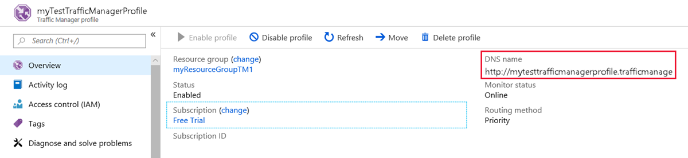
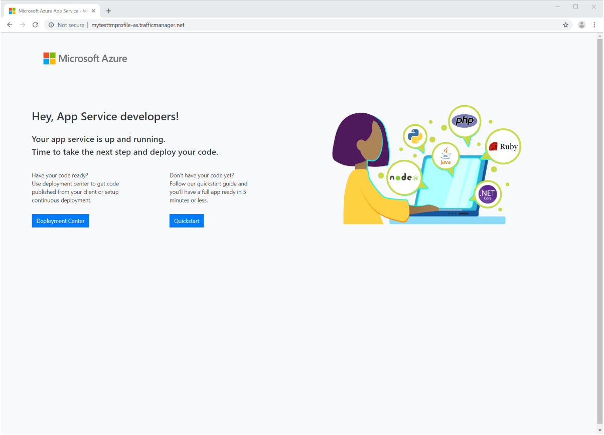

# Quickstart: Create a Traffic Manager profile using the Azure portal

This quickstart describes how to create a Traffic Manager profile that delivers high availability for your web application.

In this quickstart, you'll read about two instances of a web application. Each of them is running in a different Azure region. You'll create a Traffic Manager profile based on [endpoint priority](traffic-manager-routing-methods.md#priority). The profile directs user traffic to the primary site running the web application. Traffic Manager continuously monitors the web application. If the primary site is unavailable, it provides automatic failover to the backup site.

If you don't have an Azure subscription, create a [free account](https://azure.microsoft.com/free/?WT.mc_id=A261C142F) now.

## Sign in to Azure

Sign in to the [Azure portal](https://portal.azure.com).

## Prerequisites

For this quickstart, you'll need two instances of a web application deployed in two different Azure regions (*East US* and *West Europe*). Each will serve as primary and failover endpoints for Traffic Manager.

1. On the upper-left side of the screen, select **Create a resource** > **Web** > **Web App**.
2. In **Web App**, enter, or select these settings:

    | Setting | Value |
    | ------- | ----- |
    | App name | Enter a unique name for your web app.  |
    | Subscription | Select the subscription you want the web app applied to. |
    | Resource Group | Select **Create new**, and enter *myResourceGroupTM1*. |
    | OS | Select **Windows** as your operating system. |
    | Publish | Select **Code** as the format you want to publish to. |

3. Select **App Service plan/Location**.
4. In **App Service plan**, select **Create new**.
5. In **New App Service Plan**, enter, or select these settings:

    | Setting | Value |
    | ------- | ----- |
    | App Service plan | Enter *myAppServicePlanEastUS*. |
    | Location | East US |
    | Pricing tier | S1 Standard |

6. Select **OK**.

7. In **Web App**, select **Create**. When the Web App successfully deploys, it creates a default web site.

8. To create a second website in a different Azure region, repeat steps 1-7 with these settings:

    | Setting | Value |
    | --------| ----- |
    | Name | Enter a unique name for your web app. |
    | Subscription | Select the subscription you want the web app applied to. |
    | Resource group | Select **Create new**, and then enter *myResourceGroupTM2*. |
    | OS | Select **Windows** as your operating system. |
    | Publish | Select **Code** as the format you want to publish to. |
    | App Service plan/Location | Enter *myAppServicePlanWestEurope*. |
    | Location | West Europe |
    | Pricing tier | S1 Standard |

## Create a Traffic Manager profile

Create a Traffic Manager profile that directs user traffic based on endpoint priority.

1. On the upper-left side of the screen, select **Create a resource** > **Networking** > **Traffic Manager profile**.
2. In the **Create Traffic Manager profile**, enter, or select these settings:

    | Setting | Value |
    | --------| ----- |
    | Name | Enter a unique name for your Traffic Manager profile.|
    | Routing method | Select **Priority**.|
    | Subscription | Select the subscription you want the traffic manager profile applied to. |
    | Resource group | Select *myResourceGroupTM1*.|
    | Location |This setting refers to the location of the resource group. It has no effect on the Traffic Manager profile that will be deployed globally.|

3. Select **Create**.

## Add Traffic Manager endpoints

Add the website in the *East US* as primary endpoint to route all the user traffic. Add the website in *West Europe* as a failover endpoint. When the primary endpoint is unavailable, traffic automatically routes to the failover endpoint.

1. In the portal's search bar, enter the Traffic Manager profile name that you created in the preceding section.
2. Select the profile from the search results.
3. In **Traffic Manager profile**, in the **Settings** section, select **Endpoints**, and then select **Add**.
4. Enter, or select, these settings:

    | Setting | Value |
    | ------- | ------|
    | Type | Select **Azure endpoint**. |
    | Name | Enter *myPrimaryEndpoint*. |
    | Target resource type | Select **App Service**. |
    | Target resource | Select **Choose an app service** > **East US**. |
    | Priority | Select **1**. All traffic goes to this endpoint when it's healthy. |

    

5. Select **OK**.
6. To create a failover endpoint for your second Azure region, repeat steps 3 and 4 with these settings:

    | Setting | Value |
    | ------- | ------|
    | Type | Select **Azure endpoint**. |
    | Name | Enter *myFailoverEndpoint*. |
    | Target resource type | Select **App Service**. |
    | Target resource | Select **Choose an app service** > **West Europe**. |
    | Priority | Select **2**. All traffic goes to this failover endpoint if the primary endpoint is unhealthy. |

7. Select **OK**.

When you're done adding the two endpoints, they're displayed in **Traffic Manager profile**. Notice that their monitoring status is **Online** now.

## Test Traffic Manager profile

In this section, you'll check the domain name of your Traffic Manager profile. You'll also configure the primary endpoint to be unavailable. Finally, you get to see that the web app is still available. It's because Traffic Manager sends the traffic to the failover endpoint.

### Check the DNS name

1. In the portal’s search bar, search for the **Traffic Manager profile** name that you created in the preceding section.
2. Select the traffic manager profile. The **Overview** appears.
3. The **Traffic Manager profile** displays the DNS name of your newly created Traffic Manager profile.
  
   

### View Traffic Manager in action

1. In a web browser, enter the DNS name of your Traffic Manager profile to view your Web App's default website.

    > [!NOTE]
    > In this quickstart scenario, all requests route to the primary endpoint. It is set to **Priority 1**.

    

2. To view Traffic Manager failover in action, disable your primary site:
    1. In the Traffic Manager Profile page, from the **Overview** section, select **myPrimaryEndpoint**.
    2. In *myPrimaryEndpoint*, select **Disabled** > **Save**.
    3. Close **myPrimaryEndpoint**. Notice that the status is **Disabled** now.
3. Copy the DNS name of your Traffic Manager Profile from the preceding step to view the website in a new web browser session.
4. Verify that the web app is still available.

The primary endpoint isn't available, so you were routed to the failover endpoint.

## Clean up resources

When you're done, delete the resource groups, web applications, and all related resources. To do so, select each individual item from your dashboard and select **Delete** at the top of each page.

## Next steps

In this quickstart, you created a Traffic Manager profile. It allows you to direct user traffic for high-availability web applications. To learn more about routing traffic, continue to the Traffic Manager tutorials.

> [!div class="nextstepaction"]
> [Traffic Manager tutorials](tutorial-traffic-manager-improve-website-response.md)
