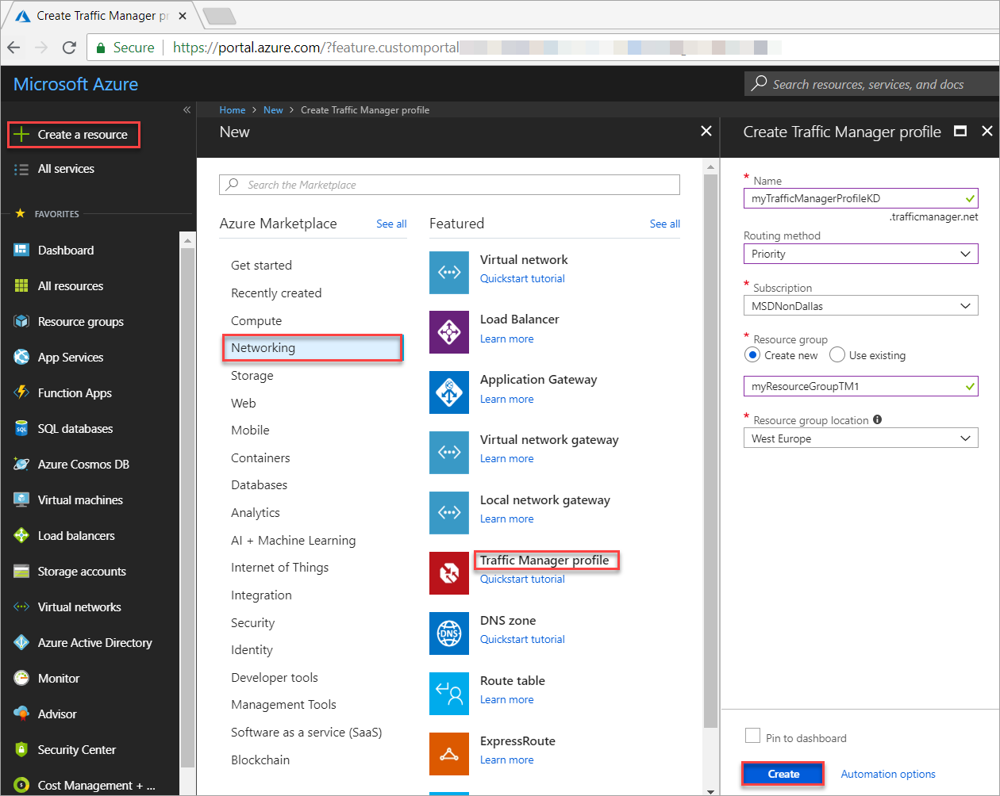
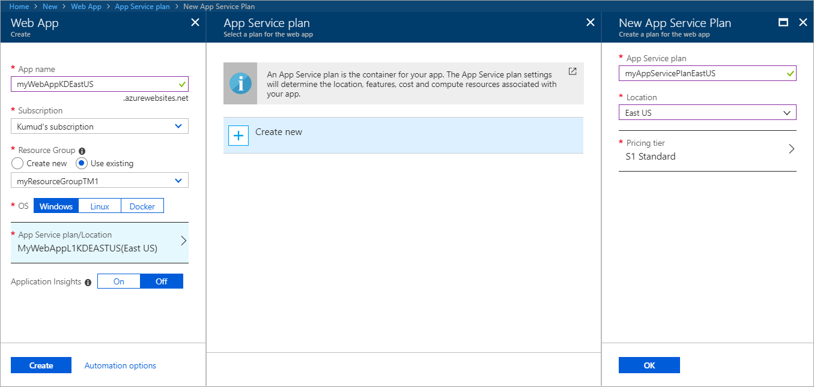
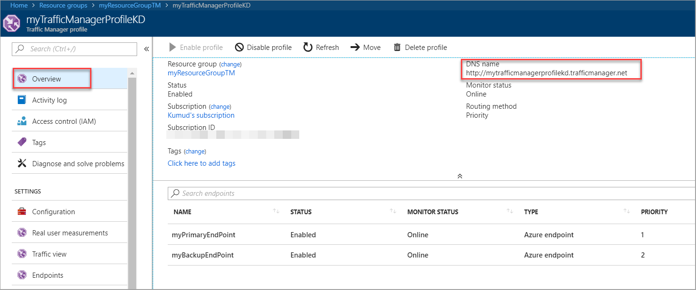
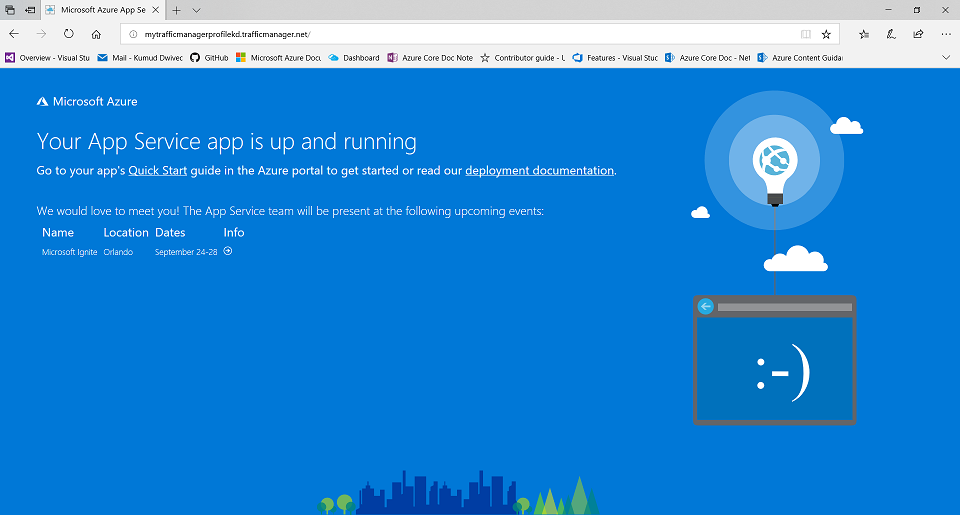

# Quickstart: Create a Traffic Manager profile for high availability of a web application

 Azure Traffic Manager allows you to control the distribution of user traffic to service endpoints across the different Azure regions. This quickstart describes how to create a Traffic Manager profile that delivers high availability of your web application. Traffic Manager accomplishes this by monitoring your service endpoints and providing automatic failover when an endpoint goes down.

If you don't have an Azure subscription, create a [free account](https://azure.microsoft.com/free/?WT.mc_id=A261C142F) before you begin.

## Log in to Azure 

Log in to the Azure portal at https://portal.azure.com.

## Create a Traffic Manager profile
Create a Traffic manager profile that directs user traffic based on endpoint [priority](traffic-manager-routing-methods.md#priority).

1. On the top left-hand side of the screen, select **Create a resource** > **Networking** > **Traffic Manager profile** > **Create**.
2. In the **Create Traffic Manager profile**, enter or select, the following information, accept the defaults for the remaining settings, and then select **Create**:
    | Setting                 | Value                                              |
    | ---                     | ---                                                |
    | Name                   | This name needs to be unique within the trafficmanager.net zone and results in the DNS name <name>, trafficmanager.net which is used to access your Traffic Manager profile.                                   |
    | Routing method          | Select the **Priority** routing method.                                       |
    | Subscription            | Select your subscription.                          |
    | Resource group          | Select **Create new** and enter *myResourceGroupTM1*. |
    | Location                | Select **East US**.  This setting refers to the location of the resource group, and has no impact on the Traffic Manager profile that will be deployed globally.                              |
    |
  
    
    *Figure: Create a Traffic Manager profile*

## Create Web Apps

In this section, you create Web Apps in different Azure regions - *West US* and *East Europe*. These Web Apps later serve as primary and backup service endpoints for the Traffic Manager profile.

1. On the top left-hand side of the screen, select **Create a resource** > **Web** > **Web App** > **Create**.
2. In **Web App**, enter or select the following information:

     | Setting         | Value     |
     | ---              | ---  |
     | Name           | Enter an unique name for your Web App  |
     | Resource group          | Select **Existing**, and the select *myResourceGroupTM1* |
     | App Service plan/Location         | Select **New**.  In the App Service plan, enter  *myAppServicePlanEastUS*, and then select **OK**. 
     |      Location  |   East US        |
    |||

3. Select **Create**.
4. Repeat steps 1-3 to create another Web App in the **West Europe** location, in a new Resource Group named *MyResourceGroupTM2*, and with a service plan name *myAppServicePlanWestEurope*.

    
    *Figure: Create a Web App*

## Add Traffic Manager endpoints

In this section, you add the Web App in the **West US** as the primary endpoint and the app located in **East US** as a backup endpoint to your Traffic manager profile. All traffic is routed to the primary endpoint while the secondary endpoint is kept as a backup. When the primary endpoint is unavailable, traffic is automatically routed to the secondary endpoint.

1. In the portal’s search bar, search for the Traffic Manager profile name that you created in the preceding section and select the profile in the results that the displayed.
2. In **Traffic Manager profile**, in the **Settings** section, click **Endpoints**, and then click **Add**.
3. Enter, or select, the following information, accept the defaults for the remaining settings, and then select **OK**:

    | Setting                 | Value                                              |
    | ---                     | ---                                                |
    | Type                    | Azure endpoint                                   |
    | Name           | myPrimaryEndpoint                                        |
    | Target resource type           | App Service                          |
    | Target resource          | **Choose an app service** to show the listing of the Web Apps under the same subscription. In **Resource**, pick the App service that you want to add as the first endpoint. |
    | Priority               | Select **1**. This results in all traffic going to this endpoint if it is healthy.    |
    |        |           |

     

      *Figure: Add a Traffic Manager endpoint*
1. Repeat steps 3 and 4 for the next Azure Web Apps endpoint. Make sure to add it with its **Priority** value set at **2**.
6.	When the addition of both endpoints is complete, they are displayed in **Traffic Manager profile** along with their monitoring status as **Online**.
  

## Test Traffic Manager profile
In this section, you test how the Traffic Manager fails over to the secondary endpoint when the primary endpoint is unavailable.

1.	In the portal’s search bar, search for the **Traffic Manager profile** name that you created in the preceding section. In the results that are displayed, click the traffic manager profile.
1. Click **Overview**.
2. The **Traffic Manager profile** displays the DNS name of your newly created Traffic Manager profile.

    
     *Figure: Determine the DNS name for the Traffic Manager profile*
    
1. In a web browser, type the DNS name of your Traffic Manager profile to view your web application. In this quickstart scenario, all requests are routed to the primary endpoint that is set to **Priority 1**.

    
    *Figure: Test Traffic Manager traffic routing*
  
1. To view Traffic Manager failover in action, you can disable your primary endpoint. To do so, under **Settings**, select **Endpoints**, select *MyPrimaryEndpoint*, and then select **Disabled**. You can still successfully access your web app in a web browser using the DNS name of your Traffic Manager profile. This is because the user traffic now gets routed to the secondary endpoint since the primary endpoint is unavailable.

## Delete the Traffic Manager profile
When no longer needed, delete the resource group and the Traffic Manager profile that you have created. To do so, select the resource group from the **Traffic Manager profile** and click **Delete**.

## Next steps

- Learn how to [direct traffic to improve your app performance](traffic-manager-configure-performance-routing-method.md).

