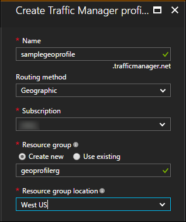

---
title: Tutorial - Configure geographic traffic routing with Azure Traffic Manager
description: This tutorial explains how to configure the geographic traffic routing method using Azure Traffic Manager
services: traffic-manager
author: rohinkoul
manager: kumudD
ms.service: traffic-manager
ms.devlang: na
ms.topic: tutorial
ms.tgt_pltfrm: na
ms.workload: infrastructure-services
ms.date: 03/22/2017
ms.author: rohink
---

# Tutorial: Configure the geographic traffic routing method using Traffic Manager

The Geographic traffic routing method allows you to direct traffic to specific endpoints based on the geographic location where the requests originate. This tutorial shows you how to create a Traffic Manager profile with this routing method and configure the endpoints to receive traffic from specific geographies.

## Create a Traffic Manager Profile

1. From a browser, sign in to the [Azure portal](https://portal.azure.com). If you don’t already have an account, you can sign up for a [free one-month trial](https://azure.microsoft.com/free/).
2. Click **Create a resource** > **Networking** > **Traffic Manager profile** > **Create**.
4. In the **Create Traffic Manager profile**:
    1. Provide a name for your profile. This name needs to be unique within the trafficmanager.net zone. To access your Traffic Manager profile, you use the DNS name `<profilename>.trafficmanager.net`.
    2. Select the **Geographic** routing method.
    3. Select the subscription you want to create this profile under.
    4. Use an existing resource group or create a new resource group to place this profile under. If you choose to create a new resource group, use the **Resource Group location** dropdown to specify the location of the resource group. This setting refers to the location of the resource group, and has no impact on the Traffic Manager profile that's deployed globally.
    5. After you click **Create**, your Traffic Manager profile is created and deployed globally.

## Add endpoints

1. Search for the Traffic Manager profile name you created in the portal’s search bar and click on the result when it is shown.
2. Navigate to **Settings** -> **Endpoints** in Traffic Manager.
3. Click **Add** to show the **Add Endpoint**.
3. Click **Add** and in the **Add endpoint** that is displayed, complete as follows:
4. Select **Type** depending upon the type of endpoint you are adding. For geographic routing profiles used in production, we strongly recommend using nested endpoint types containing a child profile with more than one endpoint. For more details, see [FAQs about geographic traffic routing methods](traffic-manager-FAQs.md).
5. Provide a **Name** by which you want to recognize this endpoint.
6. Certain fields on this page depend on the type of endpoint you are adding:
    1. If you are adding an Azure endpoint, select the **Target resource type** and the **Target** based on the resource you want to direct traffic to
    2. If you are adding an **External** endpoint, provide the **Fully-qualified domain name (FQDN)** for your endpoint.
    3. If you are adding a **Nested endpoint**, select the **Target resource** that corresponds to the child profile you want to use and specify the **Minimum child endpoints count**.
7. In the Geo-mapping section, use the drop down to add the regions from where you want traffic to be sent to this endpoint. You must add at least one region, and you can have multiple regions mapped.
8. Repeat this for all endpoints you want to add under this profile

## Use the Traffic Manager profile
1.	In the portal’s search bar, search for the **Traffic Manager profile** name that you created in the preceding section and click on the traffic manager profile in the results that the displayed.
2. Click **Overview**.
3. The **Traffic Manager profile** displays the DNS name of your newly created Traffic Manager profile. This can be used by any clients (for example, by navigating to it using a web browser) to get routed to the right endpoint as determined by the routing type.  In the case of geographic routing, Traffic Manager looks at the source IP of the incoming request and determines the region from which it is originating. If that region is mapped to an endpoint, traffic is routed to there. If this region is not mapped to an endpoint, then Traffic Manager returns a NODATA query response.

## Next steps

- Learn more about [Geographic traffic routing method](traffic-manager-routing-methods.md#geographic).
- Learn how to [test Traffic Manager settings](traffic-manager-testing-settings.md).
