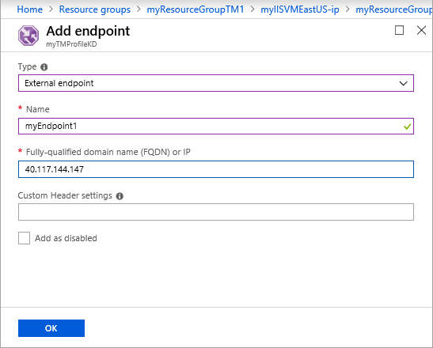

# Direct traffic to IPv4/IPv6 endpoints using Traffic Manager

This article describes how to configure the multivalue traffic-routing method. The **Multivalue** traffic routing method allows you to direct traffic to traffic to A/AAAA endpoint and helps increase the reliability of your application since clients have multiple healthy endpoint options to retry without having to do another DNS lookup. 
When a query is received for this profile, all healthy endpoints are returned based on the maximum return count specified. 

## Sign in to Azure 

Sign in to the Azure portal at https://portal.azure.com.
## Create a resource group
Create a resource group for the Traffic Manager profile.
1. On the left pane of the Azure portal, select **Resource groups**.
2. In **Resource groups**, on the top of the page, select **Add**.
3. In **Resource group name**, type a name *myResourceGroupTM1*. For **Resource group location**, select **East US**, and then select **OK**.

## Create a Traffic Manager profile
Create a Traffic Manager profile that directs user traffic by sending them to the endpoint with lowest latency.

1. On the top left-hand side of the screen, select **Create a resource** > **Networking** > **Traffic Manager profile** > **Create**.
2. In **Create Traffic Manager profile**, enter or select, the following information, accept the defaults for the remaining settings, and then select **Create**:
    | Setting                 | Value                                              |
    | ---                     | ---                                                |
    | Name                   | This name needs to be unique within the trafficmanager.net zone and results in the DNS name, trafficmanager.net that is used to access your Traffic Manager profile.                                   |
    | Routing method          | Select the **Multivalue** routing method.                                       |
    | Subscription            | Select your subscription.                          |
    | Resource group          | Select *myResourceGroupTM1*. |
    | Location                | This setting refers to the location of the resource group, and has no impact on the Traffic Manager profile that will be deployed globally.                              |
    |
  
    

## Add Traffic Manager endpoints

Add two IP addresses as external endpoints to the multivalue traffic manager profile that you created in the preceding step.

1. In the portal’s search bar, search for the Traffic Manager profile name that you created in the preceding section and select the profile in the results that the displayed.
2. In **Traffic Manager profile**, in the **Settings** section, click **Endpoints**, and then click **Add**.
3. Enter, or select, the following information, accept the defaults for the remaining settings, and then select **OK**:

    | Setting                 | Value                                              |
    | ---                     | ---                                                |
    | Type                    | External endpoint                                   |
    | Name           | myEndpoint1                                        |
    | Fully qualified domain name (FQDN) or IP           | Type the Public IP address of the endpoint that you want to add to this Traffic Manager profile                         |
    |        |           |

4. Repeat steps 2 and 3 to add another endpoint named *myEndpoint2*, for **Fully qualified domain name (FQDN) or IP**, enter the public IP address of the second endpoint.
5.	When the addition of both endpoints is complete, they are displayed in **Traffic Manager profile** along with their monitoring status as **Online**.

    
 
## Next steps

- Learn about [weighted traffic routing method](traffic-manager-configure-weighted-routing-method.md).
- Learn about [priority routing method](traffic-manager-configure-priority-routing-method.md).
- Learn about [geographic routing method](traffic-manager-configure-geographic-routing-method.md).

