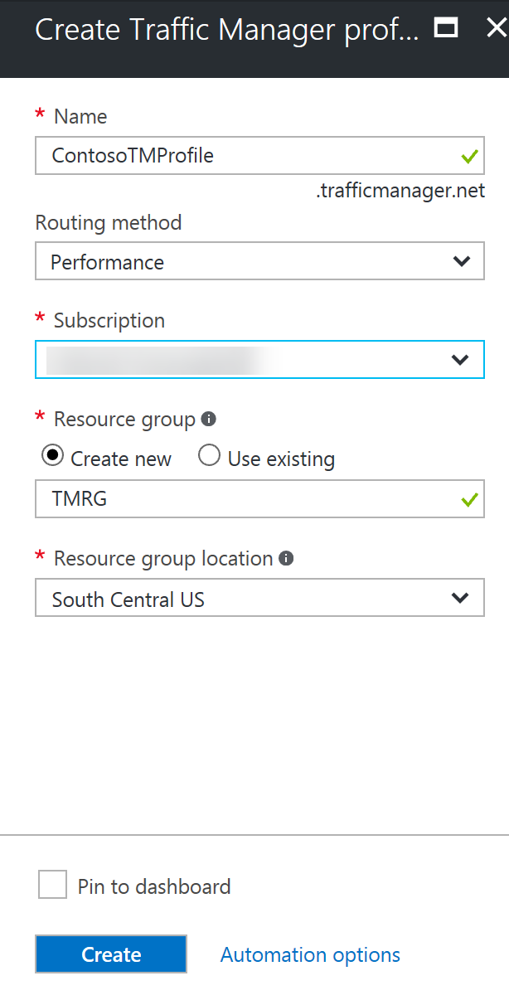
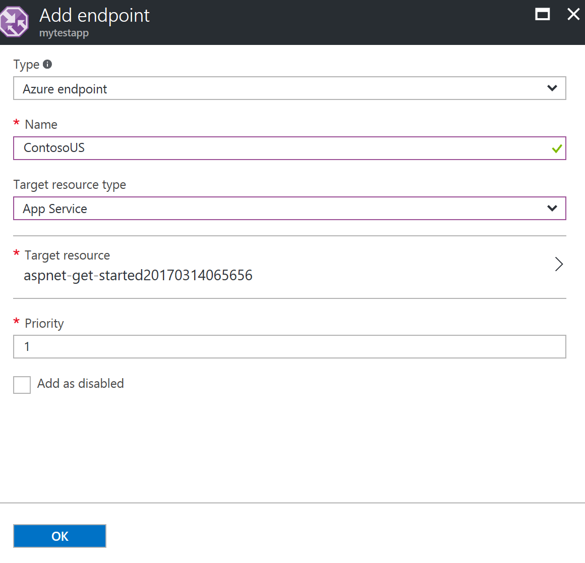

# Create a Traffic Manager profile

This article describes how a profile with **Priority** routing type can be created to route users to two Azure Web Apps endpoints. By using the **Priority** routing type, all traffic is routed to the first endpoint while the second is kept as a backup. As a result, users can be routed to the second endpoint if the first endpoint becomes unhealthy.

In this article, two previously created Azure Web App endpoints are associated to this newly created Traffic Manager profile. To learn more about how to create Azure Web App endpoints, visit the [Azure Web Apps documentation page](https://docs.microsoft.com/azure/app-service-web/). You can add any endpoint that has a DNS name and is reachable over the public internet and that we are using Azure Web Apps endpoints as an example.

### Create a Traffic Manager profile
1. From a browser, sign in to the [Azure portal](http://portal.azure.com). If you don’t already have an account, you can sign-up for a [free one-month trial](https://azure.microsoft.com/free/). 
2. On the **Hub** menu, click **New** > **Networking** > **See all**, click **Traffic Manager** profile to open the **Create Traffic Manager profile** blade, then click **Create**.
3. On the **Create Traffic Manager profile** blade, complete as follows:
    1. In **Name**, provide a name for your profile. This name needs to be unique within the trafficmanager.net zone and results in the DNS name <name>,trafficmanager.net which is used to access your Traffic Manager profile.
    2. In **Routing method**, select the **Priority** routing method.
    3. In **Subscription**, select the subscription you want to create this profile under
    4. In **Resource Group**, create a new resource group to place this profile under.
    5. In **Resource group location**, select the location of the resource group. This setting refers to the location of the resource group, and has no impact on the Traffic Manager profile that will be deployed globally.
    6. Click **Create**.
    7. When the global deployment of your Traffic Manager profile is complete, it is listed in respective resource group as one of the resources.

    

## Add Traffic Manager endpoints

1. In the portal’s search bar, search for the **Traffic Manager profile** name that you created in the preceding section and click the traffic manager profile in the results that the displayed.
2. In the **Traffic Manager profile** blade, in the **Settings** section, click **Endpoints**.
3. In the **Endpoints** blade that is displayed, click **Add**.
4. In the **Add endpoint** blade, complete as follows:
    1. For **Type**, click **Azure endpoint**.
    2. Provide a **Name** by which you want to recognize this endpoint.
    3. For **Target resource type**, click **App Service**.
    4. For **Target resource**, click **Choose an app service** to show the listing of the Web Apps under the same subscription. In the **Resource** blade that is displayed, pick the App service that you want to add as the first endpoint.
    5. For **Priority**, select as **1**. This results in all traffic going to this endpoint if it is healthy.
    6. Keep **Add as disabled** unchecked.
    7. Click **OK**
5.	Repeat steps 3 and 4 for the next Azure Web Apps endpoint. Make sure to add it with its **Priority** value set at **2**.
6.	When the addition of both endpoints is complete, they are displayed in the **Traffic Manager profile** blade along with their monitoring status as **Online**.

    

## Use the Traffic Manager profile
1.	In the portal’s search bar, search for the **Traffic Manager profile** name that you created in the preceding section. In the results that are displayed, click the traffic manager profile.
2. In the **Traffic Manager profile** blade, click **Overview**.
3. The **Traffic Manager profile** blade displays the DNS name of your newly created Traffic Manager profile. This can be used by any clients (for example, by navigating to it using a web browser) to get routed to the right endpoint as determined by the routing type. In this case, all requests are routed to the first endpoint and if Traffic Manager detects it be unhealthy, the traffic automatically fails over to the next endpoint.

## Delete the Traffic Manager profile
When no longer needed, delete the resource group and the Traffic Manager profile that you have created. To do so, select the resource group from the **Traffic Manager profile** blade and click **Delete**.

## Next steps

- Learn more about [routing types](traffic-manager-routing-methods.md).
- Learn more about endpoint types [endpoint types](traffic-manager-endpoint-types.md).
- Learn more about [endpoint monitoring](traffic-manager-monitoring.md).

