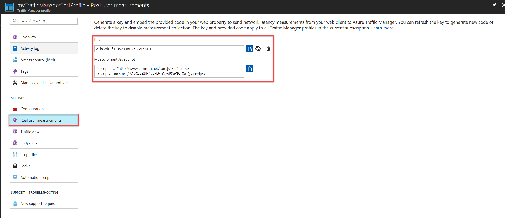

# How to send Real User Measurements to Traffic Manager with Visual Studio Mobile Center

You can set up your mobile application developed using Visual Studio Mobile Center to send Real User Measurements to Traffic Manager by following the steps:

>[!NOTE]
> Currently, sending Real User Measurements to Traffic manager is only supported for Android.

To configure Real User Measurements, you need to obtain a key and instrument your app with the RUM package.

## Step 1: Obtain a key
    
The measurements you take and sent to Traffic Manager from your client application are identified by the service using a unique string, called the Real User Measurements (RUM) Key. You can get a RUM key using the Azure portal, a REST API or by using the PowerShell / CLI interfaces.

To obtain the RUM Key using Azure portal using the following procedure:
1. From a browser, sign in to the Azure portal. If you don’t already have an account, you can sign up for a free one-month trial.
2. In the portal’s search bar, search for the Traffic Manager profile name that you want to modify, and then click the Traffic Manager profile in the results that the displayed.
3. In the Traffic Manager profile page, click **Real User Measurements** under **Settings**.
4. Click **Generate Key** to create a new RUM Key.
        
   

   **Figure 1: Real User Measurements key generation**

5. The page displays the RUM Key that is generated and a JavaScript code snippet that needs to be embedded into your HTML page.
 
   

   **Figure 2: Real User Measurements Key and Measurement JavaScript**
 
6. Click the **Copy** button to copy the RUM Key. 

## Step 2: Instrument your app with the RUM package of Mobile Center SDK

If you're new to Visual Studio Mobile Center, visit its [website](https://mobile.azure.com). For detailed instructions on SDK integration, see
[Getting Started with the Android SDK](https://docs.microsoft.com/mobile-center/sdk/getting-started/Android).

To use Real User Measurements, complete the following procedure:

1.  Add the SDK to the project

    During the preview of the ATM RUM SDK, you need to explicitly reference the package repository.

    In your **app/build.gradle** file add the following lines:

    ```groovy
    repositories {
        maven {
            url "https://dl.bintray.com/mobile-center/mobile-center-snapshot"
        }
    }
    ```
    In your **app/build.gradle** file add the following lines:

    ```groovy
    dependencies {
     
        def mobileCenterSdkVersion = '0.12.1-16+3fe5b08'
        compile "com.microsoft.azure.mobile:mobile-center-rum:${mobileCenterSdkVersion}"
    }
    ```

2. Start the SDK

    Open your app’s main activity class and add the following import statements:

    ```java
    import com.microsoft.azure.mobile.MobileCenter;
    import com.microsoft.azure.mobile.rum.RealUserMeasurements;
    ```

    Look for the `onCreate` callback in the same file and add the following code:

    ```java
    RealUserMeasurements.setRumKey("<Your RUM Key>");
    MobileCenter.start(getApplication(), "<Your Mobile Center AppSecret>", RealUserMeasurements.class);
    ```

## Next steps
- Learn more about [Real User Measurements](traffic-manager-rum-overview.md)
- Learn [how Traffic Manager works](traffic-manager-overview.md)
- Learn more about [Mobile Center](https://docs.microsoft.com/mobile-center/)
- [Sign up](https://mobile.azure.com) for Mobile Center
- Learn more about the [traffic-routing methods](traffic-manager-routing-methods.md) supported by Traffic Manager
- Learn how to [create a Traffic Manager profile](traffic-manager-create-profile.md)

