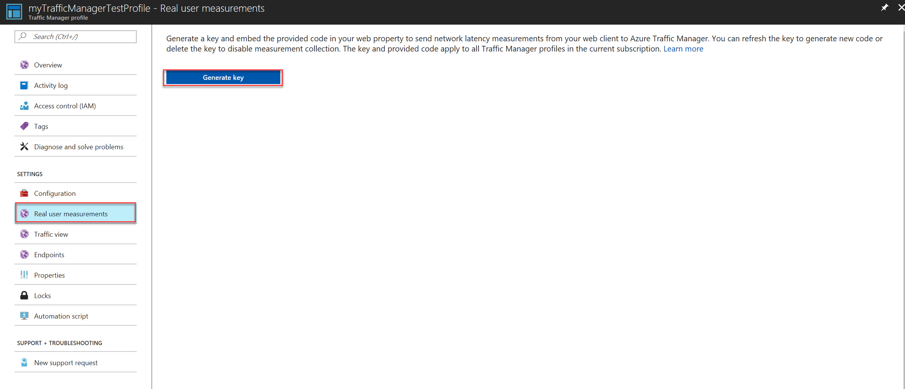
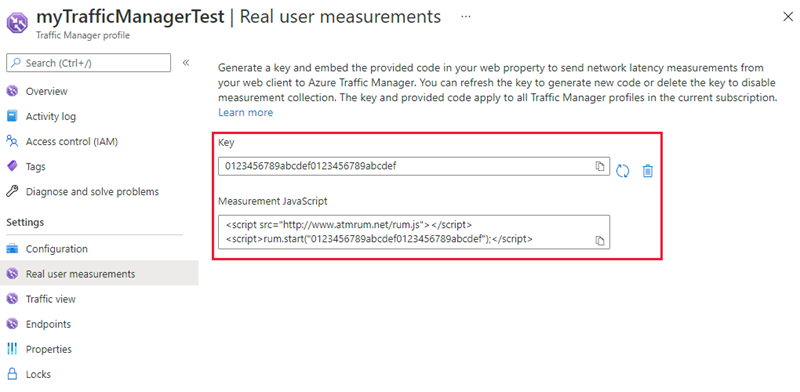
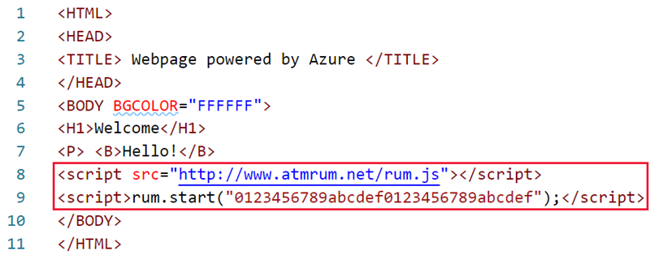

# How to send Real User Measurements to Azure Traffic Manager using web pages

You can configure your web pages to send Real User Measurements to Traffic Manager by obtaining a Real User Measurements (RUM) key and embedding the generated code to web page.

## Obtain a Real User Measurements key

The measurements you take and send to Traffic Manager from your client application are identified by the service using a unique string, called the **Real User Measurements (RUM) Key**. You can get a RUM key using the Azure portal, a REST API, or by using the PowerShell or Azure CLI.

To obtain the RUM Key using Azure portal:
1. From a browser, sign in to the Azure portal. If you don’t already have an account, you can sign up for a free one-month trial.
2. In the portal’s search bar, search for the Traffic Manager profile name that you want to modify, and then click the Traffic Manager profile in the results that the displayed.
3. In the Traffic Manager profile blade, click **Real User Measurements** under **Settings**.
4. Click **Generate Key** to create a new RUM Key.
 
   

   **Figure 1: Real User Measurements Key Generation**

5. The blade now displays the RUM Key generated and a JavaScript code snippet that needs to be embedded into your HTML page.
 
    

    **Figure 2: Real User Measurements Key and Measurement JavaScript**
 
6. Click the **Copy** button to copy the JavaScript code. 

>[!IMPORTANT]
> Use the generated JavaScript for Real User Measurements feature to function properly. Any changes to this script or the scripts used by Real User Measurements can lead to unpredictable behavior.

## Embed the code to an HTML web page

After you have obtained the RUM key, the next step is to embed this copied JavaScript into an HTML page that your end users visit. Editing HTML can be done in many ways and using different tools and workflows. This example shows how to update an HTML page to add this script. You can use this guidance to adapt it to your HTML source management workflow.

1.	Open the HTML page in a text editor
2.	Paste the JavaScript code you had copied in the earlier step to the BODY section of the HTML (the copied code is on line 8 & 9, see figure 3).
 
      

    **Figure 3: Simple HTML with embedded Real User Measurements JavaScript**

3.	Save the HTML file and host it on a webserver connected to the internet. 
4. Next time this page is rendered on a web browser, the JavaScript referenced is downloaded and the script will execute the measurement and reporting operations.

## Next steps
- Learn more about [Real User Measurements](traffic-manager-rum-overview.md)
- Learn [how Traffic Manager works](traffic-manager-overview.md)
- Learn more about the [traffic-routing methods](traffic-manager-routing-methods.md) supported by Traffic Manager
- Learn how to [create a Traffic Manager profile](traffic-manager-create-profile.md)

