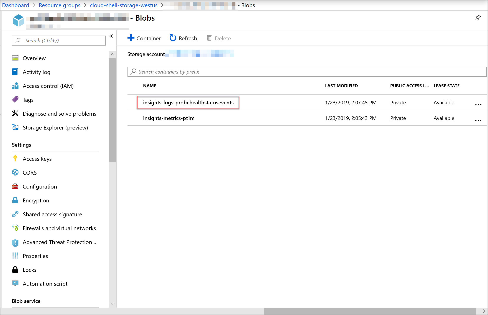

# Enable resource logging in Azure Traffic Manager

This article describes how to enable collection of diagnostic resource logs and access log data for a Traffic Manager profile.

Azure Traffic Manager resource logs can provide insight into the behavior of the Traffic Manager profile resource. For example, you can use the profile's log data to determine why individual probes have timed out against an endpoint.

## Prerequisites

* If you don't have an Azure subscription, create a [free account](https://azure.microsoft.com/free/?WT.mc_id=A261C142F) before you begin.
* This guide requires a Traffic Manager profile. To learn more, see [Create a Traffic Manager profile](./quickstart-create-traffic-manager-profile.md).

* This guide requires an Azure Storage account. To learn more, see [Create a storage account](../storage/common/storage-account-create.md).

[!INCLUDE [cloud-shell-try-it.md](../../includes/cloud-shell-try-it.md)]
If you choose to install and use PowerShell locally, this article requires the Azure PowerShell module version 5.4.1 or later. Run `Get-Module -ListAvailable Az` to find the installed version. If you need to upgrade, see [Install Azure PowerShell module](/powershell/azure/install-azure-powershell). If you're running PowerShell locally, you also need to run `Connect-AzAccount` to create a connection with Azure.

## Enable resource logging


1. **Retrieve the Traffic Manager profile:**

    To enable resource logging, you need the ID of a Traffic Manager profile. Retrieve the Traffic Manager profile that you want to enable resource logging for with [Get-AzTrafficManagerProfile](/powershell/module/az.TrafficManager/Get-azTrafficManagerProfile). The output includes the Traffic Manager profile's ID information.

    ```azurepowershell-interactive
    Get-AzTrafficManagerProfile -Name <TrafficManagerprofilename> -ResourceGroupName <resourcegroupname>
    ```

2. **Enable resource logging for the Traffic Manager profile:**

    Enable resource logging for the Traffic Manager profile using the ID obtained in the previous step with [New-AzDiagnosticSetting](/powershell/module/az.monitor/new-azdiagnosticsetting). The following command stores verbose logs for the Traffic Manager profile to a specified Azure Storage account. 

      ```azurepowershell-interactive
    $subscriptionId = (Get-AzContext).Subscription.Id
    $metric = @()
    $log = @()
    $categories = Get-AzDiagnosticSettingCategory -ResourceId  <TrafficManagerprofileResourceId>
    $categories | ForEach-Object {if($_.CategoryType -eq "Metrics"){$metric+=New-AzDiagnosticSettingMetricSettingsObject -Enabled $true -Category $_.Name -RetentionPolicyDay 7 -RetentionPolicyEnabled $true} else{$log+=New-AzDiagnosticSettingLogSettingsObject -Enabled $true -Category $_.Name -RetentionPolicyDay 7 -RetentionPolicyEnabled $true}}
    New-AzDiagnosticSetting -Name <DiagnosticSettingName> -ResourceId <TrafficManagerprofileResourceId> -StorageAccountId <storageAccountId> -Log $log -Metric $metric
 
      ``` 
3. **Verify diagnostic settings:**

      Verify diagnostic settings for the Traffic Manager profile using [Get-AzDiagnosticSetting](/powershell/module/az.monitor/get-azdiagnosticsetting). The following command displays the categories that are logged for a resource.

     ```azurepowershell-interactive
     Get-AzDiagnosticSetting -ResourceId <TrafficManagerprofileResourceId>
     ```  
      Ensure that all log categories associated with the Traffic Manager profile resource display as enabled. Also, verify that the storage account is correctly set.

## Access log files

To access log files follow the following steps.

1. Sign in to the [Azure portal](https://portal.azure.com).
1. Navigate to your Azure Storage account in the portal.
2. On the left pane of your Azure storage account, under **Data Storage** select **Containers**.
3. For **Containers**, select **$logs**, and navigate down to the PT1H.json file and select **Download** to download and save a copy of this log file.

    


## Traffic Manager log schema

All resource logs available through Azure Monitor share a common top-level schema, with flexibility for each service to emit unique properties for their own events. 
For top-level resource logs schema, see [Supported services, schemas, and categories for Azure Resource Logs](../azure-monitor/essentials/resource-logs-schema.md).

The following table includes logs schema specific to the Azure Traffic Manager profile resource.

|Field Name|Field Type|Definition|Example|
|----|----|---|---|
|EndpointName|String|The name of the Traffic Manager endpoint whose health status is being recorded.|*myPrimaryEndpoint*|
|Status|String|The health status of the Traffic Manager endpoint that was probed. The status can either be **Up** or **Down**.|**Up**|
|||||

## Next steps

* Learn more about [Traffic Manager Monitoring](traffic-manager-monitoring.md)
