# Using load-balancing services in Azure

## Introduction

Microsoft Azure provides multiple services for managing how network traffic is distributed and load balanced. You can use these services individually or combine their methods, depending on your needs, to build the optimal solution.

In this tutorial, we first define a customer use case and see how it can be made more robust and performant by using the following Azure load-balancing portfolio: Traffic Manager, Application Gateway, and Load Balancer. We then provide step-by-step instructions for creating a deployment that is geographically redundant, distributes traffic to VMs, and helps you manage different types of requests.

At a conceptual level, each of these services plays a distinct role in the load-balancing hierarchy.

* **Traffic Manager** provides global DNS load balancing. It looks at incoming DNS requests and responds with a healthy endpoint, in accordance with the routing policy the customer has selected. Options for routing methods are:
  * Performance routing to send the requestor to the closest endpoint in terms of latency.
  * Priority routing to direct all traffic to an endpoint, with other endpoints as backup.
  * Weighted round-robin routing, which distributes traffic based on the weighting that is assigned to each endpoint.
  * Geography-based routing to distribute the traffic to your application endpoints based on geographic location of the user.
  * Subnet-based routing to distribute the traffic to your application endpoints based on the subnet (IP address range) of the user.
  * Multi Value routing that enable you to send IP addresses of more than one application endpoints in a single DNS response.

  The client connects directly to the endpoint returned by Traffic Manager. Azure Traffic Manager detects when an endpoint is unhealthy and then redirects the clients to another healthy instance. Refer to [Azure Traffic Manager documentation](traffic-manager-overview.md) to learn more about the service.
* **Application Gateway** provides application delivery controller (ADC) as a service, offering various Layer 7 load-balancing capabilities for your application. It allows customers to optimize web farm productivity by offloading CPU-intensive TLS termination to the application gateway. Other Layer 7 routing capabilities include round-robin distribution of incoming traffic, cookie-based session affinity, URL path-based routing, and the ability to host multiple websites behind a single application gateway. Application Gateway can be configured as an Internet-facing gateway, an internal-only gateway, or a combination of both. Application Gateway is fully Azure managed, scalable, and highly available. It provides a rich set of diagnostics and logging capabilities for better manageability.
* **Load Balancer** is an integral part of the Azure SDN stack, providing high-performance, low-latency Layer 4 load-balancing services for all UDP and TCP protocols. It manages inbound and outbound connections. You can configure public and internal load-balanced endpoints and define rules to map inbound connections to back-end pool destinations by using TCP and HTTP health-probing options to manage service availability.

## Scenario

In this example scenario, we use a simple website that serves two types of content: images and dynamically rendered webpages. The website must be geographically redundant, and it should serve its users from the closest (lowest latency) location to them. The application developer has decided that any URLs that match the pattern /images/* are served from a dedicated pool of VMs that are different from the rest of the web farm.

Additionally, the default VM pool serving the dynamic content needs to talk to a back-end database that is hosted on a high-availability cluster. The entire deployment is set up through Azure Resource Manager.

Using Traffic Manager, Application Gateway, and Load Balancer allows this website to achieve these design goals:

* **Multi-geo redundancy**: If one region goes down, Traffic Manager routes traffic seamlessly to the closest region without any intervention from the application owner.
* **Reduced latency**: Because Traffic Manager automatically directs the customer to the closest region, the customer experiences lower latency when requesting the webpage contents.
* **Independent scalability**: Because the web application workload is separated by type of content, the application owner can scale the request workloads independent of each other. Application Gateway ensures that the traffic is routed to the right pools based on the specified rules and the health of the application.
* **Internal load balancing**: Because Load Balancer is in front of the high-availability cluster, only the active and healthy endpoint for a database is exposed to the application. Additionally, a database administrator can optimize the workload by distributing active and passive replicas across the cluster independent of the front-end application. Load Balancer delivers connections to the high-availability cluster and ensures that only healthy databases receive connection requests.

The following diagram shows the architecture of this scenario:

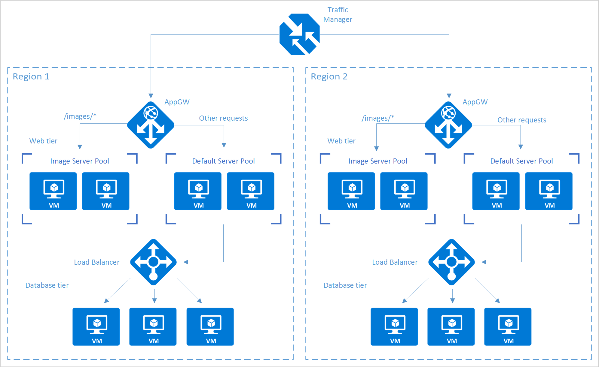

> [!NOTE]
> This example is only one of many possible configurations of the load-balancing services that Azure offers. Traffic Manager, Application Gateway, and Load Balancer can be mixed and matched to best suit your load-balancing needs. For example, if TLS offload or Layer 7 processing is not necessary, Load Balancer can be used in place of Application Gateway.

## Setting up the load-balancing stack

### Step 1: Create a Traffic Manager profile

1. In the Azure portal, click **Create a resource** > **Networking** > **Traffic Manager profile** > **Create**.
2. Enter the following basic information:

   * **Name**: Give your Traffic Manager profile a DNS prefix name.
   * **Routing method**: Select the traffic-routing method policy. For more information about the methods, see [About Traffic Manager traffic routing methods](traffic-manager-routing-methods.md).
   * **Subscription**: Select the subscription that contains the profile.
   * **Resource group**: Select the resource group that contains the profile. It can be a new or existing resource group.
   * **Resource group location**: Traffic Manager service is global and not bound to a location. However, you must specify a region for the group where the metadata associated with the Traffic Manager profile resides. This location has no impact on the runtime availability of the profile.

3. Click **Create** to generate the Traffic Manager profile.

   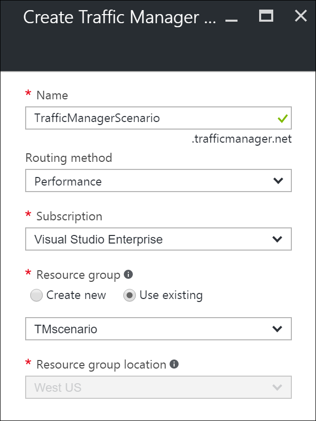

### Step 2: Create the application gateways

1. In the Azure portal, in the left pane, click **Create a resource** > **Networking** > **Application Gateway**.
2. Enter the following basic information about the application gateway:

   * **Name**: The name of the application gateway.
   * **SKU size**: The size of the application gateway, available as Small, Medium, or Large.
   * **Instance count**: The number of instances, a value from 2 through 10.
   * **Resource group**: The resource group that holds the application gateway. It can be an existing resource group or a new one.
   * **Location**: The region for the application gateway, which is the same location as the resource group. The location is important, because the virtual network and public IP must be in the same location as the gateway.
3. Click **OK**.
4. Define the virtual network, subnet, front-end IP, and listener configurations for the application gateway. In this scenario, the front-end IP address is **Public**, which allows it to be added as an endpoint to the Traffic Manager profile later on.
5. Configure the listener with one of the following options:
    * If you use HTTP, there is nothing to configure. Click **OK**.
    * If you use HTTPS, further configuration is required. Refer to [Create an application gateway](../application-gateway/quick-create-portal.md), starting at step 9. When you have completed the configuration, click **OK**.

#### Configure URL routing for application gateways

When you choose a back-end pool, an application gateway that's configured with a path-based rule takes a path pattern of the request URL in addition to round-robin distribution. In this scenario, we are adding a path-based rule to direct any URL with "/images/\*" to the image server pool. For more information about configuring URL path-based routing for an application gateway, refer to [Create a path-based rule for an application gateway](../application-gateway/create-url-route-portal.md).

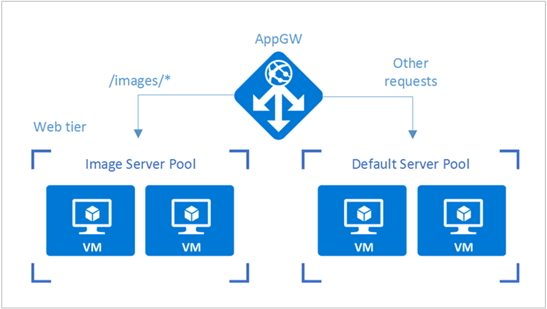

1. From your resource group, go to the instance of the application gateway that you created in the preceding section.
2. Under **Settings**, select **Backend pools**, and then select **Add** to add the VMs that you want to associate with the web-tier back-end pools.
3. Enter the name of the back-end pool and all the IP addresses of the machines that reside in the pool. In this scenario, we are connecting two back-end server pools of virtual machines.

   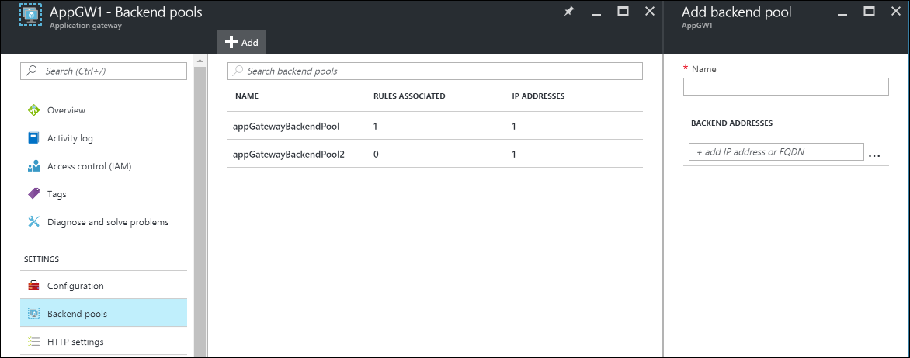

4. Under **Settings** of the application gateway, select **Rules**, and then click the **Path based** button to add a rule.

   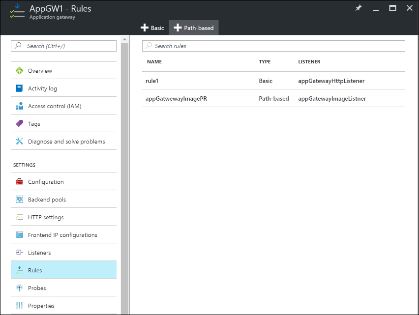

5. Configure the rule by providing the following information.

   Basic settings:

   + **Name**: The friendly name of the rule that is accessible in the portal.
   + **Listener**: The listener that is used for the rule.
   + **Default backend pool**: The back-end pool to be used with the default rule.
   + **Default HTTP settings**: The HTTP settings to be used with the default rule.

   Path-based rules:

   + **Name**: The friendly name of the path-based rule.
   + **Paths**: The path rule that is used for forwarding traffic.
   + **Backend Pool**: The back-end pool to be used with this rule.
   + **HTTP Setting**: The HTTP settings to be used with this rule.

   > [!IMPORTANT]
   > Paths: Valid paths must start with "/". The wildcard "\*" is allowed only at the end. Valid examples are /xyz, /xyz\*, or /xyz/\*.

   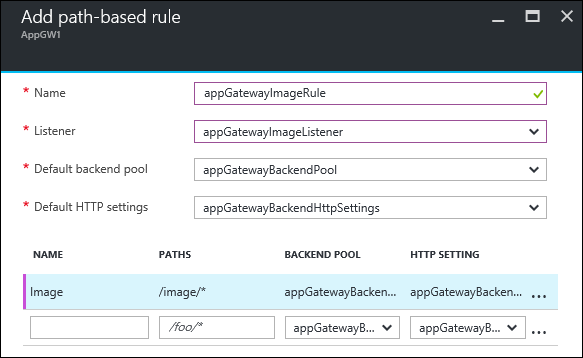

### Step 3: Add application gateways to the Traffic Manager endpoints

In this scenario, Traffic Manager is connected to application gateways (as configured in the preceding steps) that reside in different regions. Now that the application gateways are configured, the next step is to connect them to your Traffic Manager profile.

1. Open your Traffic Manager profile. To do so, look in your resource group or search for the name of the Traffic Manager profile from **All Resources**.
2. In the left pane, select **Endpoints**, and then click **Add** to add an endpoint.

   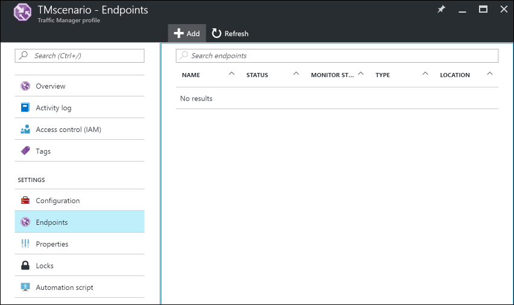

3. Create an endpoint by entering the following information:

   * **Type**: Select the type of endpoint to load-balance. In this scenario, select **Azure endpoint** because we are connecting it to the application gateway instances that were configured previously.
   * **Name**: Enter the name of the endpoint.
   * **Target resource type**: Select **Public IP address** and then, under **Target resource**, select the public IP of the application gateway that was configured previously.

   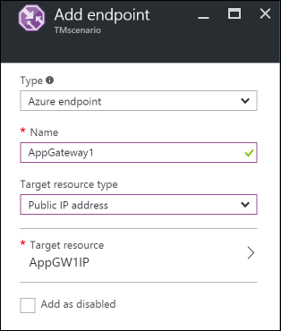

4. Now you can test your setup by accessing it with the DNS of your Traffic Manager profile (in this example: TrafficManagerScenario.trafficmanager.net). You can resend requests, bring up or bring down VMs and web servers that were created in different regions, and change the Traffic Manager profile settings to test your setup.

### Step 4: Create a load balancer

In this scenario, Load Balancer distributes connections from the web tier to the databases within a high-availability cluster.

If your high-availability database cluster is using SQL Server Always On, refer to [Configure one or more Always On Availability Group Listeners](/azure/azure-sql/virtual-machines/windows/availability-group-listener-powershell-configure) for step-by-step instructions.

For more information about configuring an internal load balancer, see [Create an Internal load balancer in the Azure portal](../load-balancer/quickstart-load-balancer-standard-internal-portal.md).

1. In the Azure portal, in the left pane, click **Create a resource** > **Networking** > **Load balancer**.
2. Choose a name for your load balancer.
3. Set the **Type** to **Internal**, and choose the appropriate virtual network and subnet for the load balancer to reside in.
4. Under **IP address assignment**, select either **Dynamic** or **Static**.
5. Under **Resource group**, choose the resource group for the load balancer.
6. Under **Location**, choose the appropriate region for the load balancer.
7. Click **Create** to generate the load balancer.

#### Connect a back-end database tier to the load balancer

1. From your resource group, find the load balancer that was created in the previous steps.
2. Under **Settings**, click **Backend pools**, and then click **Add** to add a back-end pool.

   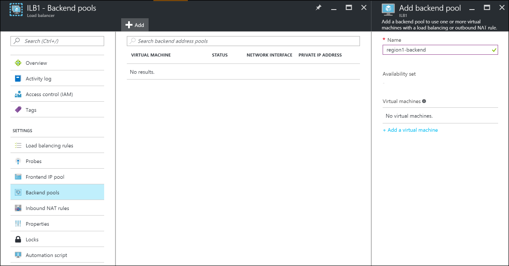

3. Enter the name of the back-end pool.
4. Add either individual machines or an availability set to the back-end pool.

#### Configure a probe

1. In your load balancer, under **Settings**, select **Probes**, and then click **Add** to add a probe.

   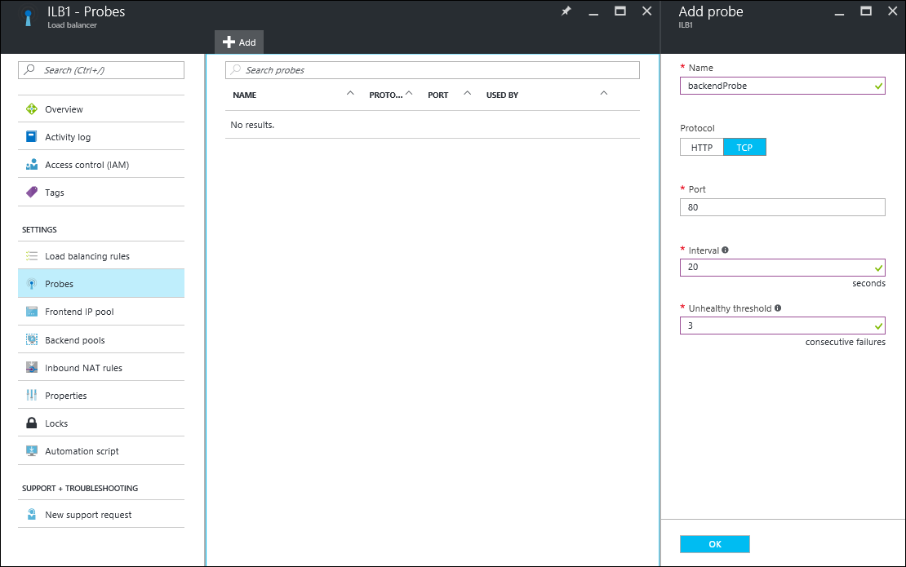

2. Enter the name for the probe.
3. Select the **Protocol** for the probe. For a database, you might want a TCP probe rather than an HTTP probe. To learn more about load-balancer probes, refer to [Understand load balancer probes](../load-balancer/load-balancer-custom-probe-overview.md).
4. Enter the **Port** of your database to be used for accessing the probe.
5. Under **Interval**, specify how frequently to probe the application.
6. Under **Unhealthy threshold**, specify the number of continuous probe failures that must occur for the back-end VM to be considered unhealthy.
7. Click **OK** to create the probe.

#### Configure the load-balancing rules

1. Under **Settings** of your load balancer, select **Load balancing rules**, and then click **Add** to create a rule.
2. Enter the **Name** for the load-balancing rule.
3. Choose the **Frontend IP Address** of the load balancer, **Protocol**, and **Port**.
4. Under **Backend port**, specify the port to be used in the back-end pool.
5. Select the **Backend pool** and the **Probe** that were created in the previous steps to apply the rule to.
6. Under **Session persistence**, choose how you want the sessions to persist.
7. Under **Idle timeouts**, specify the number of minutes before an idle timeout.
8. Under **Floating IP**, select either **Disabled** or **Enabled**.
9. Click **OK** to create the rule.

### Step 5: Connect web-tier VMs to the load balancer

Now we configure the IP address and load-balancer front-end port in the applications that are running on your web-tier VMs for any database connections. This configuration is specific to the applications that run on these VMs. To configure the destination IP address and port, refer to the application documentation. To find the IP address of the front end, in the Azure portal, go to the front-end IP pool on the **Load balancer settings**.

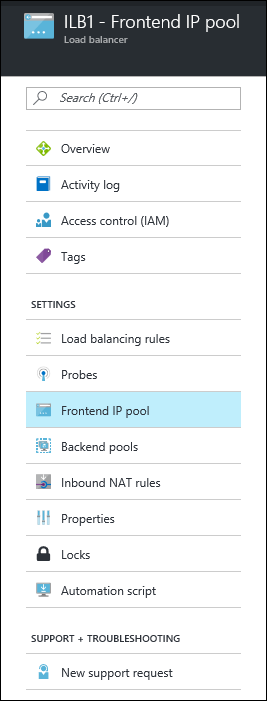

## Next steps

* [Overview of Traffic Manager](traffic-manager-overview.md)
* [Application Gateway overview](../application-gateway/overview.md)
* [Azure Load Balancer overview](../load-balancer/load-balancer-overview.md)