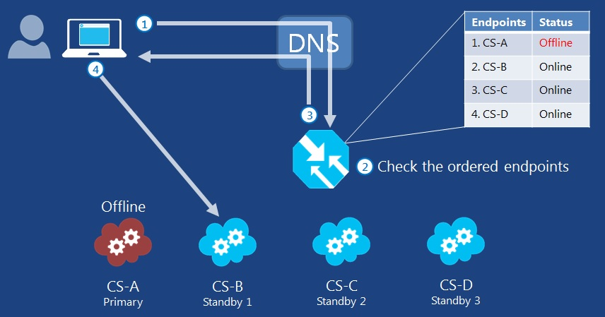
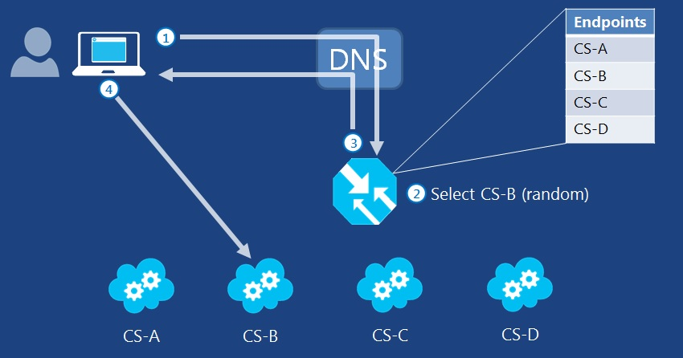

<properties 
   pageTitle=" Traffic Manager - traffic routing methods | Microsoft Azure"
   description="This articles will help you understand the different traffic routing methods used by Traffic Manager"
   services="traffic-manager"
   documentationCenter=""
   authors="joaoma"
   manager="adinah"
   editor="tysonn" />
<tags 
   ms.service="traffic-manager"
   ms.devlang="na"
   ms.topic="article"
   ms.tgt_pltfrm="na"
   ms.workload="infrastructure-services"
   ms.date="08/19/2015"
   ms.author="joaoma" />

# Traffic Manager routing methods

There are three traffic routing methods available in Traffic Manager. Each Traffic Manager profile can use only one traffic routing method at a time, although you can select a different traffic routing method for your profile at any time.

It’s important to note that all traffic routing methods include endpoint monitoring. After you configure your Traffic Manager profile to specify the traffic routing method that best fits your requirements, configure your monitoring settings. When monitoring is correctly configured, Traffic Manager will monitor the state of your endpoints, consisting of cloud services and websites, and won’t send traffic to endpoints it thinks are unavailable. For information about Traffic Manager monitoring, see [About Traffic Manager Monitoring](traffic-manager-monitoring.md). 

The three Traffic Manager traffic routing methods are:

- **Failover**: Select Failover when you have endpoints in the same or different Azure datacenters (known as regions in the Management Portal) and want to use a primary endpoint for all traffic, but provide backups in case the primary or the backup endpoints are unavailable. For more information, see [Failover traffic routing method](#failover-traffic-routing-method).

- **Round Robin**: Select Round Robin when you want to distribute load across a set of endpoints in the same datacenter or across different datacenters. For more information, see [Round Robin traffic routing method](#round-robin-traffic-routing-method).

- **Performance**: Select Performance when you have endpoints in different geographic locations and you want requesting clients to use the "closest" endpoint in terms of the lowest latency. For more information, see [Performance traffic routing method](#performance-traffic-routing-method).

Note that Azure Websites already provides failover and round-robin traffic routing method functionality for websites within a datacenter, regardless of the website mode. Traffic Manager allows you to specify failover and round-robin traffic routing for websites in different datacenters.

>[AZURE.NOTE] The DNS Time-to-Live (TTL) informs DNS clients and resolvers on DNS servers how long to cache the resolved names. Clients will continue to use a given endpoint when resolving its domain name until the local DNS cache entry for the name expires.

## Failover traffic routing method

Often an organization wants to provide reliability for its services. It does this by providing backup services in case their primary service goes down. A common pattern for service failover is to provide a set of identical endpoints and send traffic to a primary service, with a list of one or more backups. If the primary service is not available, requesting clients are referred to the next in order. If both the first and second services in the list are not available, the traffic goes to the third and so on.

When configuring the Failover traffic routing method, the order of the selected endpoints is important. Using the Management Portal, you can configure the failover order on the Configuration page for the profile.

Figure 1 shows an example of the Failover traffic routing method for a set of endpoints.

**Figure 1**

The following numbered steps correspond to the numbers in Figure 1.

1. Traffic Manager receives an incoming request from a client through DNS and locates the profile.
2. The profile contains an ordered list of endpoints. Traffic Manager checks which endpoint is first in the list. If the endpoint is online (based on the ongoing endpoint monitoring), it will specify that endpoint’s DNS name in the DNS response to the client. If the endpoint is offline, Traffic Manager determines the next online endpoint in the list. In this example CS-A is offline (unavailable), but CS-B is online (available).
3. Traffic Manager returns CS-B’s domain name to the client's DNS server, which resolves the domain name to an IP address and sends it to the client.
4. The client initiates traffic to CS-B.

## Round robin traffic routing method

A common traffic routing pattern is to provide a set of identical endpoints and send traffic to each in a round-robin fashion. The Round Robin method splits up traffic across various endpoints. It selects a healthy endpoint at random and will not send traffic to services that are detected as being down. For more information, see [Traffic Manager Monitoring](../traffic-manager-onitoring.md).

Figure 2 shows an example of the Round Robin traffic routing method for a set of endpoints.

**Figure 2**

The following numbered steps correspond to the numbers in Figure 2.

1. Traffic Manager receives an incoming request from a client and locates the profile.
2. The profile contains a list of endpoints. Traffic Manager selects an endpoint from this list at random, excluding any offline (unavailable) endpoints determined by Traffic Manager endpoint monitoring. In this example, this is endpoint CS-B.
3. The Traffic Manager returns CS-B's domain name to the client's DNS server. The client's DNS server resolves this domain name to an IP address and sends it to the client.
4. The client initiates traffic to CS-B.

Round Robin traffic routing also supports weighted distribution of network traffic. Figure 3 shows an example of the weighted Round Robin traffic routing method for a set of endpoints.

**Figure 3**

Round Robin weighted traffic routing allows you to distribute load to various endpoints based on an assigned weight value of each endpoint. The higher the weight, the more frequently an endpoint will be returned. Scenarios where this method can be useful include:

- Gradual application upgrade: Allocate a percentage of traffic to route to a new endpoint, and gradually increase the traffic over time to 100%.
- Application migration to Azure: Create a profile with both Azure and external endpoints, and specify the weight of traffic that is routed to each endpoint.
- Cloud-bursting for additional capacity: Quickly expand an on-premises deployment into the cloud by putting it behind a Traffic Manager profile. When you need extra capacity in the cloud, you can add or enable more endpoints and specify what portion of traffic goes to each endpoint.

At this time, you cannot use the Management Portal to configure weighted traffic routing. Azure provides programmatic access to this method using the associated Service Management REST API and Azure PowerShell cmdlets.

For information about using the REST APIs, see [Operations on Traffic Manager (REST API Reference)](http://go.microsoft.com/fwlink/p/?LinkId=313584).

For information about using the Azure PowerShell cmdlets, see [Azure Traffic Manager Cmdlets](http://go.microsoft.com/fwlink/p/?LinkId=400769). For an example configuration, see [Azure Traffic Manager External Endpoints and Weighted Round Robin via PowerShell](http://azure.microsoft.com/blog/2014/06/26/azure-traffic-manager-external-endpoints-and-weighted-round-robin-via-powershell/) in the Azure blog.

To test the profile from a single client and observe the equal or weighted round robin behavior, verify that the DNS name is resolved to the different IP addresses of the endpoints according to the equal or weighted values in the profile. When testing, you must either disable client-side DNS caching or clear the DNS cache between each attempt to ensure that a new DNS name query gets sent.

## Performance traffic routing method

In order to traffic route endpoints that are located in different datacenters across the globe, you can direct incoming traffic to the closest endpoint in terms of the lowest latency between the requesting client and the endpoint. Usually, the “closest” endpoint directly corresponds to the shortest geographic distance. The Performance traffic routing method will allow you to distribute based on location and latency, but cannot take into account real-time changes in network configuration or load.

The Performance traffic routing method locates the requesting client and refers it to the closest endpoint. “Closeness” is determined by an Internet Latency Table showing the round trip time between various IP addresses and each Azure datacenter. This table is updated at periodic intervals and is not meant to be a real time reflection of performance across the Internet. It does not take into account the load on a given service, although Traffic Manager monitors your endpoints based on the method you choose and will not include them in DNS query responses if they are unavailable. In other words, Performance traffic routing also incorporates the Failover traffic routing method.

Figure 4 shows an example of the Performance traffic routing method for a set of endpoints.

**Figure 4**

The following numbered steps correspond to the numbers in Figure 4.

1. Traffic Manager builds the Internet Latency Table periodically. The Traffic Manager infrastructure runs tests to determine the round trip times between different points in the world and the Azure datacenters that host endpoints.
2. Traffic Manager receives an incoming request from a client through its local DNS server and locates the profile.
3. Traffic Manager locates the row in the Internet Latency Table for the IP address of the incoming DNS request. Because the user's local DNS server is performing an iterative DNS query to find the authoritative DNS server for the Traffic Manager profile name, the DNS query is sent from the IP address of the client's local DNS server.
4. Traffic Manager locates the datacenter with the shortest time for the datacenters that host the endpoints defined in the profile. In this example, that is CS-B.
5. Traffic Manager returns CS-B’s domain name to the client's local DNS server, which resolves the domain name to an IP address and sends it to the client.
6. The client initiates traffic to CS-B.

**Points to note:**

- If your profile contains multiple endpoints in the same datacenter, then traffic directed to that datacenter is distributed evenly across the endpoints that are available and healthy according to endpoint monitoring.
- If all endpoints in a given datacenter are not available (according to endpoint monitoring), traffic for those endpoints will be distributed across all other available endpoints that are specified in the profile, not to the next-closest endpoint(s). This is to help avoid a cascading failure that could potentially occur if the next-closest endpoint becomes overloaded.
- When the Internet Latency Table is updated, you may notice a difference in traffic patterns and load on your endpoints. These changes should be minimal.
- When using the Performance traffic routing method with external endpoints, you will need to specify the location of those endpoints. Choose the Azure region closest to your deployment. For more information, see [Manage Endpoints in Traffic Manager](traffic-manager-endpoints.md).

## Traffic Manager figures

If you want the figures in this topic as PowerPoint sides for your own presentation on Traffic Manager or to modify for your own purposes, see [Traffic Manager figures in MSDN documentation](http://gallery.technet.microsoft.com/Traffic-Manager-figures-in-887e7c99).

## Next Steps

[What is Traffic Manager?](traffic-manager-overview.md)

[About Traffic Manager Monitoring](traffic-manager-monitoring.md)

[Operations on Traffic Manager (REST API Reference)](http://go.microsoft.com/fwlink/p/?LinkID=313584)

[Cloud Services](http://go.microsoft.com/fwlink/p/?LinkId=314074)

[Websites](http://go.microsoft.com/fwlink/p/?LinkId=393327)

[Azure Traffic Manager Cmdlets](http://go.microsoft.com/fwlink/p/?LinkId=400769)

 