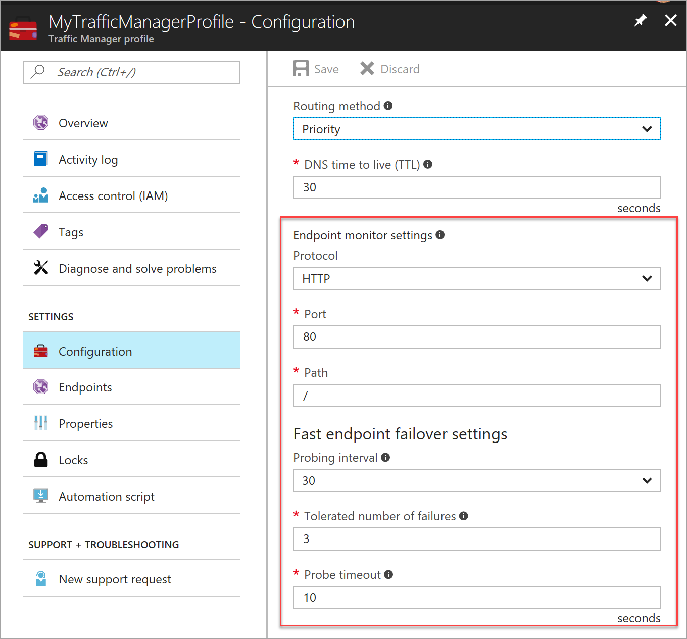
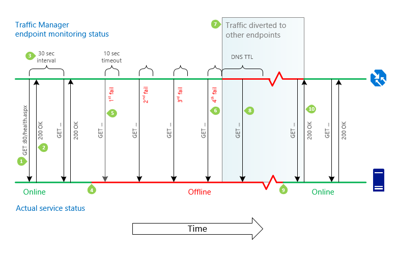

# Traffic Manager endpoint monitoring

Azure Traffic Manager includes built-in endpoint monitoring and automatic endpoint failover. This feature helps you deliver high-availability applications that are resilient to endpoint failure, including Azure region failures.

## Configure endpoint monitoring

To configure endpoint monitoring, you must specify the following settings on your Traffic Manager profile:

* **Protocol**. Choose HTTP, HTTPS, or TCP as the protocol that Traffic Manager uses when probing your endpoint to check its health. HTTPS monitoring does not verify whether your SSL certificate is valid--it only checks that the certificate is present.
* **Port**. Choose the port used for the request.
* **Path**. This configuration setting is valid only for the HTTP and HTTPS protocols, for which specifying the path setting is required. Providing this setting for the TCP monitoring protocol results in an error. For  HTTP and HTTPS protocol, give the relative path and the name of the webpage or the file that the monitoring accesses. A forward slash (/) is a valid entry for the relative path. This value implies that the file is in the root directory (default).
* **Custom header settings** This configuration setting helps you add specific HTTP headers to the health checks that Traffic Manager sends to endpoints under a profile. The custom headers can be specified at a profile level to be applicable for all endpoints in that profile and / or at an endpoint level applicable only to that endpoint. You can use custom headers for having health checks to endpoints in a multi-tenant environment be routed correctly to their destination by specifying a host header. You can also use this setting by adding unique headers that can be used to identify Traffic Manager originated HTTP(S) requests and processes them differently.
* **Expected status code ranges** This setting allows you to specify multiple success code ranges in the format 200-299, 301-301. If these status codes are received as response from an endpoint when a health check is initiated, Traffic Manager marks those endpoints as healthy. You can specify a maximum of 8 status code ranges. This setting is applicable only to HTTP and HTTPS protocol and to all endpoints. This setting is at the Traffic Manager profile level and by default the value 200 is defined as the success status code.
* **Probing interval**. This value specifies how often an endpoint is checked for its health from a Traffic Manager probing agent. You can specify two values here: 30 seconds (normal probing) and 10 seconds (fast probing). If no values are provided, the profile sets to a default value of 30 seconds. Visit the [Traffic Manager Pricing](https://azure.microsoft.com/pricing/details/traffic-manager) page to learn more about fast probing pricing.
* **Tolerated number of failures**. This value specifies how many failures a Traffic Manager probing agent tolerates before marking that endpoint as unhealthy. Its value can range between 0 and 9. A value of 0 means a single monitoring failure can cause that endpoint to be marked as unhealthy. If no value is specified, it uses the default value of 3.
* **Probe timeout**. This property specifies the amount of time the Traffic Manager probing agent should wait before considering that check a failure when a health check probe is sent to the endpoint. If the Probing Interval is set to 30 seconds, then you can set the Timeout value between 5 and 10 seconds. If no value is specified, it uses a default value of 10 seconds. If the Probing Interval is set to 10 seconds, then you can set the Timeout value between 5 and 9 seconds. If no Timeout value is specified, it uses a default value of 9 seconds.

    

    **Figure:  Traffic Manager endpoint monitoring**

## How endpoint monitoring works

If the monitoring protocol is set as HTTP or HTTPS, the Traffic Manager probing agent makes a GET request to the endpoint using the protocol, port, and relative path given. If it gets back a 200-OK response, or any of the responses configured in the **Expected status code *ranges**, then that endpoint is considered healthy. If the response is a different value, or, if no response is received within the timeout period specified, then the Traffic Manager probing agent re-attempts according to the Tolerated Number of Failures setting (no re-attempts are done if this setting is 0). If the number of consecutive failures is higher than the Tolerated Number of Failures setting, then that endpoint is marked as unhealthy. 

If the monitoring protocol is TCP, the Traffic Manager probing agent initiates a TCP connection request using the port specified. If the endpoint responds to the request with a response to establish the connection, that health check is marked as a success and the Traffic Manager probing agent resets the TCP connection. If the response is a different value, or if no response is received within the timeout period specified, the Traffic Manager probing agent re-attempts according to the Tolerated Number of Failures setting (no re-attempts are made if this setting is 0). If the number of consecutive failures is higher than the Tolerated Number of Failures setting, then that endpoint is marked unhealthy.

In all cases, Traffic Manager probes from multiple locations and the consecutive failure determination happens within each region. This also means that endpoints are receiving health probes from Traffic Manager with a higher frequency than the setting used for Probing Interval.

>[!NOTE]
>For HTTP or HTTPS monitoring protocol, a common practice on the endpoint side is to implement a custom page within your application - for example, /health.aspx. Using this path for monitoring, you can perform application-specific checks, such as checking performance counters or verifying database availability. Based on these custom checks, the page returns an appropriate HTTP status code.

All endpoints in a Traffic Manager profile share monitoring settings. If you need to use different monitoring settings for different endpoints, you can create [nested Traffic Manager profiles](traffic-manager-nested-profiles.md#example-5-per-endpoint-monitoring-settings).

## Endpoint and profile status

You can enable and disable Traffic Manager profiles and endpoints. However, a change in endpoint status also might occur as a result of Traffic Manager automated settings and processes.

### Endpoint status

You can enable or disable a specific endpoint. The underlying service, which might still be healthy, is unaffected. Changing the endpoint status controls the availability of the endpoint in the Traffic Manager profile. When an endpoint status is disabled, Traffic Manager does not check its health and the endpoint is not included in a DNS response.

### Profile status

Using the profile status setting, you can enable or disable a specific profile. While endpoint status affects a single endpoint, profile status affects the entire profile, including all endpoints. When you disable a profile, the endpoints are not checked for health and no endpoints are included in a DNS response. An [NXDOMAIN](https://tools.ietf.org/html/rfc2308) response code is returned for the DNS query.

### Endpoint monitor status

Endpoint monitor status is a Traffic Manager-generated value that shows the status of the endpoint. You cannot change this setting manually. The endpoint monitor status is a combination of the results of endpoint monitoring and the configured endpoint status. The possible values of endpoint monitor status are shown in the following table:

| Profile status | Endpoint status | Endpoint monitor status | Notes |
| --- | --- | --- | --- |
| Disabled |Enabled |Inactive |The profile has been disabled. Although the endpoint status is Enabled, the profile status (Disabled) takes precedence. Endpoints in disabled profiles are not monitored. An NXDOMAIN response code is returned for the DNS query. |
| &lt;any&gt; |Disabled |Disabled |The endpoint has been disabled. Disabled endpoints are not monitored. The endpoint is not included in DNS responses, therefore, it does not receive traffic. |
| Enabled |Enabled |Online |The endpoint is monitored and is healthy. It is included in DNS responses and can receive traffic. |
| Enabled |Enabled |Degraded |Endpoint monitoring health checks are failing. The endpoint is not included in DNS responses and does not receive traffic.  An exception to this is if all endpoints are degraded, in which case all of them are considered to be returned in the query response). |
| Enabled |Enabled |CheckingEndpoint |The endpoint is monitored, but the results of the first probe have not been received yet. CheckingEndpoint is a temporary state that usually occurs immediately after adding or enabling an endpoint in the profile. An endpoint in this state is included in DNS responses and can receive traffic. |
| Enabled |Enabled |Stopped |The cloud service or web app that the endpoint points to is not running. Check the cloud service or web app settings. This can also happen if the endpoint is of type nested endpoint and the child profile is disabled or is inactive.  An endpoint with a Stopped status is not monitored. It is not included in DNS responses and does not receive traffic. An exception to this is if all endpoints are degraded, in which case all of them will be considered to be returned in the query response. |

For details about how endpoint monitor status is calculated for nested endpoints, see [nested Traffic Manager profiles](traffic-manager-nested-profiles.md).

>[!NOTE]
> A Stopped Endpoint monitor status can happen on App Service if your web application is not running in the Standard tier or above. For more information, see [Traffic Manager integration with App Service](/azure/app-service/web-sites-traffic-manager).

### Profile monitor status

The profile monitor status is a combination of the configured profile status and the endpoint monitor status values for all endpoints. The possible values are described in the following table:

| Profile status (as configured) | Endpoint monitor status | Profile monitor status | Notes |
| --- | --- | --- | --- |
| Disabled |&lt;any&gt; or a profile with no defined endpoints. |Disabled |The profile has been disabled. |
| Enabled |The status of at least one endpoint is Degraded. |Degraded |Review the individual endpoint status values to determine which endpoints require further attention. |
| Enabled |The status of at least one endpoint is Online. No endpoints have a Degraded status. |Online |The service is accepting traffic. No further action is required. |
| Enabled |The status of at least one endpoint is CheckingEndpoint. No endpoints are in Online or Degraded status. |CheckingEndpoints |This transition state occurs when a profile if created or enabled. The endpoint health is being checked for the first time. |
| Enabled |The statuses of all endpoints in the profile are either Disabled or Stopped, or the profile has no defined endpoints. |Inactive |No endpoints are active, but the profile is still Enabled. |

## Endpoint failover and recovery

Traffic Manager periodically checks the health of every endpoint, including unhealthy endpoints. Traffic Manager detects when an endpoint becomes healthy and brings it back into rotation.

An endpoint is unhealthy when any of the following events occur:
- If the monitoring protocol is HTTP or HTTPS:
    - A non-200 response, or a response that does not include the status range specified in the **Expected status code ranges** setting, is received (including a different 2xx code, or a 301/302 redirect).
- If the monitoring protocol is TCP: 
    - A response other than ACK or SYN-ACK is received in response to the SYNC request sent by Traffic Manager to attempt a connection establishment.
- Timeout. 
- Any other connection issue resulting in the endpoint being not reachable.

For more information about troubleshooting failed checks, see [Troubleshooting Degraded status on Azure Traffic Manager](traffic-manager-troubleshooting-degraded.md). 

The timeline in the following figure is a detailed description of the monitoring process of Traffic Manager endpoint that has the following settings: monitoring protocol is HTTP, probing interval is 30 seconds, number of tolerated failures is 3, timeout value is 10 seconds, and DNS TTL is 30 seconds.

**Figure:  Traffic manager endpoint failover and recovery sequence**

1. **GET**. For each endpoint, the Traffic Manager monitoring system performs a GET request on the path specified in the monitoring settings.
2. **200 OK or custom code range specified Traffic Manager profile monitoring settings** . The monitoring system expects an HTTP 200 OK or the or custom code range specified Traffic Manager profile monitoring settings message to be returned within 10 seconds. When it receives this response, it recognizes that the service is available.
3. **30 seconds between checks**. The endpoint health check is repeated every 30 seconds.
4. **Service unavailable**. The service becomes unavailable. Traffic Manager will not know until the next health check.
5. **Attempts to access the monitoring path**. The monitoring system performs a GET request, but does not receive a response within the timeout period of 10 seconds (alternatively, a non-200 response may be received). It then tries three more times, at 30-second intervals. If one of the tries is successful, then the number of tries is reset.
6. **Status set to Degraded**. After a fourth consecutive failure, the monitoring system marks the unavailable endpoint status as Degraded.
7. **Traffic is diverted to other endpoints**. The Traffic Manager DNS name servers are updated and Traffic Manager no longer returns the endpoint in response to DNS queries. New connections are directed to other, available endpoints. However, previous DNS responses that include this endpoint may still be cached by recursive DNS servers and DNS clients. Clients continue to use the endpoint until the DNS cache expires. As the DNS cache expires, clients make new DNS queries and are directed to different endpoints. The cache duration is controlled by the TTL setting in the Traffic Manager profile, for example, 30 seconds.
8. **Health checks continue**. Traffic Manager continues to check the health of the endpoint while it has a Degraded status. Traffic Manager detects when the endpoint returns to health.
9. **Service comes back online**. The service becomes available. The endpoint retains its Degraded status in Traffic Manager until the monitoring system performs its next health check.
10. **Traffic to service resumes**. Traffic Manager sends a GET request and receives a 200 OK status response. The service has returned to a healthy state. The Traffic Manager name servers are updated, and they begin to hand out the service's DNS name in DNS responses. Traffic returns to the endpoint as cached DNS responses that return other endpoints expire, and as existing connections to other endpoints are terminated.

    > [!NOTE]
    > Because Traffic Manager works at the DNS level, it cannot influence existing connections to any endpoint. When it directs traffic between endpoints (either by changed profile settings, or during failover or failback), Traffic Manager directs new connections to available endpoints. However, other endpoints might continue to receive traffic via existing connections until those sessions are terminated. To enable traffic to drain from existing connections, applications should limit the session duration used with each endpoint.

## Traffic-routing methods

When an endpoint has a Degraded status, it is no longer returned in response to DNS queries. Instead, an alternative endpoint is chosen and returned. The traffic-routing method configured in the profile determines how the alternative endpoint is chosen.

* **Priority**. Endpoints form a prioritized list. The first available endpoint on the list is always returned. If an endpoint status is Degraded, then the next available endpoint is returned.
* **Weighted**. Any available endpoint is chosen at random based on their assigned weights and the weights of the other available endpoints.
* **Performance**. The endpoint closest to the end user is returned. If that endpoint is unavailable, Traffic Manager moves traffic to the endpoints in the next closest Azure region. You can configure alternative failover plans for performance traffic-routing by using [nested Traffic Manager profiles](traffic-manager-nested-profiles.md#example-4-controlling-performance-traffic-routing-between-multiple-endpoints-in-the-same-region).
* **Geographic**. The endpoint mapped to serve the geographic location based on the query request IP’s is returned. If that endpoint is unavailable, another endpoint will not be selected to failover to, since a geographic location can be mapped only to one endpoint in a profile (more details are in the [FAQ](traffic-manager-FAQs.md#traffic-manager-geographic-traffic-routing-method)). As a best practice, when using geographic routing, we recommend customers to use nested Traffic Manager profiles with more than one endpoint as the endpoints of the profile.
* **MultiValue** Mutliple endpoints mapped to IPv4/IPv6 addresses are returned. When a query is received for this profile, healthy endpoints are returned based on the **Maximum record count in response** value that you have specified. The default number of responses is two endpoints.
* **Subnet** The endpoint mapped to a set of IP address ranges is returned. When a request is received from that IP address, the endpoint returned is the one mapped for that IP address. 

For more information, see [Traffic Manager traffic-routing methods](traffic-manager-routing-methods.md).

> [!NOTE]
> One exception to normal traffic-routing behavior occurs when all eligible endpoints have a degraded status. Traffic Manager makes a "best effort" attempt and *responds as if all the Degraded status endpoints actually are in an online state*. This behavior is preferable to the alternative, which would be to not return any endpoint in the DNS response. Disabled or Stopped endpoints are not monitored, therefore, they are not considered eligible for traffic.
>
> This condition is commonly caused by improper configuration of the service, such as:
>
> * An access control list [ACL] blocking the Traffic Manager health checks.
> * An improper configuration of the monitoring port or protocol in the Traffic manager profile.
>
> The consequence of this behavior is that if Traffic Manager health checks are not configured correctly, it might appear from the traffic routing as though Traffic Manager *is* working properly. However, in this case, endpoint failover cannot happen which affects overall application availability. It is important to check that the profile shows an Online status, not a Degraded status. An Online status indicates that the Traffic Manager health checks are working as expected.

For more information about troubleshooting failed health checks, see [Troubleshooting Degraded status on Azure Traffic Manager](traffic-manager-troubleshooting-degraded.md).

## Next steps

Learn [how Traffic Manager works](traffic-manager-how-it-works.md)

Learn more about the [traffic-routing methods](traffic-manager-routing-methods.md) supported by Traffic Manager

Learn how to [create a Traffic Manager profile](traffic-manager-manage-profiles.md)

[Troubleshoot Degraded status](traffic-manager-troubleshooting-degraded.md) on a Traffic Manager endpoint
