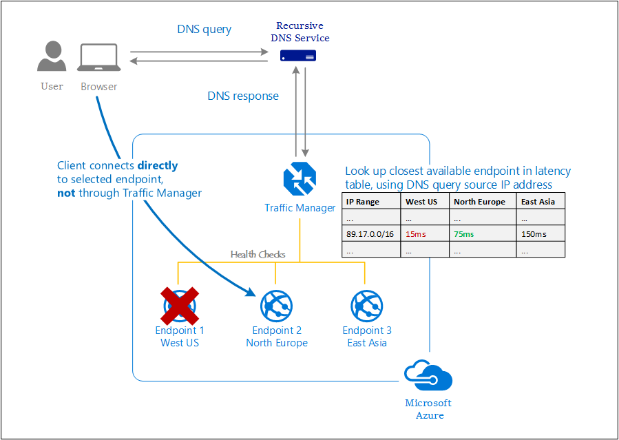

# What is Traffic Manager?
Azure Traffic Manager is a dns-based traffic load balancer that enables you to route incoming traffic for high performance and availability of your web applications. Traffic Manager helps control the distribution of user traffic for service endpoints in different datacenters across Azure regions. Service endpoints supported by Traffic Manager include Azure VMs, Web Apps, and Cloud Service. You can also use Traffic Manager to distribute traffic to external non-Azure endpoints.

Traffic Manager uses the Domain Name System (DNS) to direct client requests to the most appropriate endpoint based on a traffic-routing method and the health of the endpoints. Traffic Manager provides a range of [traffic-routing methods](traffic-manager-routing-methods.md) and [endpoint monitoring options](traffic-manager-monitoring.md) to suit different application needs and automatic failover models. Traffic Manager is resilient to failure, including the failure of an entire Azure region.

>[!NOTE]
> Azure provides a suite of fully managed load-balancing solutions for your scenarios. If you are looking for Transport Layer Security (TLS) protocol termination ("SSL offload") or per-HTTP/HTTPS request, application-layer processing, review [Application Gateway](../application-gateway/application-gateway-introduction.md). If you are looking for regional balancing, review [Load Balancer](../load-balancer/load-balancer-overview.md). Your end-to-end scenarios might benefit from combining these solutions as needed.

## Traffic Manager benefits

Traffic Manager can help you:

* **Improve availability of critical applications**

    Traffic Manager delivers high availability for your applications by monitoring your endpoints and providing automatic failover when an endpoint goes down.

    
* **Improve responsiveness for high-performance applications**

    Azure allows you to run cloud services or websites in datacenters located around the world. Traffic Manager improves application responsiveness by directing traffic to the endpoint with the lowest network latency for the client.

* **Perform service maintenance without downtime**

    You can perform planned maintenance operations on your applications without downtime. Traffic Manager directs traffic to alternative endpoints while the maintenance is in progress.

* **Combine on-premises and cloud-based applications**

    Traffic Manager supports external, non-Azure endpoints enabling it to be used with hybrid cloud and on-premises deployments, including the "[burst-to-cloud](https://azure.microsoft.com/overview/what-is-cloud-bursting/)," "migrate-to-cloud," and "failover-to-cloud" scenarios.

* **Distribute traffic for large, complex deployments**

    Using [nested Traffic Manager profiles](traffic-manager-nested-profiles.md), traffic-routing methods can be combined to create sophisticated and flexible rules to scale to the needs of larger, more complex deployments.

## Pricing

For pricing information, see [Traffic Manager Pricing](https://azure.microsoft.com/pricing/details/traffic-manager/).

## Next steps

- Learn how to create a [Traffic Manager profile](traffic-manager-create-profile.md).
- Learn how [How Traffic Manager Works](traffic-manager-how-it-works.md).
- Learn more about Traffic Manager [traffic routing methods](traffic-manager-routing-methods.md).
- For frequently asked questions about Traffic Manager, see the [Traffic Manager FAQ](traffic-manager-FAQs.md).
- Learn more about Traffic Manager [endpoint monitoring and automatic failover](traffic-manager-monitoring.md).

