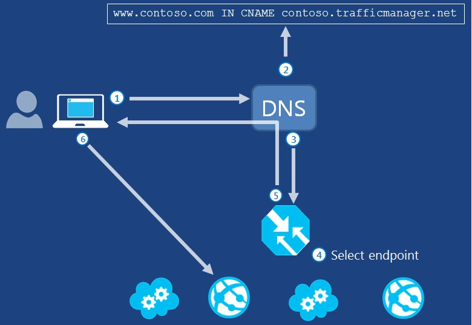
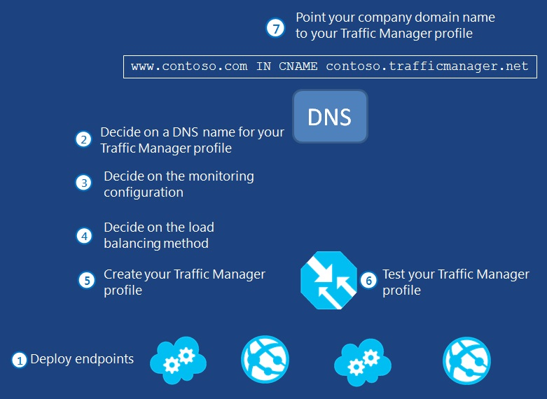
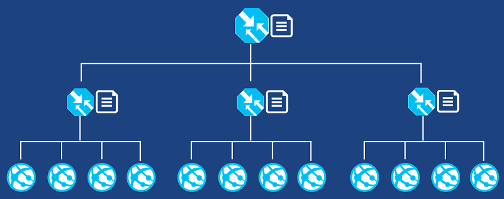

<properties 
   pageTitle="What is Traffic Manager | Microsoft Azure"
   description="This article will help you understand what Traffic Manager is, and how it works"
   services="traffic-manager"
   documentationCenter=""
   authors="joaoma"
   manager="adinah"
   editor="tysonn" />
<tags 
   ms.service="traffic-manager"
   ms.devlang="na"
   ms.topic="article"
   ms.tgt_pltfrm="na"
   ms.workload="infrastructure-services"
   ms.date="08/19/2015"
   ms.author="joaoma" />

# What is Traffic Manager?

Microsoft Azure Traffic Manager allows you to control the distribution of user traffic to your specified endpoints, which can include Azure cloud services, websites, and other endpoints. Traffic Manager works by applying an intelligent policy engine to Domain Name System (DNS) queries for the domain names of your Internet resources. Your Azure cloud services or websites can be running in different datacenters across the world.

Traffic Manager can help you:

- **Improve availability of critical applications** – Traffic Manager allows you to improve the availability of your critical applications by monitoring your endpoints in Azure and providing automatic failover capabilities when an Azure cloud service, Azure website, or other location goes down.
- **Improve responsiveness for high performing applications** – Azure allows you to run cloud services or websites in datacenters located around the world. Traffic Manager can improve the responsiveness of your applications and content delivery times by directing end-users to the endpoint with the lowest network latency from the client.
- **Upgrade and perform service maintenance without downtime** – Traffic Manager supports extended scenarios for hybrid cloud and on-premises deployments including the “burst-to-cloud,” “migrate-to-cloud,” and “failover-to-cloud” scenarios. For planned maintenance, you disable the endpoint in Traffic Manager and then wait for the endpoint to complete the servicing of existing connections. When there is no more traffic to the endpoint, you update the service on that endpoint and test it, then re-enable it in Traffic Manager. This helps you to maintain and upgrade your services without downtime for clients.
- **Traffic distribution for large, complex deployments** – With nested Traffic Manager profiles, in which a Traffic Manager profile can have another Traffic Manager profile as an endpoint, you can create configurations to optimize performance and distribution for larger, more complex deployments. For more information, see [Nested profiles](#nested-profiles).

## How Traffic Manager works

When you configure a Traffic Manager profile, the settings that you specify provide Traffic Manager with the information needed to determine which endpoint should service the request based on a DNS query. No actual endpoint traffic routes through Traffic Manager.

*Figure 1* shows how Traffic Manager directs users to one of a set of endpoints. The numbers in Figure 1 correspond to the numbered descriptions below:

**Figure 1**

1. **User traffic to company domain name**: The client requests information using the company domain name. The goal is to resolve a DNS name to an IP address. Company domains must be reserved through normal Internet domain name registrations that are maintained outside of Traffic Manager. In Figure 1, the example company domain is *www.contoso.com*.
2. **Company domain name to Traffic Manager domain name**: The DNS resource record for the company domain points to a Traffic Manager domain name maintained in Azure Traffic Manager. This is achieved by using a CNAME resource record that maps the company domain name to the Traffic Manager domain name. In the example, the Traffic Manager domain name is *contoso.trafficmanager.net*.
3. **Traffic Manager domain name and profile**: The Traffic Manager domain name is part of the Traffic Manager profile. The user's DNS server sends a new DNS query for the Traffic Manager domain name (in our example, *contoso.trafficmanager.net*), which is received by the Traffic Manager DNS name servers.
4. **Traffic Manager profile rules processed**: Traffic Manager uses the specified traffic routing method and monitoring status to determine which Azure or other endpoint should service the request.
5. **Endpoint domain name sent to user**: Traffic Manager returns a CNAME record that maps the Traffic Manager domain name to the domain name of the endpoint. The user's DNS server resolves the endpoint domain name to its IP address and sends it to the user.
6. **User calls the endpoint**: The user calls the returned endpoint directly using its IP address.

Since the company domain and resolved IP address are cached on the client machine, the user continues to interact with the chosen endpoint until its local DNS cache entry expires. It is important to note that the DNS client caches DNS host entries for the duration of their Time-to-Live (TTL). Retrieving host entries from the DNS client cache bypasses the Traffic Manager profile and you could experience connection delays if the endpoint becomes unavailable before the TTL expires. If the TTL of a DNS host entry in the cache expires and the client computer needs to resolve the company domain name again, it sends a new DNS query. The client computer may receive the IP address of a different endpoint depending on the traffic routing method applied and the health of the endpoints at the time of the request.

## How to implement Traffic Manager

*Figure 2* shows the steps, in order, that are necessary to implement Traffic Manager. These steps can be performed in a slightly different order once you have a firm understanding of Traffic Manager configuration and best practices. The numbers in Figure 2 correspond to the numbered descriptions below:

**Figure 2**

1. **Deploy your Azure cloud services, Azure websites, or other endpoints to your production environment**. When you create a Traffic Manager profile, it must be associated with a subscription. You then add endpoints for cloud services and Standard tier websites in production that are part of the same subscription. If an endpoint is in staging and is not in an Azure production environment or is not in the same subscription, it can be added as an external endpoint. For more information about cloud services, see [Cloud Services](http://go.microsoft.com/fwlink/p/?LinkId=314074). For more information about websites, see [Websites](http://go.microsoft.com/fwlink/p/?LinkId=393327).
2. **Decide a name for your Traffic Manager domain**. Consider a name for your domain with a unique prefix. The latter part of the domain, trafficmanager.net, is fixed. For more information, see [Best practices](#best-practices).
3. **Decide the monitoring configuration that you want to use**. Traffic Manager monitors endpoints to ensure that they are online, regardless of the traffic routing method. After you configure monitoring settings, Traffic Manager will not direct traffic to endpoints that are offline according to the monitoring system unless it detects that all endpoints are offline or it cannot detect the status of any of the endpoints contained in the profile. For more information about monitoring, see [Traffic Manager Monitoring](traffic-manager-monitoring.md).
4. **Decide the traffic routing method that you want to use**. Three different traffic routing methods are available. Take time to understand which method best fits your requirements. If you need to change the method later, you can do so at any time. Also note that each method requires slightly different configuration steps. For information about traffic routing methods, see [About Traffic Manager traffic routing methods](traffic-manager-load-balancing-methods.md).
5. **Create your profile and configure settings**. You can use REST APIs, Windows PowerShell, or the Management Portal to create your Traffic Manager profile and configure settings. For more information, see [How to configure Traffic Manager settings](#how-to-configure-traffic-manager-settings). The following steps assume you will use **Quick Create** in the Management Portal. 
   - **Create your Traffic Manager profile** - To create a profile by using Quick Create in the Management Portal, see [Manage Traffic Manager Profiles](traffic-manager-manage-profiles.md).
   - **Configure traffic routing method settings** – While in Quick Create, you must select the traffic routing method for your profile. This setting can be changed at any time after completing the Quick Create steps. For configuration steps, see the topic that corresponds to your traffic routing method: [Configure Performance traffic routing method](traffic-manager-configure-performance-load-balancing.md), [Configure Failover traffic routing method](traffic-manager-configure-failover-load-balancing.md), [Configure Round Robin traffic routing method](traffic-manager-configure-round-robin-load-balancing.md).
   
   >[AZURE.NOTE] The Round Robin method of traffic routing method now supports weighted distribution of network traffic. However, at this time you must use either REST APIs or Windows PowerShell to configure the weight. For more information and an example configuration, see [Azure Traffic Manager External Endpoints and Weighted Round Robin via PowerShell](http://azure.microsoft.com/blog/2014/06/26/azure-traffic-manager-external-endpoints-and-weighted-round-robin-via-powershell/) in the Azure blog.

   - **Configure endpoints** – Endpoints are not configured during Quick Create. After creating your profile and specifying your traffic routing method, you must then let Traffic Manager know the endpoints. For steps to configure endpoints, see [Manage Endpoints in Traffic Manager](traffic-manager-endpoints.md)

   - **Configure monitoring settings** – Monitoring settings are not configured during Quick Create. After creating your profile and specifying your traffic routing method, you must then let Traffic Manager know what to monitor. For steps to configure monitoring, see [Traffic Manager Monitoring](traffic-manager-monitoring.md).
6. **Test your Traffic Manager profile**. Test that your profile and domain are working as expected. For information about how to do this, see [Testing Traffic Manager Settings](traffic-manager-testing-settings.md).
7. **Point your company domain name’s DNS resource record to the profile to make it live**. For more information, see [Point a Company Internet Domain to a Traffic Manager Domain](traffic-manager-point-internet-domain.md).

Using the example in Figure 1, you would change the DNS resource record on your servers for the following to point the company domain name to the Traffic Manager domain name:
    www.contoso.com IN CNAME contoso.trafficmanager.net

## How to configure Traffic Manager settings

You can configure Traffic Manager settings using the Management Portal, with REST APIs, and with Windows PowerShell cmdlets.

Although each REST API element is not visible in the Management Portal, many settings are available using either method. For more information about the use of REST APIs, see [Operations on Traffic Manager (REST API Reference)](http://go.microsoft.com/fwlink/p/?LinkId=313584).

For more information about Windows PowerShell cmdlets for Traffic Manager, see [Azure Traffic Manager Cmdlets](http://go.microsoft.com/fwlink/p/?LinkId=400769).

>[AZURE.NOTE] There is currently no support for configuring external endpoints (type = ‘Any’), weights for the Round Robin traffic routing method, and nested profiles with the Management Portal. You must use either REST (see [Create Definition](http://go.microsoft.com/fwlink/p/?LinkId=400772)) or Windows PowerShell (see [Add-AzureTrafficManagerEndpoint](https://msdn.microsoft.com/library/azure/dn690257.aspx)).

### Configuring settings in the Management Portal

In the Management Portal, you can create your Traffic Manager profile by using Quick Create. Quick Create allows you to create a basic profile. After creating your profile, you can then configure additional settings or edit the settings that you previously configured. For more information about creating your Traffic Manager profile by using Quick Create, see [Manage Traffic Manager Profiles](traffic-manager-manage-profiles.md).

You can configure the following settings in the Management Portal:

- **DNS prefix** – A unique prefix that you create. Profiles are displayed in the Management portal by prefix.
- **DNS TTL** – The DNS Time-to-Live (TTL) value controls how often the client’s local caching name server will query the Azure Traffic Manager DNS system for updated DNS entries.
- **Subscription** – Select the subscription that your profile will correspond to. Note that this option only appears if you have multiple subscriptions.
- **traffic routing method** – The way you want Traffic Manager to handle traffic routing.
- **Failover order** – When using the failover traffic routing method, the order of endpoints.
- **Monitoring** – Monitoring settings contain the protocol (HTTP or HTTPS), port, and relative path and file name.

### Configuring settings by using REST APIs

You can create and configure your Traffic Manager profile by using REST APIs. For more information, see [Operations on Traffic Manager (REST API Reference)](http://go.microsoft.com/fwlink/?LinkId=313584).

- **Profile** – A profile contains a domain name prefix that you create. Each profile corresponds to your subscription. You can create multiple profiles per subscription. The profile name is visible in the Management Portal. The name that you create, which is contained in the profile, is referred to as your Traffic Manager Domain.
- **Definition** – A definition contains policy settings and monitor settings. A definition corresponds to a profile. You can have only one definition per profile. The definition itself is not visible in the Management Portal, although many of the settings contained within the definition are visible and can be configured in the Management Portal.
- **DNS Options** – Within each definition are DNS options. This is where the DNS TTL is configured.
- **Monitors** – Within each definition are monitor settings. This is where the protocol, port, and relative path and file name are configured. Monitor settings are visible and can be configured in the Management Portal. For more information, see [Traffic Manager Monitoring](traffic-manager-monitoring.md).
- **Policy** – Within each definition are policy settings. The policy is where traffic routing methods and endpoints are specified. The policy itself is not visible in the Management Portal, although some of the settings for the policy are visible and can be configured in the Management Portal. For more information, see [About Traffic Manager traffic routing methods](traffic-manager-load-balancing-methods.md).

## Configuring settings by using Windows PowerShell

You can create and configure your Traffic Manager profile by using Windows PowerShell. For more information, see [Azure Traffic Manager Cmdlets](http://go.microsoft.com/fwlink/p/?LinkId=400769).

## Best practices

- **Make your prefixes unique and easy to understand** – The DNS name of your Traffic Manager profile must be unique. You can control the first part of the DNS name only. The Traffic Manager domain name is used for identification and client request directing purposes only. Client computers will never display these names to the end user. However, profiles are identified by this domain name so it is important that you be able to quickly identify it from other domain names listed in the Management Portal.
- **Use dots to add uniqueness or make domain names readable** – You can use periods to separate parts of your domain name prefix as well.  If you are planning to create multiple policies in Traffic Manager, use a consistent hierarchy to differentiate one service from the other. For example, Contoso has global services for web, billing, and utility management. The three policies would be *web.contoso.trafficmanager.net*, *bill.contoso.trafficmanager.net*, and *util.contoso.trafficmanager.net*. When setting up cloud services or websites, use names that include location. For example, *web-us-contoso.cloudapp.net* and *web-asia-contoso.cloudapp.net*. Your limitations are those imposed by DNS. Assume a domain name is a sequence of labels separated by dots (label.label.label.label.etc.). At the time of this documentation, the limits for domain names in Traffic Manager are as follows:
   - Each label can be a maximum of 63 characters.
   - You cannot have more than 40 labels total. Since two labels are taken up by trafficmanager.net, that leaves 38 for your prefix.
   - The entire domain name can be a maximum of 253 characters. Keep in mind that trafficmanager.net takes up 19 of those characters.
- **DNS TTL** – The DNS TTL value controls how often the client’s local caching name server will query the Azure Traffic Manager DNS system for updated DNS entries. Any change that occurs within Traffic Manager, such as profile changes or changes in endpoint availability, will take this period of time to be refreshed throughout the global system of DNS servers. We recommend you leave the setting at the default value of 300 seconds (5 minutes). A higher number increases how long Traffic Manager DNS responses are cached by DNS resolvers and clients, which reduces overall DNS query latency. However, if a very quick failover is required, you may prefer to configure a lower value.
- **Endpoints should be in a single subscription** – All endpoints should be in the same subscription where you are creating the profile. You can add endpoints from different subscriptions to a profile as external endpoints, but Azure will not automatically remove them if you disable or delete the associated service. As a result, external endpoints remain in the Traffic Manager profile, and you will continue to be billed for them unless you manually remove them.
- **Production services only** – Only endpoints in a production environment are available. You cannot direct to endpoints running in a staging environment. Note that if you perform a virtual IP (VIP) address swap while a profile is directing traffic, the traffic will use the endpoint just swapped into the production environment.
- **Name your endpoints so they can be easily identified** – Consider the DNS prefix that you want to use. The DNS name is used because it is guaranteed to be unique in a subscription, while the name of the cloud service or website may not be. In order to avoid confusion, give a cloud service or website a name and DNS prefix that are the same or similar. If you have over 20 cloud services and websites, bad naming can make finding the correct endpoint difficult. Additionally, badly named endpoints will make profiles difficult to maintain.
- **All endpoints in a profile should service the same operations and ports** – If you mix your endpoints, it becomes more likely that a client will call an endpoint that cannot service its request.
- **All cloud services in a profile must use the same monitoring settings** – You can only chose a single path and file to monitor all endpoints in a given definition. You can enter "/" in the **Relative path and file name** text box so that monitoring will try to access the default path and filename.
- **Disable endpoints for temporary changes, rather than changing your configuration** – In many cases, you may wish to take an endpoint offline. Rather than removing the endpoint from your profile, simply disable the individual endpoint in your profile instead. This leaves the endpoint as part of the profile, but the profile acts as if the endpoint is not included in it. This is very useful for temporarily removing an endpoint that is in maintenance mode or being redeployed. Once the endpoint is up and running again, you can enable it. For more information, see [Manage Endpoints in Traffic Manager](traffic-manager-endpoints.md).
- **Disable a profile for temporary changes, instead of deleting it** – You may want to take an entire profile offline, not just individual endpoints specified within it. To do that, disable the profile. When you disable a profile, all of the settings remain available for you to edit in the management portal and you can then bring the profile back online quickly and easily when you want to use it again. For more information, see [Manage Endpoints in Traffic Manager](traffic-manager-endpoints.md).
- **Storage** – How you design the location and distribution of your storage is an important consideration when using Traffic Manager. Think of the end-to-end transaction and how your data will flow when you design and deploy your applications for Traffic Manager.
- **SQL Azure** – Similar to storage design, analyze your application state and data requirements when you extend your endpoints to multiple geographic regions.

## Nested profiles

You can specify the name of another Traffic Manager profile as an endpoint, a practice known as nested profiles. The Traffic Manager profile name is its DNS name, such as contoso-europe.trafficmanager.net.

This allows you to configure Traffic Manager so that incoming DNS name queries are analyzed in a set of tiers to ensure that the requesting client is directed to the correct set of endpoints. *Figure 3* shows an example.

**Figure 3**

You can nest up to 10 levels and each profile can be configured with a different traffic routing method.

For example, you could create a configuration for the following:

- At the top tier (the Traffic Manager profile that is mapped to your external DNS name), you could configure the profile with the performance traffic routing method.
- At the middle tier, a set of Traffic Manager profiles represent different datacenters and use the round-robin traffic routing method.
- At the bottom tier, a set of cloud service endpoints in each datacenter service the user's traffic requests.

The result is that users are directed to a regionally appropriate datacenter based on performance and to a cloud service within that datacenter based on equal or weighted load distribution. For example, weighting could be used to distribute a small percentage of traffic to a new or trial deployment for testing or customer feedback.

*Figure 4* shows the configuration.

**Figure 4**

In *Figure 4*, the Traffic Manager profile in the top-level tier is a parent profile and the Traffic Manager profiles in the middle tier are child profiles.

If Traffic Manager directs users to a child profile that has a small number of healthy endpoints, it is possible to overload those endpoints and cause performance issues. To prevent this situation, you can configure the parent Traffic Manager profile with a threshold of healthy endpoints that determines whether any of endpoints within the child profiles of that parent can receive traffic. For example, if you want to ensure that there are at least three healthy endpoints within the child profiles, you would set this threshold value to 3. In the example in Figure 4, you would configure the top-level tier Traffic Manager profile for this threshold.

To add a Traffic Manager profile as an endpoint and configure the minimum number of healthy endpoints, you must use either REST (see [Create Definition](http://go.microsoft.com/fwlink/p/?LinkId=400772)) or Windows PowerShell (see [Add-AzureTrafficManagerEndpoint](https://msdn.microsoft.com/library/azure/dn690257.aspx)). You cannot use the Management Portal.

## Traffic Manager figures

If you want the figures in this topic as PowerPoint sides for your own presentation on Traffic Manager or to modify for your own purposes, see [Traffic Manager figures in MSDN documentation](http://gallery.technet.microsoft.com/Traffic-Manager-figures-in-887e7c99).

## Next Steps

[Cloud Services](http://go.microsoft.com/fwlink/p/?LinkId=314074)

[Websites](http://go.microsoft.com/fwlink/p/?LinkId=393327)

[Operations on Traffic Manager (REST API Reference)](http://go.microsoft.com/fwlink/p/?LinkId=313584)

[Azure Traffic Manager Cmdlets](http://go.microsoft.com/fwlink/p/?LinkId=400769) 