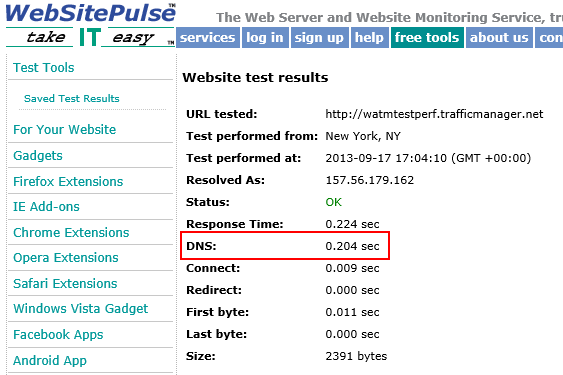
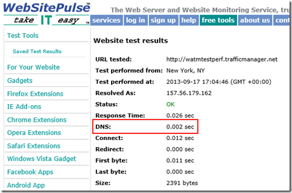

# Performance considerations for Traffic Manager

This page explains performance considerations using Traffic Manager. Consider the following scenario:

You have instances of your website in the WestUS and EastAsia regions. One of the instances is failing the health check for the traffic manager probe. Application traffic is directed to the healthy region. This failover is expected but performance can be a problem based on the latency of the traffic now traveling to a distant region.

## Performance considerations for Traffic Manager

The only performance impact that Traffic Manager can have on your website is the initial DNS lookup. A DNS request for the name of your Traffic Manager profile is handled by the Microsoft DNS root server that hosts the trafficmanager.net zone. Traffic Manager populates, and regularly updates, the Microsoft's DNS root servers based on the Traffic Manager policy and the probe results. So even during the initial DNS lookup, no DNS queries are sent to Traffic Manager.

Traffic Manager is made up of several components: DNS name servers, an API service, the storage layer, and an endpoint monitoring service. If a Traffic Manager service component fails, there is no effect on the DNS name associated with your Traffic Manager profile. The records in the Microsoft DNS servers remain unchanged. However, endpoint monitoring and DNS updating do not happen. Therefore, Traffic Manager is not able to update DNS to point to your failover site when your primary site goes down.

DNS name resolution is fast and results are cached. The speed of the initial DNS lookup depends on the DNS servers the client uses for name resolution. Typically, a client can complete a DNS lookup within ~50 ms. The results of the lookup are cached for the duration of the DNS Time-to-live (TTL). The default TTL for Traffic Manager is 300 seconds.

Traffic does NOT flow through Traffic Manager. Once the DNS lookup completes, the client has an IP address for an instance of your web site. The client connects directly to that address and does not pass through Traffic Manager. The Traffic Manager policy you choose has no influence on the DNS performance. However, a Performance routing-method can negatively impact the application experience. For example, if your policy redirects traffic from North America to an instance hosted in Asia, the network latency for those sessions may be a performance issue.

## Measuring Traffic Manager Performance

There are several websites you can use to understand the performance and behavior of a Traffic Manager profile. Many of these sites are free but may have limitations. Some sites offer enhanced monitoring and reporting for a fee.

The tools on these sites measure DNS latencies and display the resolved IP addresses for client locations around the world. Most of these tools do not cache the DNS results. Therefore, the tools show the full DNS lookup each time a test is run. When you test from your own client, you only experience the full DNS lookup performance once during the TTL duration.

## Sample tools to measure DNS performance

* [WebSitePulse](https://www.websitepulse.com/help/tools.php)

    One of the simplest tools is WebSitePulse. Enter the URL to see DNS resolution time, First Byte, Last Byte, and other performance statistics. You can choose from three different test locations. In this example, you see that the first execution shows that DNS lookup takes 0.204 sec.

    

    Because the results are cached, the second test for the same Traffic Manager endpoint the DNS lookup takes 0.002 sec.

    

* [Pingdom](https://tools.pingdom.com/)

    This tool provides performance statistics for each element of a web page. The Page Analysis tab shows the percentage of time spent on DNS lookup.

* [What's My DNS?](https://www.whatsmydns.net/)

    This site does a DNS lookup from 20 different locations and displays the results on a map.

* [Dig Web Interface](https://www.digwebinterface.com)

    This site shows more detailed DNS information including CNAMEs and A records. Make sure you check the 'Colorize output' and 'Stats' under options, and select 'All' under Nameservers.

## Next Steps

[About Traffic Manager traffic routing methods](traffic-manager-routing-methods.md)

[Test your Traffic Manager settings](traffic-manager-testing-settings.md)

[Operations on Traffic Manager (REST API Reference)](/previous-versions/azure/reference/hh758255(v=azure.100))

[Azure Traffic Manager Cmdlets](/powershell/module/az.trafficmanager)
