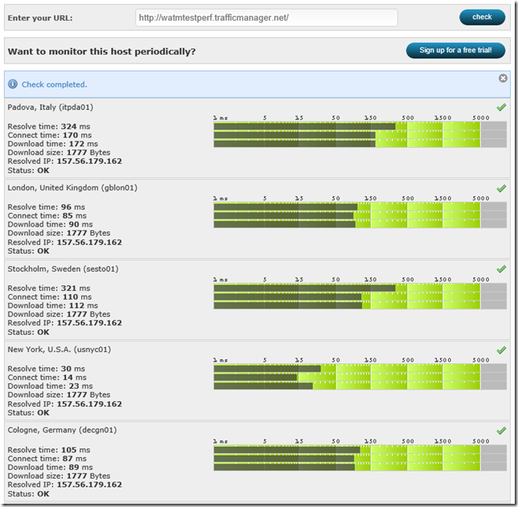

<properties
   pageTitle="Performance considerations for Azure Traffic Manager | Microsoft Azure"
   description="Understand performance on Traffic Manager and how to test performance of your website when using Traffic Manager"
   services="traffic-manager"
   documentationCenter=""
   authors="kwill-MSFT"
   manager="adinah"
   editor="joaoma" />

<tags 
   ms.service="traffic-manager"
   ms.devlang="na"
   ms.topic="article"
   ms.tgt_pltfrm="na"
   ms.workload="infrastructure-services"
   ms.date="08/19/2015"
   ms.author="joaoma" />

# Performance considerations for Traffic Manager

Common question regarding Azure Traffic Manager deals with potential performance problems that it might cause.  The questions are typically along the lines of “How much latency will Traffic Manager add to my website?”, “My monitoring site says that my website was slow for a couple hours yesterday – were there any Traffic Manager issues at that time?”, “Where are the Traffic Manager servers? I want to make sure they are in the same datacenter as my website so that performance isn’t impacted”.

This page will talk about the direct performance impact that Traffic Manager can cause to a website.  If you have a website in East US and one in Asia and your East US is failing the Traffic Manager probes, then all of your users will be directed to your Asia website and you will see performance impacts, but this performance impact has nothing to do with Traffic Manager itself.

  

## Important note about how Traffic Manager works

[Traffic Manager Overview](traffic-manager-overview.md) is an excellent resource to learn how Traffic Manager works, but there is a lot of information on that page and picking out the key information relating to performance can be difficult.  The important points to look at in the MSDN documentation is step #5 and #6 from Image 3, which I will explain in more detail here:

- Traffic Manager essentially only does one thing – DNS resolution.  This means that the only performance impact that Traffic Manager can have on your website is the initial DNS lookup.
- A point of clarification about the Traffic Manager DNS lookup.  Traffic Manager populates, and regularly updates, the normal Microsoft DNS root servers based on your policy and the probe results.  So even during the initial DNS lookup there is no involvement by Traffic Manager since the DNS request is handled by the normal Microsoft DNS root servers.  If Traffic Manager goes ‘down’ (ie. a failure in the VMs doing the policy probing and DNS updating) then there will be no impact to your Traffic Manager DNS name since the entries in the Microsoft DNS servers will still be preserved – the only impact will be that probing and updating based on policy will not happen (ie. if your primary site goes down, Traffic Manager will not be able to update DNS to point to your failover site).
- Traffic does NOT flow through Traffic Manager.  There are no Traffic Manager servers acting as a middle-man between your clients and your Azure hosted service.  Once the DNS lookup is finished then Traffic Manager is completely removed from the communication between client and server.
- DNS lookup is very fast, and is cached.  The initial DNS lookup will depend on the client and their configured DNS servers, by typically a client can do a DNS lookup in ~50 ms (see http://www.solvedns.com/dns-comparison/).  Once the first lookup is done the results will be cached for the DNS TTL, which for Traffic Manager is default of 300 seconds.
- The Traffic Manager policy you choose (performance, failover, round robin) has no influence on the DNS performance.  Your performance policy can negatively impact your user’s experience, for example if you send US users to a service hosed in Asia, but this performance issue is not caused by Traffic Manager.

  

## Testing Traffic Manager Performance

There are a few publicly available websites that you can use to determine your Traffic Manager performance and behavior.  These sites are useful to determine the DNS latency and which of your hosted services your users around the world are being directed to.  Keep in mind that most of these tools do not cache the DNS results so running the tests multiple times will show the full DNS lookup, whereas clients connecting to your Traffic Manager endpoint will only see the full DNS lookup performance impact once during the TTL duration.

## Sample tools to measure performance

One of the simplest tools is WebSitePulse.  Enter the URL and you will see statistics such as DNS resolution time, First Byte, Last Byte, and other performance statistics.  You can choose from three different locations to test your site from.  In this example you will see that the first execution shows that first DNS lookup time takes 0.204 sec.  The second time we run this test on the same Traffic Manager endpoint the DNS lookup time takes 0.002 sec since the results are already cached.

http://www.websitepulse.com/help/tools.php

DNS time when cached:

Another really useful tool to get DNS resolution time from multiple geographic regions simultaneously is Watchmouse’s Check Website tool.  Enter the URL and you will see DNS resolution time, connection time, and speed from several geo locations.  This is also handy to test the Traffic Manager Performance policy to see which hosted service your different users around the world are being sent to.

http://www.watchmouse.com/en/checkit.php

http://tools.pingdom.com/ – This will test a website and provide performance statistics for each element on the page on a visual graph.  If you switch to the Page Analysis tab you can see the percentage of time spent doing DNS lookup.

 

http://www.whatsmydns.net/ – This site will do a DNS lookup from 20 different geo locations and display the results on a map.  This is a great visual representation to help determine which hosted service your clients will connect to.

 

http://www.digwebinterface.com – Similar to the watchmouse site, but this one shows more detailed DNS information including CNAMEs and A records.  Make sure you check the ‘Colorize output’ and ‘Stats’ under options, and select ‘All’ under Nameservers.

## Conclusion

Given the above information we know that the only performance impact that Traffic Manager will have on a website is the first DNS lookup (times vary, but average ~50 ms), and then 0 performance impact for the duration of the DNS TTL (300 seconds default), and then again a refresh the DNS cache after the TTL expires.  So the answer to the question “How much latency will Traffic Manager add to my website?" is, essentially, zero.

## Next Steps

[About Traffic Manager traffic routing methods](traffic-manager-load-balancing-methods.md)

[What is Traffic Manager?](../traffic-manmager-overview.md)

[Cloud Services](http://go.microsoft.com/fwlink/?LinkId=314074)

[Websites](http://go.microsoft.com/fwlink/p/?LinkId=393327)

[Operations on Traffic Manager (REST API Reference)](http://go.microsoft.com/fwlink/?LinkId=313584)

[Azure Traffic Manager Cmdlets](http://go.microsoft.com/fwlink/p/?LinkId=400769)
 
