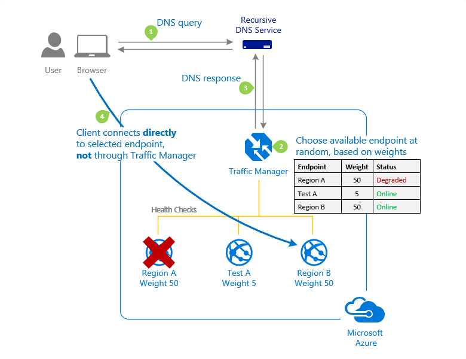
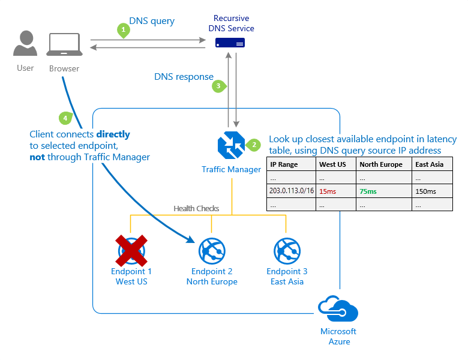
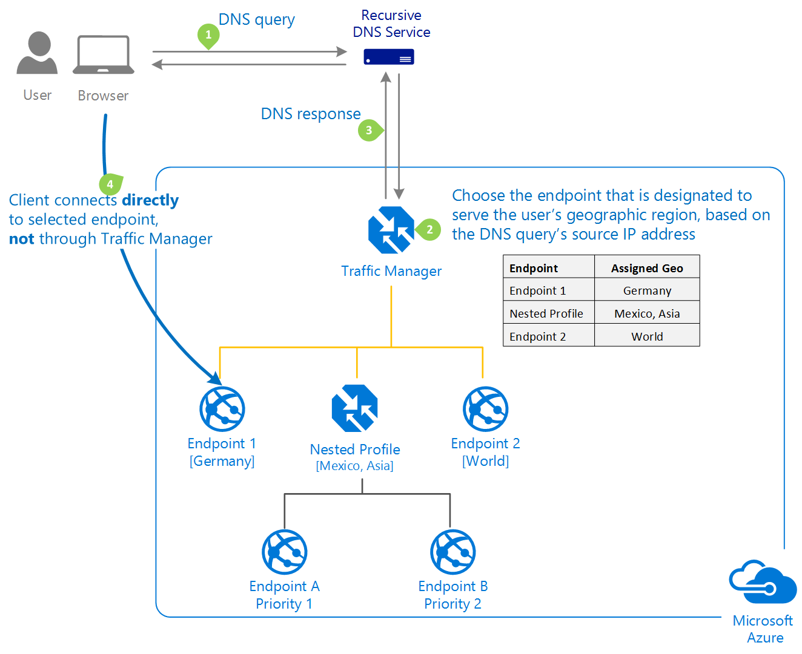

# Traffic Manager routing methods

Azure Traffic Manager supports six traffic-routing methods to determine how to route network traffic to the various service endpoints. For any profile, Traffic Manager applies the traffic-routing method associated to it to each DNS query it receives. The traffic-routing method determines which endpoint is returned in the DNS response.

The following traffic routing methods are available in Traffic Manager:

* **[Priority](#priority-traffic-routing-method):** Select **Priority** when you want to use a primary service endpoint for all traffic, and provide backups in case the primary or the backup endpoints are unavailable.
* **[Weighted](#weighted):** Select **Weighted** when you want to distribute traffic across a set of endpoints, either evenly or according to weights, which you define.
* **[Performance](#performance):** Select **Performance** when you have endpoints in different geographic locations and you want end users to use the "closest" endpoint in terms of the lowest network latency.
* **[Geographic](#geographic):** Select **Geographic** so that users are directed to specific endpoints (Azure, External, or Nested) based on which geographic location their DNS query originates from. This empowers Traffic Manager customers to enable scenarios where knowing a user’s geographic region and routing them based on that is important. Examples include complying with data sovereignty mandates, localization of content & user experience and measuring traffic from different regions.
* **[Multivalue](#multivalue):** Select **MultiValue** for Traffic Manager profiles that can only have IPv4/IPv6 addresses as endpoints. When a query is received for this profile, all healthy endpoints are returned.
* **[Subnet](#subnet):** Select **Subnet** traffic-routing method to map sets of end-user IP address ranges to a specific endpoint within a Traffic Manager profile. When a request is received, the endpoint returned will be the one mapped for that request’s source IP address. 

All Traffic Manager profiles include monitoring of endpoint health and automatic endpoint failover. For more information, see [Traffic Manager Endpoint Monitoring](traffic-manager-monitoring.md). A single Traffic Manager profile can use only one traffic routing method. You can select a different traffic routing method for your profile at any time. Changes are applied within one minute, and no downtime is incurred. Traffic-routing methods can be combined by using nested Traffic Manager profiles. Nesting enables sophisticated and flexible traffic-routing configurations that meet the needs of larger, complex applications. For more information, see [nested Traffic Manager profiles](traffic-manager-nested-profiles.md).

## Priority traffic-routing method

Often an organization wants to provide reliability for its services by deploying one or more backup services in case their primary service goes down. The 'Priority' traffic-routing method allows Azure customers to easily implement this failover pattern.

The Traffic Manager profile contains a prioritized list of service endpoints. By default, Traffic Manager sends all traffic to the primary (highest-priority) endpoint. If the primary endpoint is not available, Traffic Manager routes the traffic to the second endpoint. If both the primary and secondary endpoints are not available, the traffic goes to the third, and so on. Availability of the endpoint is based on the configured status (enabled or disabled) and the ongoing endpoint monitoring.

### Configuring endpoints

With Azure Resource Manager, you configure the endpoint priority explicitly using the 'priority' property for each endpoint. This property is a value between 1 and 1000. Lower values represent a higher priority. Endpoints cannot share priority values. Setting the property is optional. When omitted, a default priority based on the endpoint order is used.

## Weighted traffic-routing method
The 'Weighted' traffic-routing method allows you to distribute traffic evenly or to use a pre-defined weighting.

In the Weighted traffic-routing method, you assign a weight to each endpoint in the Traffic Manager profile configuration. The weight is an integer from 1 to 1000. This parameter is optional. If omitted, Traffic Managers uses a default weight of '1'. The higher weight, the higher the priority.

For each DNS query received, Traffic Manager randomly chooses an available endpoint. The probability of choosing an endpoint is based on the weights assigned to all available endpoints. Using the same weight across all endpoints results in an even traffic distribution. Using higher or lower weights on specific endpoints causes those endpoints to be returned more or less frequently in the DNS responses.

The weighted method enables some useful scenarios:

* Gradual application upgrade: Allocate a percentage of traffic to route to a new endpoint, and gradually increase the traffic over time to 100%.
* Application migration to Azure: Create a profile with both Azure and external endpoints. Adjust the weight of the endpoints to prefer the new endpoints.
* Cloud-bursting for additional capacity: Quickly expand an on-premises deployment into the cloud by putting it behind a Traffic Manager profile. When you need extra capacity in the cloud, you can add or enable more endpoints and specify what portion of traffic goes to each endpoint.

In addition to using the Azure portal, you can configure weights using Azure PowerShell, CLI, and the REST APIs.

It is important to understand that DNS responses are cached by clients and by the recursive DNS servers that the clients use to resolve DNS names. This caching can have an impact on weighted traffic distributions. When the number of clients and recursive DNS servers is large, traffic distribution works as expected. However, when the number of clients or recursive DNS servers is small, caching can significantly skew the traffic distribution.

Common use cases include:

* Development and testing environments
* Application-to-application communications
* Applications aimed at a narrow user-base that share a common recursive DNS infrastructure (for example, employees of company connecting through a proxy)

These DNS caching effects are common to all DNS-based traffic routing systems, not just Azure Traffic Manager. In some cases, explicitly clearing the DNS cache may provide a workaround. In other cases, an alternative traffic-routing method may be more appropriate.

## Performance traffic-routing method

Deploying endpoints in two or more locations across the globe can improve the responsiveness of many applications by routing traffic to the location that is 'closest' to you. The 'Performance' traffic-routing method provides this capability.

The 'closest' endpoint is not necessarily closest as measured by geographic distance. Instead, the 'Performance' traffic-routing method determines the closest endpoint by measuring network latency. Traffic Manager maintains an Internet Latency Table to track the round-trip time between IP address ranges and each Azure datacenter.

Traffic Manager looks up the source IP address of the incoming DNS request in the Internet Latency Table. Traffic Manager then chooses an available endpoint in the Azure datacenter that has the lowest latency for that IP address range, and returns that endpoint in the DNS response.

As explained in [How Traffic Manager Works](traffic-manager-how-it-works.md), Traffic Manager does not receive DNS queries directly from clients. Rather, DNS queries come from the recursive DNS service that the clients are configured to use. Therefore, the IP address used to determine the 'closest' endpoint is not the client's IP address, but it is the IP address of the recursive DNS service. In practice, this IP address is a good proxy for the client.

Traffic Manager regularly updates the Internet Latency Table to account for changes in the global Internet and new Azure regions. However, application performance varies based on real-time variations in load across the Internet. Performance traffic-routing does not monitor load on a given service endpoint. However, if an endpoint becomes unavailable, Traffic Manager does not include it in DNS query responses.

Points to note:

* If your profile contains multiple endpoints in the same Azure region, then Traffic Manager distributes traffic evenly across the available endpoints in that region. If you prefer a different traffic distribution within a region, you can use [nested Traffic Manager profiles](traffic-manager-nested-profiles.md).
* If all enabled endpoints in the closest Azure region are degraded, Traffic Manager moves traffic to the endpoints in the next closest Azure region. If you want to define a preferred failover sequence, use [nested Traffic Manager profiles](traffic-manager-nested-profiles.md).
* When using the Performance traffic routing method with external endpoints or nested endpoints, you need to specify the location of those endpoints. Choose the Azure region closest to your deployment. Those locations are the values supported by the Internet Latency Table.
* The algorithm that chooses the endpoint is deterministic. Repeated DNS queries from the same client are directed to the same endpoint. Typically, clients use different recursive DNS servers when traveling. The client may be routed to a different endpoint. Routing can also be affected by updates to the Internet Latency Table. Therefore, the Performance traffic-routing method does not guarantee that a client is always routed to the same endpoint.
* When the Internet Latency Table changes, you may notice that some clients are directed to a different endpoint. This routing change is more accurate based on current latency data. These updates are essential to maintain the accuracy of Performance traffic-routing as the Internet continually evolves.

## Geographic traffic-routing method

Traffic Manager profiles can be configured to use the Geographic routing method so that users are directed to specific endpoints (Azure, External or Nested) based on which geographic location their DNS query originates from. This empowers Traffic Manager customers to enable scenarios where knowing a user’s geographic region and routing them based on that is important. Examples include complying with data sovereignty mandates, localization of content & user experience and measuring traffic from different regions.
When a profile is configured for geographic routing, each endpoint associated with that profile needs to have a set of geographic regions assigned to it. A geographic region can be at following levels of granularity 
- World– any region
- Regional Grouping – for example, Africa, Middle East, Australia/Pacific etc. 
- Country/Region – for example, Ireland, Peru, Hong Kong SAR etc. 
- State/Province – for example, USA-California, Australia-Queensland, Canada-Alberta etc. (note: this granularity level is supported only for states / provinces in Australia, Canada, and USA).

When a region or a set of regions is assigned to an endpoint, any requests from those regions gets routed only to that endpoint. Traffic Manager uses the source IP address of the DNS query to determine the region from which a user is querying from – usually this is the IP address of the local DNS resolver doing the query on behalf of the user.  

Traffic Manager reads the source IP address of the DNS query and decides which geographic region it is originating from. It then looks to see if there is an endpoint that has this geographic region mapped to it. This lookup starts at the lowest granularity level (State/Province where it is supported, else at the Country/Region level) and goes all the way up to the highest level, which is **World**. The first match found using this traversal is designated as the endpoint to return in the query response. When matching with a Nested type endpoint, an endpoint within that child profile is returned, based on its routing method. The following points are applicable to this behavior:

- A geographic region can be mapped only to one endpoint in a Traffic Manager profile when the routing type is Geographic Routing. This ensures that routing of users is deterministic, and customers can enable scenarios that require unambiguous geographic boundaries.
- If a user’s region comes under two different endpoints’ geographic mapping, Traffic Manager selects the endpoint with the lowest granularity and does not consider routing requests from that region to the other endpoint. For example, consider a Geographic Routing type profile with two endpoints - Endpoint1 and Endpoint2. Endpoint1 is configured to receive traffic from Ireland and Endpoint2 is configured to receive traffic from Europe. If a request originates from Ireland, it is always routed to Endpoint1.
- Since a region can be mapped only to one endpoint, Traffic Manager returns it regardless of whether the endpoint is healthy or not.

    >[!IMPORTANT]
    >It is strongly recommended that customers using the geographic routing method associate it with the Nested type endpoints that has child profiles containing at least two endpoints within each.
- If an endpoint match is found and that endpoint is in the **Stopped** state, Traffic Manager returns a NODATA response. In this case, no further lookups are made higher up in the geographic region hierarchy. This behavior is also applicable for nested endpoint types when the child profile is in the **Stopped** or **Disabled** state.
- If an endpoint displays a **Disabled** status, it won’t be included in the region matching process. This behavior is also applicable for nested endpoint types when the endpoint is in the **Disabled** state.
- If a query is coming from a geographic region that has no mapping in that profile, Traffic Manager returns a NODATA response. Therefore, it is strongly recommended that customers use geographic routing with one endpoint, ideally of type Nested with at least two endpoints within the child profile, with the region **World** assigned to it. This also ensures that any IP addresses that do not map to a region are handled.

As explained in [How Traffic Manager Works](traffic-manager-how-it-works.md), Traffic Manager does not receive DNS queries directly from clients. Rather, DNS queries come from the recursive DNS service that the clients are configured to use. Therefore, the IP address used to determine the region is not the client's IP address, but it is the IP address of the recursive DNS service. In practice, this IP address is a good proxy for the client.

### FAQs

* [What are some use cases where geographic routing is useful?](https://docs.microsoft.com/azure/traffic-manager/traffic-manager-faqs#what-are-some-use-cases-where-geographic-routing-is-useful)

* [How do I decide if I should use Performance routing method or Geographic routing method?](https://docs.microsoft.com/azure/traffic-manager/traffic-manager-faqs#how-do-i-decide-if-i-should-use-performance-routing-method-or-geographic-routing-method)

* [What are the regions that are supported by Traffic Manager for geographic routing?](https://docs.microsoft.com/azure/traffic-manager/traffic-manager-faqs#what-are-the-regions-that-are-supported-by-traffic-manager-for-geographic-routing)

* [How does traffic manager determine where a user is querying from?](https://docs.microsoft.com/azure/traffic-manager/traffic-manager-faqs#how-does-traffic-manager-determine-where-a-user-is-querying-from)

* [Is it guaranteed that Traffic Manager can correctly determine the exact geographic location of the user in every case?](https://docs.microsoft.com/azure/traffic-manager/traffic-manager-faqs#is-it-guaranteed-that-traffic-manager-can-correctly-determine-the-exact-geographic-location-of-the-user-in-every-case)

* [Does an endpoint need to be physically located in the same region as the one it is configured with for geographic routing?](https://docs.microsoft.com/azure/traffic-manager/traffic-manager-faqs#does-an-endpoint-need-to-be-physically-located-in-the-same-region-as-the-one-it-is-configured-with-for-geographic-routing)

* [Can I assign geographic regions to endpoints in a profile that is not configured to do geographic routing?](https://docs.microsoft.com/azure/traffic-manager/traffic-manager-faqs#can-i-assign-geographic-regions-to-endpoints-in-a-profile-that-is-not-configured-to-do-geographic-routing)

* [Why am I getting an error when I try to change the routing method of an existing profile to Geographic?](https://docs.microsoft.com/azure/traffic-manager/traffic-manager-faqs#why-am-i-getting-an-error-when-i-try-to-change-the-routing-method-of-an-existing-profile-to-geographic)

* [Why is it strongly recommended that customers create nested profiles instead of endpoints under a profile with geographic routing enabled?](https://docs.microsoft.com/azure/traffic-manager/traffic-manager-faqs#why-is-it-strongly-recommended-that-customers-create-nested-profiles-instead-of-endpoints-under-a-profile-with-geographic-routing-enabled)

* [Are there any restrictions on the API version that supports this routing type?](https://docs.microsoft.com/azure/traffic-manager/traffic-manager-faqs#are-there-any-restrictions-on-the-api-version-that-supports-this-routing-type)

## Multivalue traffic-routing method
The **Multivalue** traffic-routing method allows you to get multiple healthy endpoints in a single DNS query response. This enables the caller to do client-side retries with other endpoints in the event of a returned endpoint being unresponsive. This pattern can increase the availability of a service and reduce the latency associated with a new DNS query to obtain a healthy endpoint. MultiValue routing method works only if all the endpoints of type ‘External’ and are specified as IPv4 or IPv6 addresses. When a query is received for this profile, all healthy endpoints are returned and are subject to a configurable maximum return count.

### FAQs

* [What are some use cases where MultiValue routing is useful?](https://docs.microsoft.com/azure/traffic-manager/traffic-manager-faqs#what-are-some-use-cases-where-multivalue-routing-is-useful)

* [How many endpoints are returned when MultiValue routing is used?](https://docs.microsoft.com/azure/traffic-manager/traffic-manager-faqs#how-many-endpoints-are-returned-when-multivalue-routing-is-used)

* [Will I get the same set of endpoints when MultiValue routing is used?](https://docs.microsoft.com/azure/traffic-manager/traffic-manager-faqs#will-i-get-the-same-set-of-endpoints-when-multivalue-routing-is-used)

## Subnet traffic-routing method
The **Subnet** traffic-routing method allows you to map a set of end user IP address ranges to specific endpoints in a profile. After that, if Traffic Manager receives a DNS query for that profile, it will inspect the source IP address of that request (in most cases this will be the outgoing IP address of the DNS resolver used by the caller), determine which endpoint it is mapped to and will return that endpoint in the query response. 

The IP address to be mapped to an endpoint can be specified as CIDR ranges (e.g. 1.2.3.0/24) or as an address range (e.g. 1.2.3.4-5.6.7.8). The IP ranges associated with an endpoint need to be unique within that profile and cannot have an overlap with the IP address set of a different endpoint in the same profile.
If you define an endpoint with no address range, that functions as a fallback and take traffic from any remaining subnets. If no fallback endpoint is included, Traffic Manager sends a NODATA response for any undefined ranges. It is therefore highly recommended that you either define a fallback endpoint, or else ensure that all possible IP ranges are specified across your endpoints.

Subnet routing can be used to deliver a different experience for users connecting from a specific IP space. For example, using subnet routing, a customer can make all requests from their corporate office be routed to a different endpoint where they might be testing an internal only version of their app. Another scenario is if you want to provide a different experience to users connecting from a specific ISP (For example, block users from a given ISP).

### FAQs

* [What are some use cases where subnet routing is useful?](https://docs.microsoft.com/azure/traffic-manager/traffic-manager-faqs#what-are-some-use-cases-where-subnet-routing-is-useful)

* [How does Traffic Manager know the IP address of the end user?](https://docs.microsoft.com/azure/traffic-manager/traffic-manager-faqs#how-does-traffic-manager-know-the-ip-address-of-the-end-user)

* [How can I specify IP addresses when using Subnet routing?](https://docs.microsoft.com/azure/traffic-manager/traffic-manager-faqs#how-can-i-specify-ip-addresses-when-using-subnet-routing)

* [How can I specify a fallback endpoint when using Subnet routing?](https://docs.microsoft.com/azure/traffic-manager/traffic-manager-faqs#how-can-i-specify-a-fallback-endpoint-when-using-subnet-routing)

* [What happens if an endpoint is disabled in a Subnet routing type profile?](https://docs.microsoft.com/azure/traffic-manager/traffic-manager-faqs#what-happens-if-an-endpoint-is-disabled-in-a-subnet-routing-type-profile)

## Next steps

Learn how to develop high-availability applications using [Traffic Manager endpoint monitoring](traffic-manager-monitoring.md)

