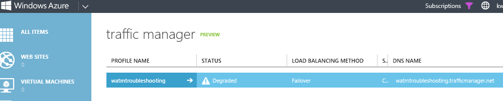
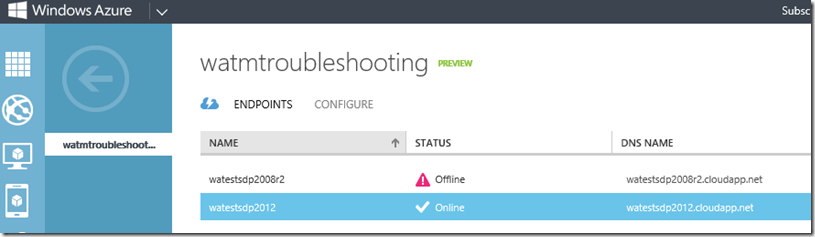
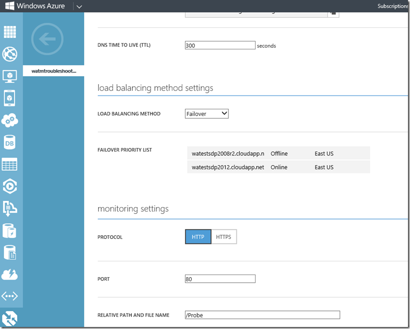
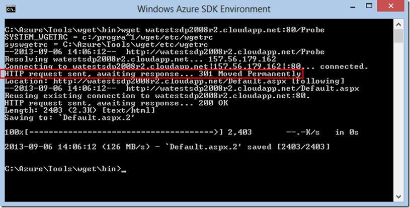

<properties
   pageTitle="Troubleshooting degraded status on Azure Traffic Manager"
   description="How to troubleshoot Traffic Manager profiles when it shows as degraded status."
   services="traffic-manager"
   documentationCenter=""
   authors="kwill-MSFT"
   manager="adinah"
   editor="joaoma" />

<tags 
   ms.service="traffic-manager"
   ms.devlang="na"
   ms.topic="article"
   ms.tgt_pltfrm="na"
   ms.workload="infrastructure-services"
   ms.date="08/19/2015"
   ms.author="joaoma" />

# Troubleshooting degraded status on Azure Traffic Manager
This page will describe how to troubleshoot Azure Traffic Manager profile which is showing a degraded status, and provide some key points to understand about traffic manager probes.

You have configured a Traffic Manager profile pointing to some of your .cloudapp.net hosted services and after a few seconds you see the Status as Degraded.

If you go into the Endpoints tab of that profile you will see one or more of the endpoints in an Offline status:

## Important notes about Traffic Manager probing

- Traffic Manager only considers an endpoint as ONLINE if the probe gets a 200 back from the probe path.
- A 30x redirect (or any other non-200 response) will fail, even if the redirected URL returns a 200.

- For HTTPs probes, certificate errors are ignored.
 
- The actual content of the probe path doesn’t matter, as long as a 200 is returned.  A common technique if the actual website content doesn’t return a 200 (ie. if the ASP pages redirect to an ACS login page or some other CNAME URL) is to set the path to something like “/favicon.ico”.
 
- Best practice is to set the Probe path to something which has enough logic to determine if the site is up or down.  In the above example setting the path to “/favicon.ico” you are only testing if w3wp.exe is responding, but not if your website is healthy.  A better option would be to set a path to something such as “/Probe.aspx”, and within Probe.aspx include enough logic to determine if your site is healthy (ie. check perf counters to make sure you aren’t at 100% CPU or receiving a large number of failed requests, attempt to access resources such as the database or session state to make sure the application’s logic is working, etc).
 
- If all endpoints in a profile are degraded then Traffic Manager will treat all endpoints as healthy and route traffic to all endpoints.  This is to ensure that any potential problem with the probing mechanism which results in incorrectly failed probes will not result in a complete outage of your service.

  

## Troubleshooting

One tool for troubleshooting Traffic Manager probe failures is wget.  You can get the binaries and dependencies package from [wget](http://gnuwin32.sourceforge.net/packages/wget.htm).  Note that you can use other programs such as Fiddler or curl instead of wget – basically you just need something that will show you the raw HTTP response.

Once you have wget installed, go to a command prompt and run wget against the URL + Probe port & path that is configured in Traffic Manager.  For this example it would be http://watestsdp2008r2.cloudapp.net:80/Probe.

Using Wget:

 

Notice that wget indicates that the URL returned a 301 redirect to http://watestsdp2008r2.cloudapp.net/Default.aspx.  As we know from the “Important notes about Traffic Manager probing” section above, a 30x redirect is considered a failure by Traffic Manager probing and this will cause the probe to report Offline.  At this point it is a simple matter to check the website configuration and make sure that a 200 is returned from the /Probe path (or reconfigure the Traffic Manager probe to point to a path which will return a 200).

 

If your probe is using HTTPs protocol you will want to add the “--no-check-certificate” parameter to wget so that it will ignore the certificate mismatch on the cloudapp.net URL.

## Next Steps

[About Traffic Manager traffic routing methods](traffic-manager-load-balancing-methods.md)

[What is Traffic Manager](../traffic-manmager-overview.md)

[Cloud Services](http://go.microsoft.com/fwlink/?LinkId=314074)

[Websites](http://go.microsoft.com/fwlink/p/?LinkId=393327)

[Operations on Traffic Manager (REST API Reference)](http://go.microsoft.com/fwlink/?LinkId=313584)

[Azure Traffic Manager Cmdlets](http://go.microsoft.com/fwlink/p/?LinkId=400769)
 
