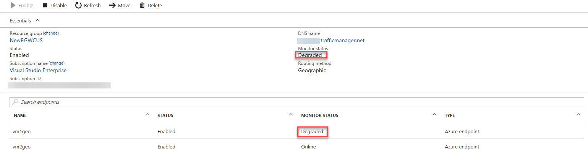
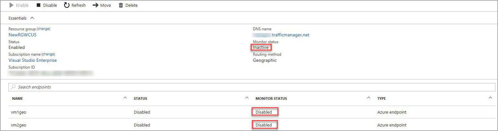

# Troubleshooting degraded state on Azure Traffic Manager

This article describes how to troubleshoot an Azure Traffic Manager profile that is showing a degraded status. For this scenario, consider that you have configured a Traffic Manager profile pointing to some of your cloudapp.net hosted services. If the health of your Traffic Manager displays a **Degraded** status, then the status of one or more endpoints may be **Degraded**:



If the health of your Traffic Manager displays an **Inactive** status, then both end points may be **Disabled**:



## Understanding Traffic Manager probes

* Traffic Manager considers an endpoint to be ONLINE only when the probe receives an HTTP 200 response back from the probe path. Any other non-200 response is a failure.
* A 30x redirect fails, even if the redirected URL returns a 200.
* For HTTPs probes, certificate errors are ignored.
* The actual content of the probe path doesn't matter, as long as a 200 is returned. Probing a URL to some static content like "/favicon.ico" is a common technique. Dynamic content, like the ASP pages, may not always return 200, even when the application is healthy.
* A best practice is to set the Probe path to something that has enough logic to determine that the site is up or down. In the previous example, by setting the path to "/favicon.ico", you are only testing that w3wp.exe is responding. This probe may not indicate that your web application is healthy. A better option would be to set a path to a something such as "/Probe.aspx" that has logic to determine the health of the site. For example, you could use performance counters to CPU utilization or measure the number of failed requests. Or you could attempt to access database resources or session state to make sure that the web application is working.
* If all endpoints in a profile are degraded, then Traffic Manager treats all endpoints as healthy and routes traffic to all endpoints. This behavior ensures that problems with the probing mechanism do not result in a complete outage of your service.

## Troubleshooting

To troubleshoot a probe failure, you need a tool that shows the HTTP status code return from the probe URL. There are many tools available that show you the raw HTTP response.

* [Fiddler](http://www.telerik.com/fiddler)
* [curl](https://curl.haxx.se/)
* [wget](http://gnuwin32.sourceforge.net/packages/wget.htm)

Also, you can use the Network tab of the F12 Debugging Tools in Internet Explorer to view the HTTP responses.

For this example we want to see the response from our probe URL: http://watestsdp2008r2.cloudapp.net:80/Probe. The following PowerShell example illustrates the problem.

```powershell
Invoke-WebRequest 'http://watestsdp2008r2.cloudapp.net/Probe' -MaximumRedirection 0 -ErrorAction SilentlyContinue | Select-Object StatusCode,StatusDescription
```

Example output:

    StatusCode StatusDescription
    ---------- -----------------
           301 Moved Permanently

Notice that we received a redirect response. As stated previously, any StatusCode other than 200 is considered a failure. Traffic Manager changes the endpoint status to Offline. To resolve the problem, check the website configuration to ensure that the proper StatusCode can be returned from the probe path. Reconfigure the Traffic Manager probe to point to a path that returns a 200.

If your probe is using the HTTPS protocol, you may need to disable certificate checking to avoid SSL/TLS errors during your test. The following PowerShell statements disable certificate validation for the current PowerShell session:

```powershell
add-type @"
using System.Net;
using System.Security.Cryptography.X509Certificates;
public class TrustAllCertsPolicy : ICertificatePolicy {
    public bool CheckValidationResult(
    ServicePoint srvPoint, X509Certificate certificate,
    WebRequest request, int certificateProblem) {
    return true;
    }
}
"@
[System.Net.ServicePointManager]::CertificatePolicy = New-Object TrustAllCertsPolicy
```

## Next Steps

[About Traffic Manager traffic routing methods](traffic-manager-routing-methods.md)

[What is Traffic Manager](traffic-manager-overview.md)

[Cloud Services](http://go.microsoft.com/fwlink/?LinkId=314074)

[Azure Web Apps](https://azure.microsoft.com/documentation/services/app-service/web/)

[Operations on Traffic Manager (REST API Reference)](http://go.microsoft.com/fwlink/?LinkId=313584)

[Azure Traffic Manager Cmdlets][1]

[1]: https://docs.microsoft.com/powershell/module/azurerm.trafficmanager
