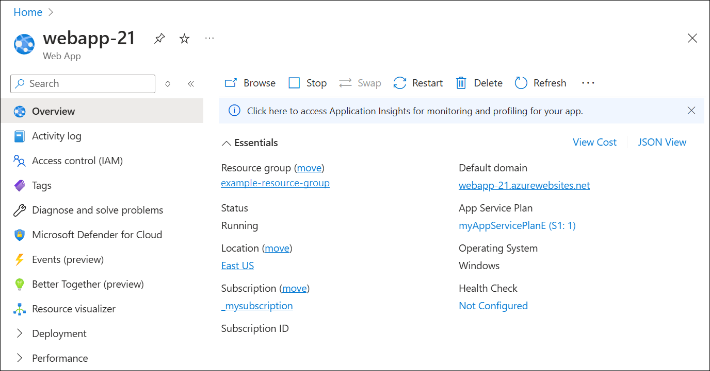

# Use Azure App Service with Azure Traffic Manager

Azure App Service is a fully managed platform as a service (PaaS) offering that allows developers to quickly build, deploy, and scale web, mobile, and API applications without worrying about the underlying infrastructure. Azure Traffic Manager can be used with Azure App Service to control how requests from web clients are distributed to apps in Azure App Service.

## Scenarios for using Azure Traffic Manager with Azure App Service

* **High availability**: Azure Traffic Manager can help ensure that your app is always available by directing traffic to a healthy instance of your app in the event of an outage or other issue.
* **Geographic distribution**: If you have apps in different geographic locations, you can use Azure Traffic Manager to direct users to the closest app in terms of the lowest network latency.
* **Load balancing**: Azure Traffic Manager can distribute traffic across a set of apps, either evenly or according to weights, which you define.

By using Azure Traffic Manager with Azure App Service, you can ensure that your app is always available, provide better user experience by directing users to the closest app, and distribute traffic across a set of apps.

## Considerations when using Azure Traffic Manager with Azure App Service

* For app-only deployments within the same region, App Service already provides failover and round-robin functionality without regard to app mode.
* For deployments in the same region that use App Service in conjunction with another Azure cloud service, you can combine both types of endpoints to enable hybrid scenarios.
* You can only specify one App Service endpoint per region in a profile.
* When you select an app as an endpoint for one region, the remaining apps in that region become unavailable for selection for that profile.

## Process overview: Steps to use Azure Traffic Manager with Azure App Service

1.	[Create an Azure App Service](../app-service/getting-started.md): Start by creating an Azure App Service. This will host your web, mobile, or API application. The following example is a Dotnet 8.0 web app.

    
2.	Create an Azure Traffic Manager Profile: In the Azure portal, create a new Traffic Manager profile. Choose the routing method that best suits your needs (Priority, Weighted, Performance, Geographic).

     
3.	[Add an endpoint](quickstart-create-traffic-manager-profile.md#add-traffic-manager-endpoints) to your Traffic Manager profile: Add your Azure App Service as an endpoint in your Traffic Manager profile. Remember, you can only specify one App Service endpoint per region in a profile.

    
4.	[Configure Endpoint Weights or Priorities](traffic-manager-routing-methods.md): If you’re using the [weighted](traffic-manager-configure-weighted-routing-method.md) or [priority](traffic-manager-configure-priority-routing-method.md) routing methods, configure the weights or priorities of your endpoints.
5.	Test Your Setup: Use different devices or services to send requests to your Traffic Manager profile’s DNS name. Verify that the requests are routed to the expected endpoint. The following example displays a web app request.

    

Remember to monitor the health of your endpoints and adjust your Traffic Manager configuration as needed to ensure high availability, optimal geographic distribution, and effective load balancing.

> [!NOTE]
> If your web app uses SSL (settings > certificates), you can enable SSL on the **trafficmanager.net** domain by adding a binding for **trafficmanager.net** under **settings > custom domains** for the web app.

## Next steps

- Learn about [weighted traffic routing method](traffic-manager-configure-weighted-routing-method.md).
- Learn about [priority routing method](traffic-manager-configure-priority-routing-method.md).
- Learn about [geographic routing method](traffic-manager-configure-geographic-routing-method.md).
- Learn how to [test Traffic Manager settings](traffic-manager-testing-settings.md).
