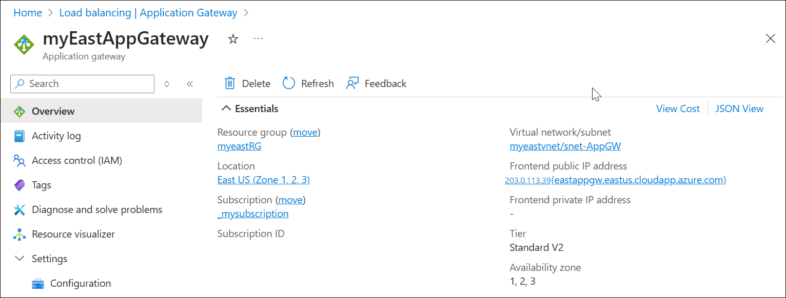
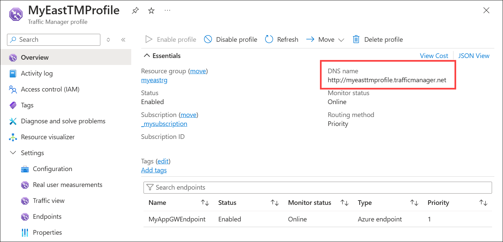

# Use Azure App Gateway with Azure Traffic Manager

Azure Traffic Manager and [Azure Application Gateway](../application-gateway/overview.md) can be used together to provide global load balancing and failover capabilities for your web applications. Azure Traffic Manager uses DNS-based routing to distribute incoming traffic across multiple regions, while Azure Application Gateway provides application-level routing and load balancing within a region.

## Scenarios for using Azure App Gateway with Azure Traffic Manager

* **Improve application performance**: By using Azure Traffic Manager to route traffic to the closest Azure Application Gateway, you can reduce latency and improve application performance for your users.
* **Increase application availability**: By using Azure Traffic Manager to distribute traffic across multiple Azure Application Gateways, you can ensure that your application remains available even if one or more gateways become unavailable.
* **Scale your application**: By using Azure Application Gateway to load balance traffic within a region, you can scale your application horizontally to handle increased traffic.
* **Secure your application**: By using Azure Application Gateway to terminate SSL/TLS connections and protect against web attacks, you can secure your application from external threats.

## Process overview: How to use Azure App Gateway with Azure Traffic Manager

1. [Create an Azure Traffic Manager profile](quickstart-create-traffic-manager-profile.md): Start by creating an Azure Traffic Manager profile. Configure it to use the desired traffic routing method (priority, weighted, performance, or geographic).
    
     
2. [Create an Azure Application Gateway](../application-gateway/quick-create-portal.md): Next, create an Azure Application Gateway. Configure it to use the desired backend pool and routing rules.

    
3. Copy the Azure Application Gateway [frontend public IP address](../application-gateway/application-gateway-components.md#frontend-ip-addresses) and then use this IP address to [add an endpoint](quickstart-create-traffic-manager-profile.md#add-traffic-manager-endpoints) to your Azure Traffic Manager profile.

    

    
4. Test Your Setup: Finally, test the configuration by accessing the Azure Traffic Manager DNS name from a web browser. This will help ensure that traffic is being correctly routed and is load balanced. In the following example, the application gateway backend target is a web server. 

    

    

By using Azure Traffic Manager with Azure Application Gateway, you can achieve high availability and scalability for your web applications across multiple regions. This combination of services can help you to improve application performance, increase application availability, scale your application, and secure your application.

Remember to monitor the health of your endpoints and adjust your Traffic Manager and Application Gateway configurations as needed to ensure high availability, optimal geographic distribution, and effective load balancing.

## Next steps

- Learn about [weighted traffic routing method](traffic-manager-configure-weighted-routing-method.md).
- Learn about [priority routing method](traffic-manager-configure-priority-routing-method.md).
- Learn about [geographic routing method](traffic-manager-configure-geographic-routing-method.md).
- Learn how to [test Traffic Manager settings](traffic-manager-testing-settings.md).
