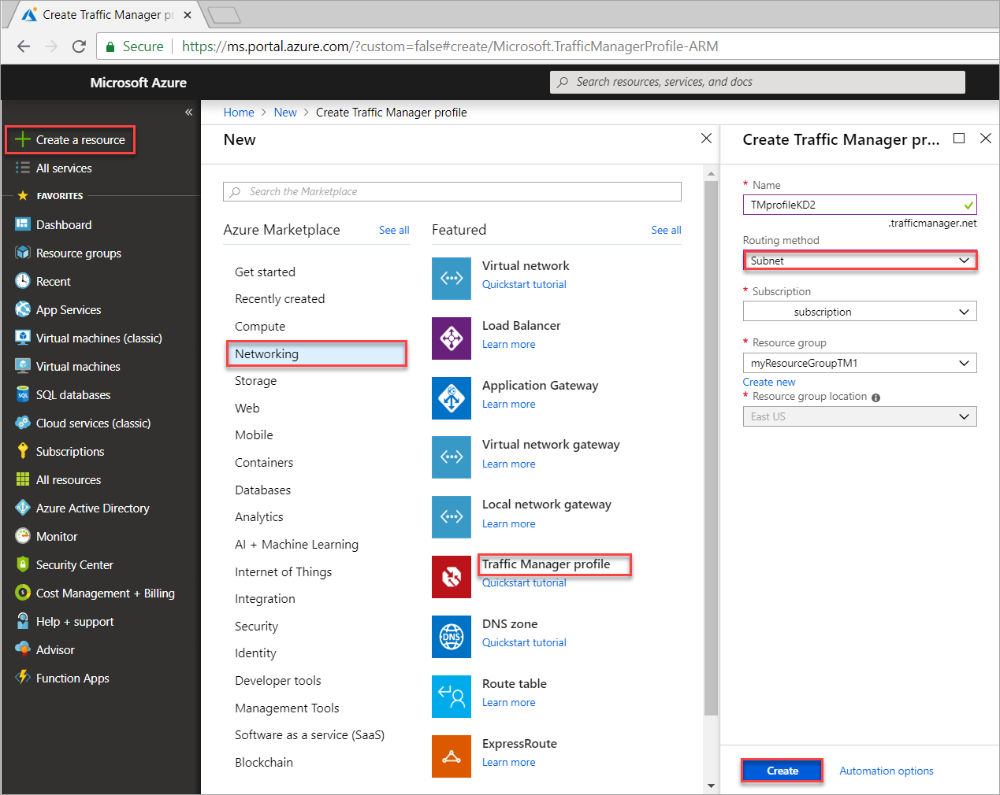

# Direct traffic to specific endpoints based on user subnet using Traffic Manager

This article describes how to configure the subnet traffic-routing method. The **Subnet** traffic-routing method allows you to map a set of IP address ranges to specific endpoints and when a request is received by Traffic Manager, it inspects the source IP of the request and returns the endpoint associated with it.

In this tutorial, using subnet routing, depending on the IP address of the user's query, traffic is either routed to an internal website or a production website.

In this tutorial, you learn how to:

> [!div class="checklist"]
> * Create two VMs running a basic website on IIS
> * Create two test VMs to view Traffic Manager in action
> * Configure DNS name for the VMs running IIS
> * Create a Traffic Manager profile for routing traffic based on user's subnet
> * Add VM endpoints to the Traffic Manager profile
> * View Traffic Manager in action

If you don't have an Azure subscription, create a [free account](https://azure.microsoft.com/free/?WT.mc_id=A261C142F) before you begin.

## Prerequisites

In order to see the Traffic Manager in action, this tutorial requires that you deploy the following:

- two basic websites running in different Azure regions - **East US** (serves as internal website) and **West Europe** (serves as production website).
- two test VMs for testing the Traffic Manager - one VM in **East US** and the second VM in **West Europe**.

The test VMs are used to illustrate how Traffic Manager routes user traffic to the internal website or the production website based on subnet from where the user query originates.

### Sign in to Azure

Sign in to the Azure portal at https://portal.azure.com.

### Create websites

In this section, you create two website instances that provide the two service endpoints for the Traffic Manager profile in two Azure regions. Creating the two websites includes the following steps:

1. Create two VMs for running a basic website - one in **East US**, and the other in **West Europe**.
2. Install IIS server on each VM and update the default website page that describes the VM name that a user is connected to when visiting the website.

#### Create VMs for running websites

In this section, you create two VMs *myIISVMEastUS* and *myIISVMWestEurope* in the **East US** and **West Europe** Azure regions.

1. On the upper, left corner of the Azure portal, select **Create a resource** > **Compute** > **Windows Server 2019 Datacenter**.
2. In **Create a virtual machine**, type or select the following values in the **Basics** tab:

   - **Subscription** > **Resource Group**: Select **Create new** and then type **myResourceGroupTM1**.
   - **Instance Details** > **Virtual machine name**: Type *myIISVMEastUS*.
   - **Instance Details** > **Region**:  Select **East US**.
   - **Administrator Account** > **Username**:  Enter a user name of your choosing.
   - **Administrator Account** > **Password**:  Enter a password of your choosing. The password must be at least 12 characters long and meet the [defined complexity requirements](../virtual-machines/windows/faq.md?toc=%2fazure%2fvirtual-network%2ftoc.json#what-are-the-password-requirements-when-creating-a-vm).
   - **Inbound Port Rules** > **Public inbound ports**: Select **Allow selected ports**.
   - **Inbound Port Rules** > **Select inbound ports**: Select **RDP** and **HTTP** in the pull down box.

3. Select the **Management** tab, or select **Next: Disks**, then **Next: Networking**, then **Next: Management**. Under **Monitoring**, set **Boot diagnostics** to **Off**.
4. Select **Review + create**.
5. Review the settings, and then click **Create**.  
6. Follow the steps to create a second VM named *myIISVMWestEurope*, with a **Resource group** name of *myResourceGroupTM2*, a **location** of *West Europe*, and all the other settings the same as *myIISVMEastUS*.
7. The VMs take a few minutes to create. Do not continue with the remaining steps until both VMs are created.

#### Install IIS and customize the default web page

In this section, you install the IIS server on the two VMs - *myIISVMEastUS* & *myIISVMWestEurope*, and then update the default website page. The customized website page shows the name of the VM that you are connecting to when you visit the website from a web browser.

1. Select **All resources** in the left-hand menu, and then from the resources list click *myIISVMEastUS* that is located in the *myResourceGroupTM1* resource group.
2. On the **Overview** page, click **Connect**, and then in **Connect to virtual machine**, select **Download RDP file**.
3. Open the downloaded rdp file. If prompted, select **Connect**. Enter the user name and password you specified when creating the VM. You may need to select **More choices**, then **Use a different account**, to specify the credentials you entered when you created the VM.
4. Select **OK**.
5. You may receive a certificate warning during the sign-in process. If you receive the warning, select **Yes** or **Continue**, to proceed with the connection.
6. On the server desktop, navigate to **Windows Administrative Tools**>**Server Manager**.
7. Launch Windows PowerShell on VM *myIISVMEastUS*, and using the following commands to install IIS server and update the default htm file.

    ```powershell-interactive
    # Install IIS
    Install-WindowsFeature -name Web-Server -IncludeManagementTools

    # Remove default htm file
    remove-item C:\inetpub\wwwroot\iisstart.htm

    #Add custom htm file
    Add-Content -Path "C:\inetpub\wwwroot\iisstart.htm" -Value $("Hello World from my " + $env:computername)
    ```

8. Close the RDP connection with *myIISVMEastUS* VM.
9. Repeat steps 1-6 with by creating an RDP connection with the VM *myIISVMWestEurope* within the *myResourceGroupTM2* resource group to install IIS and customize its default web page.
10. Launch Windows PowerShell on *myIISVMWestEurope* VM, and using the following commands to install IIS server and update the default htm file.

    ```powershell-interactive
    # Install IIS
    Install-WindowsFeature -name Web-Server -IncludeManagementTools

    # Remove default htm file
    remove-item C:\inetpub\wwwroot\iisstart.htm

    #Add custom htm file
    Add-Content -Path "C:\inetpub\wwwroot\iisstart.htm" -Value $("Hello World from my " + $env:computername)
    ```

#### Configure DNS names for the VMs running IIS

Traffic Manager routes user traffic based on DNS name of the service endpoints. In this section, you configure the DNS names for the IIS servers - *myIISVMEastUS* and *myIISVMWestEurope*.

1. Click **All resources** in the left-hand menu, and then from the resources list, select *myIISVMEastUS* that is located in the *myResourceGroupTM1* resource group.
2. On the **Overview** page, under **DNS name**, select **Configure**.
3. On the **Configuration** page, under DNS name label, add a unique name, and then select **Save**.
4. Repeat steps 1-3, for the VM named *myIISVMWestEurope* that is located in the *myResourceGroupTM2* resource group.

### Create test VMs

In this section, you create a VM (*myVMEastUS* and *myVMWestEurope*) in each Azure region (**East US** and **West Europe**). You will use these VMs to test how Traffic Manager routes user traffic based on the subnet of the user's query.

1. On the upper, left corner of the Azure portal, select **Create a resource** > **Compute** > **Windows Server 2019 Datacenter**.
2. In **Create a virtual machine**, type or select the following values in the **Basics** tab:

   - **Subscription** > **Resource Group**: Select **myResourceGroupTM1**.
   - **Instance Details** > **Virtual machine name**: Type *myVMEastUS*.
   - **Instance Details** > **Region**:  Select **East US**.
   - **Administrator Account** > **Username**:  Enter a user name of your choosing.
   - **Administrator Account** > **Password**:  Enter a password of your choosing. The password must be at least 12 characters long and meet the [defined complexity requirements](../virtual-machines/windows/faq.md?toc=%2fazure%2fvirtual-network%2ftoc.json#what-are-the-password-requirements-when-creating-a-vm).
   - **Inbound Port Rules** > **Public inbound ports**: Select **Allow selected ports**.
   - **Inbound Port Rules** > **Select inbound ports**: Select **RDP** in the pull down box.

3. Select the **Management** tab, or select **Next: Disks**, then **Next: Networking**, then **Next: Management**. Under **Monitoring**, set **Boot diagnostics** to **Off**.
4. Select **Review + create**.
5. Review the settings, and then click **Create**.  
6. Follow the steps to create a second VM named *myVMWestEurope*, with a **Resource group** name of *myResourceGroupTM2*, a **location** of *West Europe*, and all the other settings the same as *myVMEastUS*.
7. The VMs take a few minutes to create. Do not continue with the remaining steps until both VMs are created.

## Create a Traffic Manager profile

Create a Traffic Manager profile that allows you to return specific endpoints based on the source IP of the request.

1. On the top left-hand side of the screen, select **Create a resource** > **Networking** > **Traffic Manager profile** > **Create**.
2. In the **Create Traffic Manager profile**, enter or select, the following information, accept the defaults for the remaining settings, and then select **Create**:

    | Setting                 | Value                                              |
    | ---                     | ---                                                |
    | Name                   | This name needs to be unique within the trafficmanager.net zone and results in the DNS name, trafficmanager.net that is used to access your Traffic Manager profile.                                   |
    | Routing method          | Select the **Subnet** routing method.                                       |
    | Subscription            | Select your subscription.                          |
    | Resource group          | Select **Existing** and enter *myResourceGroupTM1*. |
    | |                              |
    |

    

## Add Traffic Manager endpoints

Add the two VMs running the IIS servers - *myIISVMEastUS* & *myIISVMWestEurope* to route user traffic based on the subnet of the user's query.

1. In the portal’s search bar, search for the Traffic Manager profile name that you created in the preceding section and select the profile in the results that the displayed.
2. In **Traffic Manager profile**, in the **Settings** section, click **Endpoints**, and then click **Add**.
3. Enter, or select, the following information, accept the defaults for the remaining settings, and then select **OK**:

    | Setting                 | Value                                              |
    | ---                     | ---                                                |
    | Type                    | Azure endpoint                                   |
    | Name           | myInternalWebSiteEndpoint                                        |
    | Target resource type           | Public IP Address                          |
    | Target resource          | **Choose a Public IP address** to show the listing of resources with Public IP addresses under the same subscription. In **Resource**, select the public IP address named *myIISVMEastUS-ip*. This is the public IP address of the IIS server VM in East US.|
    |  Subnet routing settings    |   Add the IP address of *myVMEastUS* test VM. Any user query originating from this VM will be directed to the *myInternalWebSiteEndpoint*.    |

4. Repeat steps 2 and 3 to add another endpoint named *myProdWebsiteEndpoint* for the public IP address *myIISVMWestEurope-ip* that is associated with the IIS server VM named *myIISVMWestEurope*. For **Subnet routing settings**, add the IP address of the test VM - *myVMWestEurope*. Any user query from this test VM will be routed to the endpoint - *myProdWebsiteEndpoint*.
5. When the addition of both endpoints is complete, they are displayed in **Traffic Manager profile** along with their monitoring status as **Online**.

## Test Traffic Manager profile

In this section, you test how the Traffic Manager routes user traffic from a given subnet to a specific endpoint. To view the Traffic Manager in action, complete the following steps:

1. Determine the DNS name of your Traffic Manager profile.
2. View Traffic Manager in action as follows:
    - From the test VM (*myVMEastUS*) that is located in the **East US** region, in a web browser, browse to the DNS name of your Traffic Manager profile.
    - From the test VM (*myVMWestEurope*) that is located in the **West Europe** region, in a web browser, browse to the DNS name of your Traffic Manager profile.

### Determine DNS name of Traffic Manager profile

In this tutorial, for simplicity, you use the DNS name of the Traffic Manager profile to visit the websites.

You can determine the DNS name of the Traffic Manager profile as follows:

1. In the portal’s search bar, search for the **Traffic Manager profile** name that you created in the preceding section. In the results that are displayed, click the traffic manager profile.
2. Click **Overview**.
3. The **Traffic Manager profile** displays the DNS name of your newly created Traffic Manager profile. In production deployments, you configure a vanity domain name to point to the Traffic Manager domain name, using a DNS CNAME record.

### View Traffic Manager in action

In this section, you can see the Traffic Manager is action.

1. Select **All resources** in the left-hand menu, and then from the resources list click *myVMEastUS* that is located in the *myResourceGroupTM1* resource group.
2. On the **Overview** page, click **Connect**, and then in **Connect to virtual machine**, select **Download RDP file**.
3. Open the downloaded rdp file. If prompted, select **Connect**. Enter the user name and password you specified when creating the VM. You may need to select **More choices**, then **Use a different account**, to specify the credentials you entered when you created the VM.
4. Select **OK**.
5. You may receive a certificate warning during the sign-in process. If you receive the warning, select **Yes** or **Continue**, to proceed with the connection.
6. In a web browser on the VM *myVMEastUS*, type the DNS name of your Traffic Manager profile to view your website. Since the VM *myVMEastUS* IP address is associated with the endpoint *myInternalWebsiteEndpoint*, the web browser launches the Test website server - *myIISVMEastUS*.

7. Next, connect to the VM *myVMWestEurope* located in **West Europe** using steps 1-5 and browse to the Traffic Manager profile domain name from this VM. Since the VM *myVMWestEurope* IP address is associated with the endpoint *myProductionWebsiteEndpoint*, the web browser launches the Test website server - *myIISVMWestEurope*.

## Delete the Traffic Manager profile

When no longer needed, delete the resource groups (**ResourceGroupTM1** and **ResourceGroupTM2**). To do so, select the resource group (**ResourceGroupTM1** or **ResourceGroupTM2**), and then select **Delete**.

## Next steps

- Learn about [weighted traffic routing method](traffic-manager-configure-weighted-routing-method.md).
- Learn about [priority routing method](traffic-manager-configure-priority-routing-method.md).
- Learn about [geographic routing method](traffic-manager-configure-geographic-routing-method.md).
