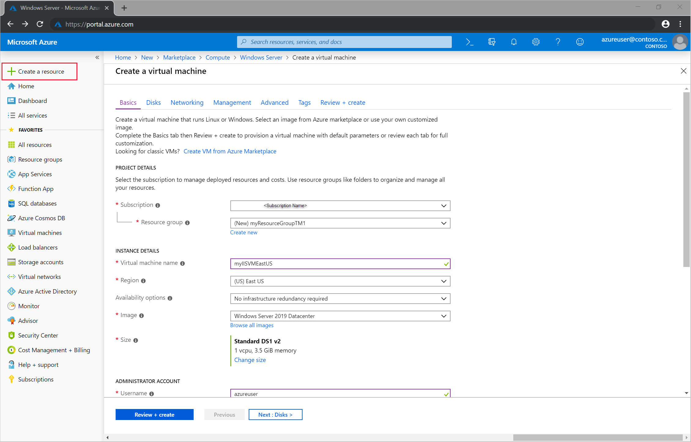
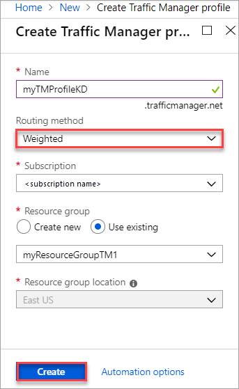
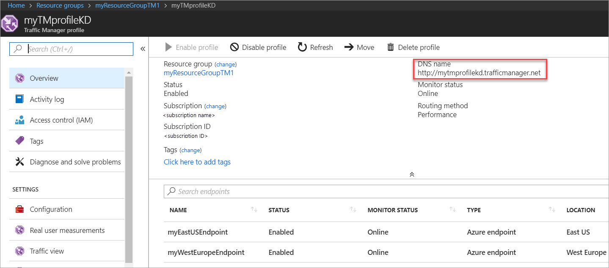

# Tutorial: Control traffic routing with weighted endpoints by using Traffic Manager

This tutorial describes how to use Azure Traffic Manager to control routing of user traffic between endpoints by using the weighted routing method. In this routing method, you assign weights to each endpoint in the Traffic Manager profile configuration. User traffic is then routed based on the weight assigned to each endpoint. The weight is an integer from 1 to 1,000. The higher the weight value assigned to an endpoint, the higher its priority.

In this tutorial, you learn how to:

> [!div class="checklist"]
> * Create two VMs running a basic website on IIS.
> * Create two test VMs to view Traffic Manager in action.
> * Configure a DNS name for the VMs running IIS.
> * Create a Traffic Manager profile.
> * Add VM endpoints to the Traffic Manager profile.
> * View Traffic Manager in action.

If you don't have an Azure subscription, create a [free account](https://azure.microsoft.com/free/?WT.mc_id=A261C142F) before you begin.

## Prerequisites

To see Traffic Manager in action, deploy the following for this tutorial:

- Two instances of basic websites running in different Azure regions: East US and West Europe.
- Two test VMs for testing Traffic Manager: one in East US and the other in West Europe. The test VMs are used to illustrate how Traffic Manager routes user traffic to a website that has higher weight assigned to its endpoint.

### Sign in to Azure

Sign in to the [Azure portal](https://portal.azure.com).

### Create websites

In this section, you create two website instances that provide the two service endpoints for the Traffic Manager profile in two Azure regions. To create the two websites, complete the following steps:

1. Create two VMs for running a basic website: one in East US, and the other in West Europe.
2. Install an IIS server on each VM. Update the default webpage that describes the VM name that a user is connected to when visiting the website.

#### Create VMs for running websites

In this section, you create two VMs (*myIISVMEastUS* and *myIISVMWestEurope*) in the East US and West Europe Azure regions.

1. On the upper, left corner of the Azure portal, select **Create a resource** > **Compute** > **Windows Server 2019 Datacenter**.
2. In **Create a virtual machine**, type or select the following values in the **Basics** tab:

   - **Subscription** > **Resource Group**: Select **Create new** and then type **myResourceGroupTM1**.
   - **Instance Details** > **Virtual machine name**: Type *myIISVMEastUS*.
   - **Instance Details** > **Region**:  Select **East US**.
   - **Administrator Account** > **Username**:  Enter a user name of your choosing.
   - **Administrator Account** > **Password**:  Enter a password of your choosing. The password must be at least 12 characters long and meet the [defined complexity requirements](../virtual-machines/windows/faq.md?toc=%2fazure%2fvirtual-network%2ftoc.json#what-are-the-password-requirements-when-creating-a-vm).
   - **Inbound Port Rules** > **Public inbound ports**: Select **Allow selected ports**.
   - **Inbound Port Rules** > **Select inbound ports**: Select **RDP** and **HTTP** in the pull down box.

3. Select the **Management** tab, or select **Next: Disks**, then **Next: Networking**, then **Next: Management**. Under **Monitoring**, set **Boot diagnostics** to **Off**.
4. Select **Review + create**.
5. Review the settings, and then click **Create**.  
6. Follow the steps to create a second VM named *myIISVMWestEurope*, with a **Resource group** name of *myResourceGroupTM2*, a **location** of *West Europe*, and all the other settings the same as *myIISVMEastUS*.
7. The VMs take a few minutes to create. Do not continue with the remaining steps until both VMs are created.



#### Install IIS and customize the default webpage

In this section, you install the IIS server on the two VMs myIISVMEastUS and myIISVMWestEurope,  and then update the default webpage. The customized webpage shows the name of the VM that you're connecting to when you visit the website from a web browser.

1. Select **All resources** on the left menu. From the resource list, select **myIISVMEastUS** in the **myResourceGroupTM1** resource group.
2. On the **Overview** page, select **Connect**. In **Connect to virtual machine**, select **Download RDP file**.
3. Open the downloaded .rdp file. If you're prompted, select **Connect**. Enter the user name and password that you specified when you created the VM. You might need to select **More choices** > **Use a different account**, to specify the credentials that you entered when you created the VM.
4. Select **OK**.
5. You might receive a certificate warning during the sign-in process. If you receive the warning, select **Yes** or **Continue** to proceed with the connection.
6. On the server desktop, browse to **Windows Administrative Tools** > **Server Manager**.
7. Open Windows PowerShell on VM1. Use the following commands to install the IIS server and update the default .htm file.

    ```powershell-interactive
    # Install IIS
    Install-WindowsFeature -name Web-Server -IncludeManagementTools
    
    # Remove default .htm file
    remove-item C:\inetpub\wwwroot\iisstart.htm
    
    #Add custom .htm file
    Add-Content -Path "C:\inetpub\wwwroot\iisstart.htm" -Value $("Hello World from " + $env:computername)
    ```

    

8. Close the RDP connection with **myIISVMEastUS**.
9. Repeat steps 1-8. Create an RDP connection with the VM **myIISVMWestEurope** within the **myResourceGroupTM2** resource group, to install IIS and customize its default webpage.

#### Configure DNS names for the VMs running IIS

Traffic Manager routes user traffic based on the DNS name of the service endpoints. In this section, you configure the DNS names for the IIS servers myIISVMEastUS and myIISVMWestEurope.

1. Select **All resources** on the left menu. From the resource list, select **myIISVMEastUS** in the **myResourceGroupTM1** resource group.
2. On the **Overview** page, under **DNS name**, select **Configure**.
3. On the **Configuration** page, under the DNS name label, add a unique name. Then select **Save**.
4. Repeat steps 1-3 for the VM named **myIISVMWestEurope** in the **myResourceGroupTM2** resource group.

### Create a test VM

In this section, you create a VM (*myVMEastUS* and *myVMWestEurope*) in each Azure region (**East US** and **West Europe**). You will use these VMs to test how Traffic Manager routes traffic to the website endpoint that has the higher weight value.

1. On the upper, left corner of the Azure portal, select **Create a resource** > **Compute** > **Windows Server 2019 Datacenter**.
2. In **Create a virtual machine**, type or select the following values in the **Basics** tab:

   - **Subscription** > **Resource Group**: Select **myResourceGroupTM1**.
   - **Instance Details** > **Virtual machine name**: Type *myVMEastUS*.
   - **Instance Details** > **Region**:  Select **East US**.
   - **Administrator Account** > **Username**:  Enter a user name of your choosing.
   - **Administrator Account** > **Password**:  Enter a password of your choosing. The password must be at least 12 characters long and meet the [defined complexity requirements](../virtual-machines/windows/faq.md?toc=%2fazure%2fvirtual-network%2ftoc.json#what-are-the-password-requirements-when-creating-a-vm).
   - **Inbound Port Rules** > **Public inbound ports**: Select **Allow selected ports**.
   - **Inbound Port Rules** > **Select inbound ports**: Select **RDP** in the pull down box.

3. Select the **Management** tab, or select **Next: Disks**, then **Next: Networking**, then **Next: Management**. Under **Monitoring**, set **Boot diagnostics** to **Off**.
4. Select **Review + create**.
5. Review the settings, and then click **Create**.  
6. Follow the steps to create a second VM named *myVMWestEurope*, with a **Resource group** name of *myResourceGroupTM2*, a **location** of *West Europe*, and all the other settings the same as *myVMEastUS*.
7. The VMs take a few minutes to create. Do not continue with the remaining steps until both VMs are created.

## Create a Traffic Manager profile

Create a Traffic Manager profile based on the **Weighted** routing method.

1. On the upper-left side of the screen, select **Create a resource** > **Networking** > **Traffic Manager profile** > **Create**.
2. In **Create Traffic Manager profile**, enter or select the following information. Accept the defaults for the other settings, and then select **Create**.

    | Setting                 | Value                                              |
    | ---                     | ---                                                |
    | Name                   | Enter a unique name within the trafficmanager.net zone. It results in the DNS name trafficmanager.net, which is used to access your Traffic Manager profile.                                   |
    | Routing method          | Select the **Weighted** routing method.                                       |
    | Subscription            | Select your subscription.                          |
    | Resource group          | Select **Use existing** and then select **myResourceGroupTM1**. |
    |        |   |

    

## Add Traffic Manager endpoints

Add the two VMs running the IIS servers myIISVMEastUS and myIISVMWestEurope, to route user traffic to them.

1. In the portal’s search bar, search for the Traffic Manager profile name that you created in the preceding section. Select the profile in the results that are displayed.
2. In **Traffic Manager profile**, in the **Settings** section, select **Endpoints** > **Add**.
3. Enter or select the following information. Accept the defaults for the other settings, and then select **OK**.

    | Setting                 | Value                                              |
    | ---                     | ---                                                |
    | Type                    | Enter the Azure endpoint.                                   |
    | Name           | Enter **myEastUSEndpoint**.                                        |
    | Target resource type           | Select **Public IP address**.                          |
    | Target resource          | Choose a public IP address to show the listing of resources with public IP addresses under the same subscription. In **Resource**, select the public IP address named **myIISVMEastUS-ip**. This is the public IP address of the IIS server VM in East US.|
    |  Weight      | Enter **100**.        |
    |        |           |

4. Repeat steps 2 and 3 to add another endpoint named **myWestEuropeEndpoint** for the public IP address **myIISVMWestEurope-ip**. This address is associated with the IIS server VM named myIISVMWestEurope. For **Weight**, enter **25**.
5. When the addition of both endpoints is complete, they're displayed in the Traffic Manager profile along with their monitoring status as **Online**.

## Test the Traffic Manager profile

To view Traffic Manager in action, complete the following steps:

1. Determine the DNS name of your Traffic Manager profile.
2. View Traffic Manager in action.

### Determine DNS name of Traffic Manager profile

In this tutorial, for simplicity, you use the DNS name of the Traffic Manager profile to visit the websites.

You can determine the DNS name of the Traffic Manager profile as follows:

1. In the portal’s search bar, search for the Traffic Manager profile name that you created in the preceding section. In the results that are displayed, select the Traffic Manager profile.
2. Select **Overview**.
3. The Traffic Manager profile displays its DNS name. In production deployments, you configure a vanity domain name to point to the Traffic Manager domain name, by using a DNS CNAME record.

   

### View Traffic Manager in action

In this section, you can see Traffic Manager in action.

1. Select **All resources** on the left menu. From the resource list, select **myVMEastUS** in the **myResourceGroupTM1** resource group.
2. On the **Overview** page, select **Connect**. In **Connect to virtual machine**, select **Download RDP file**.
3. Open the downloaded .rdp file. If you're prompted, select **Connect**. Enter the user name and password that you specified when creating the VM. You might need to select **More choices** > **Use a different account**, to specify the credentials that you entered when you created the VM.
4. Select **OK**.
5. You might receive a certificate warning during the sign-in process. If you receive the warning, select **Yes** or **Continue** to proceed with the connection.
6. In a web browser on the VM myVMEastUS, enter the DNS name of your Traffic Manager profile to view your website. You're routed to website hosted on the IIS server myIISVMEastUS because it's assigned a higher weight of **100**. The IIS server myIISVMWestEurope is assigned a lower endpoint weight value of **25**.

   

7. Repeat steps 1-6 on the VM myVMWestEurope to see the weighted website response.

## Delete the Traffic Manager profile

When you no longer need the resource groups that you created in this tutorial, you can delete them. To do so, select the resource group (**ResourceGroupTM1** or **ResourceGroupTM2**), and then select **Delete**.

## Next steps

> [!div class="nextstepaction"]
> [Route traffic to specific endpoints based on the user's geographic location](traffic-manager-configure-geographic-routing-method.md)
