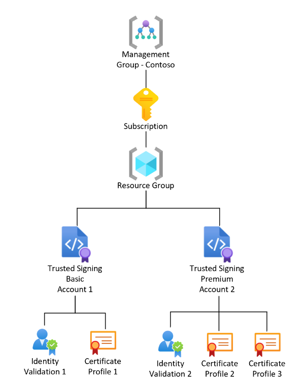

<!--Remove all the comments in this template before you sign-off or merge to the 
main branch.

This template provides the basic structure of a Concept article pattern. See the
[instructions - Concept](../level4/article-concept.md) in the pattern library.

You can provide feedback about this template at: https://aka.ms/patterns-feedback

To provide feedback on this template contact 
[the templates workgroup](mailto:templateswg@microsoft.com).

-->

<!-- 1. H1
Required. Set expectations for what the content covers, so customers know the 
content meets their needs. Should NOT begin with a verb.

-->

# Trusted Signing Resources and Roles

<!-- 2. Introductory paragraph 
Required. Lead with a light intro that describes what the article covers. Answer the 
fundamental “why would I want to know this?” question. Keep it short.

-->

Azure Code Signing is an Azure native resource with full support for common Azure concepts such as resources. As with any other Azure Resource, Azure Code signing also has its own set of resources and roles. Let’s introduce you to resources and roles specific to Azure Code Signing:

<!-- 3. H2s
Required. Give each H2 a heading that sets expectations for the content that follows. 
Follow the H2 headings with a sentence about how the section contributes to the whole.

-->

## Resource Types
Trusted Signing has the following resource types: 

* Code Signing Account – Logical container holding certificate profiles and considered the Trusted Signing resource. 
* Certificate Profile – Template with the information that is used in the issued certificates, and a subresource to a Code Signing Account resource. 

 
In the below example structure, you notice that an Azure Subscription has a resource group and under that resource group you can have one or many Code Signing Account resources with one or many Certificate Profiles. This ability to have multiple Code Signing Accounts and Certificate Profiles is useful as the service supports Public Trust, Private Trust, VBS Enclave, and Test signing. 

