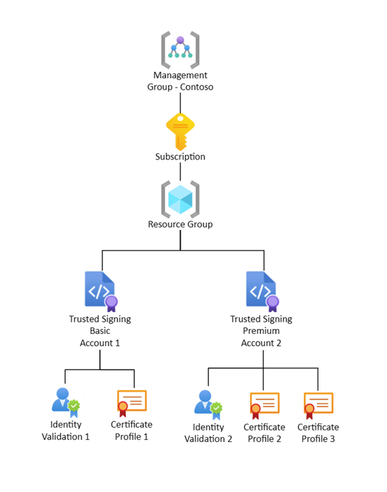

# What is Trusted Signing?
Signing is often difficult to do – from obtaining certificates, to securing them, and operationalizing a secure way to integrate with build pipelines. 

Trusted Signing (formerly Azure Code Signing) is a Microsoft fully managed end-to-end signing solution that simplifies the process and empowers 3rd party developers to easily build and distribute applications. This is part of Microsoft’s commitment to an open, inclusive, and secure ecosystem. 

## Features

* Simplifies the signing process with an intuitive experience in Azure
* Zero-touch certificate lifecycle management that is FIPS 140-2 Level 3 compliant.
* Integrations into leading developer toolsets.
* Supports Public Trust, Test, Private Trust, and CI policy signing scenarios.
* Timestamping service. 
* Content confidential signing – meaning digest signing that is fast and reliable – your file never leaves your endpoint. 

## Resource structure
Here’s a high-level overview of the service’s resource structure:

* You create a resource group within a subscription. You then create a Trusted Signing account within the resource group.
* Two resources within an account:
    *	Identity validation 
    * Certificate profile 
* Two types of accounts (depending on the SKU you choose):
    * Basic 
    * Premium

## Next steps
* [Learn more about the Trusted Signing resource structure.](concept.md)
* [Learn more about the signing integrations.](how-to-signing-integrations.md)
* [Get started with Trusted Signing.](quickstart.md) 
