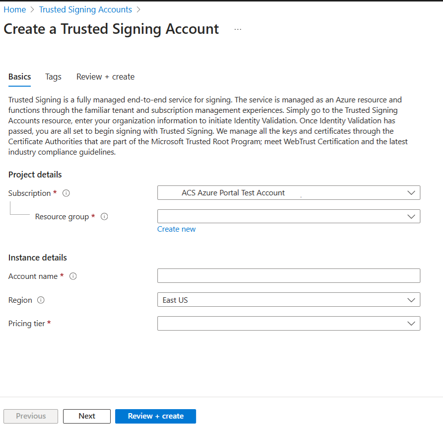

# Quickstart: Onboarding to Trusted Signing

Trusted Signing is a fully managed end to end signing service.  In this Quickstart, you create the following three Trusted Signing resources: 

- Trusted Signing account
- Identity Validation
- Certificate Profile

Trusted Signing provides users with both an Azure portal and Azure CLI extension experience to create and manage their Trusted Signing resources. **Identity Validation can only be completed in the Azure portal – it can not be completed with Azure CLI.**

## Prerequisites
An existing Azure Tenant ID and Azure subscription. [Create Azure tenant](https://learn.microsoft.com/azure/active-directory/fundamentals/create-new-tenant#create-a-new-tenant-for-your-organization) and [Create Azure subscription](https://docs.microsoft.com/azure/cost-management-billing/manage/create-subscription#create-a-subscription-in-the-azure-portal) before you begin if you don’t already have.

## Create a Trusted Signing account 
A Trusted Signing account is a logical container of identity validation and certificate profile resources. 

# [Azure portal](#tab/account-portal)

The resources must be created in Azure regions where Trusted Signing is currently available. See the table below of the current Azure regions with Trusted Signing resources: 

| Region               | Region Class Fields  | Endpoint URI Value     |
| :------------------- | :------------------- |:---------------|
| East US              | EastUS               | https://eus.codesigning.azure.net  |
| West US              |West US                | https://wus.codesigning.azure.net           |
| West Central US      | WestCentralUS                | https://wcus.codesigning.azure.net/              |
| West US 2                 |   WestUS2                   | https://wus2.codesigning.azure.net/              |
| North Europe              | NorthEurope               | https://neu.codesigning.azure.net  |
| West Europe              | WestEurope               | https://weu.codesigning.azure.net  |

1.  Sign in to the [Azure portal](https://portal.azure.com/).
2.  From either the Azure portal menu or the Home page, select **Create a resource**.
3.  In the Search box, enter **Trusted Signing account**.
4.  From the results list, select **Trusted Signing account**.
5.  On the Trusted Signing account section, select **Create**. The Create Trusted Signing account section displays. 
6.  In the **Subscription** pull-down menu, select a subscription. 
7.  In the **Resource group** field, select **Create new** and enter a resource group name.
8.  In the **Account Name** field, enter a unique account name. (See the below Certificate Profile naming constraints for naming requirements.) 
9.  In the **Region** pull-down menu, select a region.
10. In the **Pricing** tier pull-down menu, select a pricing tier.
•   Refer to Select or change Trusted Signing pricing tier link to the Pricing Tier How-To article for information about the available pricing tiers.
11. Select the **Review + Create** button. 



12. Once your Trusted Signing account has been successfully created, select **Go to resource**.  

**Trusted Signing account naming constraints**:
- Between 3-24 alphanumeric characters. 
- Begin with a letter, end with a letter or digit, and not contain consecutive hyphens.
- Globally unique.
- Case insensitive (“Abc” is the same as “abc”).

# [Az CLI](#tab/account-cli)

The resources must be created in Azure regions where Trusted Signing is currently available. See the table below of the current Azure regions with Trusted Signing resources: 

| Region               | Region Class Fields  | Endpoint URI Value     |
| :------------------- | :------------------- |:---------------|
| East US              | EastUS               | https://eus.codesigning.azure.net  |
| West US              |West US                | https://wus.codesigning.azure.net           |
| West Central US      | WestCentralUS                | https://wcus.codesigning.azure.net/              |
| West US 2                 |   WestUS2                   | https://wus2.codesigning.azure.net/              |
| North Europe              | NorthEurope               | https://neu.codesigning.azure.net  |
| West Europe              | WestEurope               | https://weu.codesigning.azure.net  |

      

Complete the following steps to create a Trusted Signing account with Azure CLI:
1.  If you're using a local installation, login to Azure CLI using the `az login` command.  

 
2.  To finish the authentication process, follow the steps displayed in your terminal. For other sign-in options, see [Sign in with the Azure CLI](https://learn.microsoft.com/en-us/cli/azure/authenticate-azure-cli).

3.  When you're prompted, install the Azure CLI extension on first use. For more information about extensions, see Use extensions with the [Azure CLI](https://learn.microsoft.com/en-us/cli/azure/azure-cli-extensions-overview).

4.   To see the versions of Azure CLI and dependent libraries that are installed, use the `az version` command. 
•   To upgrade to the latest version, use the following command:
```bash
az upgrade [--all {false, true}]
   [--allow-preview {false, true}]
    [--yes]
```
5.  To set your default subscription id, use the `az account set -s <subscriptionId>` command. 

6.  Create a resource group using the following command:
```
az group create --name MyResourceGroup --location EastUS
```
- To list accounts under the resource group, use the `az codesigning list -g MyResourceGroup` command.

7.  Create a unique Trusted Signing account using the following command. (See the below Certificate Profile naming constraints for naming requirements.) 
```
az codesigning create -n MyAccount -l eastus -g MyResourceGroup --sku Basic
```
Or 
```
az codesigning create -n MyAccount -l eastus -g MyResourceGroup --sku Premium
```
- Refer to Select or change Trusted Signing pricing tier link to the Pricing Tier How-To article for information about the available pricing tiers.

8.  Verify your Trusted Signing account using the `az codesigning show -g MyResourceGroup -n MyAccount` command.
 
**Trusted Signing account naming constraints**:
- Between 3-24 alphanumeric characters. 
- Begin with a letter, end with a letter or digit, and not contain consecutive hyphens.
- Globally unique.
- Case insensitive (“Abc” is the same as “abc”).

**Helpful commands**:
- Show help commands and detailed options:  `az codesigning -h`
- Show the details of an account: `az codesigning show -n MyAccount  -g MyResourceGroup`
- Update tags:  `az codesigning update -n MyAccount -g MyResourceGroup --tags "key1=value1 key2=value2"`

---

## Create an Identity Validation request
You can complete your own Identity Validation by filing out the request form with the information that should be included in the certificate.  Identity Validation can only be completed in the Azure portal – it can't be completed with Azure CLI.

Here are the steps to create an Identity Validation request:
1.  Navigate to your new Trusted Signing account in the Azure portal.
2.  Confirm you have the **Code Signing Identity Verifier role**. 
•   For RBAC access management, see link to RBAC and role assignment.
3.  From either the Trusted Signing account overview page or from Objects, select **Identity Validation**.
4.  Select **New Identity Validation** > Public or Private. 
    - Public identity validation is applicable to certificate profile types: Public Trust, Public Trust Test, VBS Enclave (this isn't supported yet).
    - Private identity validation is applicable to certificate profile types: Private Trust, Private Trust CI Policy.
5.  On the **New identity validation** screen, provide the following information: 
   
| Input Fields       | Details     |
| :------------------- | :------------------- |
| **Organization Name**          | For Public, enter the Legal Business Entity that the certificate will be issued to. For Private, it defaults to your Azure Tenant Name.|
| **(Private only) Organizational Unit**          | Enter the relevant information|
| **Website url**          | Enter the website that belongs to the Legal Business Entity.|
| **Primary Email**           | Enter the organization’s primary email address. A verification link is sent to this email address to verify it, ensure the email address can receive emails from external email addresses with links. The verification link expires in seven days.  |
| **Secondary Email**          | These email addresses must be different than the primary email address. For organizations, the domain must match the email address provided in primary email address field. ensure the email address can receive emails from external email addresses with links.|
| **Business Identifier**           |Enter a business identifier for the above Legal Business Entity.|
| **Seller ID**          | Only applicable to Microsoft Store customers. Find your Seller ID on Partner Center portal.|
| **Street, City, Country, State, Postal code**           | Enter the business address of the Legal Business Entity.|

6.  **Certificate subject preview**:  The preview provides a snapshot of the information displayed in the certificate.
7.  **Review and accept Trusted Signing Terms of Use**.  Terms of Use can be downloaded for review.  
8.  Select the **Create** button. 


### Important information for Public Identity Validation:

| Requirements         | Details     |
| :------------------- | :------------------- |
| Onboarding           | Trusted Signing at this time can only onboard Legal Business Entities that have verifiable tax history of three or more years. |
| Accuracy             | Ensure you provide the correct information for Public Identity Validation. Any changes or typos require you to complete a new Identity Validation request and affect the associated certificates used for signing.|
| Additional documentation            | You'll benotified though email, if we need extra documentation to process the identity validation request. The documents can be uploaded in Azure portal. The email contains information about the file size requirements. Ensure the documents provided are latest.|
| Failed email verification            | You'll be required to initiate a new Identity Validation request if email verification fails.|
| Identity Validation status            | You'll be notified through email when there is an update to the Identity Validation status. You can also check the status in the Azure portal at any time. |
| Processing time            | Expect anywhere between 1-7 business days (or sometimes longer if we need extra documentation from you) to process your Identity Validation request.|

## Create a certificate profile  
A certificate profile resource is the logical container of the certificates that will be issued to you for signing.

# [Azure portal](#tab/certificateprofile-portal)
 To create a certificate profile in the Azure portal, follow these steps:
1.  Navigate to your new trusted signing account in the Azure portal.
2.  On the trusted signing account overview page or from Objects, select **Certificate Profile**.
3.  On the **Certificate Profiles**, choose the certificate profile type from the pull-down menu. 
    - Public identity validation is applicable to Public Trust, Public Trust Test.
    - Private identity validation is applicable to Private Trust, Private Trust CI Policy.
4.  On the **Create certificate profile**, provide the following information:
•   **Certificate Profile Name**: A unique name is required. (See the below Certificate Profile naming constraints for naming requirements.) 
•   **Certificate Type**: This is autopopulated based on your selection.
•   In **Verified CN and O** pull-down menu, choose an identity validation that needs to be displayed on the certificate.
•   Include **street address**, select the box if this field must be included in the certificate.
•   Include **postal code**, select the box if this field must be included in the certificate.
•   Generated **Certificate Subject Preview** shows the preview of the certificate issued.
•   The remainder values are autopopulated based on the selection in Verified CN and O.
•   Select **Create**.


**Certificate Profile naming constraints**:
- Between 5-100 alphanumeric characters. 
- Begin with a letter, end with a letter or digit, and not contain consecutive hyphens.
- Unique within the account.
- Inherits region from the account.
- Case insensitive (“Abc” is the same as “abc”).

# [Azure CLI](#tab/certificateprofile-cli)

To create a certificate profile with Azure CLI, follow these steps:

1.  Create a certificate profile using the following command: 

```
az codesigning certificate-profile create -g MyResourceGroup --a
    account-name MyAccount -n MyProfile --profile-type PublicTrust --identity-validation-id xxxxxxxx-xxxx-xxxx-xxxx-xxxxxxxxxxxx
```
- See the below Certificate Profile naming constraints for naming requirements. 

2.  Create a certificate profile that includes optional fields (street address or postal code) in subject name of certificate using the following command:
``` 
az codesigning certificate-profile create -g MyResourceGroup --a
   account-name MyAccount -n MyProfile --profile-type PublicTrust --identity-   validation-id xxxxxxxx-xxxx-xxxx-xxxx-xxxxxxxxxxxx --include-street true
```

3.  Verify you successfully created a certificate profile by getting the Certificate Profile details using the following command: 

```
az codesigning certificate-profile show -g myRG --account-name MyAccount -n          MyProfile
```

**Certificate Profile naming constraints**:
- Between 5-100 alphanumeric characters. 
- Begin with a letter, end with a letter or digit, and not contain consecutive hyphens.
- Unique within the account.
- Inherits region from the account.
- Case insensitive (“Abc” is the same as “abc”) .

**Helpful commands**:
- Show help for sample commands and detailed parameter descriptions:   `az codesigning certificate-profile create -–help`
- List certificate profile under a Trusted Signing account:  `az codesigning certificate-profile list -g MyResourceGroup --account-name MyAccount`
- Get details of a profile:  `az codesigning certificate-profile show -g MyResourceGroup --account-name MyAccount -n MyProfile`

---

## Clean up resources

# [Azure portal](#tab/deleteresources-portal)

- Delete the Trusted Signing account:
1. Sign in to the [Azure portal](https://portal.azure.com/).
2. In the Search box, enter **Trusted Signing account**.
3. From the results list, select **Trusted Signing account**.
4. On the Trusted Signing account section, select the Trusted Signing account to be deleted.
5. Select **Delete**.

**Note**: This deletes all the certificate profiles associated to this account. This stops any signing associated to the corresponding certificate profiles.

- Delete the Certificate Profile:
1. Navigate to your trusted signing account in the Azure portal.
2. On the trusted signing account overview page or from Objects, select **Certificate Profile**.
3. On the **Certificate Profiles**, choose the certificate profile to be deleted.
4. Select **Delete**.

**Note**: This stops any signing associated to the corresponding certificate profile(s).

# [Azure CLI](#tab/adeleteresources-cli)
- Delete the Trusted Signing account:

```
az codesigning delete -n MyAccount -g MyResourceGroup
```
**Note**: This deletes all the certificate profiles associated to this account. This stops any signing associated to the corresponding certificate profiles.

- Delete the certificate profile:

 ```
az codesigning certificate-profile delete -g MyResourceGroup --account-name MyAccount -n MyProfile
```
**Note**: This stops any signing associated to the corresponding certificate profile(s).

## Next steps
In this Quickstart you created a Trusted Signing account, an Identity Validation and a Certificate Profile. To learn more about Trusted Signing and how to begin signing, refer to the articles below.
•   link to How to
•   link to Service design/business problem it address


 


 

<!-- 5. Prerequisites --------------------------------------------------------------------

Optional: Make Prerequisites the first H2 after the H1. Omit any preliminary text to the list.

Include this heading even if there aren't any prerequisites, in which case just use the text: "None"
(not bulleted). The reason for this is to maintain consistency across services, which trains readers
to always look in the same place.

When there are prerequisites, list each as *items*, not instructions to minimize the verbiage.
For example, use "Python 3.6" instead of "Install Python 3.6". If the prerequisite is something
to install, link to the applicable and specific installer or download. Selecting the item/link is then the
action to fulfill the prerequisite. Use an action word only if necessary to make the meaning clear.
Don't use links to conceptual information about a prerequisite; only use links for installers.

Do not bold items, because listing items alone fulfills that same purpose.

List prerequisites in the following order:
- An Azure account with an active subscription. [Create an account for free](https://azure.microsoft.com/free/?WT.mc_id=A261C142F).
- Language runtimes (Python, Node, .NET, etc.)
- Packages (from pip, npm, nuget, etc.)
- Tools (like VS Code IF REQUIRED. Don't include tools like pip if they're
  automatically installed with another tool or language runtime, like Python. Don't include
  optional tools like text editors--include them only if the quickstart demonstrates them.)
- Sample code
- Specialized hardware
- Other preparatory work, such as creating a VM (OK to link to another article)
- Azure keys
- Service-specific keys

The reason for placing runtimes and tools first is that it might take time to install
them, and it's best to get a user started sooner than later.

If you feel like your quickstart has a lot of prerequisites, the quickstart may be the
wrong content type - a tutorial or how-to guide may be the better option. Remember that
quickstarts should be something a reader can complete in 10 minutes or less.

-->


<!-- 6. Account sign in --------------------------------------------------------------------

Required: If you need to sign in to the portal to do the quickstart, this H2 and link are required.

-->

<!-- If signing in requires more than one step, then use this section. If it's just a single
step, include that step in the first section that requires it.

-->

<!-- 7. Open Azure Cloud Shell---------------------------------------------------------------------
If you want to refer to using the Cloud Shell, place the instructions after the
Prerequisites to keep the prerequisites as the first H2.

However, only include the Cloud Shell if ALL commands can be run in the cloud shell.

--->


<!-- 7. Task H2s ------------------------------------------------------------------------------

Required:
Quickstarts are prescriptive and guide the customer through an end-to-end procedure.
Make sure to use specific naming for setting up accounts and configuring technology.

Avoid linking off to other content - include whatever the customer needs to complete the
scenario in the article. For example, if the customer needs to set permissions, include the
permissions they need to set, and the specific settings in the quickstart procedure. Don't
send the customer to another article to read about it.

In a break from tradition, do not link to reference topics in the procedural part of the
quickstart when using cmdlets or code. Provide customers what they need to know in the quickstart
to successfully complete the quickstart.

For portal-based procedures, minimize bullets and numbering.

For the CLI or PowerShell based procedures, don't use bullets or numbering.

Be mindful of the number of H2/procedures in the Quickstart. 3-5 procedural steps are about right.
Once you've staged the article, look at the right-hand "In this article" section on the docs page;
if there are more than 8 total, consider restructuring the article.

--->


<!-- 7. Code blocks ------------------------------------------------------------------------------

Optional: Code requires specific formatting. Here are a few useful examples of
commonly used code blocks. Make sure to use the interactive functionality where
possible.
For the CLI or PowerShell based procedures, don't use bullets or numbering.

Here is an example of a code block for Java:

```java
cluster = Cluster.build(new File("src/remote.yaml")).create();
...
client = cluster.connect();
```

or a code block for Azure CLI:

```azurecli 
az vm create --resource-group myResourceGroup --name myVM --image win2016datacenter --admin-username azureuser --admin-password myPassword12
```
or a code block for Azure PowerShell:

```azurepowershell
New-AzureRmContainerGroup -ResourceGroupName myResourceGroup -Name mycontainer -Image mcr.microsoft.com/windows/servercore/iis:nanoserver -OsType Windows -IpAddressType Public
```

<!-- Use the -interactive CLI/PowerShell code fences ONLY if all such commands can be marked that way,
otherwise the reader might run some in the interactive in which case the state isn't determinate. 

--->

<!-- 8. Clean up resources ------------------------------------------------------------------------

Required: To avoid any costs associated with following the quickstart procedure, a
Clean up resources (H2) should come just before Next steps (H2)

If there is a follow-on quickstart that uses the same resources, make that option clear
so that a reader doesn't need to recreate those resources. 

-->


<!-- 9. Next steps ------------------------------------------------------------------------

Required: Quickstarts should always have a Next steps H2 that points to the next logical
quickstart in a series, or, if there are no other quickstarts, to some other
cool thing the customer can do. A single link in the blue box format should
direct the customer to the next article - and you can shorten the title in the
boxes if the original one doesn’t fit. 

Do not use a "More info section" or a "Resources section" or a "See also section". 

--->


