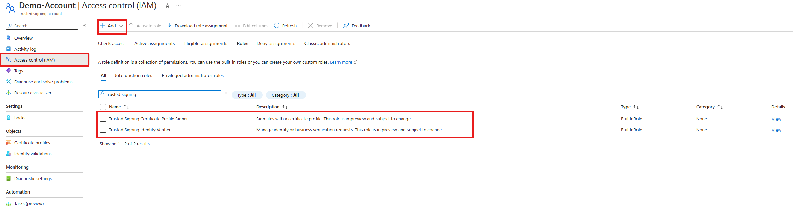

# Assigning roles in Trusted Signing

The Trusting Signing service has a few Trusted Signing specific roles (in addition to the standard Azure roles). Use [Azure role-based access control (RBAC)](https://docs.microsoft.com/azure/role-based-access-control/overview) to assign user and group roles for the Trusted Signing specific roles. In this tutorial, you review the different Trusted Signing supported roles and assign roles to your Trusted Signing account on the Azure portal. 

## Supported roles with Trusting Signing
The following table lists the roles that Trusted Signing supports, including what each role can access within the service’s resources. 

| Role | Manage/View Account  | Manage Cert Profiles  | Sign w/ Cert Profile | View Signing History  | Manage Role Assignment  | Manage Identity Validation |
|--------------|----------|------------|--------------|-----------|------------|-------------|
| Trusted Signing Identity Verifier|   | |  | |  | x|
| Trusted Signing Certificate Profile Signer |   | | x | x|  | |
| Owner |  x |x |  | | x | |
| Contributor |  x |x |  | | | |
| Reader |  x | |  | | | |
| User Access Admin | | |  | |x | |

The Identity Verified role specifically is needed to manage Identity Validation requests, which can only be done via Azure portal not AzCli. The Signer role is needed to successfully sign with Trusted Signing.

## Assign roles in Trusting Signing
Complete the following steps to assign roles in Trusted Signing.
1.	Navigate to your Trusted Signing account on the Azure portal and select the **Access Control (IAM)** tab in the left menu. 
2.	Select on the **Roles** tab and search "Trusted Signing". You can see in the screenshot below the two custom roles.

3. To assign these roles, select on the **Add** drop down and select **Add role assignment**. Follow the [Assign roles in Azure](https://docs.microsoft.com/azure/role-based-access-control/role-assignments-portal?tabs=current) guide to assign the relevant roles to your identities.

## Related content 
* [What is Azure role-based access control (RBAC)?](https://docs.microsoft.com/azure/role-based-access-control/overview)
* [Trusted Signing Quickstart](quickstart.md)
