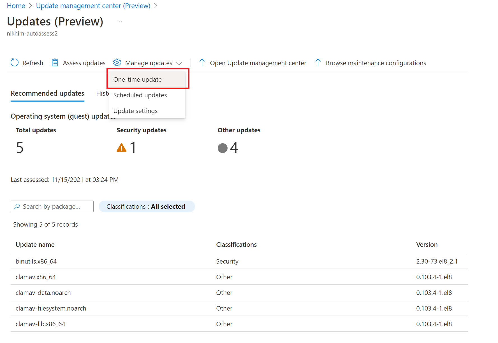
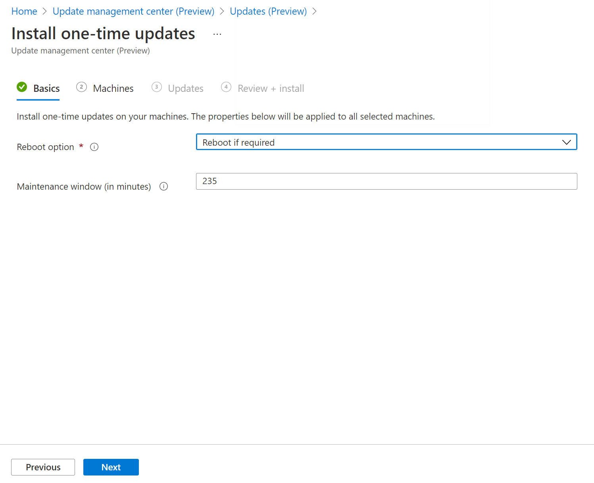
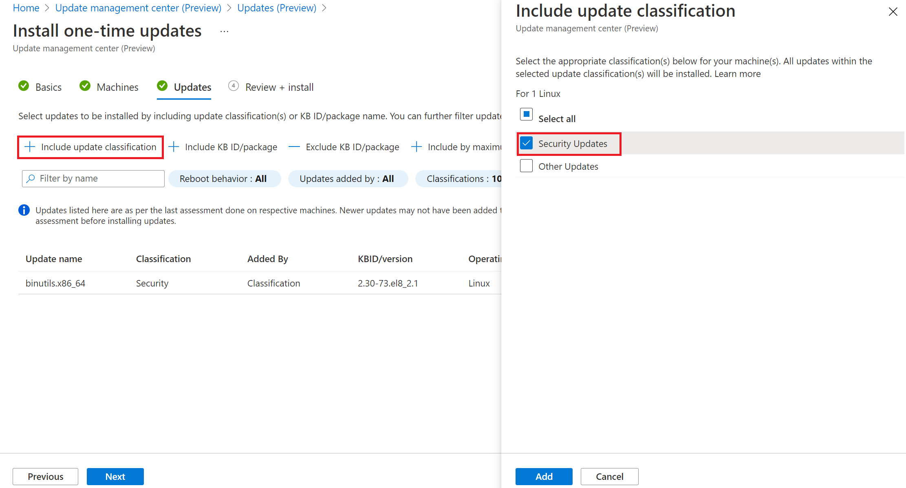
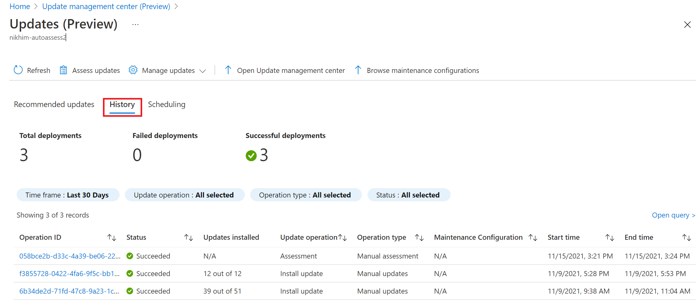
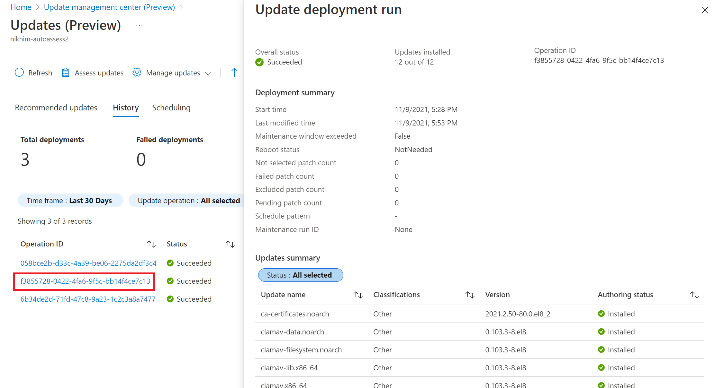

# How to deploy updates and track results

This article describes how to perform an update deployment and review the results after the deployment is complete with update management center (private preview) in Azure. You can configure an update deployment from a selected Azure virtual machine or a selected Arc-enabled server, or across [multiple machines](manage-multiple-machines.md).

## Supported Regions

In private preview, update management center (private preview) is available for use in limited regions. But will scale to all regions later in public preview stages. Listed below are the Azure public cloud where you can use update management center (private preview).

**On demand patching** on **Azure Compute virtual machines** is available in all Azure public regions where Compute virtual machines is available.

**On demand patching** on **Azure arc-enabled servers** is supported in the following regions currently. This means that VMs must be in below regions:

* Australia East
* East US
* North Europe
* South Central US
* South East Asia
* UK South
* West Central US
* West Europe
* West US2

## Sign in to the Azure portal

Sign in to the [Azure portal](https://portal.azure.com)

## Install updates

To create a new update deployment, perform the following steps.

1. The option to use update management center (private preview) is available from the left-hand option list of your Azure virtual machine or Arc-enabled server. Navigate to **Virtual Machines** and select your virtual machine from the list. You can get to update management center (private preview) from an Arc-enabled server by navigating to **Servers - Azure Arc** and select your Arc-enabled server from the list.

2. From the left menu, select **Guest + host updates**, and then select **Go to Update management center** on the **Guest + host updates** page.

3. In Update management center (private preview), select **One-time update** from the **Manage updates** dropdown

4. On the **Install one-time updates** page, specify the following:

   1. Use the **Reboot** option field to specify the way to handle reboots during deployment. The following options are available:

       * Reboot if required (default)
       * Always reboot
       * Never reboot
   
   2.  Use the **Maximum duration (in minutes)** field to specify the amount of time allowed for updates to install. Consider the following details when specifying the window:
   
       * It controls how many updates are installed.
       * New updates don't stop installing if the maintenance window limit is approaching.
       * In-progress updates aren't terminated if the maintenance window limit is exceeded. Any remaining updates to be installed are not attempted. If this is consistently happening, you should reevaluate the window.
      * If the limit is exceeded on Windows, it's often because a service pack update is taking a long time to install.

    The maximum limit supported is 235 minutes.

   3. Use the **Update classifications** region to specify update classifications for products. For each product, deselect all supported update classifications but the ones to include in your update deployment. If your deployment is meant to apply only a select set of updates, it is necessary to deselect all the pre-selected update classifications when configuring the **Inclusion/exclusion** updates option as described in the next step. This ensures only the updates you have specified to include in this deployment are installed on the target machine.

  
  4. Optionally define **inclusion or exclusion** to add or exclude selected updates from the deployment. Under the **Include/Exclude** region on the page, you enter a comma separated list of KB article ID numbers to include or exclude for Windows updates. For example,  `3103696, 3134815`. For Windows, you can refer to [MSRC link](https://msrc.microsoft.com/update-guide/deployments) to get the details of latest KBs released.
 
   For supported Linux distros, you specify a comma separated list of packages by the package name, and you can include wildcards . For example, `kernel*, glibc, libc=1.0.1`.

Based on the options specified, update management center (private preview) shows a preview of OS updates under the **Selected Updates** section.

> [!NOTE]
> Selected Updates shows a preview of OS updates which may be installed based on the last OS update assessment information available. If the OS update assessment information in Update Center Management (private preview) is old or obsolete, the actual updates installed would vary. Especially if you have chosen to install specific update category, where the OS updates applicable may vary as new packages or KB Ids may be available for the category.

  5. When you're finished configuring the deployment, select **Install**. A notification is generated to inform you the activity has started and another is created when it is completed. When its successfully completed, the installation operation results are available to view under the **Update history** tab. The status of the operation can be viewed at any time from the [Azure Activity log](/azure/azure-monitor/essentials/activity-log).  

## View update history

After your scheduled deployment starts, you can see its status on the **Update history** tab. The tiles at the top of the **Update history** tab summarize:

* The total number of deployments
* Number out of the total deployments that were successful
* Number out of the total deployments that failed

A list of the deployments created are show in the update deployment gride and include relevant information about the deployment. Every update deployment has a unique GUID, represented as **Activity ID**, which is listed along with **Status**, **Updates Installed** and **Time** details. You can filter the results listed in the grid in the following ways:

* Selecting one of the tile visualizations
* Selecting a specific time period. Options are: **Last 30 Days**, **Last 15 Days**, **Last 7 Days**, and **Last 24 hrs**. By default, deployments from the last 30 days are shown.
* Selecting a specific deployment status. Options are: **Succeeded**, **Failed**, **CompletedWithWarnings**, **InProgress**, and **NotStarted**. By default, all status types are selected.

Selecting any one of the update deployments from the list will open the **Update deployment run** page. On the **Update deployment run** page, it shows a detailed breakdown of the updates and the installation results for the Azure VM or Arc-enabled server. 

The available values are:

- **Not attempted** - The update wasn't installed because there was insufficient time available, based on the defined maintenance window duration.

- **Not selected** - The update wasn't selected for deployment.

- **Succeeded**  - The update succeeded.

- **Failed** - The update failed.

## Next steps

* To view update assessment and deployment logs generated by update management center (private preview), see [query logs](query-logs.md).
* To troubleshoot issues, see the [Troubleshoot](troubleshoot.md) update management center (private preview).
