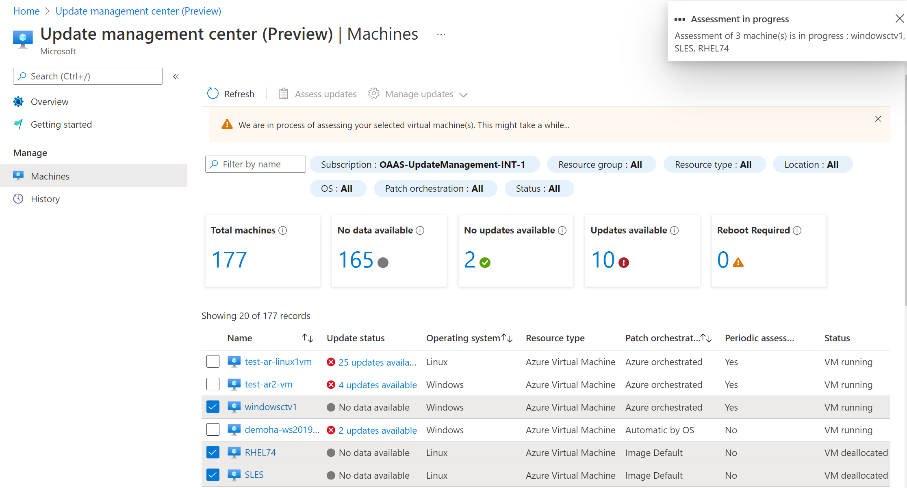
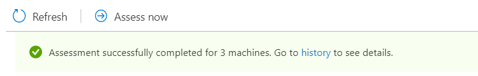
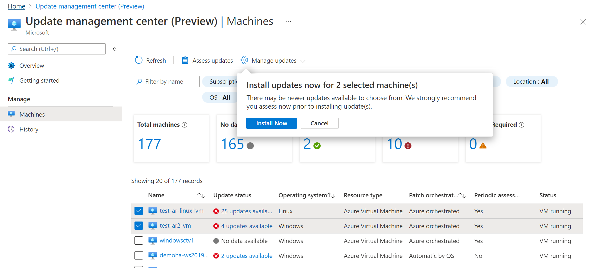
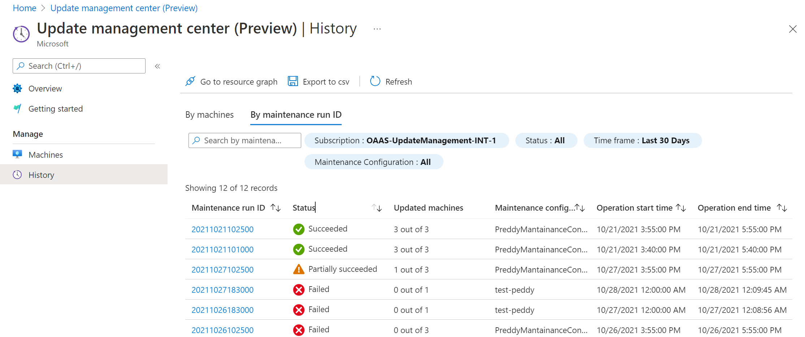
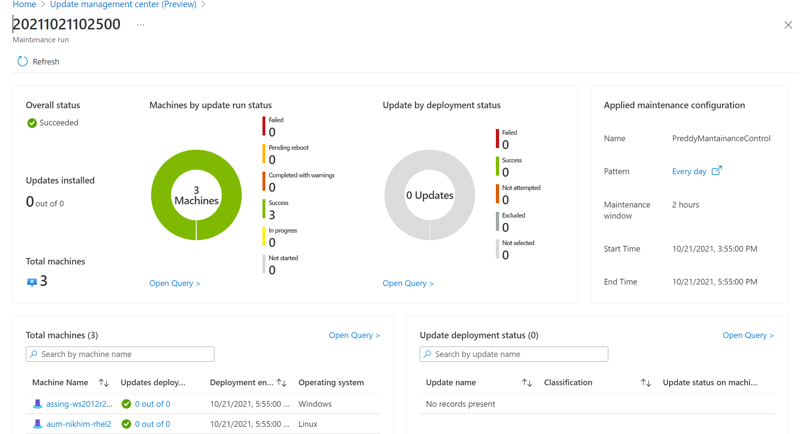

# How to manage multiple machines in update management center (private preview)

You can use update management center (private preview) in Azure to manage operating system updates for your Windows Server and Linux machines in Azure, in on-premises environments, and in other cloud environments connected using Azure Arc-enabled servers. You can quickly assess the status of available operating system updates, deploy updates now, set up recurring update deployment schedule, take a look at the number of machines managed and how, and other relevant details.

Instead of performing these actions from a selected Azure VM or Arc-enabled server, you can manage all of your machines in a subscription.

## Sign in to the Azure portal

Sign in to the [Azure portal](https://portal.azure.com)

## Summarized Update management center status 

To view update assessment across all machines, including Azure Arc-enabled servers from update management center (private preview), navigate to **Update management center**. In **Update management center**, select **Overview** from the left menu.

On the **Overview** page, the summary tiles help answer the following questions:

* **OS updates status of machines** tile informs you what the update status information for machines that were assessed and have applicable or needed updates. You can filter results based on classification types, and by default all classifications are selected. 

   This graph provides a snapshot for all your machines that you have rights to in your subscription, regardless of whether or not you have used update management center (private preview) for that machine or not. This assessment data is coming from Azure Resource Graph, which is stored for 7 days. 

   On the basis of assessment data available, machines are classified into the following categories:

   * **No pending updates** - Based on the latest assessment performed, no updates are pending for these machines and these machines are up-to-date.
   * **With pending updates** - Based on the latest assessment performed, updates are pending for these machines and these machines are not up-to-date.
   * **With pending reboot** - These machines are pending a reboot in order for the updates to take effect.
   * **No data available** - No assessment data is available for these machines. There could be multiple reasons for no assessment data such as: no assessment has been done over the last 7 days, machine has an unsupported OS, or the machine is in an unsupported region and an assessment cannot be performed.

* **Azure Virtual Machines by OS update configuration** represents all of the Azure or Arc-enabled machines inventoried in the subscription, summarize by each update orchestration method. Values are:

   * **Azure Orchestrated** - This mode enables automatic VM guest patching for the Azure virtual machine and Arc-enabled server. Subsequent patch installation is orchestrated by Azure. 
   * **Image Default** - For Linux machines, its default patching configuration is used.
   * **OS Orchestrated** - The machine is automatically updated by the OS.
   * **Manual Updates** - You control the application of patches to a machine by applying patches manually inside the machine. In this mode for the Windows OS, automatic updates is disabled.

   More information about each orchestration method is available in the [automatic VM guest patching](/azure/virtual-machines/automatic-vm-guest-patching#patch-orchestration-modes) article. 

* **OS update management run status** tile shows how many update deployments failed and successfully completed by time range selected. By default, the tile shows the last 30 days. Using the **Time** picker, you can select a different preset range.

Narrow the results in the tiles by using filters to focus on a subset of your resources. The selectors above the tiles return subscriptions, resource groups, resource types (that is, Azure VMs and Arc-enabled servers), regions, and OS type (that is Windows or Linux) based on the Azure role-based access rights you've been granted. You can combine filters to scope to a specific resource. Clicking on any one of the tiles opens the **Machines** page.

Clicking on the **OS updates status of machines** and **Azure Virtual Machines by OS update configuration** directs you to the **Machines** page. Clicking on the **OS update management run status**, directs you to the **History** page. 

## Summarized machine status

Update management center (private preview) in Azure enables you to browse information about your Azure VMs and Arc-enabled servers across your Azure subscriptions relevant to update management center (private preview). This section shows you how to filter information to better understand the update status of your machine resources, and for multiple machines, initiate an update assessment, update deployment, and manage their update settings. In Update Center, select **Machines** from the left menu.

On the page, the table lists all of the machines in the specified subscription, and for each machine it helps you understand the following:

* Based on the latest assessment, the total number of updates available identified as applicable to the machine's OS.
* The operating system running on the machine.
* The machine is either hosted in Azure or is a hybrid machine managed by Arc-enabled servers.
* Under the column **Update configuration**, the machine's patch mode. Values are:

   * **AutomaticByOS** - The machine is automatically updated by the OS.
   * **AutomaticByPlatform** - The Azure VM is automatically updated by the platform. The VM is set to [automatic VM guest patching](/azure/virtual-machines/automatic-vm-guest-patching), and for an Azure virtual machine scale set, it is set to [automatic OS image upgrade](/azure/virtual-machine-scale-sets/virtual-machine-scale-sets-automatic-upgrade).
   * **ImageDefault** - For Linux machines, its default patching configuration is used.
   * **Manual** - You control the application of patches to a machine by applying patches manually inside the machine. In this mode for the Windows OS, automatic updates is disabled.

* The machine's status. For an Azure VM, it shows it's [power state](/azure/virtual-machines/states-billing#power-states-and-billing), and for an Arc-enabled server, it shows if it is connected or not. 

Narrow the results in the grid by using filters to focus on a subset of your resources. The selectors above the tiles return subscriptions, resource groups, resource types (that is, Azure VMs and Arc-enabled servers), regions, etc. and are based on the Azure role-based access rights you've been granted. You can combine filters to scope to a specific resource.

Summary tiles at the top of the page summarize how many machines have been assessed and what their update status is. 

To manage the machine's update settings, see the following article [Manage update configuration settings](manage-update-settings.md).

### Assess now

For machines that have not had a compliance assessment scan for the first time, you can select one or more of them from the list and then select the **Assess now** option. You will receive status messages as the configuration is performed.

If it's an initial compliance assessment, the Update management center virtual machine extension is initiated and then the scan is performed. Otherwise, a compliance scan is initiated, and then the results are forwarded and stored in Azure Resource Graph. This process takes several minutes. When the assessment is completed, a banner on the page informs you it is complete.

Selecting a machine from the list opens update management center (private preview) scoped to that machine, and from here you can view its detailed assessment status, update history, configure its patch orchestration options, and initiate an update deployment. 

### Deploy updates now

For assessed machines that are reporting updates available, you can select one or more of the machines from the list and initiate an update deployment that starts immediately by selecting **Manage updates > One-time updates**. 

You are prompted to confirm for the machines selected, that you want to proceed with installing updates on them. Review the information and then select **Install Now** to proceed. Complete the following steps in the **Install one-time updates
** wizard to configure your update deployment.

1. On the **Basics** page, select the **Reboot option** and **Maximum duration (in minutes)** and then select **Next**.
1. On the **Machines** page, verify the machines selected are listed. You can add or remove machines from the list. Select **Next** to continue.
1. On the **Updates** page, specify the updates to include in the deployment by specifying:

   * Update classification(s)
   * Include updates by specific KB IDs or package names. For Windows, you can refer to [MSRC link](https://msrc.microsoft.com/update-guide/deployments) to get the details of latest KBs released.
   * Exclude updates by specific KB IDs or package names you don’t want to get installed as part of this process. Updates not shown in the list could be installed based on the time between last assessment and release of newer updates since then that are available for the selected machines. You can chose to exclude Windows updates that require a reboot by selecting the option ** Exclude KBs requiring reboot for Windows server**.
   
      

   * For Windows-based updates, you can specify the publishing date. Any KB ID/updates published after the specified date are included as a part of install process.

1. After selecting your update classification criteria, verify the list updates to reflect your criteria. Select **Next** to continue with your selection.
1. On the **Review + install** page, verify your update deployment options and then select **Review+install**. 

A notification is generated to inform you the activity has started and another is created when it is completed. When it's successfully completed, the installation operation results are available to view from either the **Update history** tab, when you select the machine from the **Machines** page, or on the **History** page, which you are redirected to automatically after initiating the update deployment. The status of the operation can be viewed at any time from the [Azure Activity log](/azure/azure-monitor/essentials/activity-log).

### Set up a recurring update deployment

You can create a recurring update deployment by selecting some machines and selecting **Manage updates > Scheduled updates**. This opens up the [Create new maintenance configuration](scheduled-patching.md) flow.

## Update deployment history

Update management center (private preview) enables you to browse information about your Azure VMs and Arc-enabled servers across your Azure subscriptions relevant to Update management center (private preview). You can filter information to better understand the update assessment and deployment history for multiple machines. In Update management center (private preview), select **History** from the left menu.

## Update deployment history by machines

From here, you can see a summarized status of update and assessment actions performed against your Azure VMs and Arc-enabled servers. You can also drill into a machine to view update-related details and manage it directly, review the detailed update or assessment history for the machine, and other related details in the table. 

The **Status** field reports if an assessment or update deployment is **Failed**, **Successful**, or **InProgress** to indicate the action is underway. The **Update Center** field reports if the action performed was an **Assessment** or **Install Updates**. The **Operation type** field reports today that the assessment and deployment were manually initiated. 

## Update deployment history by maintenance run ID
Within the history page, select **By maintenance run ID** tab to view history of the maintenance run schedules. Each record shows the maintenance run ID, Status, Updated machines, Operation Start and End times. 

When you click on any one maintenance run ID records, you can view an expanded status of the maintenance run. It contains information from both machines point of view as well as from updates point of view. It includes how many machines got updated, along with the status of each of the machines in form of a pie chart. It also shows how many updates got installed along with the status of the updates in form of pie chart. At the bottom, it contains list view of both machines and updates which were a part of this maintenance run.

### Resource Graph

The update assessment and deployment data is available for query in Azure Resource Graph. You can apply this data to scenarios that include security compliance, security operations, and troubleshooting. Selecting the option **Go to resource graph** takes you to Resource Graph Explorer, which enables running Resource Graph queries directly in the Azure portal. Resource Graph supports Azure CLI, Azure PowerShell, Azure SDK for Python, and more. For more information, see [First query with Azure Resource Graph Explorer](/azure/governance/resource-graph/first-query-portal).

When Resource Graph Explorer opens, it is automatically populated with the same query used to generate the results presented in the table on the **History** page in update management center (private preview). Before going any further, you should review the [query Update logs](query-logs.md) article to learn about the log records and their properties, and the sample queries included. 

## Next steps

* To set up and manage recurring deployment schedules, see [Schedule recurring updates](scheduled-patching.md)
* To view update assessment and deployment logs generated by update management center (private preview), see [query logs](query-logs.md).
* To troubleshoot issues, see the [Troubleshoot](troubleshoot.md) update management center (private preview).
