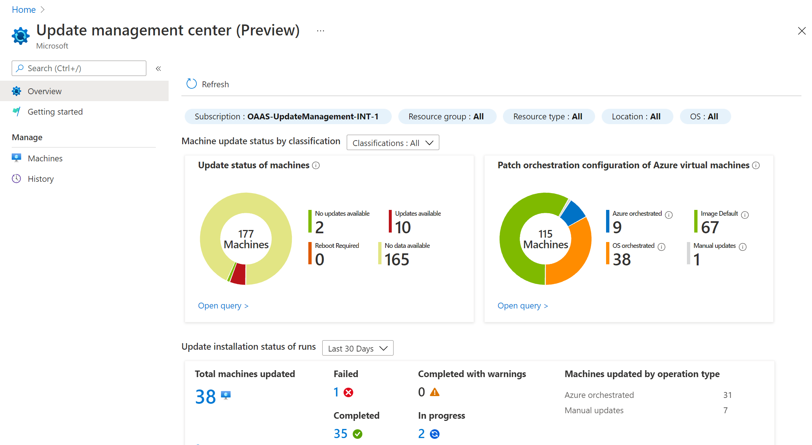
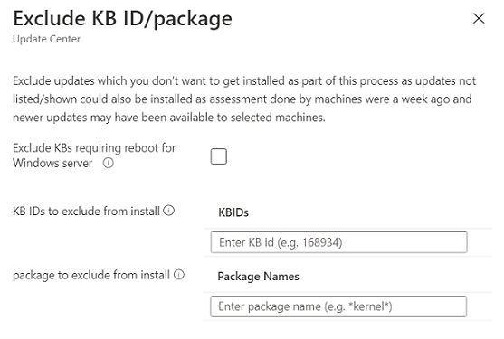

# Manage multiple machines with update management center (Preview)

**Applies to:** :heavy_check_mark: Windows VMs :heavy_check_mark: Linux VMs :heavy_check_mark: On-premises environment :heavy_check_mark: Azure Arc-enabled servers.

This article describes the various features that update management center (Preview) offers to manage the system updates on your machines. Using the update management center (Preview), you can:

- Quickly assess the status of available operating system updates.
- Deploy updates.
- Set up recurring update deployment schedule.
- Get insights on number of machines managed.
- Information on how they're managed, and other relevant details. 

Instead of performing these actions from a selected Azure VM or Arc-enabled server, you can manage all your machines in Azure subscription.

## View update management center (Preview) status 

1. Sign in to the [Azure portal](https://portal.azure.com)

1. To view update assessment across all machines, including Azure Arc-enabled servers  navigate to **Update management center(Preview)**.

   

   In the **Overview** page - the summary tiles show the following status:

   - **Filters**—use filters to focus on a subset of your resources. The selectors above the tiles return **Subscription**, **Resource group**, **Resource type** (Azure VMs and Arc-enabled servers) **Location**, and **OS** type (Windows or Linux) based on the Azure role-based access rights you've been granted. You can combine filters to scope to a specific resource. 

   - **Update status of machines**—shows the update status information for assessed machines that had applicable or needed updates. You can filter the results based on classification types. By default, all [classifications](/azure/automation/update-management/overview#update-classifications) are selected and as per the classification selection, the tile is updated.

      The graph provides a snapshot for all your machines in your subscription, regardless of whether or not you have used update management center (Preview) for that machine. This assessment data comes from Azure Resource Graph, and it stores the data for seven days. 

      From the assessment data available, machines are classified into the following categories:

      - **No updates available**—no updates are pending for these machines and these machines are up to date.
      -  **Updates available**—updates are pending for these machines and these machines aren't up to date.
      - **Reboot Required**—pending a reboot for the updates to take effect.
      - **No updates data**—no assessment data is available for these machines. 
   
      There could be the following reasons for no assessment data:
      - No assessment has been done over the last seven days
      - Machine has an unsupported OS
      - Machine is in an unsupported region and you can't perform an assessment.

   - **Patch orchestration configuration of Azure virtual machines** — all the Azure or Arc-enabled machines inventoried in the subscription are summarized by each update orchestration method. Values are: 

      - **Azure orchestrated**—this mode enables automatic VM guest patching for the Azure virtual machine and Arc-enabled server. Subsequent patch installation is orchestrated by Azure. 
      - **Image Default**—for Linux machines, it uses the default patching configuration.
      - **OS orchestrated**—the OS automatically updates the machine.
      - **Manual updates**—you control the application of patches to a machine by applying patches manually inside the machine. In this mode for the Windows OS, automatic updates are disabled.

   For more information about each orchestration method see, [automatic VM guest patching for Azure VMs](/azure/virtual-machines/automatic-vm-guest-patching#patch-orchestration-modes). 

   - **Update installation status**—by default, the tile shows the status for last 30 days. Using the **Time** picker, you can choose a different range. The values are:
      - **Failed**—is when one or more updates in the deployment have failed.
      - **Completed**—is when the deployment ends successfully by the time range selected. 
      - **Completed with warnings**—is when the deployment is completed successfully but had warnings.
      - **In progress**—is when the deployment is currently running.

- Select the **Update status of machines** or **Patch orchestration configuration of Azure Virtual machines** to go to **Machines** page. 
- Select the **Update installation status**, to go to **History** page. 

## Summary of machine status

Update management center (Preview) in Azure enables you to browse information about your Azure VMs and Arc-enabled servers across your Azure subscriptions relevant to update management center (Preview). The section shows how you can filter information to understand the update status of your machine resources, and for multiple machines, initiate an update assessment, update deployment, and manage their update settings. 

 In update management center (Preview) page, select **Machines** from the left menu.

   :::image type="content" source="./media/manage-multiple-machines/update-center-machines-page-inline.png" alt-text="Update management center Machines page in the Azure portal." lightbox="./media/manage-multiple-machines/update-center-machines-page-expanded.png":::

   On the page, the table lists all the machines in the specified subscription, and for each machine it helps you understand the following details that show up based on the latest assessment.
   - **Name**
   - **Update status**—the total number of updates available identified as applicable to the machine's OS.
   - **Operating system**—the operating system running on the machine.
   - **Resource type**—the machine is either hosted in Azure or is a hybrid machine managed by Arc-enabled servers.
   - **Patch orchestration**—
   - **Periodic assessment**—
   - **Maintenance configuration**— 
    - **Status**—

The column **Patch Orchestration**, the machine's patch mode. Values are:

   * **Automatic by OS**—the machine is automatically updated by the OS.
   * **Azure orchestrated**—for a group of virtual machines undergoing an update, the Azure platform will orchestrate updates. The VM is set to [automatic VM guest patching](/azure/virtual-machines/automatic-vm-guest-patching), and for an Azure virtual machine scale set, it's set to [automatic OS image upgrade](/azure/virtual-machine-scale-sets/virtual-machine-scale-sets-automatic-upgrade).
   * **Image Default**—for Linux machines, its default patching configuration is used.
   * **Manual**—you control the application of patches to a machine by applying patches manually inside the machine. In this mode for the Windows OS, automatic updates is disabled.

The machine's status—for an Azure VM, it shows it's [power state](/azure/virtual-machines/states-billing#power-states-and-billing), and for an Arc-enabled server, it shows if it's connected or not. 

Use filters to focus on a subset of your resources. The selectors above the tiles return subscriptions, resource groups, resource types (that is, Azure VMs and Arc-enabled servers), regions, etc. and are based on the Azure role-based access rights you've been granted. You can combine filters to scope to a specific resource.

The summary tiles at the top of the page summarize the number of machines that have been assessed and their update status. 

To manage the machine's update settings, see [Manage update configuration settings](manage-update-settings.md).

### Check for updates

For machines that haven't had a compliance assessment scan for the first time, you can select one or more of them from the list and then select the **Check for updates**. You'll receive status messages as the configuration is performed.

   :::image type="content" source="./media/manage-multiple-machines/update-center-assess-now-multi-selection-inline.png" alt-text="Initiating a scan assessment for selected machines with the check for updates option." lightbox="./media/manage-multiple-machines/update-center-assess-now-multi-selection-expanded.png":::

  Otherwise, a compliance scan is initiated, and then the results are forwarded and stored in **Azure Resource Graph**. This process takes several minutes. When the assessment is completed, a confirmation message appears on the page.

   :::image type="content" source="./media/manage-multiple-machines/update-center-assess-now-complete-banner-inline.png" alt-text="Assessment banner on Manage Machines page example." lightbox="./media/manage-multiple-machines/update-center-assess-now-complete-banner-expanded.png":::   

Select a machine from the list to open update management center (Preview) scoped to that machine. Here, you can view its detailed assessment status, update history, configure its patch orchestration options, and initiate an update deployment. 

### Deploy the updates

For assessed machines that are reporting updates available, select one or more of the machines from the list and initiate an update deployment that starts immediately. Select the machine and go to **One-time update**. 

   :::image type="content" source="./media/manage-multiple-machines/update-center-install-updates-now-multi-selection-inline.png" alt-text="Install one time updates for machine(s) on updates preview page example." lightbox="./media/manage-multiple-machines/update-center-install-updates-now-multi-selection-expanded.png":::
   
 
For the selected machine(s), if you want to proceed with installing updates on them. Review the information and then select **One-time update** to proceed. Complete the following steps in the **Install one-time updates** wizard to configure your update deployment.

1. In the **Machines**, verify the machines selected are listed. You can add or remove machines from the list. Select **Next** to continue.
1. In the **Updates**, specify the updates to include in the deployment by specifying:

   * Include Update classification
   * Include KB ID/package—for Windows, you can refer to [MSRC](https://msrc.microsoft.com/update-guide/deployments) to get the details of latest KBs released.
   * Exclude KB ID/package—you don’t want to get installed as part of this process. Updates not shown in the list could be installed based on the time between last assessment and release of newer updates since then that are available for the selected machines. You can choose to exclude Windows updates that require a reboot by selecting the option **Exclude KBs requiring reboot for Windows server**.
   
      
   * Include by maximum patch publish date

   For Windows-based updates, you can specify the publishing date. Any KB ID/updates published after the specified date are included as a part of install process.

1. After selecting your update classification criteria, verify the list updates to reflect your criteria. Select **Next** to continue with your selection.
1. In **Properties** page, select the **Reboot option** and enter the duration in **Maintenance window (in minutes)**.
1. In the **Review + install** page, verify your update deployment options and then select **Install**. 

A notification appears to confirm that an activity has started and another is created when it's completed. When it's successfully completed, the installation operation results are available to view from either the **Update history** tab, when you select the machine from the **Machines** page, or on the **History** page, which you're redirected to automatically after initiating the update deployment. The status of the operation can be viewed at any time from the [Azure Activity log](/azure/azure-monitor/essentials/activity-log).

### Set up a recurring update deployment

You can create a recurring update deployment for your machines. Select your machine and select **Scheduled updates**. This opens [Create new maintenance configuration](scheduled-patching.md) flow.

## Update deployment history

Update management center (Preview) enables you to browse information about your Azure VMs and Arc-enabled servers across your Azure subscriptions relevant to Update management center (Preview). You can filter information to understand the update assessment and deployment history for multiple machines. In Update management center (Preview), select **History** from the left menu.

## Update deployment history by machines

:::image type="content" source="./media/manage-multiple-machines/update-center-history-page-inline.png" alt-text="Update Center History page in the Azure portal." lightbox="./media/manage-multiple-machines/update-center-history-page-expanded.png":::

Provides a summarized status of update and assessment actions performed against your Azure VMs and Arc-enabled servers. You can also drill into a machine specific to view update-related details and manage it directly, review the detailed update or assessment history for the machine, and other related details in the table. 

   - **Machine Name**
   - **Status**—reports if an assessment or update deployment is **Failed**, **Successful**, or **InProgress** to indicate the action is underway.
   - **Update installed**
   - **Update operation**—reports if the action performed is an **Assessment** or **Install Updates**. 
   - **Operation type**—reports that the assessment and deployment were manually initiated. 
   - **Operation start time**
   - **Resource Type**
   - **Tags**
   - **Last assessed time**

## Update deployment history by maintenance run ID
Within the history page, select **By maintenance run ID** to view history of the maintenance run schedules. Each record shows 
- Maintenance run ID
- Status
- Updated machines
- Operation start time
- Operation end time 

   :::image type="content" source="./media/manage-multiple-machines/update-center-history-by-maintenance-run-id-inline.png" alt-text="Update Center History page by maintenance run ID in the Azure portal." lightbox="./media/manage-multiple-machines/update-center-history-by-maintenance-run-id-expanded.png":::

When you select any one maintenance run ID records, you can view an expanded status of the maintenance run. It contains information about machines and updates. It includes the number of machines that were updated and updates installed on them, along with the status of each of the machines in form of a pie chart. At the end of the page, it contains list view of both machines and updates that were a part of this maintenance run.

   :::image type="content" source="./media/manage-multiple-machines/update-center-maintenance-run-record-inline.png" alt-text="Maintenance run ID record." lightbox="./media/manage-multiple-machines/update-center-maintenance-run-record-expanded.png":::

### Resource Graph

The update assessment and deployment data are available for query in Azure Resource Graph. You can apply this data to scenarios that include security compliance, security operations, and troubleshooting. Select **Go to resource graph** to go to Azure Resource Graph Explorer. It enables running Resource Graph queries directly in the Azure portal. Resource Graph supports Azure CLI, Azure PowerShell, Azure SDK for Python, and more. For more information, see [First query with Azure Resource Graph Explorer](/azure/governance/resource-graph/first-query-portal).

When Resource Graph Explorer opens, it automatically populates with the same query used to generate the results presented in the table on the **History** page in Update management center (Preview). Ensure that you review the [query Update logs](query-logs.md) article to learn about the log records and their properties, and the sample queries included. 

## Next steps

* To set up and manage recurring deployment schedules, see [Schedule recurring updates](scheduled-patching.md)
* To view update assessment and deployment logs generated by update management center (preview), see [query logs](query-logs.md).
