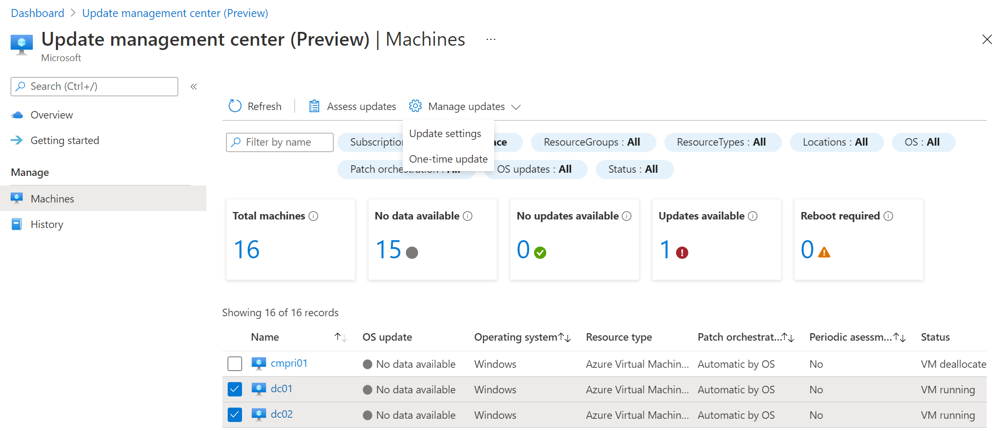
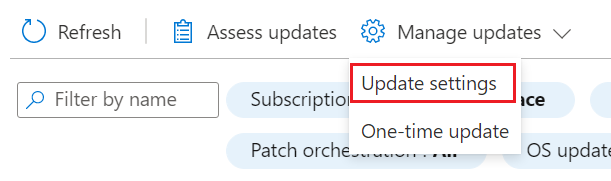
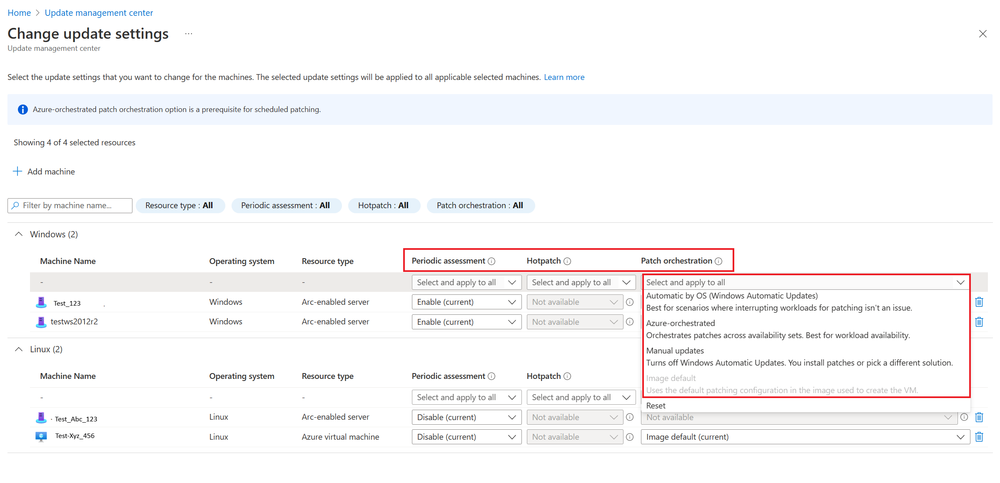
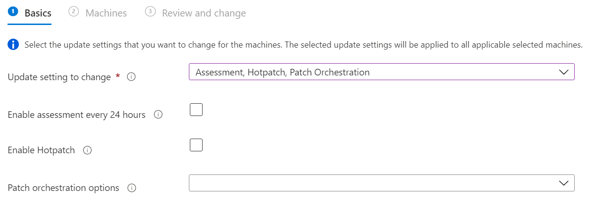

# Manage update configuration settings

This article describes how to configure update settings in update management center (private preview) in Azure for Windows and Linux machines running on Azure or outside of Azure connected to Azure Arc-enabled servers. 

From update management center (private preview) in Azure, you can control the update settings on your Azure VMs and Arc-enabled servers for one or more machines.

The following update settings are available for configuration for the selected machine(s):

* For Azure VMs, you can enable [hotpatching](https://docs.microsoft.com/azure/automanage/automanage-hotpatch) on supported Windows Server Azure Edition virtual machines (VMs) that doesn’t require a reboot after installation. You can use update management center (private preview) to install patches with other patch classifications or to schedule patch installation when you require immediate critical patch deployment.

* **Patch orchestration** option provides the following:
    * **Automatic by operating system** - When the workload running on the VM doesn't have to meet availability targets, operating system updates are automatically downloaded and installed. Machines are rebooted as needed.
    * **Azure-orchestrated (private preview)** - Available *Critical* and *Security* patches are downloaded and applied automatically on the Azure VM using [automatic VM guest patching](https://docs.microsoft.com/azure/virtual-machines/automatic-vm-guest-patching). This process kicks off automatically every month when new patches are released. Patch assessment and installation are automatic, and the process includes rebooting the VM as required.
    * **Manual updates** - Configures the Windows Update agent setting [Configure Automatic Updates](https://docs.microsoft.com/windows-server/administration/windows-server-update-services/deploy/4-configure-group-policy-settings-for-automatic-updates#configure-automatic-updates).
	* **Image Default** - Only supported for Linux Virtual Machines, this mode honors the default patching configuration in the image used to create the VM.

* Enable periodic **Assessment** to run every 24 hours.

## Configure settings

Perform the following steps to configure update settings on your machines.

1. Sign in to the [Azure portal](https://portal.azure.com).
1. Navigate to **Update management center**. In **Update management center**, select **Machines** from the left menu.
1. Select one or more machines from the list, and then select the **Manage updates > Update settings** option.

    

1. When prompted to confirm, select **Update settings** to continue.
1. On the **Basics** page, from the **Update settings to change** drop-down list, select one or more options based on what you want to configure. 

    

1. Based on the update setting(s) you selected, make your changes on the page and then select **Next** to continue.

    

1. On the **Machines** page, verify the machines selected are listed. You can add or remove machines from the list. Select **Next** to continue.
1. On the **Review + install** page, verify your update deployment options and then select **Review+install**.

A notification is generated to inform you the activity has started and another is created when it is completed. When it's successfully completed.

## Next steps

* [View assessment compliance](view-updates.md) and [deploy updates](deploy-updates.md) for a selected Azure VM or Arc-enabled server, or across [multiple machines](manage-multiple-machines.md) in your subscription in the Azure portal.
* To view update assessment and deployment logs generated by update management center (private preview), see [query logs](query-logs.md).
* To troubleshoot issues, see the [Troubleshoot](troubleshoot.md) update management center (private preview).