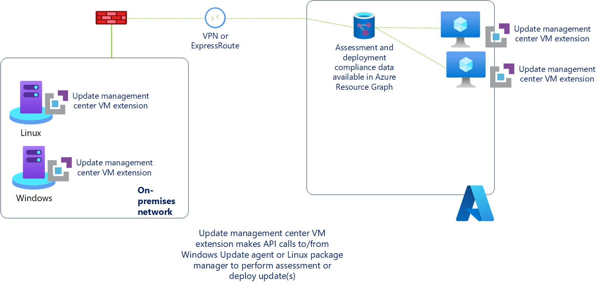

# About Update management center (preview)

Update management center (preview) is a unified service to help manage and govern updates for all your machines. You can monitor Windows and Linux update compliance across your deployments in Azure, on-premises, and on the other cloud platforms from a single dashboard. In addition, you can use the Update management center (preview) to make real-time updates or schedule them within a defined maintenance window.

You can use the update management center (preview) in Azure to:

- Oversee update compliance for your entire fleet of machines in Azure, on- premises, and other cloud environments.
- Instantly deploy critical updates to help secure your machines.
- Leverage flexible patching options such as [automatic VM guest patching](../virtual-machines/automatic-vm-guest-patching.md) in Azure, [hot patching](../automanage/automanage-hotpatch.md), and customer-defined maintenance schedules. 

We also offer other capabilities to help you manage updates for your Azure Virtual Machines (VM) that you should consider as part of your overall update management strategy. Review the Azure VM [Update options](../virtual-machines/updates-maintenance-overview.md) to learn more about the options available.

Before you enable your machines for update management center (preview), make sure that you understand the information in the following sections.

> [!IMPORTANT]
> - Update management center (preview) doesn’t store any customer data.
> - Update management center (preview) can manage machines that are currently managed by Azure Automation [Update management](../automation/update-management/overview.md) feature without interrupting your update management process. However, we don't recommend migrating from Automation Update Management since this preview gives you a chance to evaluate and provide feedback on features before it's generally available (GA). 
> - While update management center is in **preview**, the [Supplemental Terms of Use for Microsoft Azure Previews](https://azure.microsoft.com/support/legal/preview-supplemental-terms/) include additional legal terms that apply to Azure features that are in beta, preview, or otherwise not yet released into general availability.

## Key benefits

Update management center (preview) has been redesigned and doesn't depend on Azure Automation or Azure Monitor Logs, as required by the [Azure Automation Update Management feature](../automation/update-management/overview.md). Update management center (preview) offers many new features and provides enhanced functionality over the original version available with Azure Automation and some of those benefits are listed below:

- Provides native experience with zero on-boarding.
    - Built as native functionality on Azure Compute and Azure Arc for Servers platform for ease of use.
    - No dependency on Log Analytics and Azure Automation.
    - Azure policy support.
    - Global availability in all Azure Compute and Azure Arc regions.
- Works with Azure roles and identity.
    - Granular access control at per resource level instead of access control at Automation account and Log Analytics workspace level.
    - Update management center now as Azure Resource Manager based operations. It allows RBAC and roles based of ARM in Azure.
- Enhanced flexibility
    - Ability to take immediate action either by installing updates immediately or schedule them for a later date.
    - Check updates automatically or on demand.
    - Helps secure machines with new ways of patching such as [automatic VM guest patching](../virtual-machines/automatic-vm-guest-patching.md) in Azure, [hotpatching](../automanage/automanage-hotpatch.md) or custom maintenance schedules.
    - Sync patch cycles in relation to patch Tuesday—the unofficial term for Microsoft's scheduled security fix release on every second Tuesday of each month.

The following diagram illustrates how update management center (preview) assesses and applies updates to all Azure machines and Arc-enabled servers for both Windows and Linux.

To support management of your Azure VM or non-Azure machine, update management center (preview) relies on a new [Azure extension](../virtual-machines/extensions/overview.md) designed to provide all the functionality required to interact with the operating system to manage the assessment and application of updates. This extension is automatically installed when you initiate any update management center operations such as **check for updates**, **install one time update**, **periodic assessment** on your machine. The extension supports deployment to Azure VMs or Arc-enabled servers using the extension framework. The update management center (preview) extension is installed and managed using the following:

- [Azure virtual machine Windows agent](../virtual-machines/extensions/agent-windows.md) or [Azure virtual machine Linux agent](../virtual-machines/extensions/agent-linux.md) for Azure VMs.
- [Azure arc-enabled servers agent](../azure-arc/servers/agent-overview.md) for non-Azure Linux and Windows machines or physical servers.

 The extension agent installation and configuration are managed by the update management center (preview). There's no manual intervention required as long as the Azure VM agent or Azure Arc-enabled server agent is functional. The update management center (preview) extension runs code locally on the machine to interact with the operating system, and it includes:

- Retrieving the assessment information about status of system updates for it specified by the Windows Update client or Linux package manager.
- Initiating the download and installation of approved updates with Windows Update client or Linux package manager. 

All assessment information and update installation results are reported to update management center (preview) from the extension and is available for analysis with [Azure Resource Graph](../governance/resource-graph/overview.md). You can view up to the last seven days of assessment data, and up to the last 30 days of update installation results. 

The machines assigned to update management center (preview) report how up to date they're based on what source they're configured to synchronize with. [Windows Update Agent (WUA)](/windows/win32/wua_sdk/updating-the-windows-update-agent) on Windows machines can be configured to report to [Windows Server Update Services](/windows-server/administration/windows-server-update-services/get-started/windows-server-update-services-wsus) or Microsoft Update which is by default, and Linux machines can be configured to report to a local or public YUM or APT package repository. If the Windows Update Agent is configured to report to WSUS, depending on when WSUS last synchronized with Microsoft update, the results in update management center (preview) might differ from what Microsoft update shows. This behavior is the same for Linux machines that are configured to report to a local repository instead of a public package repository. 

>[!NOTE]
> You can manage your Azure VMs or Arc-enabled servers directly, or at-scale with update management center (preview).

## Prerequisites
Along with the prerequisites listed below, see [support matrix](support-matrix.md) for update management center (preview).

### Role

**Resource** | **Role**
--- | ---
|Azure VM | [Azure Virtual Machine Contributor](../role-based-access-control/built-in-roles.md#virtual-machine-contributor) or Azure [Owner](../role-based-access-control/built-in-roles.md#owner).
Arc enabled server | [Azure Connected Machine Resource Administrator](../azure-arc/servers/security-overview.md#identity-and-access-control).

### Permissions

You need the following permissions to create and manage update deployments. The following table shows the permissions needed when using the update management center (preview).
 
**Actions** |**Permission** |**Scope** |
--- | --- | --- |
|Install update on Azure VMs |*Microsoft.Compute/virtualMachines/installPatches/action* ||
|Update assessment on Azure VMs |*Microsoft.Compute/virtualMachines/assessPatches/action* ||
|Install update on Arc enabled server |*Microsoft.HybridCompute/machines/installPatches/action* ||
|Update assessment on Arc enabled server |*Microsoft.HybridCompute/machines/assessPatches/action* ||
|Create/modify maintenance configuration |*Microsoft.Maintenance/maintenanceConfigurations/write* |Subscription/resource group |
|Create/modify configuration assignments |*Microsoft.Maintenance/configurationAssignments/write* |Machine |
|Read permission for Maintenance updates resource |*Microsoft.Maintenance/updates/read* |Machine |
|Read permission for Maintenance apply updates resource |*Microsoft.Maintenance/applyUpdates/read* |Machine |

### Network planning

To prepare your network to support update management center (preview), you may need to configure some infrastructure components.

For Windows machines, you must allow traffic to any endpoints required by Windows Update agent. You can find an updated list of required endpoints in [Issues related to HTTP/Proxy](/windows/deployment/update/windows-update-troubleshooting#issues-related-to-httpproxy). If you have a local [WSUS](/windows-server/administration/windows-server-update-services/plan/plan-your-wsus-deployment) (WSUS) deployment, you must also allow traffic to the server specified in your [WSUS key](/windows/deployment/update/waas-wu-settings#configuring-automatic-updates-by-editing-the-registry).

For Red Hat Linux machines, see [IPs for the RHUI content delivery servers](../virtual-machines/workloads/redhat/redhat-rhui.md#the-ips-for-the-rhui-content-delivery-servers) for required endpoints. For other Linux distributions, see your provider documentation.

### VM images

Update management center (preview) supports Azure VMs created using Azure Marketplace images, where the virtual machine agent is already included in the Azure Marketplace image.

## Next steps

- [View updates for single machine](view-updates.md) 
- [Deploy updates now (on-demand) for single machine](deploy-updates.md) 
- [Schedule recurring updates](scheduled-patching.md)
- [Manage update settings via Portal](manage-update-settings.md)
- [Manage multiple machines using update management center](manage-multiple-machines.md)
