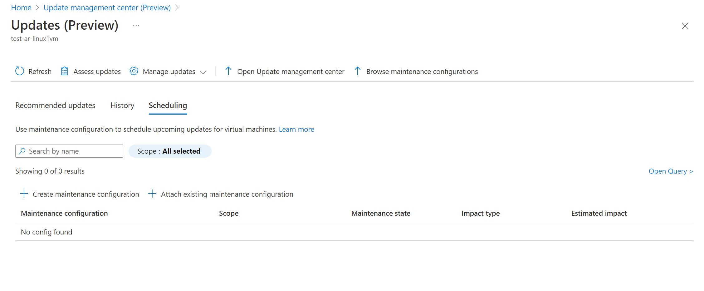
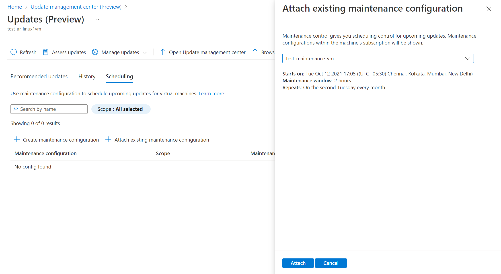
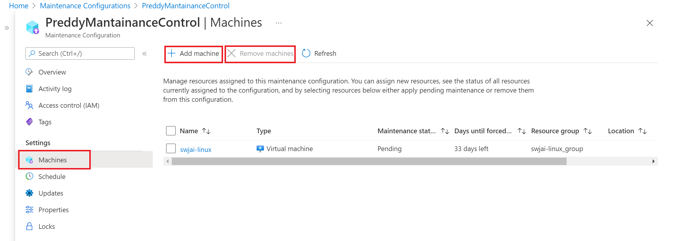
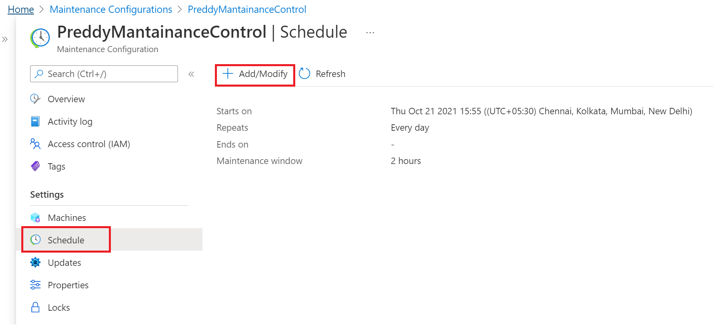
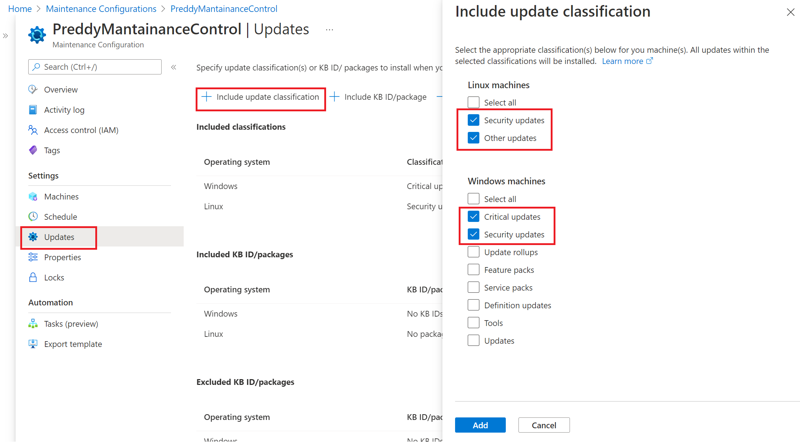

# How to schedule recurring updates for machines (private preview)

You can use update management center (private preview) in Azure to save recurring deployment schedules to install operating system updates for your Windows Server and Linux machines in Azure, in on-premises environments, and in other cloud environments connected using Azure Arc-enabled servers. You can create a schedule on a daily, weekly or hourly cadence (as per your requirement), specify the machines that will be updated as part of the schedule, which updates will be installed. This schedule will then automatically install the updates as per what is specified in the schedule that you created.
Update management center (private preview) uses Maintenance control schedule instead of using creating its own schedules. Maintenance control enables customers to manage platform updates. For more info, refer to [Maintenance control documentation](/azure/virtual-machines/maintenance-control).

## Regions supported for scheduled patching

Update management center (private preview) **scheduled patching** feature is supported in the below regions as of now. This means that your VM must be in one of the following regions:
* South Central US
* West Central US
* North Europe
* Australia East
* UK South
* Southeast Asia

## Prerequisites for scheduled patching

In addition to the [Prerequisites for Update management center (Private Preview)](./overview.md#prerequisites), scheduled patching as a feature has the below additional prerequisites:
1. Patch orchestration of the Azure machines should be set to **Azure Orchestrated (Automatic By Platform)**. For Arc machines, this is not a requirement.
**Please note**: If you set the Patch Orchestration mode to Azure Orchestrated (Automatic By Platform) but do not attach a maintenance configuration to an Azure machine, it will be treated as [Automatic Guest patching](/azure/virtual-machines/automatic-vm-guest-patching) enabled machine and Azure platform will automatically install updates as per its own schedule.
2. The maintenance configuration's subscription and the subscriptions of all VMs assigned to the maintenance configuration must be allowlisted with feature flag **Microsoft.Compute/InGuestScheduledPatchVMPreview**
3. For Azure machine, customer must keep it **running for at least 40 minutes** after enabling **Azure Orchestrated (Automatic By Platform)** patch orchestration mode. For Arc-enabled servers, machine must have been in running state at least for last 40 minutes.

## Schedule recurring updates from single VM blade

### Create new maintenance configuration

**Please note**: As of now, VMs and maintenance configuration in the same subscription are supported.
 
To create a schedule from a single VM, follow the following steps:

1. The option to use update management center (private preview) is available from the left-hand option list of your Azure virtual machine or Arc-enabled server. Navigate to **Virtual Machines** and select your virtual machine from the list. You can get to update management center (private preview) from an Arc-enabled server by navigating to **Servers - Azure Arc** and select your Arc-enabled server from the list.

2. From the left menu, select **Guest + host updates**, and then select **Go to Updates using Update Center** on the **Guest + host updates** page.

3. In **Scheduling** tab, click on **Create maintenance configuration** or under **Manage Updates** dropdown from top, select **Scheduled updates**. This opens up the flow for creating a recurring schedule. 

4. On the **Basics** page, select **Subscription**, **Resource Group**. Provide name, region and scope. In maintenance scope, select **Guest patching with update management center**. Click on **Add a schedule** and specify the schedule details like **Start on**, **Maintenance window (in hours)**, **Repeats(monthly, daily or weekly)**. **Hourly** option is currently not supported in UX but can be used through the [API](./manage-vms-programmatically.md#create-a-maintenance-configuration-schedule). In case of monthly, you have 2 options: 
	1. Repeat on a calendar date (optionally run on last date of the month)
	2. Repeat on nth (first, second, etc.) x day (e.g. Monday, Tuesday)  of the month. I can also specify an offset from the day set. This could be +6/-6. For example, for customers wanting to patch on the first Saturday after patch Tuesday, they would set the recurrence as the second Tuesday of the month with a +4 day offset.
Optionally you can also specify an end date when you want the schedule to expire.

5. On the **Machines** page, verify the machines selected are listed. You can add or remove machines from the list. Select **Next** to continue.

6. On the **Updates** page, specify the updates to include in the deployment by specifying:

   * Update classification(s)
   * Include updates by specific KB IDs or package names. For Windows, you can refer to [MSRC link](https://msrc.microsoft.com/update-guide/deployments) to get the details of latest KBs released.
   * Exclude updates by specific KB IDs or package names you don’t want to get installed as part of this process. Updates not shown in the list could be installed based on the time between last assessment and release of newer updates since then that are available for the selected machines. You can chose to exclude Windows updates that require a reboot by selecting the option ** Exclude KBs requiring reboot for Windows server**.
   

7. On the **Tags** page, you can assign tags to maintenance configurations.

8. On the **Review + Create** page, verify your update deployment options and then select **Create**.
A notification is generated to inform you that the deployment is created.

### Detatch a maintenance configuration

In the **Scheduling** tab, click on the ellipses against any maintenance configuration that you want to detatch from the machine and select **Detatch maintenance configuration**

### Attach a maintenance configuration

One maintenance configuration can be attached to multiple machines. It can be attached to machines at the time of creating a new maintenance configuration or even after you have created one also.

In the **Scheduling** tab, click on **Attach maintenance configuration**, which opens up a context pane. Select the maintenance configuration that you would want to attach and click on **Attach**. 

## Schedule recurring updates from maintenance configuration

You can browse and manage all your maintenance configurations from a single place. Search **Maintenance configurations** in Azure portal. It shows a list of all maintenance configurations at a single place along with the Maintenance scope, Resource group, Location, subscription to which it belongs. You can filter maintenance configurations using filters at the top. Maintenance configurations related to Guest OS updates are the ones which have Maintenance scope as **InGuestPatch**

You can create new Guest OS update maintenance configuration or modify an existing configuration:

### Create a new maintenance configuration
From Azure portal, go to **Maintenance configuration** and click on **Create**. This opens up a flow similar to the flow of creating maintenance configuration from single VM above from Single VM.

### Add/remove machines from maintenance configuration
From Azure portal, go to **Maintenance configuration** and click on an already existing maintenance configuration. Under **Settings** on the left hand pane, select **Machines** and click on **Add machine/Remove machines** as per your use case.

### Add/modify schedule of maintenance configuration
From Azure portal, go to **Maintenance configuration** and click on an already existing maintenance configuration. Under **Settings** on the left hand pane, select **Schedule** and click on **Add/Modify** as per your use case.

### Change update selection criteria
From Azure portal, go to **Maintenance configuration** and click on an already existing maintenance configuration. Under **Settings** on the left hand pane, select **Updates** and modify the selection criteria by clicking on the command icons **Include update classification** to select category of updates like Critical, Security, Feature updates etc. Alternatively, include/exclude a particular KB ID/package name by using **Include KB ID/package** and **Exclude KB ID/package** commands respectively

## Check on your scheduled patching run
You can check the deployment status and history of your maintenance configuration runs from the Update management center portal. Follow [Update deployment history by maintenance run ID](./manage-multiple-machines.md#update-deployment-history-by-maintenance-run-id).

## Current limitations and known issues with scheduled patching
These are some of the known issues and limitations of scheduled patching which will be done away with in the future releases:
1. In case of concurrent/conflicting schedule, only one schedule will be triggered. Even if triggered schedule finishes before the end of the maintenance window, the other schedule won't be triggered. Customer must choose start time for the second schedule to be a time later than the end time of the maintenance window of first schedule.
2. If customer removes the patch mode AutomaticByPlatform after the configure assignment then machine will be skipped and deployment will be marked as failed with no error message.
3. If no install patches API call was successful then deployment will be marked as failure with no error message.
	Some Possible reasons for install patches API call failure -
	* Some patch operation was already going on, on the machine (assess/install patches)
	* Patch orchestration mode was changed to an option other than Azure Orchestrated/AutomaticByPlatform
	* Concurrent schedule but in this case the later triggered schedule will be marked as Succeeded.
	* Machine skipped because of availability set guarantees for Azure VMs
	* Invalid input configuration
	* Machine is not in running state.
	* Customer must keep at least 40 minutes the Azure and Arc machine in running state if machine is newly created. If machine is not newly created then it must have been in running state in the past for the at least 40 minutes.
4. For Azure machine, customer must keep it **running for at least 40 minutes** after enabling **Azure Orchestrated (Automatic By Platform)** patch orchestration mode. For Arc-enabled servers, machine must have been in running state at least for last 40 minutes.

## Next steps

* To view update assessment and deployment logs generated by update management center (private preview), see [query logs](query-logs.md).
* To troubleshoot issues, see the [Troubleshoot](troubleshoot.md) update management center (private preview).
