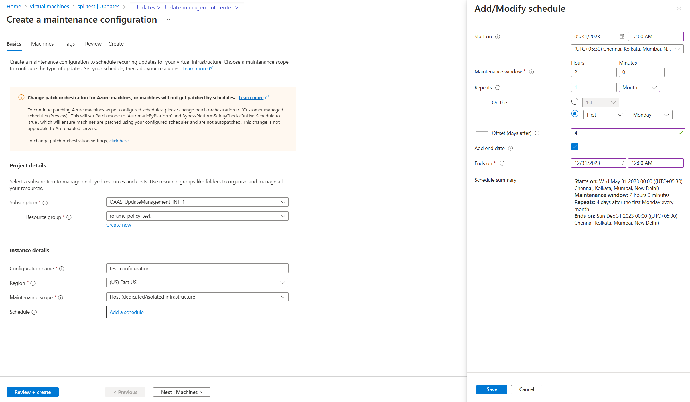
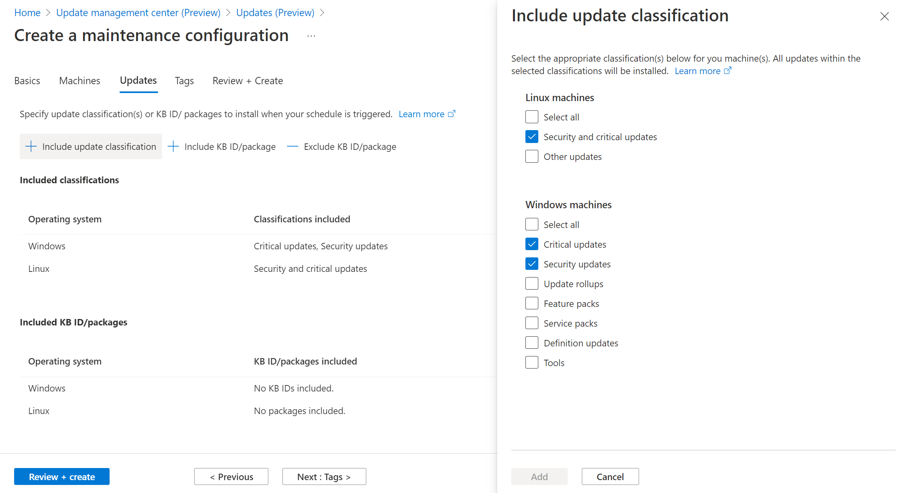
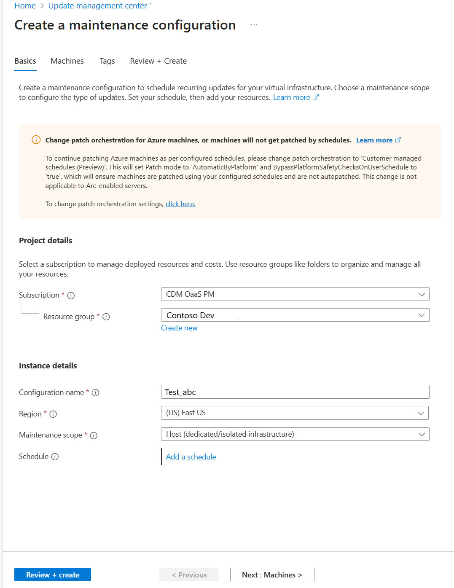

# Schedule recurring updates for machines in update management center (Preview)

**Applies to:** :heavy_check_mark: Windows VMs :heavy_check_mark: Linux VMs :heavy_check_mark: On-premises environment :heavy_check_mark: Azure Arc-enabled servers.

You can use Update management center (preview) in Azure to create and save recurring deployment schedules. You can create a schedule on a daily, weekly or hourly cadence, specify the machines that must be updated as part of the schedule, and the updates to be installed. This schedule will then automatically install the updates as per the created schedule.

Update management center (preview) uses maintenance control schedule instead of using creating its own schedules. Maintenance control enables customers to manage platform updates. For more information, see [Maintenance control documentation](/azure/virtual-machines/maintenance-control).

## Prerequisites for scheduled patching

1. See [Prerequisites for Update management center (preview)](./overview.md#prerequisites)
1. Patch orchestration of the Azure machines should be set to **Azure Orchestrated (Automatic By Platform)**. For Azure Arc-enabled machines, it isn't a requirement.

> [!Note]
> If you set the patch orchestration mode to Azure orchestrated (Automatic By Platform) but don't attach a maintenance configuration to an Azure machine, it is treated as [Automatic Guest patching](/azure/virtual-machines/automatic-vm-guest-patching) enabled machine and Azure platform will automatically install updates as per its own schedule.

- The maintenance configuration's subscription and the subscriptions of all VMs assigned to the maintenance configuration must be allowlisted with feature flag **Microsoft.Compute/InGuestScheduledPatchVMPreview**
- For Azure machine, customer must keep it **running for at least 40 minutes** after enabling **Azure Orchestrated (Automatic By Platform)** patch orchestration mode. For Arc-enabled servers, machine must have been in running state at least for last 40 minutes.

## Schedule recurring updates from single VM

### Create new maintenance configuration

> [!Note] 
> Currently, VMs and maintenance configuration in the same subscription are supported.
 
To create a schedule from a single VM, use the following steps:

1. In **Update management center (Preview)**, **Overview** and select your **Subscription**.
2. Select **Check for updates** to add machines and resources.
3. Select the machine to view all the available updates and to create a recurring schedule.

   :::image type="content" source="./media/scheduled-updates/scheduling-tab-inline.png" alt-text="screenshot on create maintenance configuration." lightbox="./media/scheduled-updates/scheduling-tab-expanded.png":::

4. In **Updates (Preview)**, select **Scheduled updates** to create a maintenance configuration to the scheduled recurring updates.
  - In **Basics** page, select **Subscription**, **Resource Group** and all options in **Instance details**.
  - Select **Add a schedule** and specify the schedule details such as 
	- Start on
	- Maintenance window (in hours)
	- Repeats(monthly, daily or weekly)
	- Add end date
	- Schedule summary

	>[!NOTE]
	>The hourly option is currently not supported in the portal, but can be used through the [API](./manage-vms-programmatically.md#create-a-maintenance-configuration-schedule). 

    
	
   For the monthly option, there are two options: 

   - Repeat on a calendar date (optionally run on last date of the month)
   - Repeat on nth (first, second, etc.) x day (for example, Monday, Tuesday) of the month. You can also specify an offset from the day set. It could be +6/-6. For example, for customers who want to patch on the first Saturday after a patch on Tuesday, they would set the recurrence as the second Tuesday of the month with a +4 day offset. Optionally you can also specify an end date when you want the schedule to expire.

5. In the **Machines**, verify the machines selected are listed. You can add or remove machines from the list. Select **Next** to continue.
6. In the **Updates** page, specify the updates to include in the deployment:

   * Update classification(s)
   * Include updates by specific KB IDs or package names. 
	
7. In the **Tags** page, assign tags to maintenance configurations.
8. In the **Review + Create** page, verify your update deployment options and then select **Create**.

A notification appears that the deployment is created.

### Attach a maintenance configuration

One maintenance configuration can be attached to multiple machines. It can be attached to machines at the time of creating a new maintenance configuration or even after you've created one.

1. In **Scheduling**, select **Attach maintenance configuration**. 
1. Select the maintenance configuration that you would want to attach and select **Attach**. 

	:::image type="content" source="./media/scheduled-updates/scheduled-patching-attach-maintenance-inline.png" alt-text="Scheduled patching attach maintenance configuration." lightbox="./media/scheduled-updates/scheduled-patching-attach-maintenance-expanded.png":::
 
## Schedule recurring updates from maintenance configuration

You can browse and manage all your maintenance configurations from a single place. Search **Maintenance configurations** in Azure portal. It shows a list of all maintenance configurations along with the maintenance scope, resource group, location, subscription to which it belongs. You can filter maintenance configurations using filters at the top. Maintenance configurations related to Guest OS updates are the ones that have Maintenance scope as **InGuestPatch**

You can create new Guest OS update maintenance configuration or modify an existing configuration:

### Create a new maintenance configuration

1. Go to **Machines** and select machines from the list.
1. In the **Updates (Preview)**, select **Scheduled updates**.
1. In **Create a maintenance configuration**, create a configuration to schedule recurring updates.

	

### Add/remove machines from maintenance configuration

1. Go to **Machines** and select machines from the list.
1. In **Updates (Preview)**, select **One-time updates**.
1. In **Install one-time updates**, **Machines**, select **+Add machine**.

	:::image type="content" source="./media/scheduled-updates/add-or-remove-machines-from-maintenance-configuration-inline.png" alt-text="Add/remove machines from Maintenance configuration." lightbox="./media/scheduled-updates/add-or-remove-machines-from-maintenance-configuration-expanded.png":::
 

### Change update selection criteria

1. In **Install one-time updates**, select the resources and machines to install the updates.
1. **In Machines**, select **+Add machine** to add machines that were previously not selected and click **Add**.
1. In **Updates**, specify the updates to include in the deployment. 
1. Select **Include KB ID/package** and **Exclude KB ID/package** respectively to select category of updates like Critical, Security, Feature updates etc.

   :::image type="content" source="./media/scheduled-updates/change-update-selection-criteria-of-maintenance-configuration-inline.png" alt-text="Change update selection criteria of Maintenance configuration." lightbox="./media/scheduled-updates/change-update-selection-criteria-of-maintenance-configuration-expanded.png":::

## Check on your scheduled patching run
You can check the deployment status and history of your maintenance configuration runs from the Update management center portal. Follow [Update deployment history by maintenance run ID](./manage-multiple-machines.md#update-deployment-history-by-maintenance-run-id).

## Current limitations and known issues with scheduled patching

The known issues and limitations of scheduled patching are:

1. For concurrent/conflicting schedule, only one schedule will be triggered. Even if triggered schedule finishes before the end of the maintenance window, the other schedule won't be triggered. Customer must choose start time for the second schedule to be a time later than the end time of the maintenance window of first schedule.
2. If customer removes the patch mode AutomaticByPlatform after the configure assignment, then machine will be skipped and deployment will be marked as failed with no error message.
3. If no install patches API call was successful, then deployment will be marked as failure with no error message.
	Some Possible reasons for install patches API call failure -
	* Some patch operation was already going on, on the machine (assess/install patches)
	* Patch orchestration mode was changed to an option other than Azure Orchestrated/AutomaticByPlatform
	* Concurrent schedule but in this case the later triggered schedule will be marked as Succeeded.
	* Machine skipped because of availability set guarantees for Azure VMs
	* Invalid input configuration
	* Machine isn't in running state.
	* Customer must keep at least 40 minutes the Azure and Arc machine in running state if machine is newly created. If machine isn't newly created, then it must have been in running state in the past for at least 40 minutes.
4. For Azure machine, customer must keep it **running for at least 40 minutes** after enabling **Azure Orchestrated (Automatic By Platform)** patch orchestration mode. For Arc-enabled servers, machine must have been in running state at least for last 40 minutes.

## Next steps

* To view update assessment and deployment logs generated by update management center (preview), see [query logs](query-logs.md).
* To troubleshoot issues, see the [Troubleshoot](troubleshoot.md) update management center (preview).
