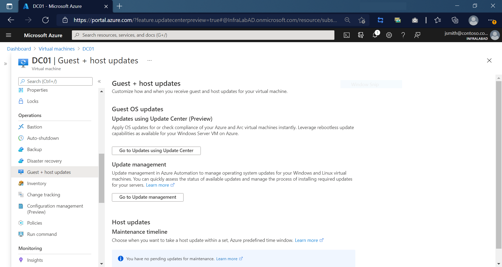
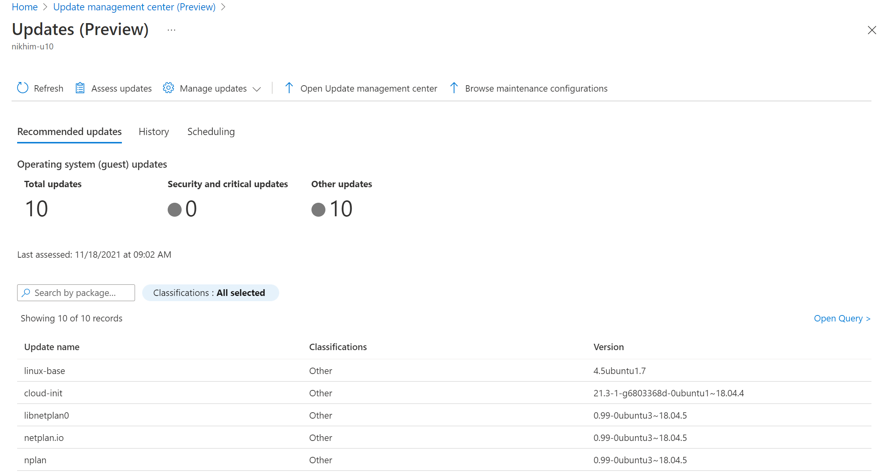
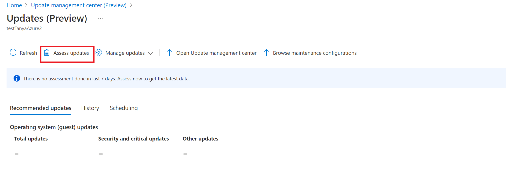
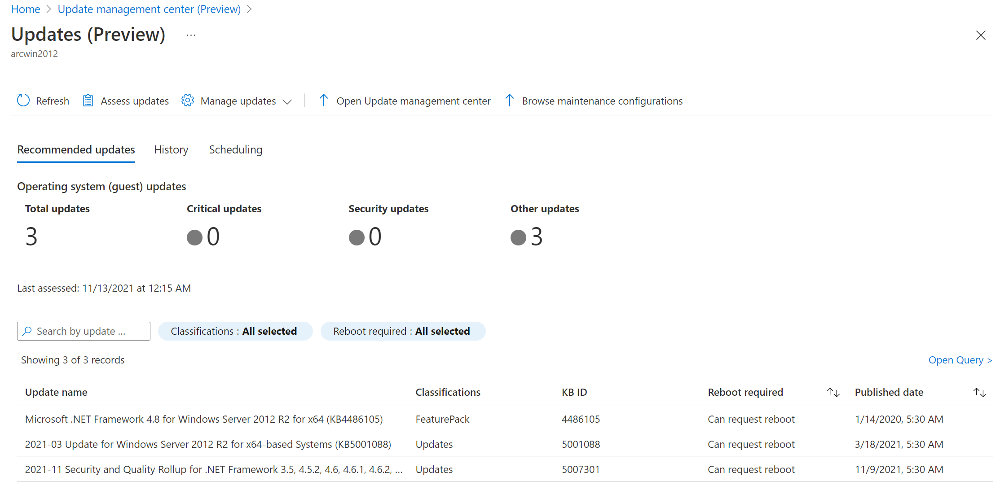

# How to view update compliance with update management center (private preview)

In update management center (private preview), you can view information about your machines, any updates missing, status of update deployments, and schedule update deployments. You can view the assessment information scoped to the selected Azure virtual machine, from the selected Arc-enabled server, or across [multiple machines](manage-multiple-machines.md). 

This article reviews how to view compliance from a selected Azure VM or Arc-enabled server.

## Prerequisites

Before using update management center (private preview) in Azure with your Azure virtual machine (VM) or Azure Arc-enabled servers, verify you have enabled the preview in your Azure subscription. You can find instructions to enable machines from both environments in the [Enable](enable-machines.md) article.

## Supported Regions

In private preview, update management center (private preview) is available for use in limited regions. But will scale to all regions later in public preview stages. Listed below are the Azure public cloud where you can use update management center (private preview).

**On demand assessment** on **Azure Compute virtual machines** is available in all Azure public regions where Compute virtual machines is available.

**On demand assessment** on **Azure arc-enabled servers** is supported in the following regions currently. This means that VMs must be in below regions:

* Australia East
* East US
* North Europe
* South Central US
* South East Asia
* UK South
* West Central US
* West Europe
* West US2

## Sign in to the Azure portal

Sign in to the [Azure portal](https://portal.azure.com).

## View update compliance

The option to use update management center (private preview) is available from the left-hand option list of your Azure virtual machine or Arc-enabled server. 

To view update compliance from an Azure VM, navigate to **Virtual Machines** and select your virtual machine from the list. You can get to update management center (private preview) from an Arc-enabled server by navigating to **Servers - Azure Arc** and select your Arc-enabled server from the list.

From the left menu, select **Guest + host updates**, and then select **Go to Update Center** on the **Guest + host updates** page. 

In update management center (private preview), you can view information about your machine, missing updates, and update deployments. At the top of the page it shows you the current OS update compliance based on the last assessment. An assessment if not performed recently, is reported based on the last time it was performed, which could be up to 7 days ago. If any updates are identified as missing, the tiles at the top summarize:

* The total number of updates missing
* How many are **Critical security updates**
* How many are **Security updates**
* How many are categorized as **Other missing updates**

A list of them is shown in the update compliance grid and include relevant information about the update, such as when it was released, its reboot behavior, etc. You can filter the results listed in the grid in the following ways:

* Selecting one of the tile visualizations
* Searching on **Update name** or **KB ID** to filter the list of results.
* Filter based on classification types, and by default all classifications are selected. 

### Update assessment scan

In update management center (private preview), you can initiate a software updates compliance scan on the machine to get a current list of operating system updates available. On Windows, the software update scan is actually performed by the Windows Update Agent. On Linux, the software update scan is performed using OVAL-compatible tools to test for the presence of vulnerabilities based on the OVAL Definitions for that platform, which is retrieved from a local or remote repository. 

Select the **Assess updates** option from the top menu bar to start the process and get the latest assessment data from the machine. You are prompted to confirm.

After initiating the operation, a notification is generated to inform you the activity has started and another is created when it is finished. When its successfully completed, the **Recommended updates** section updates to reflect the OS updates applicable. You can also select **Refresh** to update the information on the page and review the assessment details of the selected machine. 

The status of the operation can be viewed at any time from the [Azure Activity log](/azure/azure-monitor/essentials/activity-log).

## Next steps

* Learn about deploying updates to your machines to maintain security compliance by reading [deploy updates](deploy-updates.md).
* To view update assessment and deployment logs generated by update management center (private preview), see [query logs](query-logs.md).
* To troubleshoot issues, see the [Troubleshoot](troubleshoot.md) Azure Update management center (private preview).
