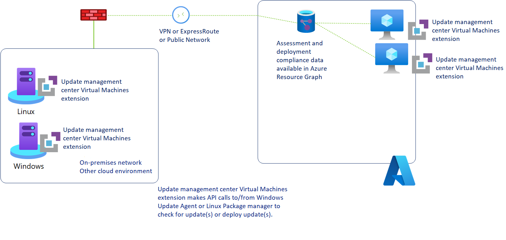

# About Azure Update Manager

> [!Important]
> Azure Log Analytics agent, also known as the Microsoft Monitoring Agent (MMA) will be [retired in August 2024](https://azure.microsoft.com/updates/were-retiring-the-log-analytics-agent-in-azure-monitor-on-31-august-2024/). Azure Automation Update Management solution relies on this agent and may encounter issues once the agent is retired as it does not work with Azure Monitoring Agent (AMA). Therefore, if you are using the Azure Automation Update Management solution, we recommend that you move to Azure Update Manager for your software update needs. All the capabilities of Azure Automation Update management solution will be available on Azure Update Manager before the retirement date. Follow the [guidance](guidance-migration-automation-update-management-azure-update-manager.md) to move your machines and schedules from Automation Update Management to Azure Update Manager.

Update Manager is a unified service to help manage and govern updates for all your machines. You can monitor Windows and Linux update compliance across your deployments in Azure, on-premises, and on other cloud platforms from a single dashboard. You can also use Update Manager to make real-time updates or schedule them within a defined maintenance window.

You can use Update Manager in Azure to:

- Oversee update compliance for your entire fleet of machines in Azure, on-premises, and in other cloud environments.
- Instantly deploy critical updates to help secure your machines.
- Use flexible patching options such as [automatic virtual machine (VM) guest patching](../virtual-machines/automatic-vm-guest-patching.md) in Azure, [hot patching](../automanage/automanage-hotpatch.md), and customer-defined maintenance schedules.

We also offer other capabilities to help you manage updates for your Azure VMs that you should consider as part of your overall update management strategy. To learn more about the options that are available, see the Azure VM [update options](../virtual-machines/updates-maintenance-overview.md).

Before you enable your machines for Update Manager, make sure that you understand the information in the following sections.

## Key benefits

Update Manager has been redesigned and doesn't depend on Azure Automation or Azure Monitor Logs, as required by the [Azure Automation Update Management feature](../automation/update-management/overview.md). Update Manager offers many new features and provides enhanced functionality over the original version available with Azure Automation. Some of those benefits are listed here:

- Provides native experience with zero on-boarding.
    - Built as native functionality on Azure compute and the Azure Arc for Servers platform for ease of use.
    - No dependency on Log Analytics and Azure Automation.
    - Azure Policy support.
    - Global availability in all Azure compute and Azure Arc regions.
- Works with Azure roles and identity.
    - Granular access control at the per-resource level instead of access control at the level of the Azure Automation account and Log Analytics workspace.
    - Update Manager now has Azure Resource Manager-based operations. It allows role-based access control and roles based on Azure Resource Manager in Azure.
- Offers enhanced flexibility.
    - Ability to take immediate action either by installing updates immediately or scheduling them for a later date.
    - Check updates automatically or on demand.
    - Helps secure machines with new ways of patching, such as [automatic VM guest patching](../virtual-machines/automatic-vm-guest-patching.md) in Azure, [hot patching](../automanage/automanage-hotpatch.md), or custom maintenance schedules.
    - Sync patch cycles in relation to "patch Tuesday," the unofficial term for Microsoft's scheduled security fix release on every second Tuesday of each month.

The following diagram illustrates how Update Manager assesses and applies updates to all Azure machines and Azure Arc-enabled servers for both Windows and Linux.

To support management of your Azure VM or non-Azure machine, Update Manager relies on a new [Azure extension](../virtual-machines/extensions/overview.md) designed to provide all the functionality required to interact with the operating system to manage the assessment and application of updates. This extension is automatically installed when you initiate any Update Manager operations, such as **Check for updates**, **Install one-time update**, and **Periodic Assessment** on your machine. The extension supports deployment to Azure VMs or Azure Arc-enabled servers by using the extension framework. The Update Manager extension is installed and managed by using:

- [Azure VM Windows agent](../virtual-machines/extensions/agent-windows.md) or the [Azure VM Linux agent](../virtual-machines/extensions/agent-linux.md) for Azure VMs.
- [Azure Arc-enabled servers agent](../azure-arc/servers/agent-overview.md) for non-Azure Linux and Windows machines or physical servers.

 Update Manager manages the extension agent installation and configuration. Manual intervention isn't required as long as the Azure VM agent or Azure Arc-enabled server agent is functional. The Update Manager extension runs code locally on the machine to interact with the operating system, and it includes:

- Retrieving the assessment information about status of system updates for it specified by the Windows Update client or Linux package manager.
- Initiating the download and installation of approved updates with the Windows Update client or Linux package manager.

All assessment information and update installation results are reported to Update Manager from the extension and is available for analysis with [Azure Resource Graph](../governance/resource-graph/overview.md). You can view up to the last seven days of assessment data, and up to the last 30 days of update installation results.

The machines assigned to Update Manager report how up to date they are based on what source they're configured to synchronize with. You can configure [Windows Update Agent (WUA)](/windows/win32/wua_sdk/updating-the-windows-update-agent) on Windows machines to report to [Windows Server Update Services](/windows-server/administration/windows-server-update-services/get-started/windows-server-update-services-wsus) or Microsoft Update, which is by default. You can configure Linux machines to report to a local or public YUM or APT package repository. If the Windows Update Agent is configured to report to WSUS, depending on when WSUS last synchronized with Microsoft Update, the results in Update Manager might differ from what Microsoft Update shows. This behavior is the same for Linux machines that are configured to report to a local repository instead of a public package repository.

You can manage your Azure VMs or Azure Arc-enabled servers directly or at scale with Update Manager.

## Prerequisites

Along with the following prerequisites, see [Support matrix](support-matrix.md) for Update Manager.

### Role

Resource | Role
--- | ---
|Azure VM | [Azure Virtual Machine Contributor](../role-based-access-control/built-in-roles.md#virtual-machine-contributor) or Azure [Owner](../role-based-access-control/built-in-roles.md#owner)
Azure Arc-enabled server | [Azure Connected Machine Resource Administrator](../azure-arc/servers/security-overview.md#identity-and-access-control)

### Permissions

You need the following permissions to create and manage update deployments. The table shows the permissions that are needed when you use Update Manager.

Actions |Permission |Scope |
--- | --- | --- |
|Install update on Azure VMs |Microsoft.Compute/virtualMachines/installPatches/action ||
|Update assessment on Azure VMs |Microsoft.Compute/virtualMachines/assessPatches/action ||
|Install update on Azure Arc-enabled server |Microsoft.HybridCompute/machines/installPatches/action ||
|Update assessment on Azure Arc-enabled server |Microsoft.HybridCompute/machines/assessPatches/action ||
|Register the subscription for the Microsoft.Maintenance resource provider| Microsoft.Maintenance/register/action | Subscription|
|Create/modify maintenance configuration |Microsoft.Maintenance/maintenanceConfigurations/write |Subscription/resource group |
|Create/modify configuration assignments |Microsoft.Maintenance/configurationAssignments/write |Machine |
|Read permission for Maintenance updates resource |Microsoft.Maintenance/updates/read |Machine |
|Read permission for Maintenance apply updates resource |Microsoft.Maintenance/applyUpdates/read |Machine |

### VM images

For more information, see the [list of supported operating systems and VM images](support-matrix.md#supported-operating-systems).

- [Specialized images](../virtual-machines/linux/imaging.md#specialized-images) - Azure Update Manager now supports scheduled patching and periodic assessment for VMs including the VMs created by Azure Migrate, Azure Backup, and Azure Site Recovery in preview.

Currently, Update Manager has the following limitation regarding operating system support:

 - Marketplace images other than the [list of supported Marketplace OS images](../virtual-machines/automatic-vm-guest-patching.md#supported-os-images) are currently not supported.

For the preceding limitation, we recommend that you use [Automation Update Management](../automation/update-management/overview.md) until support is available in Update Manager. To learn more, see [Supported operating systems](support-matrix.md#supported-operating-systems).

## VM extensions

Azure VM extensions and Azure Arc-enabled VM extensions are available.

#### [Azure VM extensions](#tab/azure-vms)

| Operating system| Extension
|----------|-------------|
|Windows   | Microsoft.CPlat.Core.WindowsPatchExtension|
|Linux     | Microsoft.CPlat.Core.LinuxPatchExtension |

#### [Azure Arc-enabled VM extensions](#tab/azure-arc-vms)

| Operating system| Extension
|----------|-------------|
|Windows  | Microsoft.CPlat.Core.WindowsPatchExtension (Periodic assessment)   Microsoft.SoftwareUpdateManagement.WindowsOsUpdateExtension (On-demand operations and Schedule patching) |
|Linux  | Microsoft.SoftwareUpdateManagement.LinuxOsUpdateExtension (On-demand operations and Schedule patching)   Microsoft.CPlat.Core.LinuxPatchExtension (Periodic assessment) |

To view the available extensions for a VM in the Azure portal:

1. Go to the [Azure portal](https://portal.azure.com) and select a VM.
1. On the VM home page, under **Settings**, select **Extensions + applications**.
1. On the **Extensions** tab, you can view the available extensions.
---

### Network planning

To prepare your network to support Update Manager, you might need to configure some infrastructure components.

For Windows machines, you must allow traffic to any endpoints required by the Windows Update agent. You can find an updated list of required endpoints in [Issues related to HTTP/Proxy](/windows/deployment/update/windows-update-troubleshooting#issues-related-to-httpproxy). If you have a local [WSUS](/windows-server/administration/windows-server-update-services/plan/plan-your-wsus-deployment) deployment, you must also allow traffic to the server specified in your [WSUS key](/windows/deployment/update/waas-wu-settings#configuring-automatic-updates-by-editing-the-registry).

For Red Hat Linux machines, see [IPs for the RHUI content delivery servers](../virtual-machines/workloads/redhat/redhat-rhui.md#the-ips-for-the-rhui-content-delivery-servers) for required endpoints. For other Linux distributions, see your provider documentation.

## Next steps

- [View updates for a single machine](view-updates.md)
- [Deploy updates now (on-demand) for a single machine](deploy-updates.md)
- [Schedule recurring updates](scheduled-patching.md)
- [Manage update settings via the portal](manage-update-settings.md)
- [Manage multiple machines by using Update Manager](manage-multiple-machines.md)
