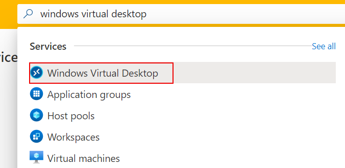
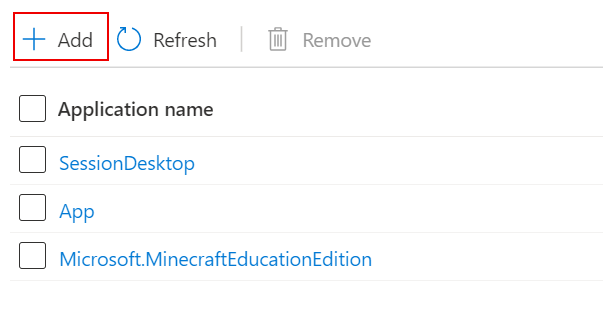

# Set up MSIX app attach with the Azure portal

> [!IMPORTANT]
> MSIX app attach is currently in public preview.
> This preview version is provided without a service level agreement, and we don't recommend using it for production workloads. Certain features might not be supported or might have constrained capabilities.
> For more information, see [Supplemental Terms of Use for Microsoft Azure Previews](https://azure.microsoft.com/support/legal/preview-supplemental-terms/).

This topic will walk you through how to set up MSIX app attach (preview) in a Windows Virtual Desktop environment.

## Requirements

Before you get started, here's what you need to configure MSIX app attach:

- A Windows Virtual Desktop host pool with at least one active session host.
- An MSIX-packaged application expanded into an MSIX image that's uploaded into a file share.
- The file share where you uploaded the MSIX image must also be accessible to all virtual machines (VMs) in the host pool. Users will need read-only permissions to access the image.

## Configure the side load Azure portal extension

Before you can start using Azure portal, you'll need to download and configure the side load portal extension.

To set up the side load portal extension:

1. [Download the extension](https://portal.azure.com/?feature.msixapplications=true&feature.customportal=false&feature.canmodifyextensions=true).
2. If you get a prompt asking if you consider the extension trustworthy, select **Allow**.

      > [!div class="mx-imgBorder"]
      > 

3. Open the portal and press the **F12** key to open the developer tools.
4. In the developer tools console, enter the following command:

      ```cmd
      Q().then(function () {

      console.warn("Unregistering existing extensions...");

      return MsPortalImpl.Extension.unregisterAll();

      }).then(function () {

      console.warn("Registering WVD extension...");

      return MsPortalImpl.Extension.registerTestExtension({name: "Microsoft_Azure_WVD", uri: "<https://msixappattach.azurewebsites.net>"});

      }).finally(function () {

      window.location.reload();

      });
      ```

## Add an MSIX image to the host pool

Next you'll need to add the MSIX image to your host pool.

To add the MSIX image:

1. Open the Azure portal.

2. Enter **Windows Virtual Desktop** into the search bar, then select the service name.

      > [!div class="mx-imgBorder"]
      > 

3. Select the host pool where you plan to put the MSIX apps.

4. Select **MSIX packages** to open the data grid with all **MSIX packages** currently added to the
host pool.

1. Select **+ Add** to open the **Add MSIX package** tab.

2. In the **Add MSIX package** tab, enter the following values:

- For **MSIX image path**, enter a valid UNC path pointing to the MSIX image on the file
share. (For example, `\\storageaccount.file.core.windows.net\msixshare\appfolder\MSIXimage.vhd`.)

- For **MSIX package**, select the relevant MSIX package name from the drop-down menu. This menu will only be populated if you've entered a valid image path in **MSIX image path**.

- For **Package applications**, make sure the list contains all MSIX applications you want to be available to users in your MSIX package.

- Optionally, enter a **Display name** if you want your package to have a more user-friendly in your user deployments.

- Make sure the **Version** has the correct version number.

- Select the **Registration type** you want to use. Which one you use depends on your needs:

    - **On-demand registration** postpones the full registration of the MSIX application until the user starts the application. This is the registration type we recommend you use.

    - **Log on blocking** only registers while the user is signing in. We don't recommend this type because it can lead to longer sign-in times for users.

- For **State**, select your preferred state.
    -  The **Active** status lets users interact with the package.
    -  The **Inactive** status causes Windows Virtual Desktop to ignore the package and not deliver it to users.

1. When you're done, select **Save**.

## Publish MSIX apps to an app group

Next, you'll need to publish the apps into the package.

To publish the apps:

1. in the Windows Virtual Desktop resource provider, select the **Application groups** tab.

2. Select the application group you want to publish the apps to.

>[!NOTE]
>MSIX applications can be delivered with MSIX app attach to both remote app and desktop app groups

3. Once you're in the app group, select the **Applications** tab. The **Applications** grid will display all existing apps within the app group.

4. Select **+ Add** to open the **Add application** tab.

      > [!div class="mx-imgBorder"]
      > 

5. For **Application source**, choose the source for your application.
    - If you're using a Desktop app group, choose **MSIX package**.
      
      > [!div class="mx-imgBorder"]
      > 
    
    - If you're using Remote app group, choose one of the following options:
        - Start menu
        - App path
        - MSIX package

6. Configure these optional features, if you want:
   
   - For **Display name**, enter a new name for the package that your users will see.

   - For **Description**, enter a short description of the app package.

   - If you're using a remote app group, you can also configure these options:

        - **Icon path**

        - **Icon index**

        - **Show in web feed**

7. When you're done, select **Save**.

>[!NOTE]
>When a user is assigned to remote app group and desktop app group from the same host pool the desktop app group will be displayed in the feed.

## Change MSIX package state

Next, you'll need to change the MSIX package state to either **Active** or **Inactive**, depending on what you want to do with the package. Active packages are packages your users can interact with once they're published. Inactive packages are ignored by Windows Virtual Desktop, so your users can't interact with the apps inside.

### Change state with the Applications list

To change the package state with the Applications list:

1. Select **MSIX packages**. You should see a list of all existing MSIX packages within the host pool.

2. Select the MSIX packages whose states you need to change, then select **Change state**.

### Change state with update package

To change the package state with an update package:

1. Select **MSIX packages**. You should see a list of all existing MSIX packages within the host pool.

2. Select the name of the package whose state you want to change from the MSIX package list. This will open the **Update package** tab.

3. Toggle the **State** switch to either **Inactive** or **Active**, then select **Save.**

## Change MSIX package registration type

To change the package's registration type:

1. Select **MSIX packages**. You should see a list of all existing MSIX packages within the host pool.

2. Select **Package name in** the **MSIX packages grid** this will open the blade to update the package.

3. Toggle the **Registration type** via the **On-demand/Log on blocking** button as desired and select **Save.**

## Remove an MSIX package

To remove an MSIX package from your host pool:

1. Select **MSIX packages**.  You should see a list of all existing MSIX packages within the host pool.

2. Select the packages you want to remove, then select **Remove**.

## Remove MSIX apps

To remove individual MSIX apps from your package:

1. Go to the host pool and select **Application groups**.

2. Select the application group you want to remove MSIX apps from.

3. Open the **Applications** tab and select **Applications**.

4. Select the app you want to remove, then select **Remove**.

## Next steps

Ask our community questions about this feature at the [Windows Virtual Desktop TechCommunity](https://techcommunity.microsoft.com/t5/Windows-Virtual-Desktop/bd-p/WindowsVirtualDesktop).

You can also leave feedback for Windows Virtual Desktop at the [Windows Virtual Desktop feedback hub](https://support.microsoft.com/help/4021566/windows-10-send-feedback-to-microsoft-with-feedback-hub-app).

Here are some other articles you might find helpful:

- [MSIX app attach glossary](app-attach-glossary.md)
- [MSIX app attach FAQ](app-attach-faq.md)