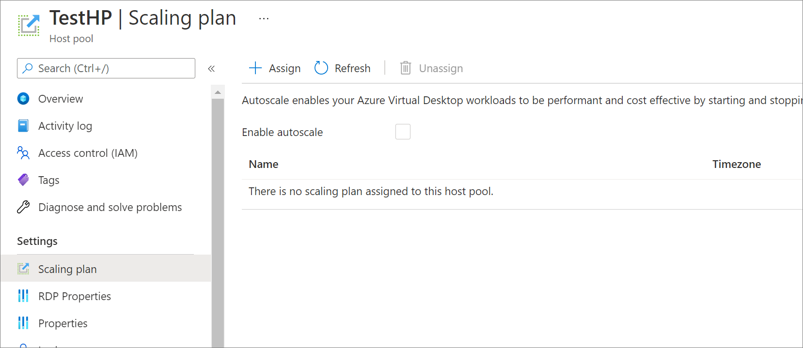

# Enable scaling plans for existing and new host pools (preview)

> [!IMPORTANT]
> The autoscale feature is currently in preview.
> See the [Supplemental Terms of Use for Microsoft Azure Previews](https://azure.microsoft.com/support/legal/preview-supplemental-terms/) for legal terms that apply to Azure features that are in beta, preview, or otherwise not yet released into general availability.

You can enable scaling plans for any existing host pools in your deployment. When you apply your scaling plan to the host pool, the plan will also apply to all session hosts within that host pool. Scaling also automatically applies to any new session hosts you create in your assigned host pool.

If you disable a scaling plan, all assigned resources will remain in the scaling state they were in at the time you disabled it.

## Assign a scaling plan to an existing host pool

To assign a scaling plan to an existing host pool:

1. Open the [Azure portal](https://portal.azure.com).

2. Go to **Azure Virtual Desktop**.

3. Select **Host pools**, then go to **Scaling plan** and select **New**.

4. Select **Scaling plan**, then select **+ Assign** to assign a scaling plan to an unassigned host pool, as shown in the following screenshot.

    > [!div class="mx-imgBorder"]
    > 

    If you've enabled the scaling plan during deployment, then you'll also have the option to disable the plan for the selected host pool in the **Scaling plan** menu by unselecting the **Enable scaling plan** checkbox, as shown in the following screenshot.

    > [!div class="mx-imgBorder"]
    > 

## Edit an existing scaling plan

To edit an existing scaling plan:

1. Sign in to the Azure portal at [https://portal.azure.com](https://portal.azure.com/).

2. Go to **Azure Virtual Desktop**.

3. Select **Scaling plan**, then select the name of the scaling plan you want to edit. The settings window should open.

4. To edit the plan's display name, description, time zone, or exclusion tags, go to the **Properties** tab.

5. To assign host pools or edit schedules, go to the **Manage** tab.

## Next steps

- Review how to create a scaling plan at [Autoscale (preview) for Azure Virtual Desktop session hosts](autoscale-new-existing-host-pool.md).
- Learn how to troubleshoot your scaling plan at [Enable diagnostics for your scaling plan](autoscale-diagnostics.md).
- Learn more about terms used in this article at our [autoscale glossary](autoscale-glossary.md).
- For examples of how the autoscale feature works, see [Autoscale example scenarios](autoscale-scenarios.md).
- View our [autoscale FAQ](autoscale-faq.yml) to answer commonly asked questions.