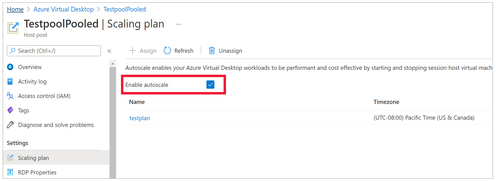

# Assign scaling plans to host pools in Azure Virtual Desktop

> [!IMPORTANT]
> Autoscale for personal host pools is currently in PREVIEW.
> See the [Supplemental Terms of Use for Microsoft Azure Previews](https://azure.microsoft.com/support/legal/preview-supplemental-terms/) for legal terms that apply to Azure features that are in beta, preview, or otherwise not yet released into general availability.

You can assign a scaling plan to any existing host pools in your deployment. When you assign a scaling plan to your host pool, the plan will apply to all session hosts within that host pool. The scaling plan also automatically applies to any new session hosts you create in the assigned host pool.

If you disable a scaling plan, all assigned resources will remain in the state they were in at the time you disabled it.

## Assign a scaling plan to a single existing host pool

To assign a scaling plan to an existing host pool:

1. Open the [Azure portal](https://portal.azure.com).

1. In the search bar, type *Azure Virtual Desktop* and select the matching service entry.

1. Select **Host pools**, and select the host pool you want to assign the scaling plan to.

1. Under the **Settings** heading, select **Scaling plan**, and then select **+ Assign**. Select the scaling plan you want to assign and select **Assign**. The scaling plan must be in the same Azure region as the host pool and the scaling plan's host pool type must match the type of host pool that you're trying to assign it to.

> [!TIP]
> If you've enabled the scaling plan during deployment, then you'll also have the option to disable the plan for the selected host pool in the **Scaling plan** menu by unselecting the **Enable autoscale** checkbox, as shown in the following screenshot.
>
> [!div class="mx-imgBorder"]
> 

## Assign a scaling plan to multiple existing host pools

To assign a scaling plan to multiple existing host pools at the same time:

1. Open the [Azure portal](https://portal.azure.com).

1. In the search bar, type *Azure Virtual Desktop* and select the matching service entry.

1. Select **Scaling plans**, and select the scaling plan you want to assign to host pools.

1. Under the **Manage** heading, select **Host pool assignments**, and then select **+ Assign**. Select the host pools you want to assign the scaling plan to and select **Assign**. The host pools must be in the same Azure region as the scaling plan and the scaling plan's host pool type must match the type of host pools you're trying to assign it to.

## Next steps

- Review how to create a scaling plan at [Autoscale for Azure Virtual Desktop session hosts](autoscale-new-existing-host-pool.md).
- Learn how to troubleshoot your scaling plan at [Enable diagnostics for your scaling plan](autoscale-diagnostics.md).
- Learn more about terms used in this article at our [autoscale glossary](autoscale-glossary.md).
- For examples of how autoscale works, see [Autoscale example scenarios](autoscale-scenarios.md).
- View our [autoscale FAQ](autoscale-faq.yml) to answer commonly asked questions.