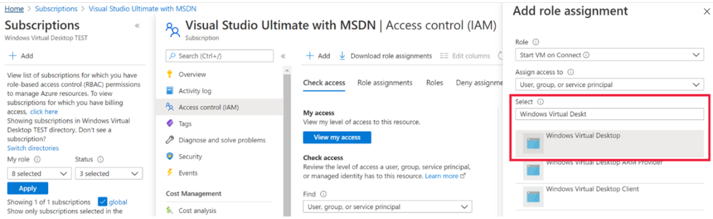

# Autoscale (preview) for Azure Virtual Desktop host pools

> [!IMPORTANT]
> The autoscale feature is currently in preview.
> See the [Supplemental Terms of Use for Microsoft Azure Previews](https://azure.microsoft.com/support/legal/preview-supplemental-terms/) for legal terms that apply to Azure features that are in beta, preview, or otherwise not yet released into general availability.

The autoscale feature (preview) lets you scale your Azure Virtual Desktop deployment's virtual machines (VMs) up or down to optimize deployment costs. Based on your needs, you can make a scaling plan based on:

- Time of day
- Specific days of the week
- Session limits per session host

>[!NOTE]
>Windows Virtual Desktop (classic) doesn't support the autoscale feature. It also doesn't support scaling ephermal disks.

For best results, we recommend using autoscale with VMs you deployed with Azure Virtual Desktop Azure Resource Manager templates or first-party tools from Microsoft.

## Requirements

Before you create your first scaling plan, make sure you follow these guidelines:

- You can currently only configure autoscale with pooled existing host pools.
- All host pools you autoscale must have a configured MaxSessionLimit parameter. Don't use the default value. You can configure this value in the host pool settings in the Azure portal or run the [New-AZWvdHostPool](/powershell/module/az.desktopvirtualization/new-azwvdhostpool?view=azps-5.7.0&preserve-view=true) or [Update-AZWvdHostPool](/powershell/module/az.desktopvirtualization/update-azwvdhostpool?view=azps-5.7.0&preserve-view=true) cmdlets in PowerShell.
- You must grant Azure Virtual Desktop access to manage power on your VM Compute resources.

## Create a Custom RBAC role

To start creating a scaling plan, you'll first need to create a custom Role-based Access Control (RBAC) role in your subscription. This role will allow Windows Virtual Desktop to power manage all VMs in your subscription. It will also let the service apply actions on both host pools and VMs when there are no active user sessions.

To create the custom role, follow the instructions in [Azure custom roles](../role-based-access-control/custom-roles.md), using this JSON template:

```json
 "properties": {
 "roleName": "Autoscale",
 "description": "Friendly description.",
 "assignableScopes": [
 "/subscriptions/<SubscriptionID>"
 ],
  "permissions": [
   {
   "actions": [
                      "Microsoft.Insights/eventtypes/values/read",
           "Microsoft.Compute/virtualMachines/deallocate/action",
                      "Microsoft.Compute/virtualMachines/restart/action",
                      "Microsoft.Compute/virtualMachines/powerOff/action",
                      "Microsoft.Compute/virtualMachines/start/action",
                      "Microsoft.Compute/virtualMachines/read",
                      "Microsoft.DesktopVirtualization/hostpools/read",
                      "Microsoft.DesktopVirtualization/hostpools/write",
                      "Microsoft.DesktopVirtualization/hostpools/sessionhosts/read",
                      "Microsoft.DesktopVirtualization/hostpools/sessionhosts/write",
                      "Microsoft.DesktopVirtualization/hostpools/sessionhosts/usersessions/delete",
"Microsoft.DesktopVirtualization/hostpools/sessionhosts/usersessions/read",                   "Microsoft.DesktopVirtualization/hostpools/sessionhosts/usersessions/sendMessage/action",
"Microsoft.DesktopVirtualization/hostpools/sessionhosts/usersessions/read"
],
  "notActions": [],
  "dataActions": [],
  "notDataActions": []
  }
 ]
}
}
```

## Assign custom roles

Next, you'll need to use the Azure portal to assign the custom role you created to your subscription.

To assign the custom role:

1. Open the Azure portal and go to **Subscriptions**.

2. Select the **+** button in the top left-hand corner of the screen, then select **Add custom role** from the drop-down menu, as shown in the following screenshot.

    > [!div class="mx-imgBorder"]
    > 

3. Next, name the custom role and add a description. We recommend you name the role “Autoscale.”

4. On the **Permissions** tab, add the following permissions to the subscription you're assigning the role to:

```azcopy
"Microsoft.Compute/virtualMachines/deallocate/action", 
"Microsoft.Compute/virtualMachines/restart/action", 
"Microsoft.Compute/virtualMachines/powerOff/action", 
"Microsoft.Compute/virtualMachines/start/action", 
"Microsoft.Compute/virtualMachines/read",
"Microsoft.DesktopVirtualization/hostpools/read",
"Microsoft.DesktopVirtualization/hostpools/write",
"Microsoft.DesktopVirtualization/hostpools/sessionhosts/read",
"Microsoft.DesktopVirtualization/hostpools/sessionhosts/write",
"Microsoft.DesktopVirtualization/hostpools/sessionhosts/usersessions/delete",
"Microsoft.DesktopVirtualization/hostpools/sessionhosts/usersessions/sendMessage/action",
"Microsoft.DesktopVirtualization/hostpools/sessionhosts/usersessions/read",
```

5. When you're finished, select **Ok**.

After that, you'll need to assign the role to grant access to Azure Virtual Desktop.

To assign the custom role to grant access:

1. In the **Access control (IAM) tab**, select **Add role assignments**.

2. Select the role you just created.

3. In the search bar, enter and select **Windows Virtual Desktop**, as shown in the following screenshot.

    > [!div class="mx-imgBorder"]
    > 

When adding the custom role in the Azure portal, make sure you've also selected the following permissions:

   - Microsoft.Compute/virtualMachines/deallocate/action
   - Microsoft.Compute/virtualMachines/restart/action
   - Microsoft.Compute/virtualMachines/powerOff/action
   - Microsoft.Compute/virtualMachines/start/action 
   - Microsoft.Compute/virtualMachines/read
   - Microsoft.DesktopVirtualization/hostpools/read
   - Microsoft.DesktopVirtualization/hostpools/write
   - Microsoft.DesktopVirtualization/hostpools/sessionhosts/read
   - Microsoft.DesktopVirtualization/hostpools/sessionhosts/write
   - Microsoft.DesktopVirtualization/hostpools/sessionhosts/usersessions/delete
   - Microsoft.DesktopVirtualization/hostpools/sessionhosts/usersessions/sendMessage/action
   - Microsoft.DesktopVirtualization/hostpools/sessionhosts/usersessions/read

These are the same permissions you entered back in step 4.

## How creating a scaling plan works

Before you create your plan, keep the following things in mind:

- You can assign one scaling plan to one or more host pools of the same host pool type. The scaling plan's schedule will also be applied across all assigned host pools.

- You can only associate one scaling plan per host pool. If you assign a single scaling plan to multiple host pools, those host pools can't be assigned to another scaling plan.

- A scaling plan can only operate in its configured time zone.

- A scaling plan can have one or multiple schedules. For example, different schedules during weekdays versus the weekend.

- Make sure you understand usage patterns before defining your schedule. You'll need to schedule around the following times of day:

    - Ramp-up: the start of the day, when usage picks up.
    - Peak hours: the time of day when usage is highest.
    - Ramp-down: when usage tapers off. This is usually when you shut down your VMs to save costs.
    - Off-peak hours: the time with the lowest possible usage. You can define the maximum number of VMs that can be active during this time.

- The scaling plan will take effect as soon as you enable it.

Also, keep these limitations in mind:

- Don’t use autoscale in combination with other scaling Microsoft or third-party scaling tools. Ensure that you disable those for the host pools you apply the scaling plans.

- Autoscale overwrites drain mode, so make sure to use exclusion tags when updating VMs in host pools.

- Autoscale ignores existing load-balancing algorithms in your host pool settings, and instead applies load balancing based on your schedule configuration.

## Create a scaling plan

To create a scaling plan:

1. Sign in to the Azure portal at [https://portal.azure.com](https://portal.azure.com/).

2. Go to **Azure Virtual Desktop** > **Scaling Plans**, then select **Create**.

3. In the **Basics** tab, look under **Project details** and select the name of the subscription you will assign the scaling plan to.

4. If you want to make a new resource group, select **Create new**. If you want to use an existing resource group, select its name from the drop-down menu.

5. Enter a name for the scaling plan into the **Name** field.

6. Optionally, you can also add a "friendly" name that will be displayed to your users and a description for your plan.

7. For **Region**, select a region for your scaling plan. The metadata for the object will be stored in the geography associated with the region. Currently, autoscale only supports the Central US and East US 2 regions. To learn more about regions, see [Data locations](data-locations.md).

8. For **Time zone**, select the time zone you'll use with your plan.

9. In **Exclusion tags**, enter tags for VMs you don't want to include in scaling operations. For example, you might want to use this functionality for maintenance. When you have set VMs on Drain mode use the tag so autoscale doesn’t override drain mode.

10. Select **Next**, which should take you to the **Schedules** tab.

## Configure a schedule

Schedules let you define when autoscale activates ramp-up and ramp-down modes throughout the day. In each phase of the schedule, autoscale only turns off VMs when a session host has no sessions active. The default values you'll see when you try to create a schedule are the suggested values for weekdays, but you can change them as needed. 

To create or change a schedule:

1. In the **Schedules** tab, select **Add schedule**.

2. Enter a name for your schedule into the **Name** field.

3. In the **Repeat on** field, select which days your schedule will repeat on.

4. In the **Ramp up** tab, fill out the following fields:

    - For **Start time**, select a time from the drop-down menu to start preparing VMs for peak business hours.

    - For **Load balancing algorithm**, we recommend selecting **breadth-first algorithm**. Breadth-first load balancing will distribute users across existing VMs to keep access times fast.
        
        >[!NOTE]
        >The load balancing preference you select here will override the one you selected for your original host pool settings.

    - For **Peak hours**, enter a start time for when your usage rate is highest during the day. Make sure the time is in the same time zone you specified for your scaling plan. This time is also the end time for your ramp-up phase.

    - For **Minimum percentage of session host VMs**, enter the amount of session host resources you want to use during ramp-up and peak hours. For example, if you choose **10%** and your host pool has 10 session hosts, autoscale will keep one session host available for user connections at all times during ramp-up and peak hours.
    
    - For **Capacity threshold**, enter the percentage of host pool usage that will trigger the start of the ramp-up and peak phases. For example, if you choose **60%** for a host pool that can handle 100 sessions, autoscale will only turn on additional hosts once the host pool goes over 60 sessions.

5. In the **Peak hours** tab, fill out the following fields:

    - For **Load balancing**, you can select either breadth-first or depth-first load balancing. Breadth-first load balancing distributes new user sessions across all available sessions in the host pool. Depth-first load balancing distributes new sessions to any available session host with the highest number of connections that hasn't reached its session limit yet. For more information about load-balancing types, see [Configure the Azure Virtual Desktop load-balancing method](configure-host-pool-load-balancing.md).

    >[!NOTE]
    >You can't change the capacity threshold here. Instead, the setting you entered in **Ramp-up** will carry over to this setting.

- For **Ramp-down**, you'll enter values into similar fields to **Ramp-up**, but this time it will be for when your host pool usage drops off. This will include the following fields:

    - Start time
    - Load-balancing algorithm
    - Minimum percentage of hosts (%)
    - Capacity threshold (%)
    - Force logoff users

- Likewise, **Off-peak hours** works the same way as **Peak hours**:

    - Start time, which is also the end of the ramp-down period.
    - Load-balancing algorithm. We recommend choosing **depth-first** to gradually reduce the number of session hosts based on sessions on each VM.
    - Just like peak hours, you can't configure the capacity threshold here. Instead, the value you entered in **Ramp-down** will carry over.

## Assign host pools

Now that you've set up your scaling plan, it's time to assign the plan to your host pools. Select the check box next to each host pool you want to include. If you don't want to enable autoscale, unselect all check boxes. You can always return to this setting later and change it.

>[!NOTE]
>When you create or update a scaling plan that's already assigned to host pools, its changes will immediately be applied.

## Add tags 

After that, you'll need to enter tags. Tags are name and value pairs that categorize resources for consolidated billing. You can apply the same tag to multiple resources and resource groups. To learn more about tagging resources, see [Use tags to organize your Azure resources](../azure-resource-manager/management/tag-resources.md).

>[!NOTE] 
>If you change resource settings on other tabs after creating tags, your tags will be automatically updated.

Once you're done, go to the **Review + create** tab and select **Create** to deploy your host pool.

## Next steps

Now that you've created your scaling plan, here are some things you can do:

- [Assign your scaling plan to new and existing host pools](autoscale-new-existing-host-pool.md)
- [Enable diagnostics for your scaling plan](autoscale-diagnostics.md)
