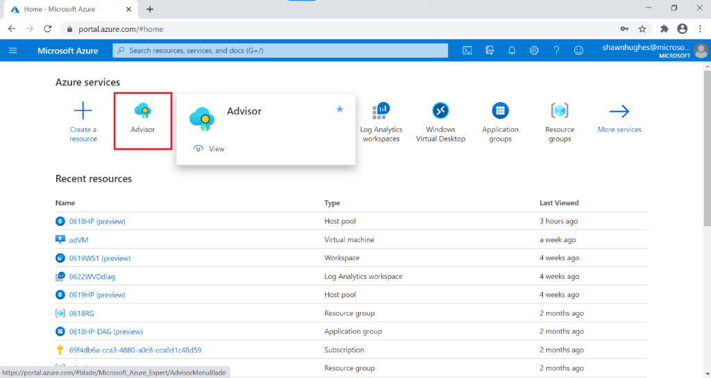
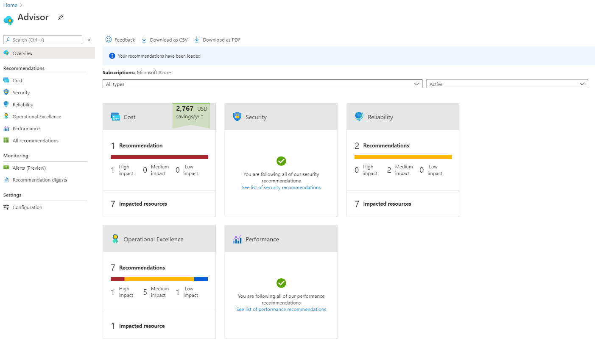
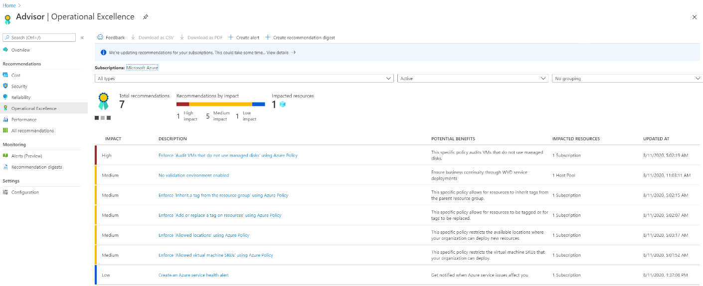

# Use Azure Advisor with Windows Virtual Desktop

Azure Advisor can help users resolve commonly encountered issues on their own without having to file support cases. This reduces the need to submit help requests, saving you time and costs.

This article will tell you how to set up Azure Advisor in your Windows Virtual Desktop deployment to help your users.

## What is Azure Advisor?

Azure Advisor analyzes your configurations and telemetry to offer personalized recommendations to solve common problems. With these recommendations, you can optimize your Azure resources for reliability, security, operational excellence, performance, and cost. Learn more at [the Azure Advisor website](https://azure.microsoft.com/services/advisor/).

## How to start using Azure Advisor

If you already have an Azure account on the Azure portal, you can use Azure Advisor. To start using Azure Advisor, visit the Azure portal at <https://portal.azure.com/#home>, then select **Advisor** under **Azure Services**, as shown in the following image. You can also enter "Azure Advisor" into the search bar in the Azure portal.

> [!div class="mx-imgBorder"]
> 

When you open Azure Advisor, you'll see five categories:

- Cost
- Security
- Reliability
- Operational Excellence
- Performance

> [!div class="mx-imgBorder"]
> 

When you select a category, you'll go to its active recommendations page. On this page, you can view which recommendations Azure Advisor has for you, as shown in the following image.

> [!div class="mx-imgBorder"]
> 

## Additional tips for Azure Advisor

- Make sure to check your recommendations frequently, at least more than once a week. Azure Advisor updates its active recommendations multiple times per day. Checking for new recommendations can prevent larger issues by helping you spot and solve smaller ones.

- Always try to solve the issues with the highest priority level in Azure Advisor. High priority issues are marked with red. Leaving high-priority recommendations unresolved can lead to problems down the line.

- If a recommendation seems less important, you can dismiss it or postpone it. To dismiss or postpone a recommendation, go to the **Action** column on the right side of the page and change its state.

- Don't dismiss recommendations until you know why they're appearing and are sure it won't have a negative impact on you or your users. Always select **Learn more** to see what the issue is. If you resolve an issue by following the instructions in Azure Advisor, it will automatically disappear from the list. You're better off resolving issues than postponing them repeatedly.

- Whenever you come across an issue in Windows Virtual Desktop, always check Azure Advisor first. Azure Advisor will give you directions for how to solve the problem, or at least point you towards a resource that can help.

## Next steps

For information on existing recommendations, visit <https://microsoft.sharepoint.com/:w:/t/RD20/EUk308l56ENBvi4y3qO6-3gB4fIBMsIddYyHKG20mf4bQQ?e=GCE9nA>

<!--Why is this going to a sharepoint link instead of official documentation? I don't want to point to an internal resource for an external doc.-->

If you have suggestions for new recommendations, post it at our [Azure Advisor User Voice forum](https://windowsvirtualdesktop.uservoice.com/forums/930847-azure-advisor-recommendations).
