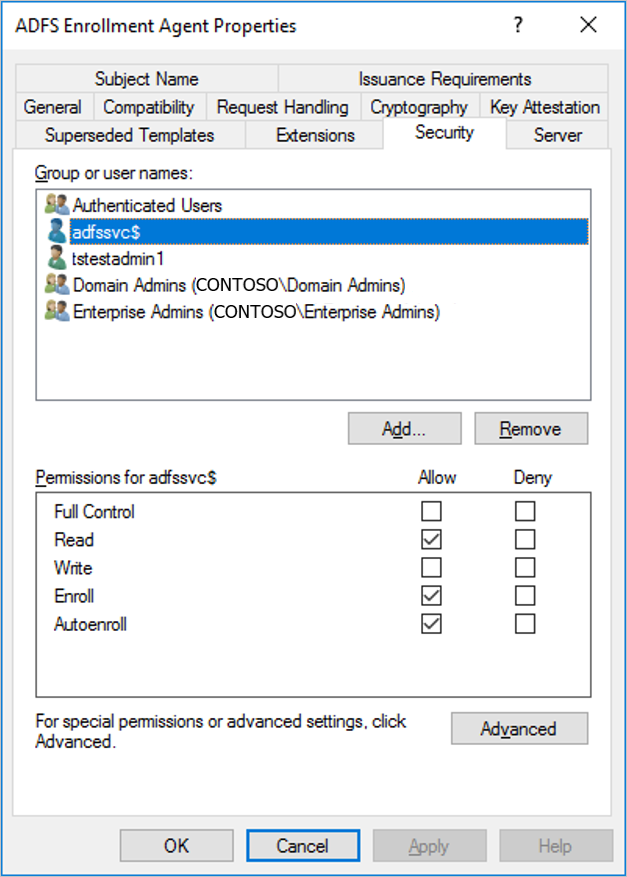
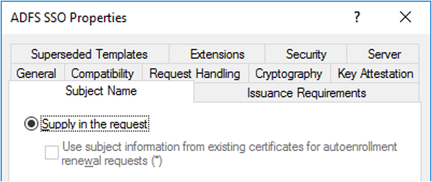
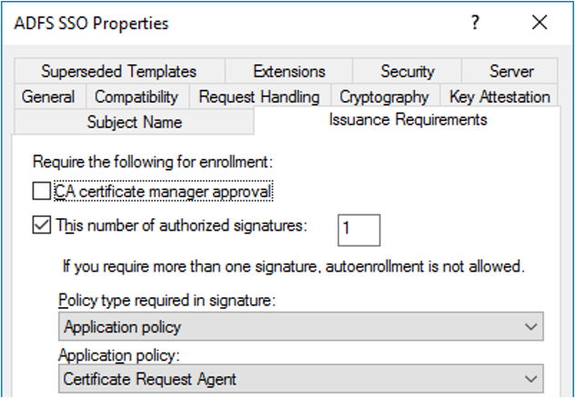
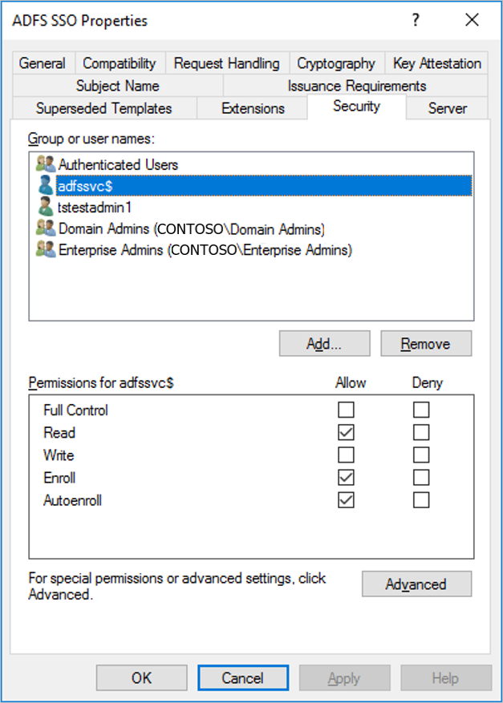
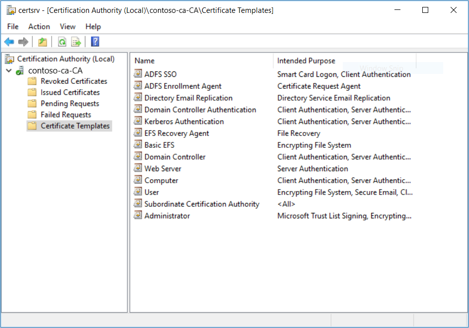

# Configure AD FS single sign-on for Windows Virtual Desktop
This article will walk you through the process of configuring Active Directory Federation Service (AD FS) single sign-on (SSO) for Windows Virtual Desktop.

## Prerequisites
Before configuring AD FS single sign-on, you must have the following setup and running in your environment:

- **Active Directory Certificate Services** - For the Active Directory Certificate Services role, make sure the servers running the role are domain-joined, have the latest Windows updates installed, and are configured as [enterprise certificate authorities](https://docs.microsoft.com/previous-versions/windows/it-pro/windows-server-2008-R2-and-2008/cc731183%28v%3dws.10%29).
- **Active Directory Federation Services (AD FS)** - The servers running this role must be domain-joined, have the latest Windows Updates installed, and running Windows Server 2016 or later. See this [federation tutorial](/azure/active-directory/hybrid/tutorial-federation.md) to get started.
- **Azure AD Connect** - For the Azure Active Directory (AD) Connect role, your service must be configured in [federation mode](/azure/active-directory/connect/active-directory-aadconnect-get-started-custom.md).

## Configure the certificate authority to issue smart cards

You must properly configure the following certificate templates so that AD FS can use SSO:

* Exchange Enrollment Agent (Offline Request) – AD FS uses the Exchange Enrollment Agent certificate template to request smart card logon certificates on the user's behalf. The smart card logon certificate template is the foundation of the smart card logon certificate.
* Smart card logon – AD FS will use this certificate template as the basis of the smart card logon certificate.

Once you create these certificate templates, you must enable them on the certificate authority so AD FS can request them.

### Configure the enrollment agent certificate template

1. On the certificate authority, run **mmc.exe** from the Start menu to launch the **Microsoft Management Console**.
2. Select **File...** > **Add/Remote Snap-in...** > **Certificate Templates** > **Add >** > **OK** to view the list of certificate templates.
3. Expand the **Certificate Templates**, right-click **Exchange Enrollment Agent (Offline Request)** and select **Duplicate Template**.
4. Select the **General** tab, then enter "ADFS Enrollment Agent" into the **Template display name** field. This will automatically set the template name to "ADFSEnrollmentAgent".
5. Select the **Security** tab, then select **Add...**.
6. Next, select **Object Types...**, then **Service Accounts**, and then **OK**.
7. Enter the service account name for AD FS and select **OK**.
     * In an isolated AD F setup, the service account will be named `adfssvc$`.
     * If you setup AD F via Azure AD Connect, the service account will be named `aadcsvc$`.
8. After the service account is added and is visible in the **Security** tab, select it in the **Group or user names** pane, select **Allow** for both "Enroll" and "Autoenroll", then select **OK** to save.

    

### Configure the smart card logon certificate template for interactive logon

1. On the certificate authority, run **mmc.exe** from the Start menu to launch the **Microsoft Management Console**.
2. Select **File...** > **Add/Remote Snap-in...** > **Certificate Templates** > **Add >** > **OK** to view the list of certificate templates.
3. Expand the **Certificate Templates**, right-click **Smart card Logon** and select **Duplicate Template**.
4. Select the **General** tab, then enter "ADFS SSO" into the **Template display name** field. This will automatically set the template name to "ADFSSSO".
   > [!NOTE]
   > Since this certificate is requested on-demand, we recommend shortening the validity period to 8 hours and the renewal period to 1 hour.

5. Select the **Subject name** tab and then select **Supply in the request**.
  
    [  ](media/adfs-sso-properties-subject-expanded.png#lightbox)

6. Select **Extensions** and **Issuance Requirements**.
7. Select **This number of authorized signatures** and enter the value of **1**.
   
    [  ](media/adfs-sso-properties-issuance-expanded.png#lightbox)

8. For **Application policy**, select **Certificate Request Agent**.
9.  Select the **Security** tab, then select **Add...**.
10. Select **Object Types...**, **Service Accounts**, and **OK**.
11. Enter the service account name for AD FS just like you did in the [Configure the enrollment agent certificate template](#configure-the-enrollment-agent-certificate-template) section.
     * In an isolated AD FS setup, the service account will be named `adfssvc$`.
     * If you setup AD FS via Azure AD Connect, the service account will be named `aadcsvc$`.

12. After the service account is added and is visible in the **Security** tab, select it in the **Group or user names** pane, select **Allow** for both "Enroll" and "Autoenroll", then select **OK** to save.

     

### Enable the new certificate templates on the certificate authority

1. On the certificate authority, launch **MMC** from the Start menu.
2. Select **File...** > **Add/Remove Snap-in...** > **Certification Authority** > **Add >** > **Finish** > and **OK** to view the list of certificate templates.
3. Expand the certificate authority on the left-hand pane and open **Certificate Templates**.
4. Right-click in the middle-pane with the list of certificate templates, select **New**, and select **Certificate Template to Issue**.
5. Select both **ADFS Enrollment Agent** and **ADFS SSO**, then select **OK**. You should see both templates in the pane on the right side of the window.
    
6. Run the following PowerShell command to configure AD FS to use the certificate templates:
  ```powershell
  Set-AdfsCertificateAuthority -EnrollmentAgentCertificateTemplate "ADFSEnrollmentAgent" -LogonCertificateTemplate "ADFSSSO" -EnrollmentAgent
  ```

### Configure a relying-party trust on your AD FS

You must create a relying-party trust between your AD FS servers and the Windows Virtual Desktop service so single sign-on certificate requests can be forwarded correctly to your domain environment.

The PowerShell script itself is **ConfigureWVDSSO.ps1** and is available in the [PowerShell Gallery](https://www.powershellgallery.com/packages/ConfigureWVDSSO/1.0.0.0/Content/ConfigureWVDSSO.ps1). This script only has one required parameter:

- *ADFSAuthority* - This is the URL that resolves to your AD FS and uses "/adfs" as its suffix. For example, `https://adfs.contoso.com/adfs`.

To configure AD FS single sign-on for users in your Windows Virtual Desktop tenant, run the following PowerShell cmdlet with <ADFSServiceUrl> replaced with the full URL to reach your AD FS service:

```powershell
Install-Script ConfigureWVDSSO
$config = ConfigureWVDSSO.ps1 -ADFSAuthority <ADFSServiceUrl>
```

> [!Note]
> You need the `$config` variable values to complete the next part of the instructions, so don't close the PowerShell window you used to complete the previous instructions. You can either keep using the same PowerShell window or leave it open while launching a new PowerShell session.


### Update your Windows Virtual Desktop tenant with AD FS single sign-on parameters

Now it's time to configure the AD FS SSO parameters of your Windows Virtual Desktop tenant. To do this, [download and import the Windows Virtual Desktop PowerShell module](https://docs.microsoft.com/powershell/windows-virtual-desktop/overview) to use in your PowerShell session if you haven't already. After that, run the following cmdlet to sign in to your account:

```powershell
Add-RdsAccount -DeploymentUrl "https://rdbroker.wvd.microsoft.com"
```

After that, update the SSO information for your Windows Virtual Desktop tenant by running the following cmdlet:

```powershell
TODO TODO TODO
Set-RdsTenant -Name <RdsTenantName> -SSOAdfsAuthority $config.SSOAdfsAuthority -SsoClientId $config.SSOClientId -SSOClientSecret $config.SSOClientSecret
Update-AzWVDTenant -ResourceGroup <ResourceGroupName> -Name <RdsTenantName> -SSOAdfsAuthority <ADFS URL> -SsoClientId <ClientId> -ssoSecretType [CertificateInKeyVault/SharedKeyInKeyVault] - ssoClientSecretKeyVaultPath <key vault URI>
```

## Next steps

Now that you've configured single sign-on, you can sign in to a Windows Virtual Desktop client to test it as part of a user session. These next two How-tos will tell you how to connect to a session using the client of your choice:

- [Connect with the Windows Desktop client](connect-windows-7-and-10.md)
- [Connect with the web client](connect-web.md)