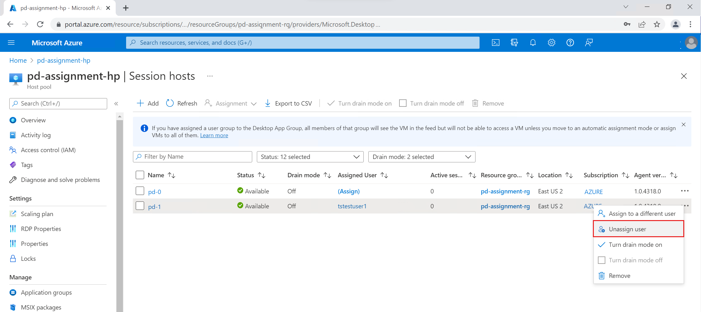
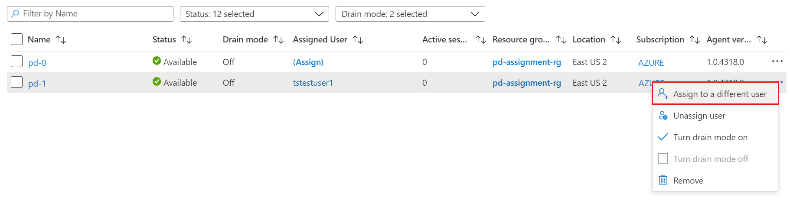
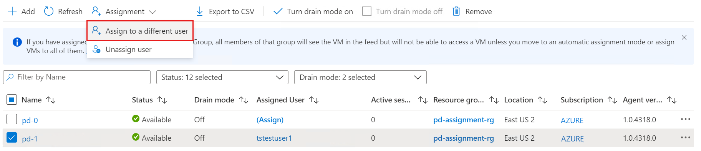

# Configure personal desktop assignment

>[!IMPORTANT]
>This content applies to Azure Virtual Desktop with Azure Resource Manager Azure Virtual Desktop objects. If you're using Azure Virtual Desktop (classic) without Azure Resource Manager objects, see [this article](./virtual-desktop-fall-2019/configure-host-pool-personal-desktop-assignment-type-2019.md).

You can configure the assignment type of your personal desktop host pool to adjust your Azure Virtual Desktop environment to better suit your needs. In this topic, we'll show you how to configure automatic or direct assignment for your users.

>[!NOTE]
> The instructions in this article only apply to personal desktop host pools, not pooled host pools, since users in pooled host pools aren't assigned to specific session hosts.

## Prerequisites

If you're using either the Azure portal or PowerShell method, you'll need the following things:

- A personal host pool with at least one session host.
- An Azure account assigned the [Desktop Virtualization Contributor](rbac.md#desktop-virtualization-contributor) role.
- If you want to use Azure CLI or Azure PowerShell locally, see [Use Azure CLI and Azure PowerShell with Azure Virtual Desktop](cli-powershell.md) to make sure you have the [desktopvirtualization](/cli/azure/desktopvirtualization) Azure CLI extension or the [Az.DesktopVirtualization](/powershell/module/az.desktopvirtualization) PowerShell module installed. Alternatively, use the [Azure Cloud Shell](../cloud-shell/overview.md).

If you're assigning desktops with PowerShell, you'll need to [download and install the Azure Virtual Desktop PowerShell module](powershell-module.md) if you haven't already.

### Define variables

The PowerShell commands listed in this article require defining the following variables with the placeholder values replaced with the values relevant to your account and deployment:

```powershell
#Define variables
$subscriptionId = <00000000-0000-0000-0000-000000000000>
$resourceGroupName = <MyResourceGroupName>
$hostPoolName = <MyHostPoolName>
$sessionHostName = <SessionHostName>
```

## Personal host pools overview

A personal host pool is a type of host pool that has personal desktops. Personal desktops have one-to-one mapping, which means a single user can only be assigned to a single personal desktop. Every time the user signs in, their user session is directed to their assigned personal desktop session host. This host pool type is ideal for customers with resource-intensive workloads because user experience and session performance will improve if there's only one session on the session host. Another benefit of this host pool type is that user activities, files, and settings persist on the virtual machine operating system (VM OS) disk after the user signs out.

Users must be assigned to a personal desktop to start their session. There are two types of assignments in a personal host pool: automatic assignment and direct assignment.

## Configure automatic assignment

Automatic assignment assigns users a personal desktop the first time they connect. It's the default assignment type for new personal desktop host pools you create in your Azure Virtual Desktop environment. Automatically assigning users doesn't require a specific session host.

To automatically assign users, first assign them to the personal desktop host pool so that they can see the desktop in their feed. When an assigned user launches the desktop in their feed, their user session will be load-balanced to an available session host if they haven't already connected to the host pool. You can still [assign a user directly to a session host](#configure-direct-assignment) before they connect, even if the assignment type is set automatic.

#### [Azure portal](#tab/azure)

To configure automatic assignment in the Azure portal:

1. Sign in to the [Azure portal](https://portal.azure.com/).

1. In the search bar, enter *Azure Virtual Desktop* and select the matching service entry.

1. Select **Host pools**, then select the personal host pool you want to configure automatic assignment.

1. Next, select **Properties**, then go to the **Assignment** drop-down menu and select **Automatic**.

1. Select **Save**.

#### [PowerShell](#tab/powershell)

Here's how to configure a host pool to automatically assign users to VMs using the [Az.DesktopVirtualization](/powershell/module/az.desktopvirtualization) PowerShell module.

[!INCLUDE [include-cloud-shell-local-cli](includes/include-cloud-shell-local-cli.md)]

2. Run the `Update-AzWvdHostPool` command in the following example to configure a host pool to automatically assign users to VMs. For more information about the parameters,see the [az-desktopvirtualization-hostpool Azure CLI reference](/cli/azure/desktopvirtualization/hostpool).

   ```powershell
   Update-AzWvdHostPool -ResourceGroupName $resourceGroupName -Name $hostPoolName -PersonalDesktopAssignmentType Automatic
   ```

---

## Configure direct assignment

Unlike automatic assignment, when you use direct assignment, you assign a specific personal desktop to a user first. You must assign the user to both the personal desktop host pool and a specific session host before they can connect to their personal desktop. If the user is only assigned to a host pool without a session host assignment, they won't be able to access resources and will see an error message that says **No resources available**.

#### [Azure portal](#tab/azure)

To configure direct assignment in the Azure portal:

1. Sign in to the [Azure portal](https://portal.azure.com/).

1. In the search bar, type *Azure Virtual Desktop* and select the matching service entry.

1. Select **Host pools**, then select the personal host pool you want to configure automatic assignment.

1. Next, select **Properties**, then go to the **Assignment** drop-down menu and select **Direct**.

1. Select **Save**.

#### [PowerShell](#tab/powershell)

Here's how to configure a host pool to require direct assignment of users to session hosts using the [Az.DesktopVirtualization](/powershell/module/az.desktopvirtualization) PowerShell module.

[!INCLUDE [include-cloud-shell-local-cli](includes/include-cloud-shell-local-cli.md)]

2. Run the `Update-AzWvdHostPool` command in the following example to configure a host pool to require direct assignment. For more information about the parameters,see the [az-desktopvirtualization-hostpool Azure CLI reference](/cli/azure/desktopvirtualization/hostpool).

   ```powershell
   Update-AzWvdHostPool -ResourceGroupName $resourceGroupName -Name $hostPoolName -PersonalDesktopAssignmentType Direct
   ```

---

### Directly assign users to session hosts

#### [Azure portal](#tab/azure)

To directly assign a user to a session host in the Azure portal:

1. Sign in to the [Azure portal](https://portal.azure.com).

1. Enter **Azure Virtual Desktop** into the search bar.

1. Under **Services**, select **Azure Virtual Desktop**.

1. At the Azure Virtual Desktop page, go the menu on the left side of the window and select **Host pools**.

1. Select the host pool you want to assign users to.

1. Next, go to the menu on the left side of the window and select **Application groups**.

1. Select the name of the app group you want to assign users to, then select **Assignments** in the menu on the left side of the window.

1. Select **+ Add**, then select the users or user groups you want to assign to this app group.

1.  Select **Assign VM** in the Information bar to assign a session host to a user.

1. Select the session host you want to assign to the user, then select **Assign**. You can also select **Assignment** > **Assign user**.

1. Select the user you want to assign the session host to from the list of available users.

1. When you're done, select **Select**.

#### [PowerShell](#tab/powershell)

Here's how to configure a host pool to assign a user to a specific session host using the [Az.DesktopVirtualization](/powershell/module/az.desktopvirtualization) PowerShell module.

[!INCLUDE [include-cloud-shell-local-cli](includes/include-cloud-shell-local-cli.md)]

2. Run the `Update-AzWvdHostPool` command in the following example to assign a user to a session host. For more information about the parameters,see the [az-desktopvirtualization-hostpool Azure CLI reference](/cli/azure/desktopvirtualization/hostpool).

   ```powershell
   Update-AzWvdSessionHost -HostPoolName $hostPoolName -Name $sessionHostName -ResourceGroupName $resourceGroupName -AssignedUser <userupn>
   ```
---

## Unassign a personal desktop

#### [Azure portal](#tab/azure)

To unassign a personal desktop in the Azure portal:

1. Sign in to the [Azure portal](https://portal.azure.com).

1. Enter **Azure Virtual Desktop** into the search bar.

1. Under **Services**, select **Azure Virtual Desktop**.

1. At the Azure Virtual Desktop page, go the menu on the left side of the window and select **Host pools**.

1. Select the host pool you want to modify user assignment for.

1. Next, go to the menu on the left side of the window and select **Session hosts**.

1. Select the checkbox next to the session host you want to unassign a user from, select the ellipses at the end of the row, and then select **Unassign user**. You can also select **Assignment** > **Unassign user**.

    > [!div class="mx-imgBorder"]
    > 
    
    > [!div class="mx-imgBorder"]
    > 

1. Select **Unassign** when prompted with the warning.

#### [PowerShell](#tab/powershell)

Here's how to configure a host pool to unassign a personal desktop using the [Az.DesktopVirtualization](/powershell/module/az.desktopvirtualization) PowerShell module.

[!INCLUDE [include-cloud-shell-local-cli](includes/include-cloud-shell-local-cli.md)]

2. Run the `Invoke-AzRestMethod` command in the following example to unassign a personal desktop. For more information about the parameters,see the [az-desktopvirtualization-hostpool Azure CLI reference](/cli/azure/desktopvirtualization/hostpool).

   ```powershell
   $unassignDesktopParams = @{
     Path = "/subscriptions/$subscriptionId/resourceGroups/$resourceGroupName/providers/Microsoft.DesktopVirtualization/hostPools/$hostPoolName/sessionHosts/$($sessionHostName)?api-version=2022-02-10-preview&force=true"
     Payload = @{
       properties = @{
         assignedUser = ''
       }} | ConvertTo-Json
     Method = 'PATCH'
   }
   Invoke-AzRestMethod @unassignDesktopParams
   ```
---

## Reassign a personal desktop

#### [Azure portal](#tab/azure)

To reassign a personal desktop in the Azure portal:

1. Sign in to the [Azure portal](https://portal.azure.com).

1. Enter **Azure Virtual Desktop** into the search bar.

1. Under **Services**, select **Azure Virtual Desktop**.

1. At the Azure Virtual Desktop page, go the menu on the left side of the window and select **Host pools**.
1. Select the host pool you want to modify user assignment for.

1. Next, go to the menu on the left side of the window and select **Session hosts**.

1. Select the checkbox next to the session host you want to reassign to a different user, select the ellipses at the end of the row, and then select **Assign to a different user**. You can also select **Assignment** > **Assign to a different user**.

    > [!div class="mx-imgBorder"]
    > 

    > [!div class="mx-imgBorder"]
    > 

1. Select the user you want to assign the session host to from the list of available users.

1. When you're done, select **Select**.

#### [PowerShell](#tab/powershell)

Here's how to reassign a personal desktop using the [Az.DesktopVirtualization](/powershell/module/az.desktopvirtualization) PowerShell module.

[!INCLUDE [include-cloud-shell-local-cli](includes/include-cloud-shell-local-cli.md)]

2. Run the following command to define the `$reassignUserUpn` variable by running the following command:

   ```powershell
   $reassignUserUpn = <UPN of user you are reassigning the desktop to>
   ```

3. Run the `Invoke-AzRestMethod` command in the following example to reassign a personal desktop. For more information about the parameters,see the [az-desktopvirtualization-hostpool Azure CLI reference](/cli/azure/desktopvirtualization/hostpool).

   ```powershell
   $reassignDesktopParams = @{
     Path = "/subscriptions/$subscriptionId/resourceGroups/$resourceGroupName/providers/Microsoft.DesktopVirtualization/hostPools/$hostPoolName/sessionHosts/$($sessionHostName)?api-version=2022-02-10-preview&force=true"
     Payload = @{
       properties = @{
         assigneduser = $reassignUserUpn
       }} | ConvertTo-Json
     Method = 'PATCH'
   }
   Invoke-AzRestMethod @reassignDesktopParams
   ```

---

## Give session hosts in a personal host pool a friendly name

You can give personal desktops you create *friendly names* to help users distinguish them in their feeds. You need a [REST API](/rest/api/desktopvirtualization/session-hosts/update?tabs=HTTP) to configure the friendly name.

Run the following command in PowerShell to use the REST API to give your session host a friendly name:

```powershell
$body = '{ "properties": {
"friendlyName": "friendlyName"
} }'
$parameters = @{
    Method = 'Patch'
    Path = "/subscriptions/$subscriptionId/resourceGroups/$resourceGroupName/providers/Microsoft.DesktopVirtualization/hostPools/$hostPoolName/sessionHosts/$($sessionHostName)?api-version=2022-02-10-preview"
    Payload = $body
}

Invoke-AzRestMethod @parameters
```

The Azure portal doesn't currently have a way to give session host friendly names.

### Get the session host friendly name

To get the session host friendly name, run the following command in PowerShell:

```powershell
$getParams = @{
  Path = '/subscriptions/$subscriptionId/resourceGroups/$resourceGroupName/providers/Microsoft.DesktopVirtualization/hostPools/$hostPoolName/sessionHosts/$($sessionHostName)?api-version=2022-02-10-preview'
  Method = 'GET'
}
Invoke-AzRestMethod @getParams
```

There isn't currently a way to get the session host friendly name in the Azure portal.

## Next steps

Now that you've configured the personal desktop assignment type and given your session host a friendly name, you can sign in to an Azure Virtual Desktop client to test it as part of a user session. These articles will show you how to connect to a session using the client of your choice:

- [Connect with the Windows Desktop client](./users/connect-windows.md)
- [Connect with the web client](./users/connect-web.md)
- [Connect with the Android client](./users/connect-android-chrome-os.md)
- [Connect with the iOS client](./users/connect-ios-ipados.md)
- [Connect with the macOS client](./users/connect-macos.md)