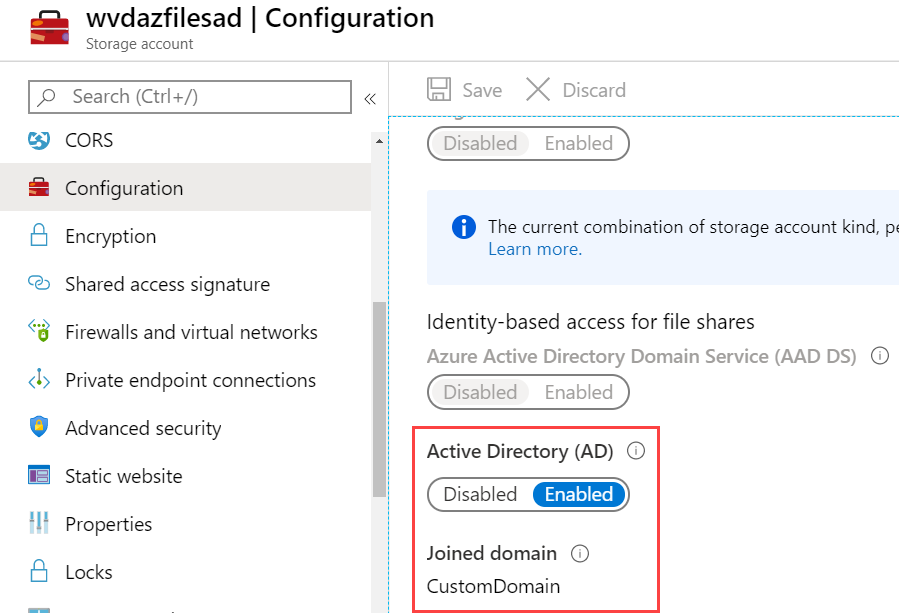

# Create a profile container with Azure Files and AD DS

In this article, you'll learn how to create an Azure file share authenticated by a domain controller on an existing Windows Virtual Desktop host pool. You can use this file share to store storage profiles.

This process uses Active Directory Domain Services (AD DS), which is an on-prem directory service. If you're looking for information about how to create an FSLogix profile container with Azure AD DS, see [Create an FSLogix profile container with Azure Files](create-profile-container-adds.md).

## Prerequisites

Before you get started, make sure your domain controller is synchronized to Azure and resolvable from the Azure virtual network (VNET) your session hosts are connected to.

## Set up a storage account

First, you'll need to set up an Azure Files storage account.

To set up a storage account:

1. Sign in to the Azure portal.

2. Search for **storage account** in the search bar.

3. Select **+Add**.

4. Enter the following information into the  **Create storage account** page:

    - Create a new resource group.
    - Enter a unique name for your storage account.
    - For **Location**, we recommend you choose the same location as the Windows Virtual Desktop host pool.
    - For **Performance**, select **Standard**. (Depending on your IOPS requirements. For more information, see [Storage options for FSLogix profile containers in Windows Virtual Desktop](store-fslogix-profile.md).)
    - For **Account type**, select **StorageV2** or **FileStorage** (only available if Performance tier is Premium).
    - For **Replication**, select **Locally-redundant storage (LRS)**.

5. When you're done, select **Review + create**, then select **Create**.

If you need more detailed configuration instructions, see [Regional availability](../storage/files/storage-files-identity-auth-active-directory-enable.md#regional-availability).

## Create an Azure file share

Next, you'll need to create an Azure file share.

To create a file share:

1. Select **Go to resource**.

2. On the Overview page, select **File shares**.

3. Select **+File shares**, create a new file share named **profiles**, then either enter an appropriate quota or leave the field blank for no quota.

4. Select **Create**.

## Enable Active Directory authentication

Next, you'll need to enable Active Directory (AD) authentication. To enable this policy, you'll need to follow this section's instructions on a machine that's already domain-joined. To enable authentication, follow these instructions on the VM running the domain controller:

1. Remote Desktop Protocol into the domain-joined VM.

2. Follow the instructions in [Enable Azure AD DS authentication for your Azure file shares](../storage/files/storage-files-identity-ad-ds-enable.md) to install the AzFilesHybrid module and enable authentication.

3.  Open the Azure portal, open your storage account, select **Configuration**, then confirm **Active Directory (AD)** is set to **Enabled**.

     > [!div class="mx-imgBorder"]
     > 

## Assign Azure RBAC permissions to Windows Virtual Desktop users

All users that need to have FSLogix profiles stored on the storage account must be assigned the Storage File Data SMB Share Contributor role.

Users signing in to the Windows Virtual Desktop session hosts need access permissions to access your file share. Granting access to an Azure File share involves configuring permissions both at the share level as well as on the NTFS level, similar to a traditional Windows share.

To configure share level permissions, assign each user a role with the appropriate access permissions. Permissions can be assigned to either individual users or an Azure AD group. To learn more, see [Assign access permissions to an identity](../storage/files/storage-files-identity-ad-ds-assign-permissions.md).

>[!NOTE]
>The accounts or groups you assign permissions to should have been created in the domain and synchronized with Azure AD. Accounts created in Azure AD won't work.

To assign role-based access control (RBAC) permissions:

1. Open the Azure portal.

2. Open the storage account you created in [Set up a storage account](#set-up-a-storage-account).

3. Select **Access Control (IAM)**.

4. Select **Add a role assignment**.

5. In the **Add role assignment** tab, select **Storage File Data SMB Share Elevated Contributor** for the administrator account.

     To assign users permissions for their FSLogix profiles, follow these same instructions. However, when you get to step 5, select **Storage File Data SMB Share Contributor** instead.

6. Select **Save**.

## Assign users permissions on the Azure file share

Once you've assigned RBAC permissions to your users, next you'll need to configure the NTFS permissions.

You'll need to know two things from the Azure portal to get started:

- The UNC path.
- The storage account key.

### Get the UNC path

Here's how to get the UNC path:

1. Open the Azure portal.

2. Open the storage account you created in [Set up a storage account](#set-up-a-storage-account).

3. Select **Settings**, then select **Properties**.

4. Copy the **Primary File Service Endpoint** URI to the text editor of your choice.

5. After copying the URI, do the following things to change it into the UNC:

    - Remove `https://` and replace with `\\`
    - Replace the forward slash `/` with a back slash `\`.
    - Add the name of the file share you created in [Create an Azure file share](#create-an-azure-file-share) to the end of the UNC.

        For example: `\\customdomain.file.core.windows.net\<fileshare-name>`

### Get the storage account key

To get the storage account key:

1. Open the Azure portal.

2. Open the storage account you created in [Set up a storage account](#set-up-a-storage-account).

3. On the **Storage account** tab, select **Access keys**.

4. Copy **key1** or **key2** to a file on your local machine.

### Configure NTFS permissions

To configure your NTFS permissions:

1. Open a command prompt on a domain-joined VM.

2. Run the following cmdlet to mount the Azure file share and assign it a drive letter:

     ```powershell
     net use <desired-drive-letter>: <UNC-pat> <SA-key> /user:Azure\<SA-name>
     ```

3. Run the following cmdlet to review the access permissions to the Azure file share:

    ```powershell
    icacls <mounted-drive-letter>:
    ```

    Replace `<mounted-drive-letter>` with the letter of the drive you mapped to.

    Both *NT Authority\Authenticated Users* and *BUILTIN\Users* have certain permissions by default. These default permissions let these users read other users' profile containers. However, the permissions described in [Configure storage permissions for use with Profile Containers and Office Containers](/fslogix/fslogix-storage-config-ht) don't let users read each others' profile containers.

4. Run the following cmdlets to let your Windows Virtual Desktop users create their own profile containers while blocking access to their profile container from other users.

     ```powershell
     icacls <mounted-drive-letter>: /grant <user-email>:(M)
     icacls <mounted-drive-letter>: /grant "Creator Owner":(OI)(CI)(IO)(M)
     icacls <mounted-drive-letter>: /remove "Authenticated Users"
     icacls <mounted-drive-letter>: /remove "Builtin\Users"
     ```

     - Replace <mounted-drive-letter> with the letter of the drive you used to map the drive.
     - Replace <user-email> with the UPN of the user or Active Directory group that contains the users that will require access to the share.

     For example:

     ```powershell
     icacls <mounted-drive-letter>: /grant john.doe@contoso.com:(M)
     icacls <mounted-drive-letter>: /grant "Creator Owner":(OI)(CI)(IO)(M)
     icacls <mounted-drive-letter>: /remove "Authenticated Users"
     icacls <mounted-drive-letter>: /remove "Builtin\Users"
     ```

5. Select **Apply**.

## Configure FSLogix on session host VMs

This section will show you how to configure a VM with FSLogix. You'll need to follow these instructions every time you configure a session host. Before you start configuring, follow the instructions in [Download and install FSLogix](/fslogix/install-ht). There are several options available that ensure the registry keys are set on all session hosts. You can set these options in an image or configure a group policy.

To configure FSLogix on your session host VM:

1. RDP to the session host VM of the Windows Virtual Desktop host pool.

2. [Download and install FSLogix](/fslogix/install-ht).

5. Follow the instructions in [Configure profile container registry settings](/fslogix/configure-profile-container-tutorial#configure-profile-container-registry-settings):

    - Navigate to **Computer** > **HKEY_LOCAL_MACHINE** > **SOFTWARE** > **FSLogix**.

    - Create a **Profiles** key.

    - Create **Enabled, DWORD** with a value of 1.

    - Create **VHDLocations, MULTI_SZ**.

    - Set the value of **VHDLocations** to the UNC path you generated in [Get the UNC path](#get-the-unc-path).

6. Restart the VM.

## Testing

Once you've installed and configured FSLogix, you can test your deployment by signing in with a user account that's been assigned an app group or desktop on the host pool. Make sure the user account you sign in with has permission on the file share.

If the user has signed in before, they'll have an existing local profile that will be used during this session. To avoid creating a local profile, either create a new user account to use for tests or use the configuration methods described in [Tutorial: Configure Profile Container to redirect User Profiles](/fslogix/configure-profile-container-tutorial/).

To check your permissions on your session:

1. Start a session on Windows Virtual Desktop.

2. Open the Azure portal.

3. Open the storage account you created in [Set up a storage account](#set-up-a-storage-account).

4. Select **Create a share** on the Create an Azure file share page.

5. Make sure a folder containing the user profile now exists in your files.

For additional testing, follow the instructions in [Make sure your profile works](create-profile-container-adds.md#make-sure-your-profile-works).

## Next steps

To troubleshoot FSLogix, see [this troubleshooting guide](/fslogix/fslogix-trouble-shooting-ht).
