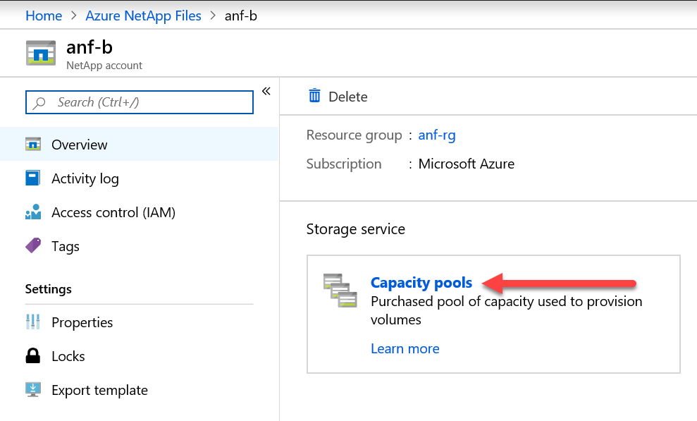
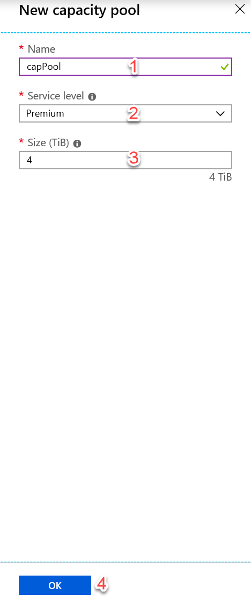

# Create an FSLogix profile container in Windows Virtual Desktop

Windows Virtual Desktop is in [publicly preview](https://aka.ms/wvdpreview) and we wanted to share this step by step guide on how you can get FSLogix profile
containers on [Azure NetApp Files](https://azure.microsoft.com/en-us/services/netapp/).

We are going to assume that you already have a set of VMs that are part of a Windows Virtual Desktop environment. Information on how to get that available at the official Windows Virtual Desktop documentation [here](https://docs.microsoft.com/en-us/azure/virtual-desktop/tenant-setup-azure-active-directory) or on the blog post in Tech Community [here](https://techcommunity.microsoft.com/t5/Windows-IT-Pro-Blog/Getting-started-with-Windows-Virtual-Desktop/ba-p/391054).

The full documentation for configuring Azure NetApp Files are available [here](https://docs.microsoft.com/en-us/azure/azure-netapp-files/azure-netapp-files-quickstart-set-up-account-create-volumes). In this article we have modified added steps particular to Windows Virtual Desktop.

This article will not cover best practices for securing access to the Azure NetApp Files share.

## Prerequisites 

-   Windows Virtual Desktop setup and configured
-   [Subscription is enabled for Azure NetApp Files](https://docs.microsoft.com/en-us/azure/azure-netapp-files/azure-netapp-files-register)

## Set up Azure NetApp Files and create an NFS volume

1. Log in to [Azure portal](https://microsoft-my.sharepoint.com/personal/stgeorgi_microsoft_com/Documents/RDS%20work/wvd%20and%20fslogix/portal.azure.com). Make sure your account has contributor or administrator permissions.

2. Open the **Azure Cloud Shell** by clicking its icon.


3. When the **Azure Cloud Shell** window opens select **PowerShell.**


4. If this is the first time using **Azure Cloud Shell** create storage account in the same subscription where **Azure NetApp Files** and **Windows Virtual Desktop.**


Once **Azure Cloud Shell** loads run the following two commands. Make sure to use correct subscription id.

```shell
az account set --subscription <subscriptionId>
```

```shell
az provider register --namespace Microsoft.NetApp --wait
```


From left hand side select **All services** and in the search box enter **Azure NetApp Files.**


Click on **Azure NetApp Files** click **Create.**

Select the **Add** button. This will open **New NetApp account** blade. Enter:

**Name** – name of NetApp account

**Subscription** – same subscription that was used in previous steps

**Resource group** – existing or a new resource group

**Location** – region where NetApp account will be created. This region must be the same region where the session host VMs are located.

>[!NOTE]
>Currently Azure NetApp Files does not support mounting of a volume across regions.

Click **Create.** This will start a deployment. Wait for its completion.


Once the NetApp account has been created click on it and create a capacity pool.





This will open a **New capacity pool** blade. Enter:

**Name** – name for the capacity pool

**Service level** – select value from the drop down. Our recommendation for most environments is premium.

**Size (TiB)** – enter size that fits your needs. Please note that as of the writing of this document the minimum size is 4 TiB.



Click **OK.**

Click **Active Directory** connections and then select **Join** button to trigger **Join Active Directory** configuration wizard.


In the **Join Active Directory** configuration wizard enter:

**Primary DNS** – IP address of the DNS server in your environment that can resolve the domain name.

**Domain** – FQDN

**SMB Server (Computer Account) Prefix** – string to be appended to the computer account.

**Username** – account with permissions to perform domain join.

**Password**

>[!NOTE]
>It is a good practice to confirm that the computer account specified in **Join Active Directory** configuration wizard has appeared in your domain controller under **Computers.**


Click **Volumes** and create new volume by clicking the **Add volume** button.


In the **Create a volume** blade enter:

**Volume name** – name for the new volume

**Capacity pool** – capacity pool under which this volume will be create. Use the one we just created.

**Quota (GiB)** – size of volume applicable for your environment.

**Virtual network** – select an existing virtual network that has connectivity to the domain controller.

**Subnet** – create a new subnet. Please note that this subnet will be delegated to Azure NetApp Files.


Click **Next: Protocol \>\>** this will open tab for configuring access parameters.

Select **SMB** as Protocol type. Under **Configuration** specify

**Active Directory –** same as the one we connect in previous step. Please note there is a limitation of one Active Directory per subscription,

**Share name** – name of share that will be used by session host pool and users.


Click **Review + create** at the bottom of the page. This will open the validation page. Once validation has passed click **Create.**


At this point a deployment for the new volume will start. Once deployment has completed the Azure NetApp Files share is ready for use.


Click **Go to resource** and the **Mount path** will be visible.


### Configure FSLogix on session host VMs

This section is based on information provided [here](https://docs.microsoft.com/en-us/azure/virtual-desktop/create-host-pools-user-profile).

While still remoted in session host VM download and install FSLogix agent from this [link](https://go.microsoft.com/fwlink/?linkid=2084562).

Unzip the downloaded file.

Navigate to **x64\\Releases** and execute **FSLogixAppsSetup.exe.**


Once the installer starts. Select **I agree to the license terms and conditions.** If applicable provide a new key.

Click **Install**.


Navigate to **C:\\Program Files\\FSLogix\\Apps** to confirm the agent installed.


From the start menu, run **RegEdit** as an administrator.


Navigate to **Computer\\HKEY_LOCAL_MACHINE\\software\\FSLogix**.


Create a key named **Profiles**.


Create value **Enabled** of type **DWORD** with value of **1.**


Create value **VHDLocations** of type **Multi-String** with value of the URI for the Azure Files share (\\\\anf-SMB-3863.gt1107.onmicrosoft.com\\anf-Vol).


### Assign users to session host

Navigate to PowerShell ISE and login to Windows Virtual Desktop.

![Machine generated alternative text: All Apps Best match Documents Email Web More -5 Windows P App Apps PowerShell C 0 Run as administrator Open file location Pin to Start Pin to taskbar Windows PowerShell Windows PowerShell (x86) Windows PowerShell ISE (x86) Microsoft Azure Active Directory Module for Windows PowerShell Search the web p powershell - see web results Settings (3) Websites (1) p powershell Feedback Windows PowerShell ISE App Open Run as administrator Open file location Pin to Start Pin to taskbar ](media/d553c0b391cee5a1b99c6a2bd415915e.png)

Execute

>   Import-Module Microsoft.RdInfra.RdPowershell

>   (Optional) Install-Module Microsoft.RdInfra.RdPowershell

>   \$brokerurl = "https://rdbroker.wvd.microsoft.com"

>   Add-RdsAccount -DeploymentUrl \$brokerurl

When prompted for credentials enter the same user that was granted Tenant
Creator role or RDS Owner/RDS Contributor on the Windows Virtual Desktop Tenant.

Execute following commands to assign user to remote desktop group

>   \$tenant = "\<your-wvd-tenant\>"

>   \$pool1 = "\<wvd-pool\>"

>   \$appgroup = "Desktop Application Group"

>   \$user1 = "\<user-principal\>"

>   Add-RdsAppGroupUser \$tenant \$pool1 \$appgroup \$user1

>   (Sample: \$pool1 = "airlift2020"

>   \$tenant = "airlift2020"

>   \$appgroup = "Desktop Application Group"

>   \$user1 = "debra.berger\@airlift2020outlook.onmicrosoft.com"

>   Add-RdsAppGroupUser \$tenant \$pool1 \$appgroup \$user1)

### Verify profile user connectivity and access to Azure NetApp File share

Open a browser of choice.

Navigate to <https://aka.ms/wvdweb>.

Sign in with user that has been assigned to the remote desktop group (<debra.berger@airlift2020outlook.onmicrosoft.com>).


Once user session has been established navigate back to the Azure portal with an administrative account.

Open **Azure NetApp Files**, select **Azure NetApp Files** account, and the corresponding volume


Confirm that space for the FSLogix profile container has been consumed.


RDP directly to any VM part of the host pool and open the **File Explorer.** Then navigate to the **Mount path**
(\\\\anf-SMB-3863.gt1107.onmicrosoft.com\\anf-VOL).

Inside that path there will be a **Folder** named \<user SID\>-\<username\>.


Under the folder there will be a profile vhd.

