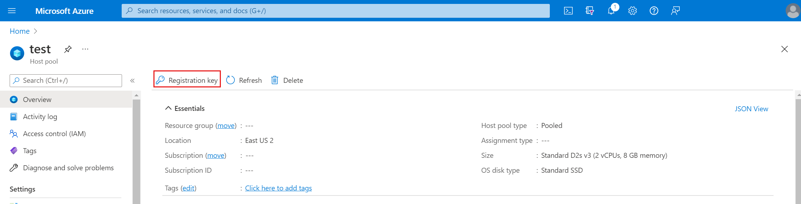

# Tutorial: Create a host pool

>[!IMPORTANT]
>This content applies to Azure Virtual Desktop with Azure Resource Manager Azure Virtual Desktop objects. If you're using Azure Virtual Desktop (classic) without Azure Resource Manager objects, see [this article](./virtual-desktop-fall-2019/create-host-pools-azure-marketplace-2019.md). Any objects you create with Azure Virtual Desktop (classic) can't be managed with the Azure portal.

Host pools are a collection of one or more identical virtual machines (VMs), also known as "session hosts," within Azure Virtual Desktop environments. Each host pool can contain an app group that users can interact with as they would on a physical desktop. If you'd like to learn more about deployment architecture, check out [Azure Virtual Desktop environment](environment-setup.md). If you're an app developer using remote app streaming for Azure Virtual Desktop, your customers or users can use your apps just like local apps on a physical device. For more information how to use Azure Virtual Desktop as an app developer, check out our [Azure Virtual Desktop remote app streaming](./remote-app-streaming/custom-apps.md) documentation.

>[!NOTE]
>If you're an app developer using remote app streaming for Azure Virtual Desktop and your app's users are in the same organization as your deployment, you can use your existing Azure tenant to create your host pool. If your users are outside of your organization, then for security reasons you'll need to create separate Azure tenants with at least one host pool for each organization. Learn more about which practices we recommend you follow to keep your deployment secure at [Architecture recommendations](./remote-app-streaming/architecture-recs.md).

This article will walk you through the setup process for creating a host pool for an Azure Virtual Desktop environment through the Azure portal. This method provides a browser-based user interface to create a host pool in Azure Virtual Desktop, create a resource group with VMs in an Azure subscription, join those VMs to either an Active Directory (AD) domain or Azure Active Directory (Azure AD) tenant, and register the VMs with Azure Virtual Desktop.

You can create host pools in the following Azure regions:

- Australia East
- Canada Central
- Canada East
- Central US
- East US
- East US 2
- Japan East
- North Central US
- North Europe
- South Central US
- UK South
- UK West
- West Central US
- West Europe
- West US
- West US 2

## Prerequisites

Before you can create a host pool, make sure you've completed the prerequisites. For more information, see [Prerequisites for Azure Virtual Desktop](prerequisites.md).

## Begin the host pool setup process

### [Portal](#tab/azure-portal)

To start creating your new host pool:

1. Sign in to the Azure portal at [https://portal.azure.com](https://portal.azure.com/).
   
   >[!NOTE]
   > If you need to access the Azure US Gov portal, go to [https://portal.azure.us/](https://portal.azure.us/) instead.
   > 
   > If you need to access the Azure China portal, go to [https://portal.azure.cn/](https://portal.azure.cn/) instead.

2. Enter **Azure Virtual Desktop** into the search bar, then find and select **Azure Virtual Desktop** under Services.

3. In the **Azure Virtual Desktop** overview page, select **Create a host pool**.

4. In the **Basics** tab, select the correct subscription under Project details.

5. Either select **Create new** to make a new resource group or select an existing resource group from the drop-down menu.

6. Enter a unique name for your host pool.

7. In the Location field, select the region where you want to create the host pool from the drop-down menu.

   The Azure geography associated with the regions you selected is where the metadata for this host pool and its related objects will be stored. Make sure you choose the regions inside the geography you want the service metadata to be stored in.

     > [!div class="mx-imgBorder"]
     > 
  
   >[!NOTE]
   > If you want to create your host pool in [a supported region](data-locations.md) outside the US, you'll need to re-register the resource provider. After re-registering, you should see the other regions in the drop-down for selecting the location. Learn how to re-register at our [Host pool creation](troubleshoot-set-up-issues.md#i-dont-see-the-azure-region-i-want-to-use-when-selecting-the-location-for-my-service-objects) troubleshooting article.

8. Under Host pool type, select whether your host pool will be **Personal** or **Pooled**.

    - If you choose **Personal**, then select either **Automatic** or **Direct** in the Assignment Type field.

      > [!div class="mx-imgBorder"]
      > 

9.  If you choose **Pooled**, enter the following information:

     - For **Max session limit**, enter the maximum number of users you want load-balanced to a single session host.
     - For **Load balancing algorithm**, choose either breadth-first or depth-first, based on your usage pattern. Learn more about what each of these options means at [Host pool load-balancing methods](host-pool-load-balancing.md).

       > [!div class="mx-imgBorder"]
       > 

10. Select **Next: Virtual Machines >**.

11. If you've already created virtual machines and want to use them with the new host pool, select **No**, select **Next: Workspace >** and jump to the [Workspace information](#workspace-information) section. If you want to create new virtual machines and register them to the new host pool, select **Yes**.
 
12. Once you create your host pool, you can get the host pool's registration key by going to the host pool's **Overview** page and selecting **Registration key**. Use this key when adding virtual machines created outside of Azure Virtual Desktop to your host pool.

    > [!div class="mx-imgBorder"]
    > 

### [Azure CLI](#tab/azure-cli)

Start by preparing your environment for the Azure CLI:

[!INCLUDE [azure-cli-prepare-your-environment-no-header.md](../../includes/azure-cli-prepare-your-environment-no-header.md)]

After you sign in, use the [az desktopvirtualization hostpool create](/cli/azure/desktopvirtualization#az-desktopvirtualization-hostpool-create) command to create the new host pool, optionally creating a registration token for session hosts to join the host pool:

```azurecli
az desktopvirtualization hostpool create --name "MyHostPool" \
    --resource-group "MyResourceGroup" \ 
    --location "MyLocation" \
    --host-pool-type "Pooled" \
    --load-balancer-type "BreadthFirst" \
    --max-session-limit 999 \
    --personal-desktop-assignment-type "Automatic"  \
    --registration-info expiration-time="2022-03-22T14:01:54.9571247Z" registration-token-operation="Update" \
    --sso-context "KeyVaultPath" \
    --description "Description of this host pool" \
    --friendly-name "Friendly name of this host pool" \
    --tags tag1="value1" tag2="value2" 
```

If you want to create new virtual machines and register them to the new host pool, continue with the following section. If you've already created virtual machines and want to use them with the new host pool, jump to the [Workspace information](#workspace-information) section. 

---

Now that you've created a host pool, let's move on to the next part of the setup process where we create the VM.

## Virtual machine details

Now that we're through the first part, you'll have to set up your VM.

### [Portal](#tab/azure-portal)

To set up your virtual machine within the Azure portal host pool setup process:

1. Under **Resource group**, choose the resource group where you want to create the virtual machines. This can be a different resource group than the one you used for the host pool.

2. After that, provide a **Name prefix** to name the virtual machines the setup process creates. The suffix will be `-` with numbers starting from 0.

3. Choose the **Virtual machine location** where you want to create the virtual machines. They can be the same or different from the region you selected for the host pool. Keep in mind that VM prices vary by region, and the VM locations should be near their users when possible to maximize performance. Learn more at [Data locations for Azure Virtual Desktop](data-locations.md).
   
4. Next, choose the availability option that best suit your needs. To learn more about which option is right for you, see [Availability options for virtual machines in Azure](../virtual-machines/availability.md) and [our FAQ](./faq.yml#which-availability-option-is-best-for-me-).
   
   > [!div class="mx-imgBorder"]
   > 

5. Next, choose the security type that you would like to use for your virtual machines. You can choose either **Standard** or **Trusted Launch virtual machines**. To learn more about Trusted Launch virtual machines, see [Trusted Launch for Azure virtual machines](../virtual-machines/trusted-launch.md).

   > [!div class="mx-imgBorder"]
   > 

   If Trusted Launch virtual machines is selected, choose which Trusted Launch security features you would like to enable. 

   > [!div class="mx-imgBorder"]
   > 

6. Next, choose the image that needs to be used to create the virtual machine. You can choose **Gallery** for new host pool deployments with **Storage blob** no longer available.

    - After choosing **Gallery**, select a Windows image that meets your requirements from the drop-down menu:

      - Windows 11 Enterprise multi-session (Gen2)
      - Windows 11 Enterprise multi-session + Microsoft 365 Apps (Gen2)
      - Windows 10 Enterprise multi-session, Version 21H2 (Gen2)
      - Windows 10 Enterprise multi-session, Version 21H2 + Microsoft 365 Apps (Gen2)
      - Windows Server 2019 Datacenter
     

      If you don't see the image you want, select **See all images**, which lets you select either another image in your gallery or an image provided by Microsoft and other publishers. Make sure that the image you choose is one of the [supported OS images](prerequisites.md#operating-systems-and-licenses).

      > [!div class="mx-imgBorder"]
      > 

      You can also go to **My Items** and choose a custom image you've already uploaded.

      > [!div class="mx-imgBorder"]
      > 

    - If you are adding a VM to a host pool that allows **Storage Blob**, you can use your own image build through Hyper-V or on an Azure VM. All you have to do is enter the location of the image in the storage blob as a URI.
   
   The image's location is independent of the availability option, but the image’s zone resiliency determines whether that image can be used with availability zone. If you select an availability zone while creating your image, make sure you're using an image from the gallery with zone resiliency enabled. To learn more about which zone resiliency option you should use, see [the FAQ](./faq.yml#which-availability-option-is-best-for-me-).

7. After that, choose the **Virtual machine size** you want to use. You can either keep the default size as-is or select **Change size** to change the size. If you select **Change size**, in the window that appears, choose the size of the virtual machine suitable for your workload. To learn more about virtual machine sizes and which size you should choose, see [Virtual machine sizing guidelines](/windows-server/remote/remote-desktop-services/virtual-machine-recs?context=/azure/virtual-desktop/context/context).

8. Under **Number of VMs**, provide the number of VMs you want to create for your host pool.

    >[!NOTE]
    >The setup process can create up to 400 VMs while setting up your host pool, and each VM setup process creates four objects in your resource group. Since the creation process doesn't check your subscription quota, make sure the number of VMs you enter is within the Azure VM and API limits for your resource group and subscription. You can add more VMs after you finish creating your host pool.

9. Choose what kind of OS disks you want your VMs to use: Standard SSD, Premium SSD, or Standard HDD.

10. Under Network and security, select the **Virtual network** and **Subnet** where you want to put the virtual machines you create. Make sure the virtual network can connect to the domain controller, since you'll need to join the virtual machines inside the virtual network to the domain. The DNS servers of the virtual network you selected should be configured to use the IP of the domain controller.

11. Select what kind of security group you want: **Basic**, **Advanced**, or **None**.

    If you select **Basic**, you'll have to select whether you want any inbound port open. If you select **Yes**, choose from the list of standard ports to allow inbound connections to.

    >[!NOTE]
    >For greater security, we recommend that you don't open public inbound ports.

    > [!div class="mx-imgBorder"]
    > 

    If you choose **Advanced**, select an existing network security group that you've already configured.

12. After that, select whether you want the virtual machines to be joined to **Active Directory** or **Azure Active Directory**.

    - For Active Directory, provide an account to join the domain and choose if you want to join a specific domain and organizational unit.

        - For the AD domain join UPN, enter the credentials for the Active Directory Domain admin of the virtual network you selected. The account you use can't have multifactor authentication (MFA) enabled. When joining to an Azure Active Directory Domain Services (Azure AD DS) domain, the account you use must be part of the Azure AD DC Administrators group and the account password must work in Azure AD DS.

        - To specify a domain, select **Yes**, then enter the name of the domain you want to join. If you want, you can also add a specific organizational unit you want the virtual machines to be in by entering the full path (Distinguished Name) and without quotation marks. If you don't want to specify a domain, select **No**. The VMs will automatically join the domain that matches the suffix of the **AD domain join UPN**.
  
    - For Azure Active Directory, you can select **Enroll the VM with Intune** to automatically make the VM available for management after it's deployed.

13. Under **Virtual Machine Administrator account**, enter the credentials for the local admin account to be added while creating the VM. You can use this account for management purposes in both AD and Azure AD-joined VMs.

14. Under **Custom configuration**, you can enter the location of an Azure Resource Manager template to perform custom configurations on your session hosts after you create them. You'll need to enter the URLs for both the Azure Resource Manager template file and the Azure Resource Manager template parameter file. To learn more and find an example custom configuration script, see the [Sample Custom Configuration Solution](https://github.com/Azure/RDS-Templates/tree/master/wvd-sh/arm-template-customization).

      >[!NOTE]
      >Azure Virtual Desktop doesn't support provisioning Azure resources in the template.

15. Select **Next: Workspace >**.

### [Azure CLI](#tab/azure-cli)

Use the [az vm create](/cli/azure/vm#az-vm-create) command to create a new Azure virtual machine:

```azurecli
az vm create --name "MyVMName" \
    --resource-group "MyResourceGroup" \
    --image "MyImage" \
    --generate-ssh-keys
```

For additional information on using the Azure CLI to create Azure virtual machines, see:
- Windows
    - [Create a Windows VM using the Azure CLI]( /azure/virtual-machines/windows/quick-create-cli)
    - [Tutorial: Create and Manage Windows VMs with the Azure CLI](/cli/azure/azure-cli-vm-tutorial)
- Linux
    - [Create a Linux VM using the Azure CLI](../virtual-machines/linux/quick-create-cli.md)
    - [Tutorial: Create and Manage Linux VMs with the Azure CLI]( /azure/virtual-machines/linux/tutorial-manage-vm) 
---

With that, we're ready to start the next phase of setting up your host pool: registering your app group to a workspace.

## Workspace information

The host pool setup process creates a desktop application group by default. For the host pool to work as intended, you'll need to publish this app group to users or user groups, and you must register the app group to a workspace.

>[!NOTE]
>If you're an app developer trying to publish your organization’s apps, you can dynamically attach MSIX apps to user sessions or add your app packages to a custom VM image. See How to serve your custom app with Azure Virtual Desktop for more information.

### [Portal](#tab/azure-portal)

To register the desktop app group to a workspace:

1. Select **Yes**.

   If you select **No**, you can register the app group later, but we recommend you get the workspace registration done as soon as you can so your host pool works properly.

2. Next, choose whether you want to create a new workspace or select from existing workspaces. Only workspaces created in the same location as the host pool will be allowed to register the app group to.

3. Optionally, you can select **Next: Tags >**.

    Here you can add tags so you can group the objects with metadata to make things easier for your admins.

4. When you're done, select **Review + create**.

     >[!NOTE]
     >The review + create validation process doesn't check if your password meets security standards or if your architecture is correct, so you'll need to check for any problems with either of those things yourself.

5. Review the information about your deployment to make sure everything looks correct. When you're done, select **Create**. 

### [Azure CLI](#tab/azure-cli)

Use the [az desktopvirtualization workspace create](/cli/azure/desktopvirtualization#az-desktopvirtualization-workspace-create) command to create the new workspace:

```azurecli
az desktopvirtualization workspace create --name "MyWorkspace" \
    --resource-group "MyResourceGroup" \
    --location "MyLocation" \
    --tags tag1="value1" tag2="value2" \
    --friendly-name "Friendly name of this workspace" \
    --description "Description of this workspace" 
```
---

This starts the deployment process, which creates the following objects:

- Your new host pool.
- A desktop app group.
- A workspace, if you chose to create it.
- If you chose to register the desktop app group, the registration will be completed.
- Virtual machines, if you chose to create them, which are joined to the domain and registered with the new host pool.
- A download link for an Azure Resource Management template based on your configuration.

After that, you're all done!

## Run the Azure Resource Manager template to provision a new host pool

If you'd rather use an automated process, [download our Azure Resource Manager template](https://github.com/Azure/RDS-Templates/tree/master/ARM-wvd-templates) to provision your new host pool instead.

>[!NOTE]
>If you're using an automated process to build your environment, you'll need the latest version of the configuration JSON file.

## Next steps

Now that you've made your host pool, you can populate it with RemoteApp programs. To learn more about how to manage apps in Azure Virtual Desktop, head to our next tutorial:

> [!div class="nextstepaction"]
> [Manage app groups tutorial](./manage-app-groups.md)
