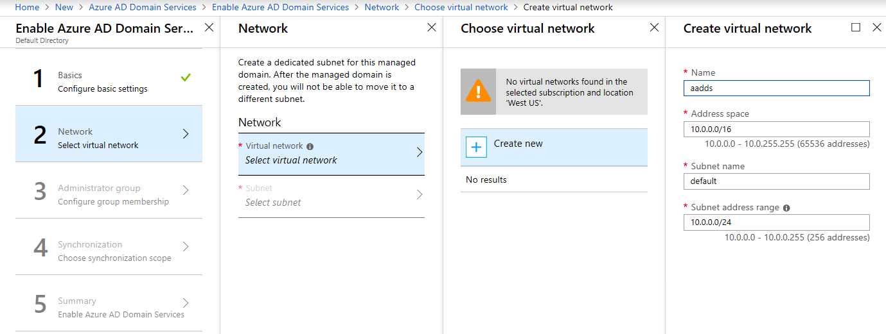
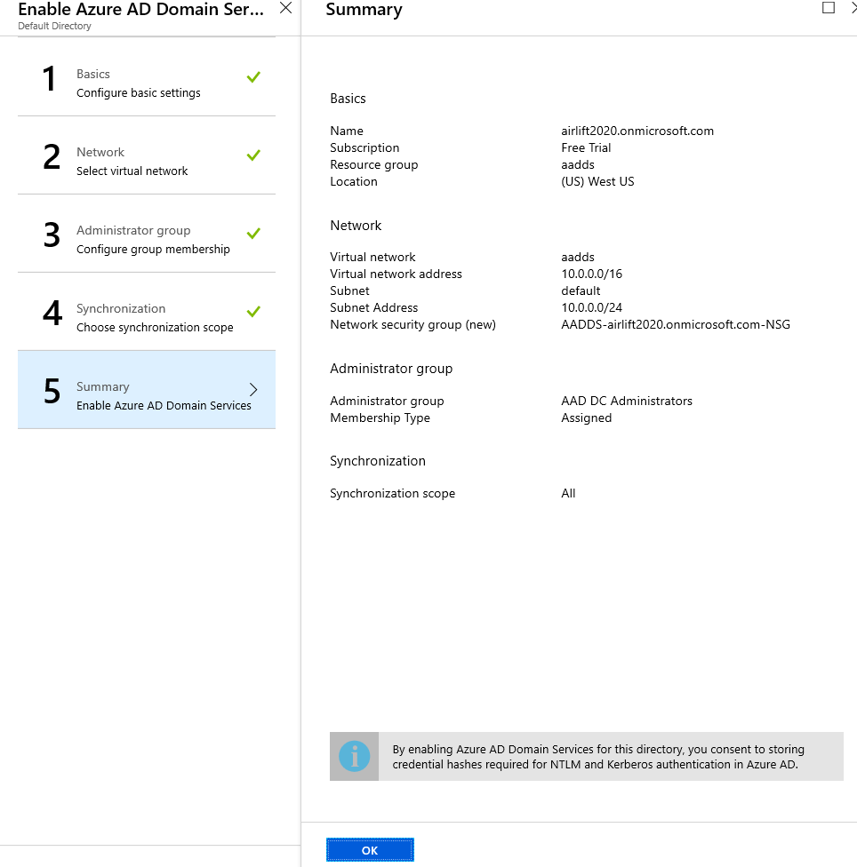
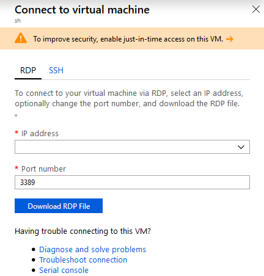
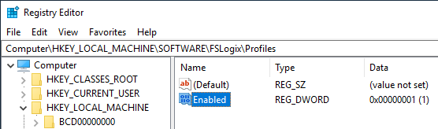
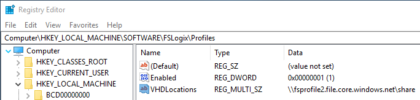

# Create an FSLogix profile container with Azure AD DS

This article will show you how to create an FSLogix profile container with Azure Active Directory Domain Services (AD DS).

## Configure Azure AD DS

To configure your Azure AD DS account to create FSLogix profile containers:

1. Sign in to the Azure portal with an account that has contributor or administrator permissions.

2. Select **New**, then in the search bar, search for and select **Azure Active Directory Domain Services**.

3. When the Azure AD DS window opens, select **Create**.

4. In the **Basics** tab:

   - Enter the DNS domain name.
   - Select an active Azure subscription (if multiple subscriptions are available).
   - Select an empty resource group or create a new one by selecting **Create new**.
   - Select a location.

    

5. For the **Network** tab, configure a virtual network or select an existing one. We recommend you create a new one by selecting **Create new** and entering the following information:

   - Visual network name
   - Address space
   - Subnet name
   - Subnet address range

    

6. For the **Administrator group** tab, select the Azure AD users that will manage the Azure AD DS configuration.

7. For most deployments, you won't need to change any information in the **Synchronization** tab. Keep the default values unless told otherwise.

8. Finally, you'll see the **Summary** tab. Review the information to make sure you've selected the right settings. When you're done, select **OK** to start the deployment.

    

   To check your deployment's progress, select the **Notifications** icon in the global controls bar.

9. When the deployment is done, go to **Azure AD DS** and confirm that Azure AD DS is running.

## Add Azure AD DS admins

To add additional admins, you create a new user and grant them permissions.

To add an admin:

1. Select **Azure Active Directory** from the sidebar, then select **All users**, and then select **New user**.

2.  Enter the user details into the fields.

3. In the Azure Active Directory pane on the left side of the screen, select **Groups**.

4. Select the **AAD DC Administrators** group.

5. In the left pane, select **Members**, then select **Add members** in the main pane. This will show a list of all users available in Azure AD. Select the name of the user profile you just created.

## Set up an Azure Files Storage account

Now it's time to enable Azure AD DS authentication over Server Message Block (SMB). For more information about this process, see our [Azure Storage Documentation](../storage/common/storage-introduction.md).

To enable authentication:

1. Go to the Azure portal, then select **All services**, and then select **Storage accounts**.

2. Select **Add** to create a storage account.
3. In the window that appears:

    - Select **Subscription** (if applicable).
    - Select an existing **Resource group** or select **Create new** to create a new one.
    - Enter the **Storage account name**.
    - Select the **Location**. (We recommend using the same location as the session host VMs.)
    - Select the **Performance type**.
    - For **Account type**, select a **StorageV2 (general purpose V2) account**.

4. Select **Review + create**. This will start the validation process for the information you entered for your new storage account.

5. Once the validation process is done, select **Create**. This will start the deployment process.

6. Once the deployment is done, select **Go to resource**.

7. Select **Configuration** from the pane on the left side of the screen, then enable **Azure Active Directory authentication for Azure Files** in the main pane. When you're done, select **Save**.

8. Select **Overview** in the pane on the left side of the screen, then select **Files** in the main pane.

9. Select **File share** and enter the **Name** and **Quota** into the fields that appear on the right side of the screen.

## Assign access permissions to an identity

From the Azure portal, navigate to the **Files share** created in the previous section.

1. Select **Access Control (IAM)**.
2. Select **Add a role assignment**.
3. In the **Add role assignment** tab, select the appropriate built-in role from the role list. You'll need to at least select **Storage File Data SMB Share Contributor** for the account to get proper permissions.
4. For **Assign access to**, select **Azure Active Directory user, group, or service principal**.
5. Select a name or email address for the target Azure Active Directory identity.
6. Select **Save**.

## Obtain storage account access key

1. From the Azure portal sidebar, select **Storage accounts**.

2. From the list of storage accounts, select the account for which you enabled Azure AD DS and created the custom roles in steps above.

3. Under **Settings**, select **Access keys** and copy the key from **key1**.

   >[!NOTE]
   >If the key contains the "/" symbol, select the **Refresh** icon to generate a new key.

4. Go to the **Virtual Machines** tab and locate any VM that is going to be part of your host pool.

5. Select the name of the virtual machine (VM) under **Virtual Machines (adVM)** and select **Connect**

    This will download an RDP file that will let you sign in to the VM with its own credentials.

    

6. When you've signed in to the VM, run a command prompt as an administrator.

7. Run the following command:

     ```cmd
     net use <desired-drive-letter>: \\<storage-account-name>.file.core.windows.net\<share-name> <storage-account-key> /user:Azure\<storage-account-name>
     ```

    - Replace `<desired-drive-letter>` with a drive letter of your choice (for example, `y:`).
    - Replace all instances of `<storage-account-name>` with the name of the storage account you specified earlier.
    - Replace `<share-name>` with the name of the share you created earlier.
    - Replace `<storage-account-key>` with the storage account key from Azure.

    For example:  
  
     ```cmd
     net use y: \\fsprofile.file.core.windows.net\share HDZQRoFP2BBmoYQ=(truncated)= /user:Azure\fsprofile)
     ```

8. Run the following command to grant the user full access to the Azure Files share.

     ```cmd
     icacls <mounted-drive-letter>: /grant <user-email>:(f)
     ```

    - Replace `<mounted-drive-letter>` with the letter of the drive you want the user to use.
    - Replace `<user-email>` with the UPN of the user who will use this profile to access the session host VMs.

    For example:
     
     ```cmd
     icacls y: /grant john.doe@contoso.com:(f)
     ```

## Configure your profile container

1. Sign in to the session host VM you configured at the beginning of this article, then [download and install the FSLogix agent](/fslogix/install-ht/).

2. Unzip the FSLogix agent file you downloaded and go to **x64** > **Releases**, then open **FSLogixAppsSetup.exe**.

     >[!NOTE]
     > If there are multiple VMs in the host pool the below configuration must be done for each VM.

3. Once the installer launches, select **I agree to the license terms and conditions.** If applicable, provide a new key.

4. Select **Install**.

5. Open **Drive C**, then go to **Program Files** > **FSLogix** > **Apps** to make sure the FSLogix agent was properly installed.

6. Run **Registry Editor** (RegEdit) as an administrator.

7. Navigate to **Computer** > **HKEY_LOCAL_MACHINE** > **software** > **FSLogix**, right-click on **FSLogix**, select **New**, and then select **Key**.

8. Create a new key named **Profiles**.

9. Right-click on **Profiles**, select **New**, and then select **DWORD (32-bit) Value.** Name the value **Enabled** and set the **Data** value to **1**.

    

10. Right-click on **Profiles**, select **New**, and then select **Multi-String Value**. Name the value **VHDLocations** and set enter the URI for the Azure Files share `\\fsprofile.file.core.windows.net\share` as the Data value.

    

## Assign users to session host

1. Run Windows PowerShell as an administrator, then run the following cmdlet to sign in to Windows Virtual Desktop with PowerShell:

   ```powershell
   Import-Module Microsoft.RdInfra.RdPowershell

   #Optional
   Install-Module Microsoft.RdInfra.RdPowershell

   \$brokerurl = "https://rdbroker.wvd.microsoft.com"

   Add-RdsAccount -DeploymentUrl \$brokerurl
   ```

   When prompted for credentials, enter the same user that was granted the Tenant Creator, RDS Owner, or RDS Contributor role on the Windows Virtual Desktop tenant.

2. Run the following cmdlets to assign the user to the remote desktop group:

     ```powershell
     $tenant = "<your-wvd-tenant>"

     $pool1 = "<wvd-pool>"

     $appgroup = "Desktop Application Group"

     $user1 = "<user-principal>"

     Add-RdsAppGroupUser $tenant $pool1 $appgroup $user1
     ```

    For example:

     ```powershell
     $pool1 = "contoso"
     
     $tenant = "contoso"
     
     $appgroup = "Desktop Application Group"
     
     $user1 = "jane.doe@contoso.com"
     
     Add-RdsAppGroupUser $tenant $pool1 $appgroup $user1
     ```

## Make sure your profile works

Now all you have to do is make sure the profile you created exists and works as intended.

To verify your profile:

1. Open a browser and go to [the Windows Virtual Desktop web client](https://rdweb.wvd.microsoft.com/webclient/index.html).

2. Sign in with the user account assigned to the Remote Desktop group.

3. Once the user session has been established, open the Azure portal and sign in with an administrative account.

4. From the sidebar, select **Storage accounts**.

5. Select the storage account you configured as the file share for your session host pool and enabled with Azure AD DS.

6. Select the **Files** icon, then expand your share.

    If everything's set up correctly, you should see a **Directory** with a name that's formatted like this: `<user SID>-<username>`.

## Next steps

Now that you've created your FSLogix profile container, you can use it to create host pools. To learn more, see [Create a profile container for a host pool using a file share](create-host-pools-user-profile.md).

You can also find more detailed information about concepts related to FSlogix containers for Azure files in [FSLogix profile containers and Azure files](fslogix-containers-azure-files.md).