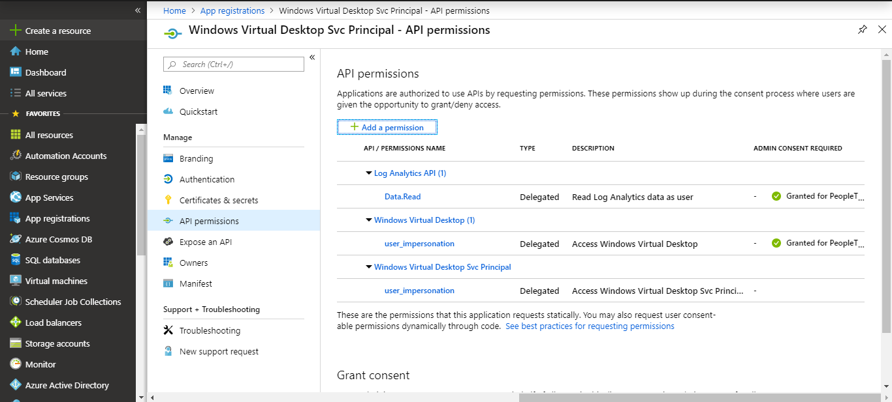
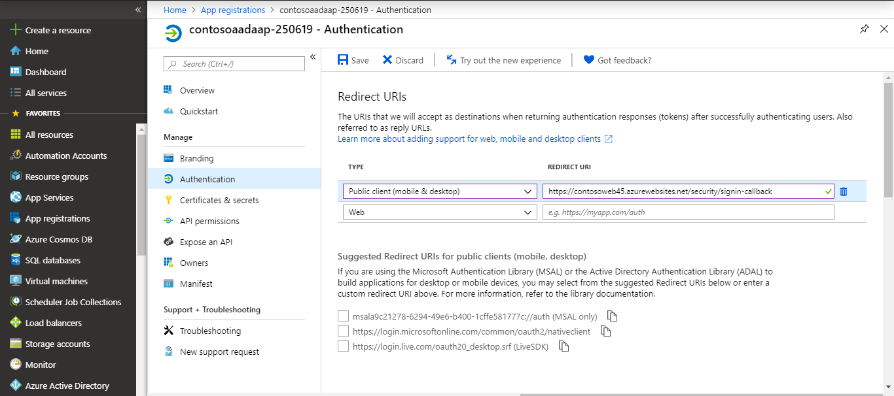

# Deploy diagnostics for Windows Virtual Desktop

Diagnostics-UX for Windows Virtual Desktop can do the following things for you:

- Look up diagnostic activities (management, connection, or feed) for a single user over a period of one week
- Gather session host information for connection activities from your Log Analytics workspace
- Review virtual machine (VM) performance details for a particular host
- See which users are signed in to the session host
- Send message to active users on a specific session host
- Sign users out of a session host

## Prerequisites

Before deploying the Azure Resource Manager template, you'll need to create an Azure Active Directory App Registration and a Log Analytics workspace. You or the administrator need the these permissions to do so:

- Owner of the Azure subscription
- Permission to create resources in your Azure subscription
- Permission to create an Azure AD application.
- RDS Owner or Contributor rights

You also need to install these PowerShell modules before you get started:

- [Azure PowerShell module](https://docs.microsoft.com/en-us/powershell/azure/install-az-ps?view=azps-2.4.0)
- [Azure AD module](https://docs.microsoft.com/en-us/powershell/azure/active-directory/install-adv2?view=azureadps-2.0)

Make sure you have your Subscription ID ready because you need it to sign in.

After you have everything in order, you can create the Azure AD app registration.

## Create an Azure AD app registration using PowerShell script

This section will show you how to use PowerShell to create the Azure AD Application with a service principal and add API permissions to it.

>[!NOTE]
>The API permissions are Windows Virtual Desktop, Log Analytics and Microsoft Graph API permissions are added to the AD Application.

1. Open PowerShell as an Administrator:
2. Go to the [RDS-Templates GitHub repo](https://github.com/Azure/RDS-Templates/tree/master/wvd-templates/diagnostics-sample/deploy/scripts) and run the **Create AD App Registration for Diagnostics.ps1** script in PowerShell.
3.  When the script asks you to name your app, enter a unique app name.
4.  The script will then ask you to sign in with an administrative account. Enter the credentials of a user with [delegated admin access](delegated-access-virtual-desktop.md). The admin should have either RDS Owner or Contributor rights.

After the script successfully runs, you should see the following things:

-  A message that confirms your app now has a service principal role assignment.
-  Your Print Client ID and Client Secret Key that you'll need to enter when you deploy diagnostics UX.

Now that you've registered your app, it's time to configure your Log Analytics workspace.

## Configure your Log Analytics workspace

For the best possible experience, we recommend you configure your Log Analytics workspace with the following performance counters that allow you to derive statements of the user experience in a remote session. Here is the list of counters with default threshold values the user interface will highlight the session host as unhealthy. 

<!--This paragraph makes no sense, and I think there's a link missing-->

If you don’t have a Log Analytics workspace today use the PowerShell script and instructions we have prepared for you in the next chapter. Otherwise go and configure the counters following the instructions here. (LINK?)

### Create an Azure Log Analytics workspace using PowerShell

In this section you will execute a PowerShell script which creates a Log Analytics Workspace and configures recommended Windows Performance Counters for deriving statements on user experience and app performance:

1.  Open PowerShell as an admin
2.  Go to the [RDS-Templates GitHub repo](https://github.com/Azure/RDS-Templates/tree/master/wvd-templates/diagnostics-sample/deploy/scripts) and run the **Create LogAnalyticsWorkspace for Diagnostics.ps1** script in PowerShell.
3. Enter the following values for the parameters:

    - For ResourceGroupName, enter the name for the resource group
    - For LogAnalyticsWorkspaceName, enter a unique name for your Log Analytics workspace
    - For Location, provide the Azure region
    - Provide the Azure Subscription ID, which you can find in the Azure Portal under **Subscriptions**.

4. Enter the credentials of a user with delegated admin access.

5. Sign in to Azure with the same user's credentials.

<!--Is this the Azure portal or desktop client?-->

6. Write down or memorize the LogAnalyticsWorkspace ID for later.

7. After that, continue to [Validate the script results in the Azure Portal](#validate-the-script-results-in-the-azure-portal) for instructions about how to connect your VMs to the log analytics workspace.

### Configure Windows Performance counters in your existing Log Analytics workspace

<!--Is this the same section as the one at the last H2? What will make people skip this section and go to Validate the script results in the Azure Portal?-->

Here's how to set up the recommended performance counters in your existing Log Analytics workspace:

1. Open your internet browser and sign in to the [Azure Portal](https://portal.azure.com/) with your administrative account.

2. Next, go to **Log Analytics workspaces** to review the configured Windows Performance Counters.

3. In the **Settings** section, select  **Advanced settings**.

4. After that, navigate to **Data** > **Windows Performance Counters** and add the following counters:

    -   LogicalDisk(\*)\|%Free Space

    -   LogicalDisk(C:)\\Avg. Disk Queue Length

    -   Memory(\*)\\Available Mbytes

    -   Processor Information(\*)\\Processor Time

    -   User Input Delay per Session(\*)\\Max Input Delay

For more detailed information about the performance counters, see [Windows and Linux performance data sources in Azure Monitor](articles\azure-monitor\platform\data-sources-performance-counters.md).

>[!NOTE]
>Any additional counters you configure won’t show up in the diagnostics tool itself. To make it appear in the diagnostics tool, you need to configure the tool's config file. Instructions for how to do this with advanced administration will be available in GitHub at a later date.

## Validate the script results in the Azure Portal

Before you continue deploying the diagnostics tool, we recommend that you verify that your Azure Active Directory application has API permissions and your Log Analytics workspace has the preconfigured Windows performance counters.

### Review your app registration

To make sure your app registration has API permissions:

1. Open a browser and connect to the [Azure Portal](https://portal.azure.com/) with your administrative account.

2. Go to **App registrations** and look for your Azure AD App registration.

### Review your Log Analytics workspace

To make sure your Log Analytics workspace has the preconfigured Windows performance counters:

1. In the [Azure Portal](https://portal.azure.com/), go to **Log Analytics workspaces** to review the configured Windows Performance Counters.
2. Under **Settings**, select **Advanced settings**.
3. After that, go to **Data** > **Windows Performance Counters**.
4. Make sure the following counters are preconfigured:

   - LogicalDisk(\*)\|%Free Space: Displays the amount of free space of the total usable space on the disk as a percentage.

   - LogicalDisk(C:)\\Avg. Disk Queue Length: The length of disk transfer request for your C drive. The value shouldn’t exceed 2 for a long period of time.

   - Memory(\*)\\Available Mbytes: The available memory for the system in megabytes.

   - Processor Information(\*)\\Processor Time: the percentage of elapsed time that the processor spends to execute a non-Idle thread.

   - User Input Delay per Session(\*)\\Max Input Delay

### Connect to VMs in your Log Analytics workspace

In order to be able to view the health of VMs you will need to enable the Log Analytics connection. Follow these steps to connect your VMs:

1. Open a browser and sign in to the [Azure Portal](https://portal.azure.com/) with your administrative account.

2. Go to LogAnalyticsWorkspace created/existing one

3. In the left panel, under Workspace Data Sources, select **virtual machines**.

4. Select the name of the VM you want to connect to.

5. Select **Connect**.

## Deploy the diagnostics UX

To deploy the Azure Resource Management template:

1.  Go to the GitHub Azure RDS-Templates page.

2.  Deploy the template to Azure and follow the instructions in the template. Make sure you have the following information available:

    -   Client-Id
    -   Client-Secret
    -   Log Analytics workspace ID

3.  Once the input parameters are provided, accept the terms and conditions, then select **Purchase**.

The deployment will take 2–3 minutes. After successful deployment, go to the resource group and make sure the web app and app service plan resources are there.

Finally, you need to set the Redirect URI.

### Set the Redirect URI

To set the Redirect URI:

1.  In the [Azure Portal](https://portal.azure.com/), go to **App Services** and locate the application you just created.

2.  Go to the overview page and copy the URL you find there.

3.  Navigate to **app registrations** and select the app you want to deploy.

4.  In the left panel, under manage section, select **Authentication**.

5.  Enter the desired Redirect URI, then select **Save**

<!--Can I get a better idea of what the UI for step 5 looks like?-->

6. Selecting **Public client (mobile & desktop)** in the dropdown under Type

7. Enter the URL from the app overview page and add **/security/signin-callback** to the end of it. For example: https://\<appname\>.azurewebsites.net/security/signin-callback.

-   For example:

8. Now, go to your Azure resources, select the Azure App Services resource with the name you provided in the template (for example, contosoapp45) and navigate to the URL associated with it; for example, <https://contosoapp45.azurewebsites.net>.

9. Sign in using the appropriate Azure Active Directory user account.

10.  Select **Accept** to provide consent and use the Diagnostics-UX application.

## Distribute the diagnostic UX

Before you distribute the UX for usage ensure that the following permissions are applied:

- Users need read access for log analytics. For more details, see [Get started with roles, permissions, and security with Azure Monitor](articles\azure-monitor\platform\roles-permissions-security.md).
-  Users also need read access for the Windows Virtual Desktop tenant (RDS Reader role). For more information, see [Delegated access in Windows Virtual Desktop Preview](delegated-access-virtual-desktop.md).

You also need to give your users the following information:

- The app's URL
- The names of the tenant group individual tenant they can access.

## Use the diagnostics UX

After you've signed in to your account using the information you've received from your organization, have the UPN ready for the user you want to query activities for. A search will give you all activities under the specified activity type from now until one week in the past.

### How to read activity search results

Activities are sorted by timestamp, with the latest activity first. If the results return an error, verify if it's a service error. For service errors, create a support ticket that includes the activity to help us debug the issue. All other error types can usually be solved by the user or administrator. For a list of the most common error scenarios and how to solve them, see [Identify issues with the diagnostics feature](diagnostics-role-service.md#common-error-scenarios).

Connection activities might have more than one error. You can expand the activity type to see any other errors the user has encountered. Select the line to open up a dialog to see the friendly message.

<!--Which line? UI?-->

### Investigate the session host 

In the search results, find and select the session host you want information about.

You can analyze session host health:

- Based on predefined threshold you will be able to retrieve the session host health information that Log Analytics queries.
- When there's no activity or the session host isn't connected to Log Analytics, the information won't available.

You can also interact with users on the session host:

- You can either sign out or send a message to signed in users.
- The user from the search result is selected by default, but you can also select additional users to send messages or sign out multiple users at once.

### Windows Performance counter thresholds

- LogicalDisk(\*)\|%Free Space:

    - Displays the percentage of the total usable space on the logical disk that is free.

    - Threshold: Less than 20% will be marked as unhealthy.

- LogicalDisk(C:)\\Avg. Disk Queue Length:

    - Represents storage system conditions.

    - Threshold: Higher than 5 is marked as unhealthy.

- Memory(\*)\\Available Mbytes:

    - The available memory for the system.

    - Threshold: Less than 500 Mbytes marked as unhealthy.

- Processor Information(\*)\\Processor Time:

    - Threshold: Higher than 80% is unhealthy.

- [User Input Delay per Session(\*)\\Max Input Delay](https://docs.microsoft.com/en-us/windows-server/remote/remote-desktop-services/rds-rdsh-performance-counters):

    - Higher than 2000 ms is unhealthy.
